# objdump
`-h`: 各个段的基本信息（段表）

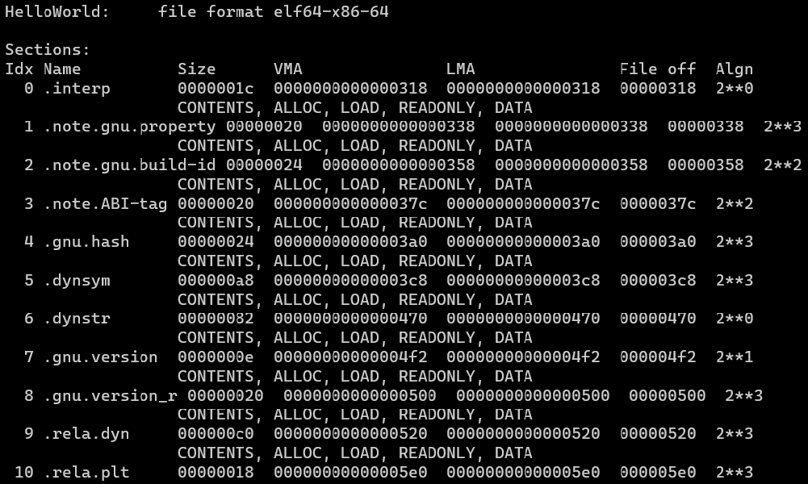

`-s`: 所有段的内容十六进制打印

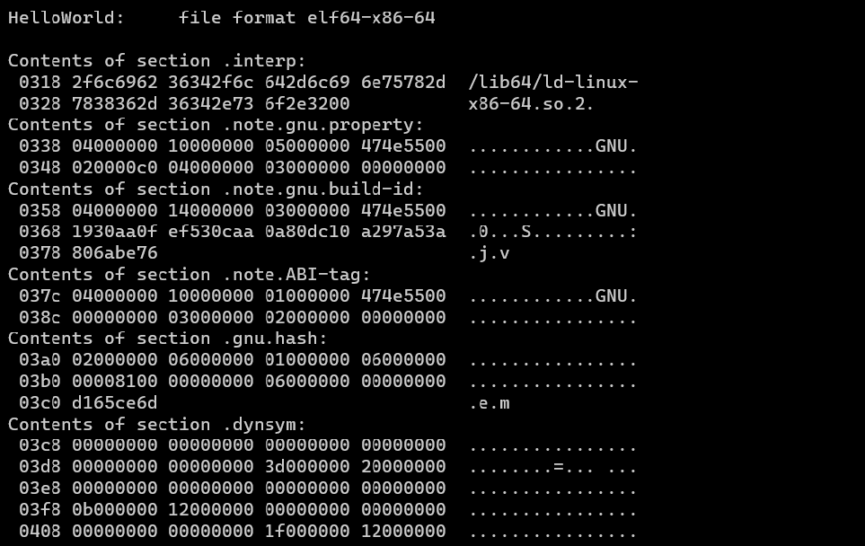

`-S`: 显示所有内容

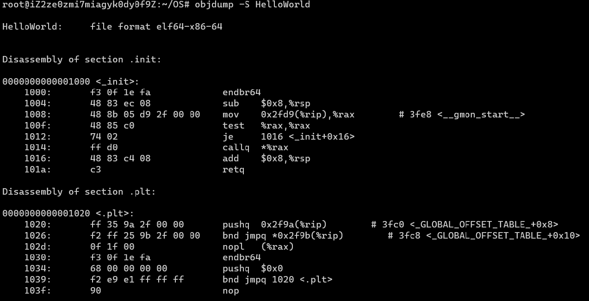

`-d`: 所有包含指令的段反汇编

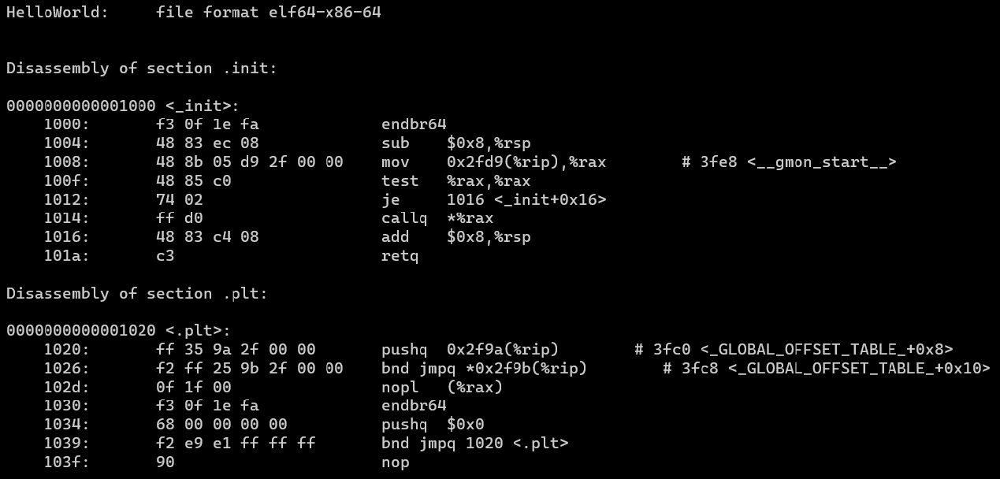

`-disassemble=<NAME>`：显示某段反汇编的内容

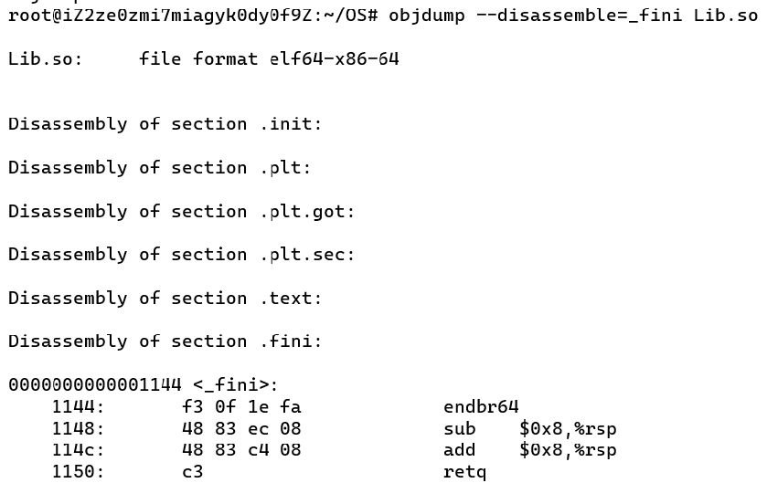

`-g`: 显示调试信息

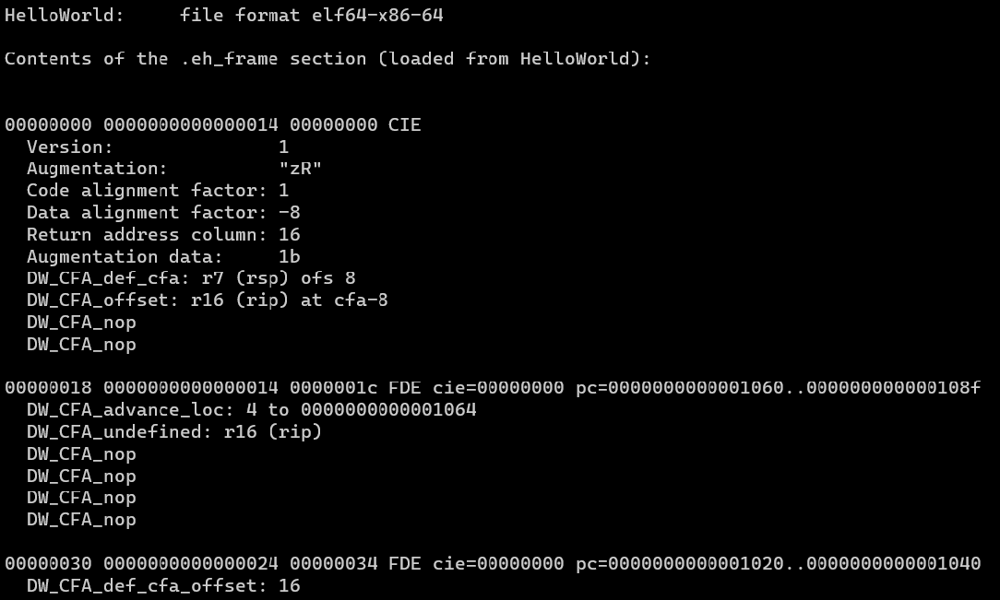

`-r`: 显示重定位信息

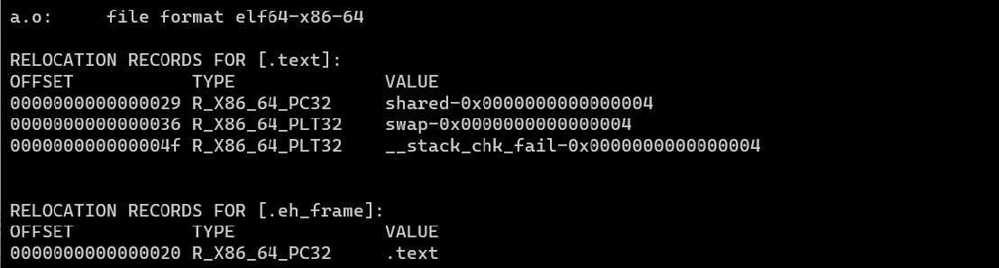

# readelf
`-h`: 读取elf文件头的内容

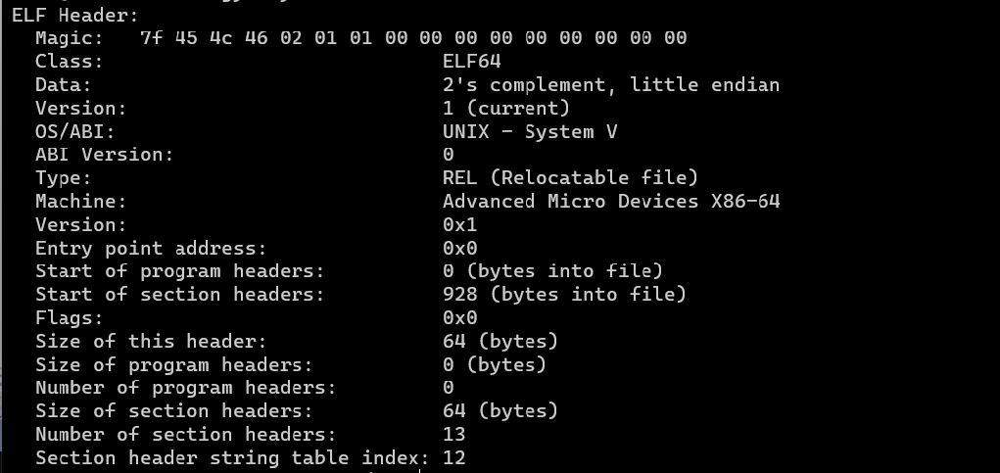

`-S`: 全部段的信息（段表）

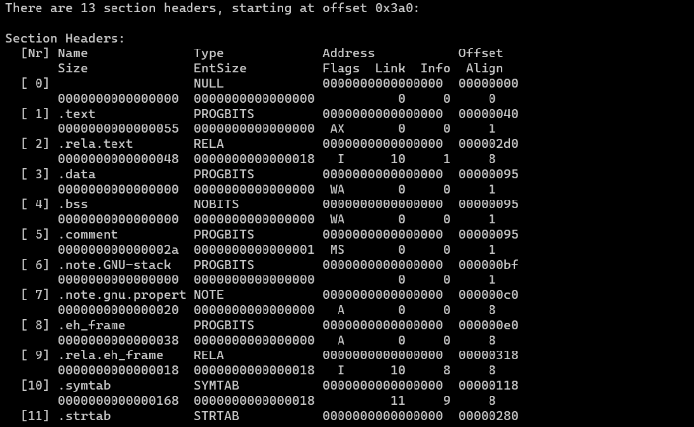

`-s`: 符号表

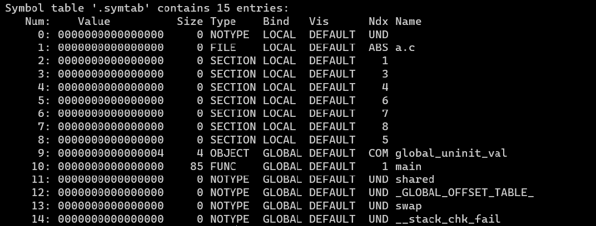

`-l`：程序头，执行视图

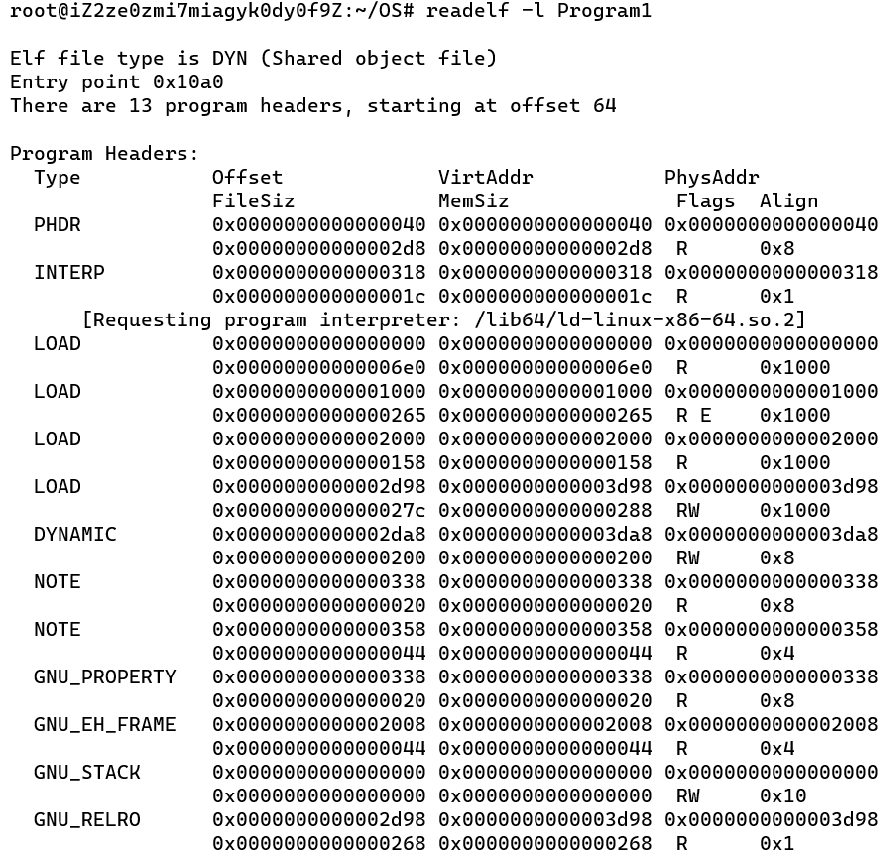

`-d`：查看动态链接相关信息

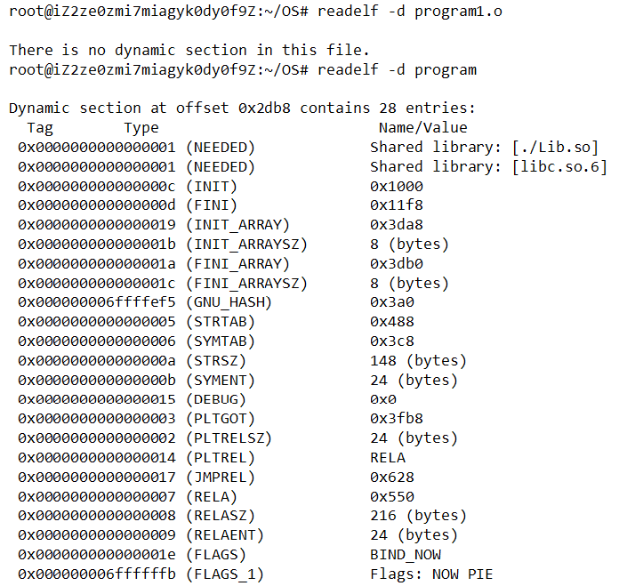

# ldd

查看程序主模块或共享库依赖于其它什么模块

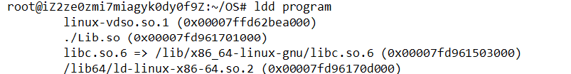
