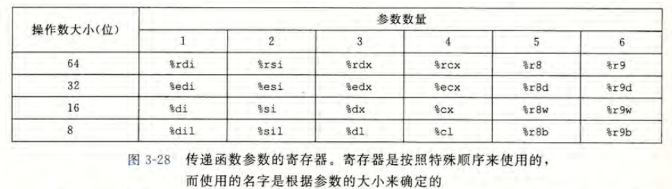

> 为了gdb能正常使用，在编译目标文件时需要加上 -g 选项，为了防止调试中需要跟踪的变量被优化掉，需要加上 -O0 选项，例如 `gcc -o HelloWorld -g -O0 HelloWorld.c`，为使gdb能调用当前目录下的`.gdbinit`文件，需要在`~/.config/gdb/gdbinit`加入`set auto-load safe-path /`

# 指定文件
```bash
file filename               指定调试的文件
symbol-file filename        从文件中读取符号
add-symbol-file filename    从别的文件中读取符号
```

# 界面

```bash
gdb a.out		进入GDB

quit			退出GDB

layout src		源代码界面
layout asm		汇编代码界面
layout reg		寄存器界面
layout split 	分屏显示多页面
```

# 执行指令
```bash
run			全速执行。

start
starti		执行第一条机器指令。

next 		单步到程序源代码的下一行，不进入函数。
nexti 		单步一条机器指令，不进入函数。
step 		单步到程序源代码的下一行，进入函数。
stepi 		单步一条机器指令，进入函数。
```

# 查看信息
```sh
backtrace
info stack		查看函数调用栈
where

info program 	查看程序状态
info functions 	查看函数
info frame 		查看栈结构
info registers 	查看寄存器
info inferiors	查看包含进程号的inferiors列表
info display	查看自动显示列表
p $eax			查看寄存器的值
i r $rdi		

list			显示断点附近源码

x/<n|f|u> <addr>	查看内存信息
display/<n|f|u> <addr>	自动显示内存的值
undisplay	取消自动显示
```
n、f、u 都是可选的参数，其中，n 是一个正整数，表示显示内存的长度，也就是说从当前地址向后显示几个地址的内容；f 表示显示的格式；u 表示将多少个字节作为一个值取出来，如果不指定的话，GDB默认是4个bytes。`<addr>`表示一个内存地址。

参数 f 的可选值：
- x 按十六进制格式显示变量。
- d 按十进制格式显示变量。
- u 按十六进制格式显示无符号整型。
- o 按八进制格式显示变量。
- t 按二进制格式显示变量。
- a 按十六进制格式显示变量。
- c 按字符格式显示变量。
- f 按浮点数格式显示变量。
- s 字符串

参数 u 的可选值：
- b 表示单字节
- h 表示双字节
- w 表示四字节
- g 表示八字节

# 断点和检查点

``` bash
break main			在main函数首插入断点
break 5				在当前文件的第五行插入断点
break *0x80483c3	在选定地址插入断点
break hello.c:5		在hello.c第五行插入断点

info breakpoints	查看已有断点

delete 1 			删除断点1，序号来自info
disable 1 			关闭断点1
enable 1 			使能断点1
delete 				删除所有断点
clear sum 			删除sum函数头的断点

# 插入 watch point 会让 gdb 在插入位置的值改变时显示信息
watch i 			为变量i添加监测点
rwatch i 			为变量i读监测点
awatch i 			为变量i读写监测点

info watch			查看已有监测点
```
# .gdbinit

[GDB - Init File](https://www.cse.unsw.edu.au/~learn/debugging/modules/gdb_init_file/)

----

**x86-64传递函数参数的寄存器**



**系统调用传参列表**
```
       Arch/ABI      arg1  arg2  arg3  arg4  arg5  arg6  arg7  
       ───────────────────────────────────────────────────────
       arm/OABI      a1    a2    a3    a4    v1    v2    v3
       arm/EABI      r0    r1    r2    r3    r4    r5    r6
       arm64         x0    x1    x2    x3    x4    x5    -
       i386          ebx   ecx   edx   esi   edi   ebp   -
       ia64          out0  out1  out2  out3  out4  out5  -
       microblaze    r5    r6    r7    r8    r9    r10   -
       mips/o32      a0    a1    a2    a3    -     -     -     
       mips/n32,64   a0    a1    a2    a3    a4    a5    -
       riscv         a0    a1    a2    a3    a4    a5    -
       x86-64        rdi   rsi   rdx   r10   r8    r9    -
```
**系统调用返回值列表**
```
       Arch/ABI    Instruction           System  Ret  Ret  Error  
                                         call #  val  val2
  ────────────────────────────────────────────────────────────────
       arm/OABI    swi NR                -       a1   -    -      
       arm/EABI    swi 0x0               r7      r0   r1   -
       arm64       svc #0                x8      x0   x1   -
       i386        int $0x80             eax     eax  edx  -
       ia64        break 0x100000        r15     r8   r9   r10    
       microblaze  brki r14,8            r12     r3   -    -
       mips        syscall               v0      v0   v1   a3     
       riscv       ecall                 a7      a0   a1   -
       x86-64      syscall               rax     rax  rdx  -      
```
---

**参考：<a herf="https://blog.csdn.net/weixin_43092232/article/details/106243657">linux下gdb调试 | next, nexti, step, stepi单步调试详解</a>、<a herf="http://csapp.cs.cmu.edu/3e/docs/gdbnotes-x86-64.pdf">Summary of GDB commands for x86-64 Systems
</a>。**