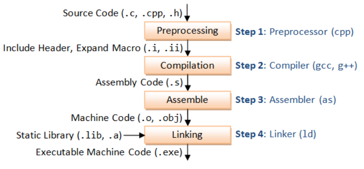

&#8195;&#8195;编写hello world C程序：

```
// hello.c
#include <stdio.h>
int main(){
    printf("hello world!\n");
}
```

&#8195;&#8195;编译过程只需：

```
$ gcc hello.c # 编译
$ ./a.out # 执行
hello world!
```

&#8195;&#8195;上述gcc命令其实依次执行了四步操作：1.`预处理`(Preprocessing),2.`编译`(Compilation),3.`汇编`(Assemble),4.`链接`(Linking)。



# 预处理(Preprocessing)

&#8195;&#8195;第一个阶段是`预处理`阶段，在正式的`编译`阶段之前进行。`预处理`阶段将根据已放置在文件中的`预处理`指令来修改源文件的内容：

1. 把你所有引用的头文件打开来插入到我们本身的程序中。
2. `预处理`阶段会把我们程序中的所有宏进行替换掉，我们经常在程序开头定义一个宏定义，那宏定义的替换就是在`预处理`阶段完成的。
3. 我们在编写程序的时候常常会写入一些注释，对程序并没有作用，所以在`预处理`阶段程序会把我们写入的注释删除掉，机器是看不到我们写的注释的。
4. 我们的条件编译我们常常会写`#ifdef`这时候我们不符合条件的那一部分我们机器也是不会看到的，他不会进入到`编译`阶段。

&#8195;&#8195;你可以通过如下命令对`test.c`进行`预处理`：

```c
gcc -E -I./inc test.c -o test.i
```

&#8195;&#8195;`预处理`之后得到的仍然是文本文件，但文件体积会大很多。

# 编译(Compilation)

&#8195;&#8195;`编译`阶段主要完成的任务就是由编译器来检查一下你的程序是不是有问题是不是有一些语法错误，当你的程序没有问题的时候将经过`预处理`之后的程序**转换成特定汇编代码**(assembly code)。编译的指令如下：

```
$ gcc -S -I./inc test.c -o test.s
```

# 汇编(Assemble)

&#8195;&#8195;`汇编`过程将上一步的汇编代码**转换成机器码**(machine code)，这一步产生的文件叫做目标文件，是二进制格式，在Windows下也就是` .obj`文件，UNIX 下是`.o`文件，即`Object File`。gcc汇编命令：

```
gcc -c test.s -o test.o
```

> &#8195;&#8195;编译进行到这一步，编译器需要的是语法的正确，函数与变量的声明的正确。对于后者，通常是你需要告诉编译器头文件的所在位置（头文件中应该只是声明，而定义应该放在C/C++文件中），只要所有的语法正确，编译器就可以编译出中间目标文件。一般来说，每个源文件都应该对应于一个中间目标文件（`.o`文件或`.obj`文件）。

# 链接(Linking)

&#8195;&#8195;`链接`过程将上一步成生的各个目标文件，以及所需的库文件(`.so`等)，根据一些参数，连接生成最终的可执行文件(executable file)，主要的工作就是重定位各个目标文件的函数，变量等，相当于将个目标文件中的二进制码按一定的规范合到一个文件中。命令大致如下：

```
$ ld -o test.out test.o inc/mymath.o ...libraries...
```

&#8195;&#8195;`链接`时，主要是链接函数和全局变量。所以，我们可以使用这些中间目标文件（`.o`文件或`.obj`文件）来链接我们的应用程序。链接器并不管函数所在的源文件，只管函数的中间目标文件（Object File）， 在大多数时候，由于源文件太多，`编译`生成的中间目标文件太多，而在链接时需要明显地指出中间目标文件名，这对于编译很不方便。所以，我们要给中间目标文件打个包，在Windows下这种包叫“库文件”（Library File），也就是`.lib`文件，在UNIX下，是 Archive File，也就是`.a`文件。

# 头文件和源文件的关系

&#8195;&#8195;c语言中`.c`和`.h`文件本质上没有任何区别。只不过一般`.h`文件是头文件，内含函数声明、宏定义、结构体定义等内容`.c`文件是程序文件，内含函数实现，变量定义等内容。而且是什么后缀也没有关系，只不过编译器会默认对某些后缀的文件采取某些动作。你可以强制编译器把任何后缀的文件都当作c文件来编。
&#8195;&#8195;已知头文件`a.h`声明了一系列函数(仅有函数原型,没有函数实现)，`b.cpp`中实现了这些函数，那么如果我想在`c.cpp`中使用`a.h`中声明的这些在`b.cpp`中实现的函数，通常都是在`c.cpp`中使用`#include “a.h”`,那么`c.cpp`是怎样找到`b.cpp`中的实现呢？
&#8195;&#8195;程序`编译`的时候，并不会去找`b.cpp`文件中的函数实现，只有在`链接`的时候才进行这个工作。我们在`b.cpp`或`c.cpp`中用`#include “a.h”`实际上是引入相关声明，使得编译可以通过，程序并不关心实现是在哪里，是怎么实现的。源文件`编译`后成生成目标文件（`obj`文件），目标文件中，这些函数和变量就视作一个个符号。在`链接`的时候，需要在`Makefile`里面说明需要连接哪个`obj`文件（在这里是`b.cpp`生成的`.obj`文件），此时链接器会去`.obj`文件中找在`b.cpp`中实现的函数，再把他们`build`到`Makefile`中指定的那个可以执行文件中。
&#8195;&#8195;通常，编译器会在每个`.o`或`.obj`文件中都去找一下所需要的符号，而不是只在某个文件中找或者说找到一个就不找了。因此，如果在几个不同文件中实现了同一个函数，或者定义了同一个全局变量，`链接`的时候就会提示`重定义`。

&#8195;&#8195;总结一下，在编译过程中，源文件首先会生成中间目标文件，再由中间目标文件生成执行文件。在编译时，编译器只检测程序语法和函数、变量是否被声明。如果函数未被声明，编译器会给出一个警告，但可以生成目标文件。而在`链接`程序时，链接器会在所有的目标文件中找寻函数的实现。

**参考：[C语言编译过程详解](https://www.cnblogs.com/CarpenterLee/p/5994681.html)、[C++头文件和源文件，编译过程](https://blog.csdn.net/qq_30815237/article/details/88948632)、跟我一起写 Makefile (PDF 重制版)-陈皓-2021 年 02 月 06 日。**