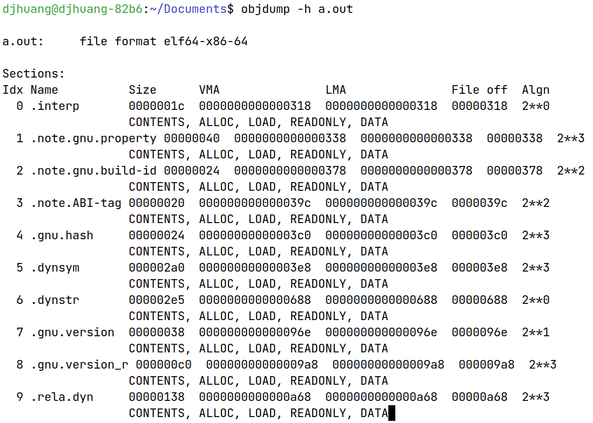
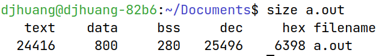
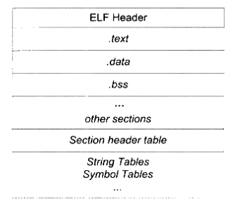
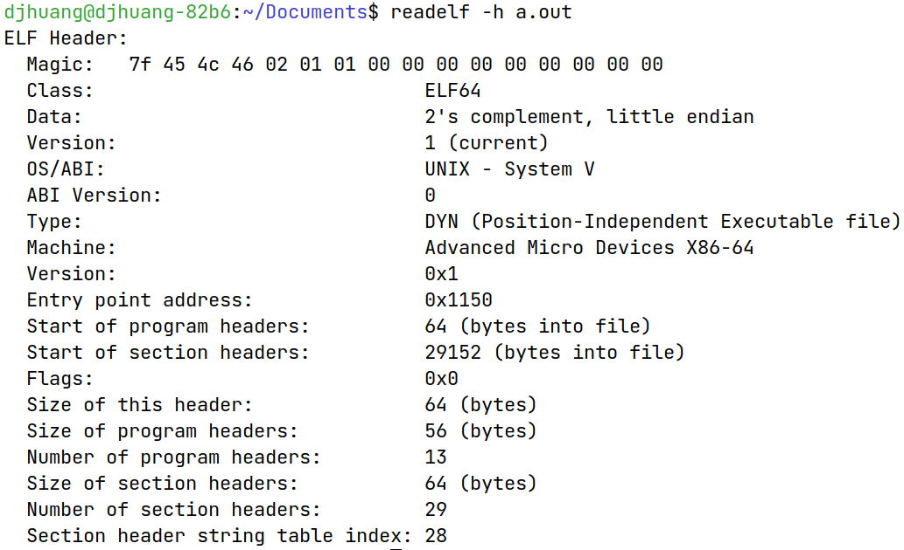
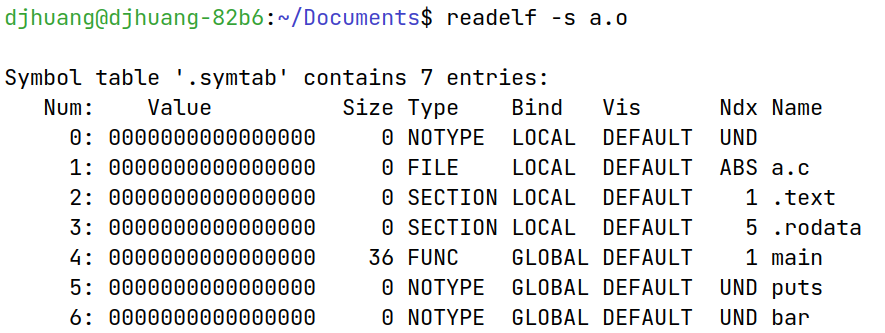

# 目标文件
| 段名  | 解释                         |
| ----- | ---------------------------- |
| .text | 代码段                       |
| .data | 已初始化的局部静态变量和全局变量 |
| .bss  | 未初始化的局部静态变量和全局变量 |
| .rodata  | 只读数据段 |
| .comment | 注释信息段 |
| .note.GNU-stack | 堆栈提示段 |
| .debug | 调试信息 |
| .dynamic | 动态链接信息 |
| .hash | 符号哈希表 |
| .line | 调试时的行号表 |
| .note | 编译器信息 |
| .strtab | 字符串表 |
| .symtab | 符号表 |
| .shstrtab | 段名表 |
| .plt  .got | 动态链接的跳转表和全局入口表 |
| .init .fini | 程序初始化与终结代码段，全局构造与析构 |

## ELF文件

可执行文件主要是windows下的PE和Linux下的ELF，它们都是COFF格式的变种。目标文件是源代码编译后但未链接的中间文件，如Windows下的.obj和Linux下的.o，格式与可执行文件相同。广义上看，目标文件与可执行文件几乎一样，在Linux下可统称为ELF文件。
动态链接库和静态链接库，Windows下的.dll和.lib、Linux下的.so和.a都按照可执行文件存储。

## 分段

总体来说，程序源代码被编译后主要分为两种段：程序指令和程序数据。代码段属于程序指令，数据段和.bss段属于程序数据。好处：

1. 数据和指令分别映射到两个虚存区域。数据区可读写，指令区只读，防止指令被改写。
2. 现代CPU的数据缓存和指令缓存分离，提高缓存命中率。
3. 便于共享指令区域，节省空间。

```sh
objdump -h查看目标文件各个段的基本信息（关键段，不全） -d反汇编 -x啥都显示
```


Size是长度，File off是在文件中的偏移，CONTENTS表示该段在文件中存在。

```sh
size xxx.o	查看三个段的长度
```



## ELF结构



### ELF 文件头
[ELF header详细解释](https://refspecs.linuxfoundation.org/elf/gabi4+/ch4.eheader.html)
ELF文件头包含ELF文件版本、目标机器型号、程序入口地址等。段表描述ELF包含的所有段的信息，如段名、段长、文件偏移、读写权限等。

```sh
readelf -h查看ELF文件头
```



ELF魔数用来确认文件的类型，操作系统在加载可执行文件时会确认魔数是否正确，不正确操作系统会拒绝加载。[马屁股决定航天飞机](https://www.cnblogs.com/royenhome/archive/2010/10/31/1865559.html)

### 段表
[段表详细解释](https://refspecs.linuxfoundation.org/elf/gabi4+/ch4.sheader.html)
段表保存段的基本属性，是除了文件头外最重要的结构。编译器、链接器、装载器都是依靠段表来定位和访问各个段的。

```sh
readelf -S显示完整段表
```


### 符号表

[符号表详细解释](https://refspecs.linuxfoundation.org/elf/gabi4+/ch4.symtab.html)

包含符号名、符号对应的值、符号大小、符号类型和绑定信息、符号所在段。

```sh
readelf -s查看符号表
```



#### 特殊符号

```sh
gcc -Wl,--verbose xxx.c >> default_linker.ld查看默认链接脚本
```

 [gcc默认链接脚本](chengxu/default_linker.ld) 

可以在程序中直接使用ld定义的一些特殊符号：

````C
#include<stdio.h>

extern char __executable_start[];
extern char etext[], _etext[], __etext[];
extern char edata[], _edata[];
extern char end[], _end[];

int main() {
    printf("Executable Start %X\n", __executable_start);
    printf("Text End %X %X %X\n", etext, _etext, __etext);
    printf("Data End %X %X", edata, _edata);
    printf("Executable End %X %X\n", end, _end);

    return 0;
}
````
[extern char *s与extern char s[]的区别](https://debug.fanzheng.org/post/difference-between-pointer-and-array.html)

### 符号修饰

为了防止类似的符号名冲突，UNIX下的C语言就规定，C语言源代码文件中的所有全局的变量和函数经过编译以后，相对应的符号名前加上下划线`_`。

### 强弱符号

编译器默认函数和初始化了的全局变量为强符号，未初始化的全局变量为弱符号。也可以通过GCC的\_\_attribute\_\_((weak))来定义任何一个强符号为弱符号。

```C
__attribute__((weak)) weak2 = 2;
```

1. 不允许强符号被多次定义
2. 如果一个符号在某个文件中是强符号，在其他文件中都是弱符号，选择强符号
3. 如果一个符号在所有目标文件中都是弱符号，选择占用空间最大的一个

强弱引用

使用\_\_attribute\_\_((weakref))这个关键字来声明对一个外部函数的引用为弱引用。

```C
__attribute__((weakref)) void foo();
foo();
```

编译器在处理弱引用时，如果该符号有定义，则链接器将该符号的引用决议；如果该符号未被定义，则链接器对于该引用不报错。一般对于为定义的弱引用，链接器默认其为0。

## 调试信息

在GCC编译时加上-g参数，编译器就会在产生的目标文件加上调试相关的段，现在的ELF文件采用一个叫[DWARF](https://dwarfstd.org/)的标准的调试信息格式。在Linux下可以使用strip命令来去掉ELF文件中的调试信息。