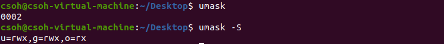

# 权限功能
文件和目录的`rwx`权限功能如下表：


可以看到，对一般文件来说，`rwx`主要是针对“文件的内容”来设计权限，对目录来说，`rwx`则是针对“目录内的文件名列表”来设计权限。
对于文件而言，`r`让用户可读取此一文件的实际内容，如读取文本文件的文字内容等；`w`让用户可以编辑、新增或者是修改该文件的内容，但不含删除该文件。`x`让用户可以执行文件内容，注意一个文件能否被执行只与`x`权限是否开放有关，不像windows一样和文件后缀有关。
对目录而言，`r`可以让使用者读取目录的文件名列表，不过详细的信息却还是读不到的；`w`可以让使用者删除、更新、新建文件或目录；`x`与“能否进入该目录”有关，如果没有`x`权限，用户不能切换到目录内，也就无法执行该目录下的任何指令，即使你具有该目录的`r`或`w`的权限。示例如下:

```
learning:
drwxrwxr-- 2 root root 4096 1月  13 22:45 ./
-rw-rw-r-- 1 root root    0 1月  13 22:45 learning
```
用户`csoh`只有`learning`目录的`r`权限，此时`cd learning`显示：
```
bash: cd: learning: Permission denied
```
`ll learning`显示：
```
ls: cannot access 'learning/.': Permission denied
ls: cannot access 'learning/learning': Permission denied
ls: cannot access 'learning/..': Permission denied
total 0
d????????? ? ? ? ?             ? ./
d????????? ? ? ? ?             ? ../
-????????? ? ? ? ?             ? learning
```
假设有`/dir1/file1`和`/dir2`两个路径，用户完成各项任务所需最小权限如下：


可见没有`dir1`的`r`权限不影响大部分操作，可理解为`/dir1`是个"抽屉"，`r`权限是"抽屉里的光"，已经知道抽屉里有怎样的数据的话，有没有光就无所谓了。

# 默认权限
用户创建一个新的文件或目录时所拥有的权限和`umask`有关，查看方法为`umask`或`umaks -S`指令。



用户创建文件时默认权限是`-rw-rw-rw-`，创建目录时默认权限是`drwxrwxrwx`，以`x`是1分，`w`是2分，`r`是4来算，`umask`的后三位分别是使用者，组内用户和其他用户默认权限需要减去的权限分数之和，按上图`umask`的后三位`002`来计算就是：使用者和组内用户不减去权限，其他用户减去`w`权限。此时创建一个新的文件和新的目录后：


**参考：鸟哥的 Linux 私房菜：基础学习篇 第四版**