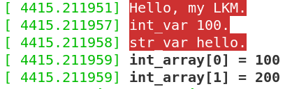
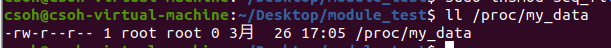
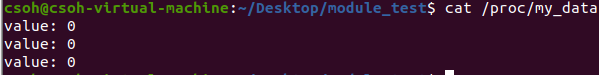
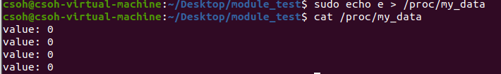
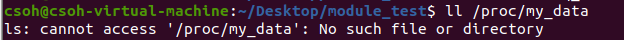
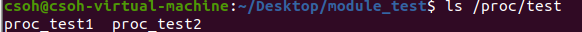
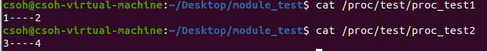
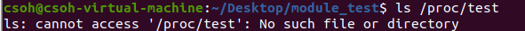

> 环境：Linux version 5.13.0-37-generic (buildd@lcy02-amd64-111) (gcc (Ubuntu 9.4.0-1ubuntu1~20.04) 9.4.0, GNU ld (GNU Binutils for Ubuntu) 2.34)

# 一、模块参数实践

## 源文件demo.c

```c
#include <linux/module.h>
#include <linux/moduleparam.h>
#include <linux/kernel.h>

#define MAX_ARRAY 6

static int int_var = 0;
static char *str_var = "default";
static int int_array[6];
int narr;

/*定义一个整型数*/
module_param(int_var, int, 0644);
MODULE_PARM_DESC(int_var, "A integer variable");

/*定义一个字符*/
module_param(str_var, charp, 0644);    
MODULE_PARM_DESC(str_var, "A string variable");

/*定义元素是整型的数组*/
module_param_array(int_array, int, &narr, 0644); 
MODULE_PARM_DESC(int_array, "A integer array");


static int __init hello_init(void)
{
       int i;
       printk(KERN_ALERT "Hello, my LKM.\n");
       printk(KERN_ALERT "int_var %d.\n", int_var);
       printk(KERN_ALERT "str_var %s.\n", str_var);

       for(i = 0; i < narr; i ++){
               printk("int_array[%d] = %d\n", i, int_array[i]);
       }
       return 0;
}

static void __exit hello_exit(void)
{
       printk(KERN_ALERT "Bye, my LKM.\n");
}
module_init(hello_init);
module_exit(hello_exit);
MODULE_LICENSE("GPL");
MODULE_AUTHOR("ydzhang");
MODULE_DESCRIPTION("This module is a example.");
```

## Makefile

```makefile
obj-m := demo.o
KERNELDIR := /lib/modules/$(shell uname -r)/build
PWD := $(shell pwd)
modules:
    $(MAKE) -C $(KERNELDIR) M=$(PWD) modules
modules_install:    
    $(MAKE) -C $(KERNELDIR) M=$(PWD) modules_install
clean:    
    rm -f *.ko ~core.depend
```

## 加载模块——insmod

```bash
sudo insmod demo.ko int_var=100 str_var=hello int_array=100,200
```

加载模块后`dmesg`命令显示：



## 卸载模块——rmmod

```bash
sudo rmmod demo
```

删除模块后`dmesg`命令显示：


# 二、Proc文件系统实践

## 1、基于Seq_file接口的Proc文件系统实现

### 源文件Seq_file.c

```c
#include <linux/kernel.h>
#include <linux/module.h>
#include <linux/mutex.h>
#include <linux/proc_fs.h>
#include <linux/seq_file.h>
#include <linux/slab.h>

static struct mutex lock;
static struct list_head head;
struct my_data
{
        struct list_head list;    /**<双向链表 */
        int value;
};

/*在链表头插入一个my_data*/
static void add_one(void)
{
        struct my_data *data;

        mutex_lock(&lock);
        data = kmalloc(sizeof(struct my_data), GFP_KERNEL);
        if (data != NULL)
                list_add(&data->list, &head);
        mutex_unlock(&lock);
}

static void *_seq_start(struct seq_file *m, loff_t *pos)
{
        mutex_lock(&lock);
        return seq_list_start(&head, *pos);
}

static void *_seq_next(struct seq_file *m, void *p, loff_t *pos)
{
        return seq_list_next(p, &head, pos);
}

static void _seq_stop(struct seq_file *m, void *p)
{
        mutex_unlock(&lock);
}

/*打印所有节点的内容*/
static int _seq_show(struct seq_file *m, void *p)
{
        struct my_data *data = list_entry(p, struct my_data, list);
        seq_printf(m, "value: %d\n", data->value);
        return 0;
}

static struct seq_operations _seq_ops = {
    .start = _seq_start,
    .next = _seq_next,
    .stop = _seq_stop,
    .show = _seq_show
};

static int _seq_open(struct inode *inode, struct file *file)
{
        return seq_open(file, &_seq_ops);
}

/*写数据则调用add_one()*/
static ssize_t _seq_write(struct file *file, const char __user *buffer, size_t count, loff_t *ppos)
{
        add_one();
        /* 此处使用copy_from_user可以从用户态传递数据到内核态 */
        return count;
}

/*static struct file_operations _seq_fops = {
    .open = _seq_open,
    .read = seq_read,
    .write = _seq_write,
    .llseek = seq_lseek,
    .release = seq_release
};*/

/*新版本内核需要使用下面的结构体*/
static struct proc_ops _seq_fops={
    .proc_open = _seq_open,
    .proc_release = seq_release,
    .proc_read = seq_read,
    .proc_lseek = seq_lseek,
    .proc_write = _seq_write
};

static int __init init(void)
{
        struct proc_dir_entry *entry;
        struct my_data *data;

        mutex_init(&lock);
        INIT_LIST_HEAD(&head);
        add_one();
        add_one();
        add_one();

        entry = proc_create("my_data", S_IWUSR | S_IRUGO, NULL, &_seq_fops);
        if (entry == NULL)
        {
                return -ENOMEM;
        }
        return 0;
}

static void __exit fini(void)
{
        struct my_data *data;
        remove_proc_entry("my_data", NULL);
        while (!list_empty(&head))
        {
                data = list_entry((&head)->next, struct my_data, list);
                list_del(&data->list);
                kfree(data);
        }
}

module_init(init);
module_exit(fini);
MODULE_LICENSE("GPL");
MODULE_AUTHOR("ydzhang");
MODULE_DESCRIPTION("This module is a example.");
```

### Makefile

```makefile
obj-m := Seq_file.o
KERNELDIR := /lib/modules/$(shell uname -r)/build
PWD := $(shell pwd)
modules:
    $(MAKE) -C $(KERNELDIR) M=$(PWD) modules
modules_install:    
    $(MAKE) -C $(KERNELDIR) M=$(PWD) modules_install
clean:    
    rm -f *.ko ~core.depend
```

### 加载模块

```bash
sudo insmod Seq_file.ko
```

使用`ll /proc/my_data`查看新建文件：



使用`cat /proc/my_data`读数据：



给自己写文件的权限：

```bash
sudo chmod a=rwx /proc/my_data
```

使用`echo e > /proc/my_data`写数据后`cat`：



`add_one()`函数执行正确。

### 卸载模块

```bash
sudo rmmod Seq_file
```

卸载后文件被删除：



## 2、基于Single_xxxx接口的Proc文件系统实现

### 源文件Single_xxxx.c

```c
#include <linux/init.h>
#include <linux/module.h>
#include <linux/types.h>
#include <linux/slab.h>
#include <linux/fs.h>
#include <linux/proc_fs.h>
#include <linux/seq_file.h>
#include <linux/mm.h>
#include <linux/uaccess.h>

MODULE_LICENSE("GPL");

typedef struct
{
    int data1;
    int data2;
} DataType;
static DataType data[2];
static struct proc_dir_entry *procdir;

/*打印proc文件的内容*/
static int test_proc_show(struct seq_file *m, void *v)
{
    DataType *pData = (DataType *)m->private;
    if (pData != NULL)
    {
        seq_printf(m, "%d----%d\n",
                   pData->data1, pData->data2);
    }
    return 0;
}

static int test_proc_open(struct inode *inode, struct file *file)
{
    return single_open(file, test_proc_show, PDE_DATA(inode));//新版本内核改动
}

/*static const struct file_operations dl_file_ops = {
    .owner = THIS_MODULE,
    .open = test_proc_open,
    .read = seq_read,
    .llseek = seq_lseek,
    .release = single_release,
};*/

/*新版本内核需要使用下面的结构体*/
static struct proc_ops dl_file_ops = {
    .proc_open = test_proc_open,
    .proc_release = single_release,
    .proc_read = seq_read,
    .proc_lseek = seq_lseek
};

/*初始化两个proc文件，填入数据*/
static int __init test_module_init(void)
{ /* create /proc/test */
    printk("[test]: module init\n");

    procdir = proc_mkdir("test", NULL);
    if (!procdir)
        return 0;

    data[0].data1 = 1;
    data[0].data2 = 2;
    proc_create_data("proc_test1", 0644, procdir, &dl_file_ops, &data[0]);

    data[1].data1 = 3;
    data[1].data2 = 4;
    proc_create_data("proc_test2", 0644, procdir, &dl_file_ops, &data[1]);
    return 0;
}

static void __exit test_module_exit(void)
{
    printk("[test]: module exit\n");
    remove_proc_entry("proc_test1", procdir);
    remove_proc_entry("proc_test2", procdir);
    remove_proc_entry("test", NULL);
}

module_init(test_module_init);
module_exit(test_module_exit);
MODULE_LICENSE("GPL");
MODULE_AUTHOR("ydzhang");
MODULE_DESCRIPTION("This module is a example.");
```

### Makefile

```makefile
obj-m := Single_xxxx.o
KERNELDIR := /lib/modules/$(shell uname -r)/build
PWD := $(shell pwd)
modules:
    $(MAKE) -C $(KERNELDIR) M=$(PWD) modules
modules_install:    
    $(MAKE) -C $(KERNELDIR) M=$(PWD) modules_install
clean:    
    rm -f *.ko ~core.depend
```

### 加载模块

```bash
sudo insmod Single_xxxx.ko
```

使用`ll /proc/test`查看新建文件：



使用`cat /proc/test/proc_test1`、`cat /proc/test/proc_test2`读数据：



### 卸载模块

```bash
sudo rmmod Single_xxxx
```

卸载后文件删除：


---

**参考：[list_head结构体的理解](https://blog.csdn.net/u013904227/article/details/50931540)、[linux kernel - Passing argument 4 of ‘proc_create’ from incompatible pointer type](https://stackoverflow.com/questions/61295277/passing-argument-4-of-proc-create-from-incompatible-pointer-type)、[Ubuntu20.04 内核5.11.8 用proc_create和seq_file创建proc文件](https://blog.csdn.net/weixin_43359312/article/details/115182166)。**
