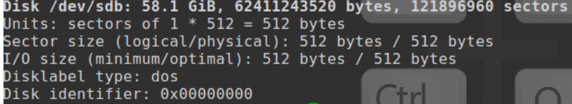

折腾了一天，把物理机上的 Manjaro 安装好了，在这里稍微记录安装中遇到的一些问题的解决办法，也作为对桌面 Linux 桌面版折腾的收尾。

## 1. Linux 制作系统盘

`sudo fdisk -l`：显示磁盘分区信息，找到U盘的盘符，一般在最下面。

`sudo umount /dev/sd*****`：卸载U盘。

`sudo mkfs.vfat /dev/sdb -I`：格式化U盘，格式化后显示和下图类似。

`sudo dd if=****.iso of=/dev/sdb`： 制作启动盘。

## 2. Manjaro 换源

`sudo pacman-mirrors -i -c China -m rank`： 列出国内镜像，按照拍好的序选择最上面的一个。

`sudo pacman -Syyu`：更新软件库。

## 3. 换 sh

`sudo chsh -s /bin.bash`：更换sh。

## 4. 处理关机的巨大声音

`su -c 'modprobe -r pcspkr && echo "blacklist pcspkr" >> /etc/modprobe.d/50-blacklist.conf'`

## 5. 软件包降版本

`sudo DOWNGRADE_FROM_ALA=1 downgrade *package-name*`

## 6. 删除无用依赖包

`sudo pacman -Qtdq | sudo pacman -Rns -`

---

**参考：[manjaro换源](https://blog.csdn.net/CHAOS_ORDER/article/details/103396013)、[Linux系统制作Ubuntu18.04启动盘](https://blog.csdn.net/xiaoma_2018/article/details/85059930)、[Loud beep at shutdown](https://forum.endeavouros.com/t/solved-loud-beep-at-shutdown/27389/26)、[How to downgrade? No Packages available](https://forum.manjaro.org/t/how-to-downgrade-no-packages-available/71916/7)、[Reddit](https://www.reddit.com/r/ManjaroLinux/comments/mixbgk/how_can_i_remove_the_unused_dependencies_but_keep/)。**