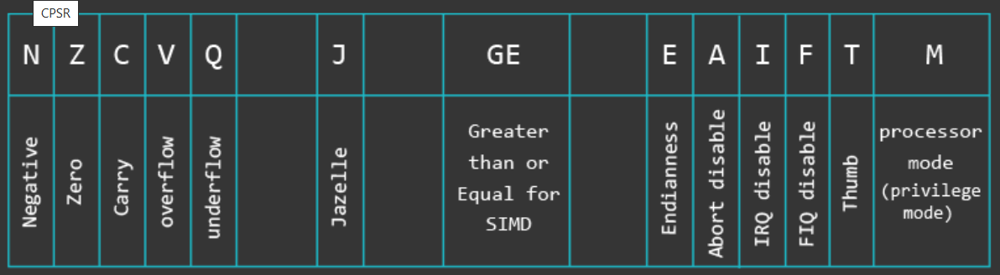

# 数据类型

```asm
ldr = Load Word
ldrh = Load unsigned Half Word
ldrsh = Load signed Half Word
ldrb = Load unsigned Byte
ldrsb = Load signed Bytes

str = Store Word
strh = Store unsigned Half Word
strsh = Store signed Half Word
strb = Store unsigned Byte
strsb = Store signed Byte
```

# 寄存器

|             #             | Alias | Purpose                         |
| :-----------------------: | :----: | :------------------------------: |
|            R0             | –     | General purpose                 |
|            R1             | –     | General purpose                 |
|            R2             | –     | General purpose                 |
|            R3             | –     | General purpose                 |
|            R4             | –     | General purpose                 |
|            R5             | –     | General purpose                 |
|            R6             | –     | General purpose                 |
|            R7             | –     | Holds Syscall Number            |
|            R8             | –     | General purpose                 |
|            R9             | –     | General purpose                 |
|            R10            | –     | General purpose                 |
|            R11            | FP    | Frame Pointer                   |
| Special Purpose Registers |       |                                 |
|            R12            | IP    | Intra Procedural Call           |
|            R13            | SP    | Stack Pointer                   |
|            R14            | LR    | Link Register                   |
|            R15            | PC    | Program Counter                 |
|           CPSR            | –     | Current Program Status Register |

> 使用ARM指令时PC是当前指令加8，使用Thumb指令时是加4。

**CSPR：**



| Flag           | Description                                                  |
| :------------- | :----------------------------------------------------------- |
| N (Negative)   | Enabled if result of the instruction yields a negative number. |
| Z (Zero)       | Enabled if result of the instruction yields a zero value.    |
| C (Carry)      | Enabled if result of the instruction yields a value that requires a 33rd bit to be fully represented. |
| V (Overflow)   | Enabled if result of the instruction yields a value that cannot be represented in 32 bit two’s complement. |
| E (Endian-bit) | ARM can operate either in little endian, or big endian. This bit is set to 0 for little endian, or 1 for big endian mode. |
| T (Thumb-bit)  | This bit is set if you are in Thumb state and is disabled when you are in ARM state. |
| M (Mode-bits)  | These bits specify the current privilege mode (USR, SVC, etc.). |
| J (Jazelle)    | Third execution state that allows some ARM processors to execute Java bytecode in hardware. |

# 汇编指令简介

大部分ARM汇编格式:

```asm
MNEMONIC{S}{condition} {Rd}, Operand1, Operand2

MNEMONIC     - Short name (mnemonic) of the instruction
{S}          - An optional suffix. If S is specified, the condition flags are updated on the result of the operation
{condition}  - Condition that is needed to be met in order for the instruction to be executed
{Rd}         - Register (destination) for storing the result of the instruction
Operand1     - First operand. Either a register or an immediate value 
Operand2     - Second (flexible) operand. Can be an immediate value (number) or a register with an optional shift
```

Operand1和Operand2可以是：

```asm
#123                    - Immediate value (with limited set of values). 
Rx                      - Register x (like R1, R2, R3 ...)
Rx, ASR n               - Register x with arithmetic shift right by n bits (1 = n = 32)
Rx, LSL n               - Register x with logical shift left by n bits (0 = n = 31)
Rx, LSR n               - Register x with logical shift right by n bits (1 = n = 32)
Rx, ROR n               - Register x with rotate right by n bits (1 = n = 31)
Rx, RRX                 - Register x with rotate right by one bit, with extend
```

指令举例：

```asm
ADD   R0, R1, R2         - Adds contents of R1 (Operand1) and R2 (Operand2 in a form of register) and stores the result into R0 (Rd)
ADD   R0, R1, #2         - Adds contents of R1 (Operand1) and the value 2 (Operand2 in a form of an immediate value) and stores the result into R0 (Rd)
MOVLE R0, #5             - Moves number 5 (Operand2, because the compiler treats it as MOVLE R0, R0, #5) to R0 (Rd) ONLY if the condition LE (Less Than or Equal) is satisfied
MOV   R0, R1, LSL #1     - Moves the contents of R1 (Operand2 in a form of register with logical shift left) shifted left by one bit to R0 (Rd). So if R1 had value 2, it gets shifted left by one bit and becomes 4. 4 is then moved to R0.
```

指令总结：

| Instruction | Description            | Instruction | Description                   |
| :---------: | :--------------------- | :---------: | :---------------------------- |
|     MOV     | Move data              |     EOR     | Bitwise XOR                   |
|     MVN     | Move and negate        |     LDR     | Load                          |
|     ADD     | Addition               |     STR     | Store                         |
|     SUB     | Subtraction            |     LDM     | Load Multiple                 |
|     MUL     | Multiplication         |     STM     | Store Multiple                |
|     LSL     | Logical Shift Left     |    PUSH     | Push on Stack                 |
|     LSR     | Logical Shift Right    |     POP     | Pop off Stack                 |
|     ASR     | Arithmetic Shift Right |      B      | Branch                        |
|     ROR     | Rotate Right           |     BL      | Branch with Link              |
|     CMP     | Compare                |     BX      | Branch and eXchange           |
|     AND     | Bitwise AND            |     BLX     | Branch with Link and eXchange |
|     ORR     | Bitwise OR             |   SWI/SVC   | System Call                   |

# LOAD 和 STORE
## 基础
```asm
LDR R2, [R0]   @ [R0] - origin address is the value found in R0.
STR R2, [R1]   @ [R1] - destination address is the value found in R1.
```
```asm
.data          /* the .data section is dynamically created and its addresses cannot be easily predicted */
var1: .word 3  /* variable 1 in memory */
var2: .word 4  /* variable 2 in memory */

.text          /* start of the text (code) section */ 
.global _start

_start:
    ldr r0, adr_var1  @ load the memory address of var1 via label adr_var1 into R0 
    ldr r1, adr_var2  @ load the memory address of var2 via label adr_var2 into R1 
    ldr r2, [r0]      @ load the value (0x03) at memory address found in R0 to register R2  
    str r2, [r1]      @ store the value found in R2 (0x03) to the memory address found in R1 
    bkpt             

adr_var1: .word var1  /* address to var1 stored here */
adr_var2: .word var2  /* address to var2 stored here */
```
## 立即数作偏移

```asm
STR    Ra, [Rb, imm]
LDR    Ra, [Rc, imm]
```

```asm
str r2, [r1, #2]  @ address mode: offset. Store the value found in R2 (0x03) to the memory address found in R1 plus 2. Base register (R1) unmodified. 
str r2, [r1, #4]! @ address mode: pre-indexed. Store the value found in R2 (0x03) to the memory address found in R1 plus 4. Base register (R1) modified: R1 = R1+4 
ldr r3, [r1], #4  @ address mode: post-indexed. Load the value at memory address found in R1 to register R3. Base register (R1) modified: R1 = R1+4 
```

## 寄存器作偏移

```asm
STR    Ra, [Rb, Rc]
LDR    Ra, [Rb, Rc]
```

```asm
str r2, [r1, r2]  @ address mode: offset. Store the value found in R2 (0x03) to the memory address found in R1 with the offset R2 (0x03). Base register unmodified.   
str r2, [r1, r2]! @ address mode: pre-indexed. Store value found in R2 (0x03) to the memory address found in R1 with the offset R2 (0x03). Base register modified: R1 = R1+R2. 
ldr r3, [r1], r2  @ address mode: post-indexed. Load value at memory address found in R1 to register R3. Then modify base register: R1 = R1+R2.
```

## 修改后寄存器作偏移

```asm
LDR    Ra, [Rb, Rc, <shifter>]
STR    Ra, [Rb, Rc, <shifter>]
```

```asm
str r2, [r1, r2, LSL#2]  @ address mode: offset. Store the value found in R2 (0x03) to the memory address found in R1 with the offset R2 left-shifted by 2. Base register (R1) unmodified.
str r2, [r1, r2, LSL#2]! @ address mode: pre-indexed. Store the value found in R2 (0x03) to the memory address found in R1 with the offset R2 left-shifted by 2. Base register modified: R1 = R1 + R2<<2
ldr r3, [r1], r2, LSL#2  @ address mode: post-indexed. Load value at memory address found in R1 to the register R3. Then modifiy base register: R1 = R1 + R2<<2
```

## LDR 伪指令

```asm
.section .text
.global _start

_start:
   ldr r0, =jump        /* load the address of the function label jump into R0 */
   ldr r1, =0x68DB00AD  /* load the value 0x68DB00AD into R1 */
jump:
   ldr r2, =511         /* load the value 511 into R2 */ 
   bkpt
```

## 使用立即数

arm指令均为32位，只剩下12位给立即数，其中8位是n(0-255)任意，另外四位是r(0-15)右移的位数。即 v = n ror 2*r。

# 多重LDR STR


-----

**参考：[azeria-labs](azeria-labs.com)**。