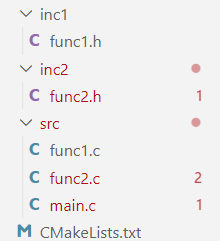
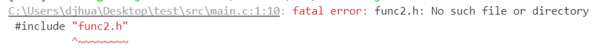

# make、Makefile和CMake
&#8195;&#8195;Makefile关系到了整个工程的编译规则。一个工程中的源文件不计其数,并且按类型、功能、模块分别放在若干个目录中,Makefile定义了一系列的规则来指定,哪些文件需要先编译,哪些文件需要后编译,哪些文件需要重新编译,甚至于进行更复杂的功能操作。Makefile带来的好处就是——“自动化编译”,一旦写好,只需要一个`make`命令,整个工程完全自动编译,极大的提高了软件开发的效率。
&#8195;&#8195;`make`是一个命令工具,是一个解释Makefile中指令的命令工具,一般来说,大多数的IDE都有这个命令,比如Delphi的`make`,Visual C++的`nmake`,Linux下GNU的`make`。可见,Makefile都成为了一种在工程方面的编译方法。
&#8195;&#8195;`CMake`是一个跨平台的编译工具，能够输出各种各样的Makefile或者project文件。例如，如果一个项目需要在Windows上用VS编译，在Linux上用`make`编译，在OS X上用X CODE，那么按以前的做法是在整个项目文件里看三个目录，分别放置VS的sln文件，Linux的Makefile，OS X的X CODE，然后让不同需求的人到相应的目录用自己需要的工程文件。有了CMake以后，就不需要这三个目录了，只要有一个给CMake读的文件，然后CMake的UI上会需要用户选择目标平台，这样CMake就会生成目标平台上的工程文件。
&#8195;&#8195;CMake并不直接构建出最终的软件，而是生成标准的Makefile文件或者Visual Studio项目文件，然后再使用make或者Visual Studio进行编译。

# 最小的CMakeLists.txt
&#8195;&#8195;一个最简单的`CMakeLists.txt`只包含三行代码：
```
# Set the minimum version of CMake that can be used To find the cmake version run $ cmake --version
cmake_minimum_required(VERSION 3.5)

# Set the project name and version
project (hello_cmake VERSION 1.0)

# Add an executable
add_executable(hello_cmake main.cpp)
```
&#8195;&#8195;`cmake_minimum_required`用来确定支持的CMake的最小版本。
&#8195;&#8195;`project`设置CMake工程名和版本号。同时用工程名创建一个`${PROJECT_NAME}`变量。
&#8195;&#8195;[`add_executable`](https://cmake.org/cmake/help/v3.22/command/add_executable.html?highlight=add_exe)确定要使用那些文件生成可执行文件，函数的第一个参数是生成可执行文件的名字，可以使用变量。如`add_executable(${PROJECT_NAME} main.cpp)`在上例中表示生成名为`hello_cmake`的可执行文件。

# include目录
&#8195;&#8195;当有多个`include`目录时，可以使用[`target_include_directories`](https://cmake.org/cmake/help/v3.22/command/target_include_directories.html?highlight=target_include_directoried)让编译器在编译目标文件时包含这些路径，例如：
```
target_include_directories(target
    PRIVATE
        ${PROJECT_SOURCE_DIR}/include
)
```
&#8195;&#8195;其中`target`必须由`add_executable`或`add_libray`创建且不能是别名目标。`PRIVATE`、`PUNLIC`、`INTERFACE`用来确定紧跟的参数的作用域。`PRIVATE`和`PUBLIC`用参数填充`target`的`INCLUDE_DIRECTORIES`变量，`PUBLIC`和`INTERFACE`用参数填充`target`的`INTERFACE_INCLUDE_DIRECTORIES`变量。如果`target`是`library`文件，`INTERFACE`表示参数只添加到所有链接此`library`的`target`的include路径中，`PUBLIC`表示参数添加到`library`的include路径和所有包含此`library`的`target`的include路径中。
# 使用库文件
## 创建库文件
&#8195;&#8195;[`add_library`](https://cmake.org/cmake/help/v3.22/command/add_library.html?highlight=add#command:add_library)函数用源文件创建库文件，下例用`Hello.cpp`创建名为`hello_library`的静态库文件，库文件的后缀由平台确定。
```
add_library(hello_library STATIC 
    src/Hello.cpp
)
```
&#8195;&#8195;创建的库文件类型可能是`STATIC`、`SHARED`或`MODULE`。静态库是目标文件的合集，在编译过程中被载入可执行程序，动态库在可执行程序运行时才载入内存，在编译过程中仅简单的引用。如果没有指定创建什么类型的库文件，默认创建静态库并依据`BUILD_SHARED_LIBS`的值决定生成是否创建动态库。库文件生成的位置可以通过变量`ARCHIVE_OUTPUT_DIRECTORY`、`LIBRARY_OUTPUT_DIRECTORY`、和`RUNTIME_OUTPUT_DIRECTORY`修改。
## 引入库文件
&#8195;&#8195;在创建可执行文件时使用[`target_link_libraries`](https://cmake.org/cmake/help/v3.22/command/target_link_libraries.html?highlight=target_link#command:target_link_libraries)函数告诉编译器使用那些库文件：
```
add_executable(hello_binary
    src/main.cpp
)

target_link_libraries( hello_binary
    PRIVATE
        hello_library
)
```
&#8195;&#8195;第一个参数`target`必须由`add_executable`或`add_libray`创建且不能是别名目标。`PUBLIC`、`INTERFACE`、`PRIVATE`用法和`target_include_directories`中类似用来确定链接的依赖性。用来链接的对象参数可以是：库文件目标名、库文件的完整路径或文件名。函数中的`PUBLIC`、`PRIVATE`、`INTERFACE`关键字用来确定链接的依赖性和链接的接口，跟在`PUBLIC`和`PRIVATE`后的对象被链接到`target`、跟在`PUBLIC`和`INTERFACE`后的对象被加入链接接口。
# 编译定义和选项
&#8195;&#8195;为目标编译过程添加预定义的函数是[`target_compile_definitions`](https://cmake.org/cmake/help/v3.0/command/target_compile_definitions.html?highlight=target_compile_definitions)，使用方法如下：
```
target_compile_definitions(cmake_examples_compile_flags 
    PRIVATE EX3
)
```
&#8195;&#8195;第一个参数`target`必须由`add_executable`或`add_libray`创建且不能是别名目标。`PRIVATE`和`PUBLIC`用参数填充`target`的`COMPILE_DEFINITIONS`变量，`PUBLIC`和`INTERFACE`用参数填充`target`的`INTERFACE_COMPILE_DEFINITIONS`变量。如果`target`是库，并且已经选择了定义的作用域是`PUBLIC`或者`INTERFACE`，则该定义也将包含在链接该`target`的任何可执行文件中。
&#8195;&#8195;类似地，可以用[`target_compile_options`](https://cmake.org/cmake/help/latest/command/target_compile_options.html#:~:text=The%20final%20set%20of%20compile%20or%20link%20options,set%20of%20options%20is%20de-duplicated%20to%20avoid%20repetition.)函数给shell传递选项参数。

# 目标的属性
&#8195;&#8195;在把源文件便以为二进制目标时，需要用到目标的`INCLUDE_DIRECTORIES`、`COMPILE_DEFINITIONS`和`COMPILE_OPTIONS`属性而`target_include_directories`、`target_compile_definitions`和`target_compile_options`函数确定了这些参数，此外这几个函数还确定`INTERFACE_INCLUDE_DIRECTORIES`、 `INTERFACE_COMPILE_DEFINITIONS`和`INTERFACE_COMPILE_OPTIONS`参数，因为它们有`PRIVATE`、`INTERFACE`和`PUBLIC的`参数可以选择。
&#8195;&#8195;`INTERFACE_INCLUDE_DIRECTORIES`，`INTERFACE_COMPILE_DEFINITIONS`和`INTERFACE_COMPILE_OPTIONS`被称作`Usage Requirements`。一个`target`的`Usage Requirements`可以传播给它的依赖者，`target_link_libraries`函数用`PRIVATE`、`INTERFACE`和`PUBLIC`关键字控制这种传播。
&#8195;&#8195;如果被依赖者只用来实现一个library的内容，那么在`target_link_libraries`函数里就要用`PRIVATE`关键字，如果被依赖者只是被加到library的头文件里，就要用`INTERFACE`关键字，如果两个功能都要实现，就要用`PUBLIC`关键字，类似的逻辑在本篇文章中已经出现过很多次。

```
target_link_libraries(archiveExtras
  PUBLIC archive
  PRIVATE serialization
)
```
# 示例
&#8195;&#8195;目录结构如下图所示：



CMakeLists.txt：

```
cmake_minimum_required (VERSION 3.0)
project (demo)
add_executable (main src/main.c)
add_library(func1_lib SHARED src/func1.c )
add_library(func2_lib SHARED src/func2.c)

target_include_directories(func1_lib PUBLIC ${PROJECT_SOURCE_DIR}/inc2)
target_include_directories(main PRIVATE ${PROJECT_SOURCE_DIR}/inc1)

target_link_libraries(func1_lib PUBLIC func2_lib)
target_link_libraries(main PRIVATE func1_lib)

target_compile_definitions(func1_lib PUBLIC FUNC1)
```
&#8195;&#8195;main.c：
```
#include "func2.h"
#include "func1.h"
int main(){
    func1();
    func2();
#ifdef FUNC1
    printf("DEFINED");
#endif
}
```
&#8195;&#8195;func1.h：
```
void func1();
```
&#8195;&#8195;func1.c：
```
#include <stdio.h>
#include "func2.h"
void func1(){
    printf("func1");
    func2();
}
```
&#8195;&#8195;func2.h：
```
void func2();
```
&#8195;&#8195;func2.c：
```
#include <stdio.h>
void func2(){
    printf("func2");
}
```
&#8195;&#8195;现在使用CMake后程序正常编译，输出结果：


&#8195;&#8195;**此时：**

1. 如果将`CMakeLists.txt`第6行的`PUBLIC`改为`PRIVATEPUBLIC`，编译器提示找不到`func2.h`。这是因为`main.c`获取`func2.h`的途径是`func1_lib`——因为`mian`链接了`func1_lib`，而`func1_1`以`PUBLIC`的方式得到了`fun2.h`的路径，所以`main`也能得到`fun2.h`的路径。如果`func1_1`以`PRIVATE`的方式得到`fun2.h`的路径，就不能传播给`main`，会提示找不到`func2.h`。
    

2. 如果将`CMakeLists.txt`第8行的`PUBLIC`改为`PRIVATE`，编译器提示`func2`函数未定义。这是因为`main`是通过`func1_lib`来获取`func2_lib`的，当`func1_lib`不再通过`PUBLIC`关键字把`func2_lib`传播到`main`，`main`中的`func2`自然就未定义了。
    

3. 如果将`CMakeLists.txt`最后一行的`PUBLIC`改为`PRIVATE`，输出改变。道理很简单，也是因为定义不再能从`func1_lib`传到`main`。


**参考：[Linux下CMake简明教程](https://blog.csdn.net/whahu1989/article/details/82078563)、[cmake介绍](https://www.cnblogs.com/king-lps/p/7761621.html)、[ttroy50/cmake-examples](https://github.com/ttroy50/cmake-examples)、跟我一起写Makefile(PDF重制版)-陈皓-2021年02月06日、[CMake Reference Documentation](https://cmake.org/cmake/help/v3.0/index.html)。**

