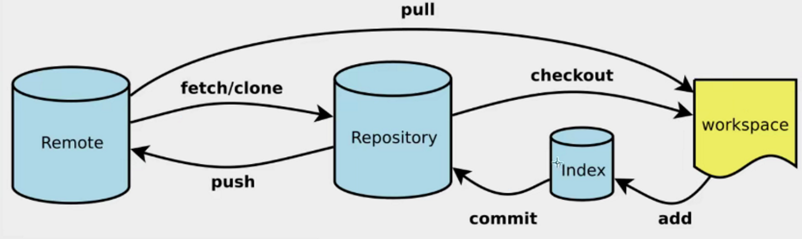
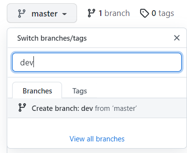
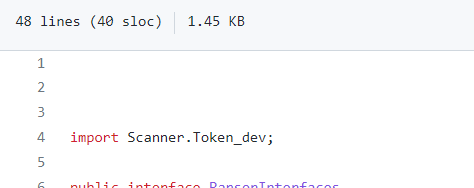
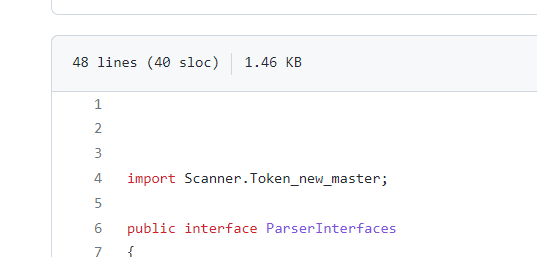
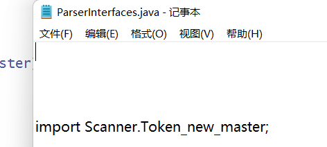

# 版本控制系统

&#8195;&#8195;版本控制系统分为本机版本控制系统、集中版本控制系统、分布式版本控制系统。

- 本地版本控制所有版本数据保存在本地。

- 集中版本控制所有版本数据保存在服务器上，协同开发者从服务器上同步更新或上传自己的修该，SYN、CVS、VSS是集中版本控制。

- 分布式版本控制所有版本信息仓库全部同步到每个用户，可以离线在本地提交，只需在联网时push到服务器或其它用户那里。每个用户那里保存的都是所有的版本信息。Git是目前世界上最先进的分布式版本控制系统。

# Git基本理论

&#8195;&#8195;Git本地有三个工作区域：工作目录`Working Directory`，暂存区`Index/Stage`，资源库`Respository`。还有一个远程仓库`Remote`，即托管代码的服务器。各个区域使用流程如下：



&#8195;&#8195;git管理的文件有如下几种状态：

- `untracked`：未跟踪，此文件在文件夹里，但没有被git管理不参与版本控制，通过`git add`状态变为`staged`。

- `unmodified`：文件已经被git管理，版本库里的文件快照内容与文件夹中完全一致，如果该状态文件被修改变为`modified`，如果使用`git rm`移出版本库变为`untackled`。

- `modified`：文件已经修改但并没有进行其它操作，该状态文件通过`git add`变为`staged`状态，通过`git checkout`丢弃修改回到`unmodified`。

- `staged`：该状态文件通过`git commit`同步修改到库中，文件变为`unmodified`，通过`git reset HEAD filename`取消暂存文件回到`modified`。

  
# Git 使用
## 变量
&#8195;&#8195;使用git前必须先配置用户的本地变量，这样才能让git知道登陆的用户是谁。
```

# 查看本地和系统变量
git config -l

# 系统变量
git config --system --list

# 本地变量
git config --global --list

# 设置用户名和邮箱
git config --global user.name "*******"
git config --global user.email "******@****.com"
```


## SSH公钥
&#8195;&#8195;配置`SSH Key`可以让我们在通过git提交代码时不必频繁地验证身份。使用以下命令在用户目录的`/ssh`目录生成公钥，`id_rsa`是私钥`id_rsa.pub`是公钥。在代码托管网站上传`id_rsa.pub`即可无密码连接。
```
ssh-keygen -t rsa
```

## 忽略文件
&#8195;&#8195;在主目录下创建`.gitignore`文件可设置不把某些文件纳入版本控制。可使用`*`、`?`通配符、`[abc]`选项等。

```
*.txt		#忽略所有.txt结尾的文件
!lib.txt	#除了lib.txt 文件
/temp		#仅忽略项目根目录下temp目录中的文件
build/		#忽略build目录下所有文件
```

## 工作流程
```
#在一个目录里初始化git工程
git init
#下载工程到本地，直接克隆一个up to date的工程
git clone [url]
#绑定远程仓库（一个Git项目多个仓库https://www.cnblogs.com/lxynn/p/10298640.html>）
git remote add origin [url]
#将远程主机的最新内容拉到本地，用户在检查了以后决定是否合并到工作本机分支中。不加[branch_name]将远程主机的更新全部取回本地
git fetch origin [branch_name]
#用于从远程获取代码并合并本地的版本，其实就是git fetch和git merge FETCH_HEAD的简写。
git pull origin [branch_name]

#查看文件状态
git status

#文件入库
git add .

#提交暂存区内容到本地仓库
git commit -m "message"

#提交到远程仓库
git push origin [branch_name]

# 执行完上一步，有可能报错，大多数时候提示本地落后于远端，是因为远端比本地多了一些代码。为什么会出现这种情况呢，肯定是你跟别人共用一个分支，他提交了一段代码到远端，所以导致你的本地落后于远端。使用下面代码更新后再提交一遍即可。
git pull --rebase origin [branch_name]
```

## 分支

&#8195;&#8195;几乎所有的版本控制系统都以某种形式支持分支。使用分支意味着你可以把你的工作从开发主线上分离 开来进行重大的Bug修改、开发新的功能，以免影响开发主线。

```
#列出本地所有分支
git branch
#列出所有远程分支
git branch -r
#列出本地远程分支
git branch -a

#新建一个分支
git branch [branch_name]
#新建一个分支并切换到新建分支
git checkout -b [branch_name]

#切换到分支
git checkout [branch_name]

#合并指定分支到当前分支
git merge [branch]
#在merge中途取消
git merge --abort

#删除本地分支
git branch -d [branch_name]
#删除远程分支
git push origin --delete [branch_name]
```

## IDE集成Git

&#8195;&#8195;......

# Git 使用示例（解决冲突）

&#8195;&#8195;使用git控制版本时，如果在自己的分支归并主分支之前，已经有其他人修改过你所修改的内容，就需要人工地选择使用还是不适用你的分支的内容。进行以下操作前远程仓库和本地仓库的`master`分支都有一个以 `import Scanner.Token_master;`为第一行的文件。

## 在远程仓库创建分支
&#8195;&#8195;按下图在远程仓库创建分支，创建完成后远程仓库`dev`分支下也有上述同样的文件。



## 在本地创建dev分支
```
djhua@LAPTOP-J5GSHE5C MINGW32 ~/Desktop/idea/drawer/Simple_JAVA_Drawer (master)
$ git branch -a
* master
  remotes/origin/HEAD -> origin/master
  remotes/origin/dev
  remotes/origin/master

djhua@LAPTOP-J5GSHE5C MINGW32 ~/Desktop/idea/drawer/Simple_JAVA_Drawer (master)
$ git branch dev

djhua@LAPTOP-J5GSHE5C MINGW32 ~/Desktop/idea/drawer/Simple_JAVA_Drawer (master)
$ git checkout dev
Switched to branch 'dev'

```

## 修改dev分支中的文件

&#8195;&#8195;把`dev`分支文件第一行的 `import Scanner.Token_master;`改为 `import Scanner.Token_dev;`。
```
djhua@LAPTOP-J5GSHE5C MINGW32 ~/Desktop/idea/drawer/Simple_JAVA_Drawer (dev)
$ vim ParserInterfaces.java

djhua@LAPTOP-J5GSHE5C MINGW32 ~/Desktop/idea/drawer/Simple_JAVA_Drawer (dev)
$ git add .

djhua@LAPTOP-J5GSHE5C MINGW32 ~/Desktop/idea/drawer/Simple_JAVA_Drawer (dev)
$ git commit -m "dev change"
[dev f0d0a25] dev change
 1 file changed, 1 insertion(+), 1 deletion(-)

djhua@LAPTOP-J5GSHE5C MINGW32 ~/Desktop/idea/drawer/Simple_JAVA_Drawer (dev)
$ git push origin dev
Enumerating objects: 5, done.
Counting objects: 100% (5/5), done.
Delta compression using up to 16 threads
Compressing objects: 100% (3/3), done.
Writing objects: 100% (3/3), 287 bytes | 287.00 KiB/s, done.
Total 3 (delta 2), reused 0 (delta 0), pack-reused 0
remote: Resolving deltas: 100% (2/2), completed with 2 local objects.
To github.com:dajunHuang/Simple_JAVA_Drawer.git
   d8873d0..f0d0a25  dev -> dev

```
&#8195;&#8195;此时远程仓库中文件第一行的内容变成了`import Scanner.Token_dev;`，而`master`分支中文件的内容没变。



## 修改master分支中的文件
&#8195;&#8195;切换回`master`分支把文件第一行内容改为`import Scanner.Token_new_master;`。
```
djhua@LAPTOP-J5GSHE5C MINGW32 ~/Desktop/idea/drawer/Simple_JAVA_Drawer (dev)
$ git checkout master
Switched to branch 'master'
Your branch is up to date with 'origin/master'.

djhua@LAPTOP-J5GSHE5C MINGW32 ~/Desktop/idea/drawer/Simple_JAVA_Drawer (master)
$ vim ParserInterfaces.java

djhua@LAPTOP-J5GSHE5C MINGW32 ~/Desktop/idea/drawer/Simple_JAVA_Drawer (master)
$ git add .

djhua@LAPTOP-J5GSHE5C MINGW32 ~/Desktop/idea/drawer/Simple_JAVA_Drawer (master)
$ git commit -m "master change"
[master c625edb] master change
 1 file changed, 1 insertion(+), 1 deletion(-)

djhua@LAPTOP-J5GSHE5C MINGW32 ~/Desktop/idea/drawer/Simple_JAVA_Drawer (master)
$ git push origin master
Enumerating objects: 5, done.
Counting objects: 100% (5/5), done.
Delta compression using up to 16 threads
Compressing objects: 100% (3/3), done.
Writing objects: 100% (3/3), 289 bytes | 289.00 KiB/s, done.
Total 3 (delta 2), reused 0 (delta 0), pack-reused 0
remote: Resolving deltas: 100% (2/2), completed with 2 local objects.
To github.com:dajunHuang/Simple_JAVA_Drawer.git
   d8873d0..c625edb  master -> master

```
&#8195;&#8195;此时`master`分支中文件内容改变，而`dev`文件中还是`import Scanner.Token_dev;`。



## 合并分支，处理冲突
&#8195;&#8195;在`master`分支中合并`dev`分支，发现冲突。
```
djhua@LAPTOP-J5GSHE5C MINGW32 ~/Desktop/idea/drawer/Simple_JAVA_Drawer (master)
$ git merge dev
Auto-merging ParserInterfaces.java
CONFLICT (content): Merge conflict in ParserInterfaces.java
Automatic merge failed; fix conflicts and then commit the result.

```
&#8195;&#8195;冲突的位置显示如下，此时删除不要的行记录就能完成选择，例如保留`master`分支的内容则删去`import Scanner.Token_dev;`。
```
<<<<<<< HEAD
import Scanner.Token_new_master;
=======
import Scanner.Token_dev;
>>>>>>> dev
```
&#8195;&#8195;删除后依次使用`add .`、`commit`指令然后合并成功：
```
djhua@LAPTOP-J5GSHE5C MINGW32 ~/Desktop/idea/drawer/Simple_JAVA_Drawer (master|MERGING)
$ vim ParserInterfaces.java

djhua@LAPTOP-J5GSHE5C MINGW32 ~/Desktop/idea/drawer/Simple_JAVA_Drawer (master|MERGING)
$ git add .

djhua@LAPTOP-J5GSHE5C MINGW32 ~/Desktop/idea/drawer/Simple_JAVA_Drawer (master|MERGING)
$ git commit -m "merge needed"
[master 7eb491d] merge needed

djhua@LAPTOP-J5GSHE5C MINGW32 ~/Desktop/idea/drawer/Simple_JAVA_Drawer (master)
$ git merge dev
Already up to date.
```
&#8195;&#8195;此时本地`master`分支下文件的内容就变为了我们选择的`import Scanner.Token_new_master;`。




**参考：[git创建分支，提交代码详细流程（保姆级）](https://blog.csdn.net/weixin_43367262/article/details/100575221)、[[狂神说Java]Git最新教程通俗易懂_哔哩哔哩_bilibili](https://www.bilibili.com/video/BV1FE411P7B3?p=12)。**


