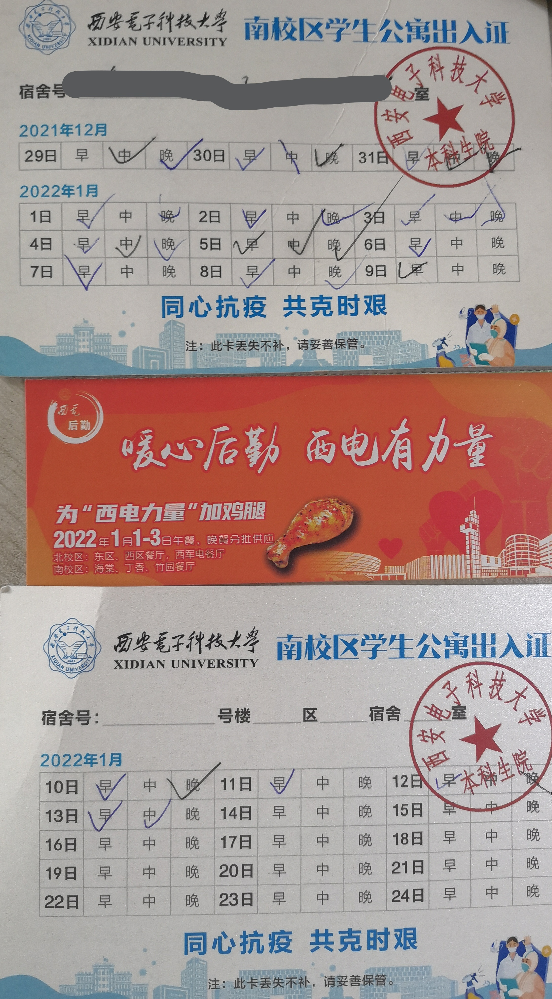
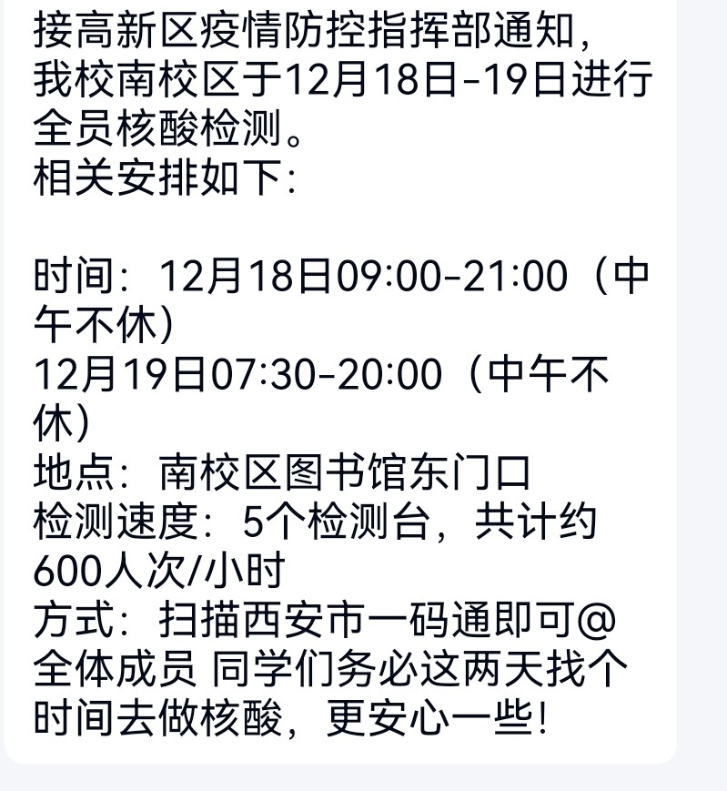
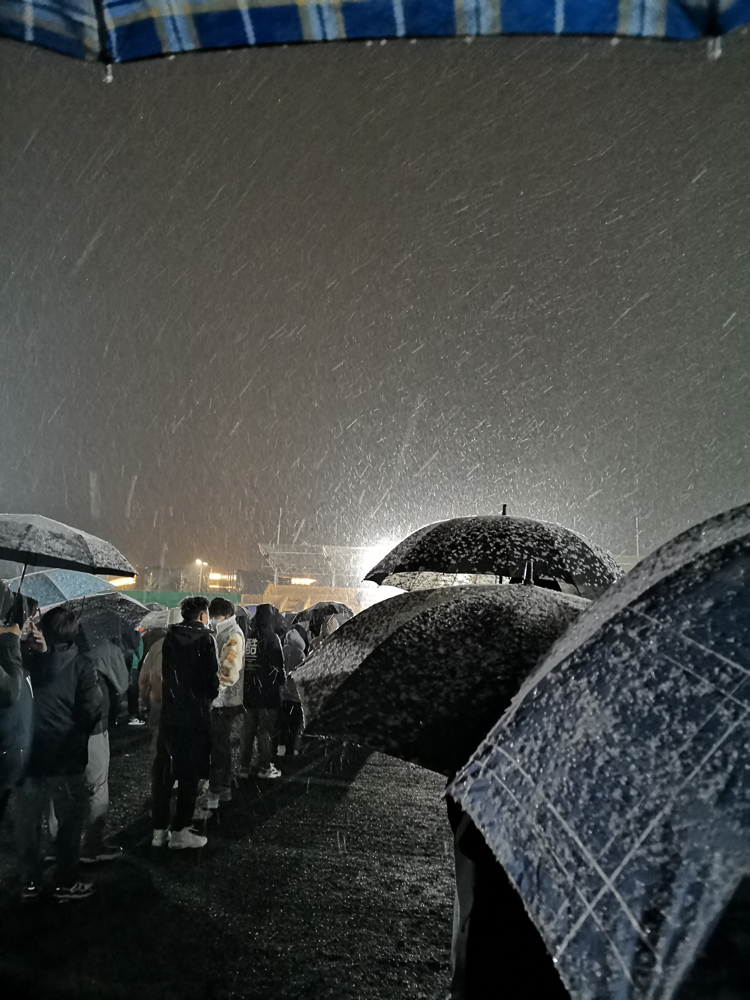
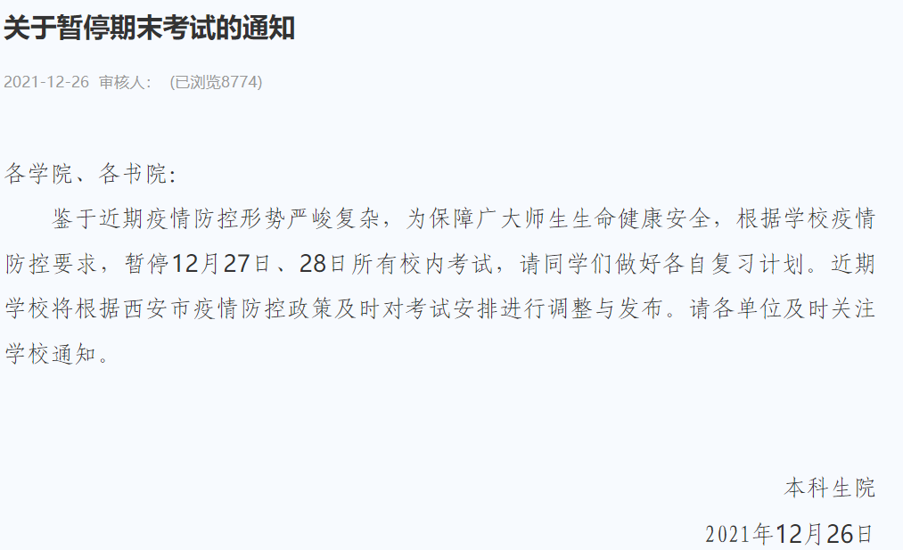
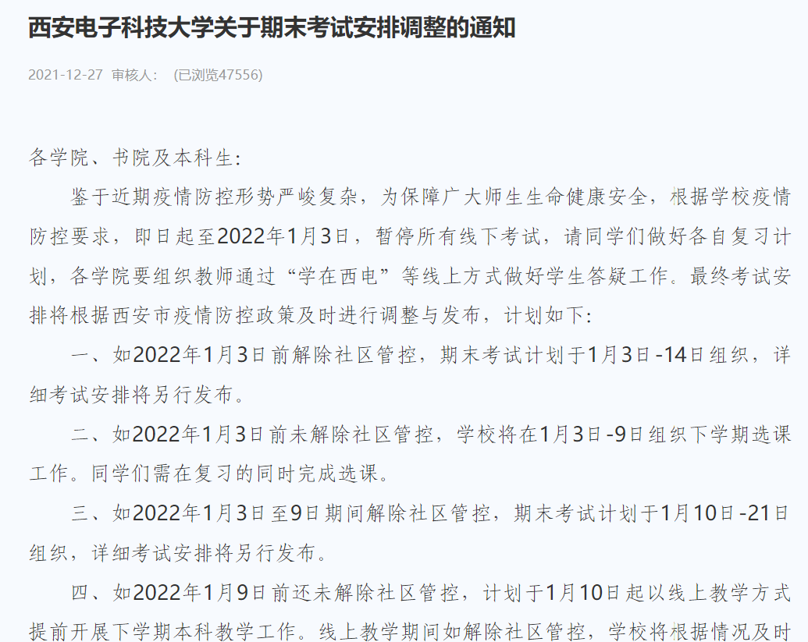
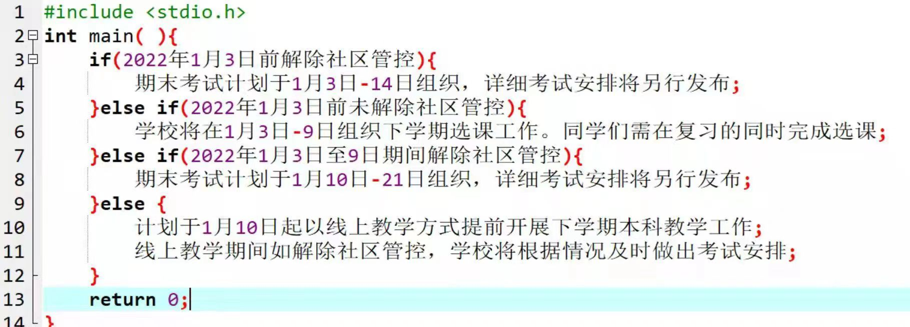
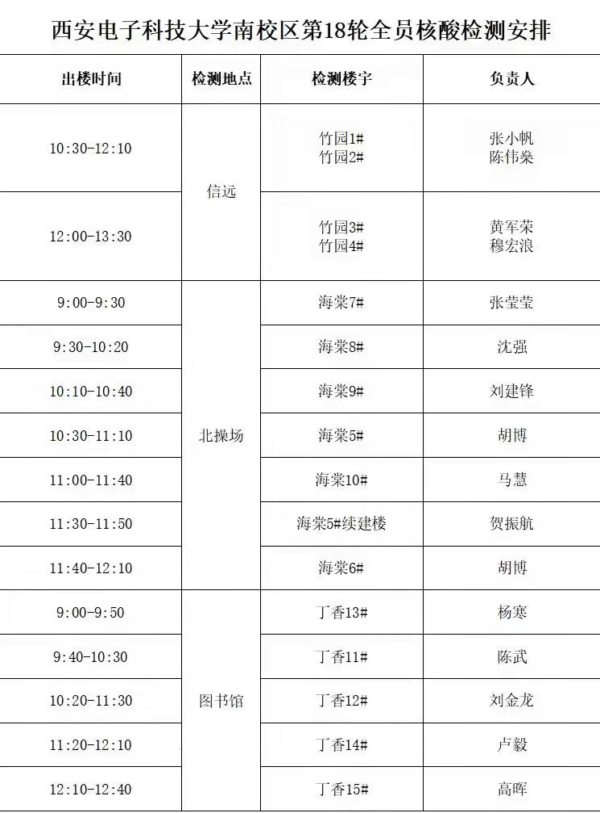
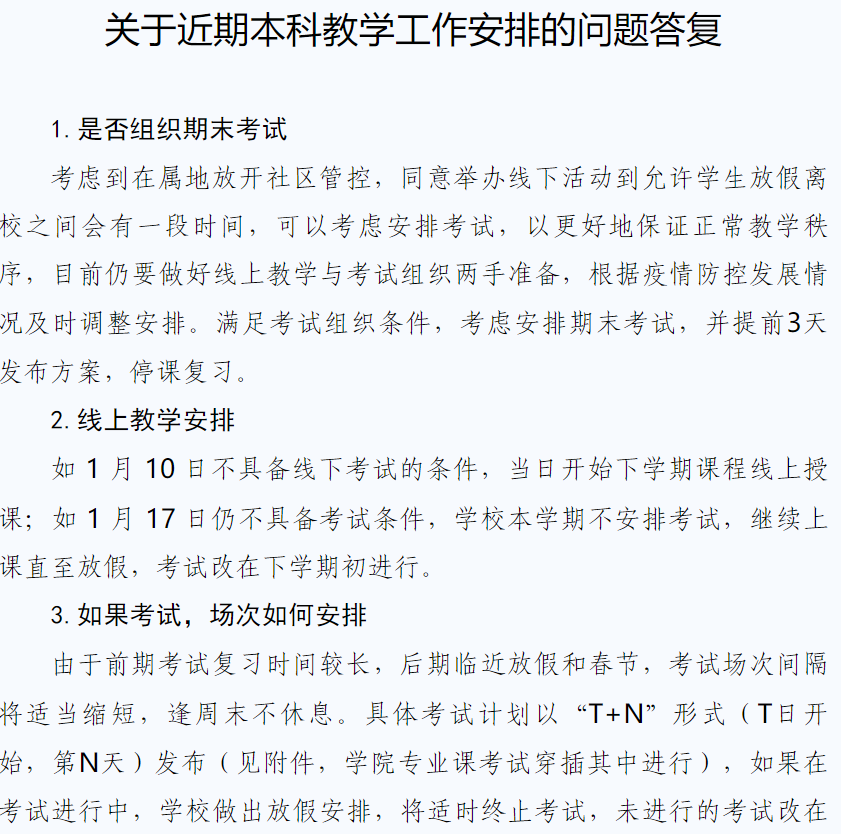
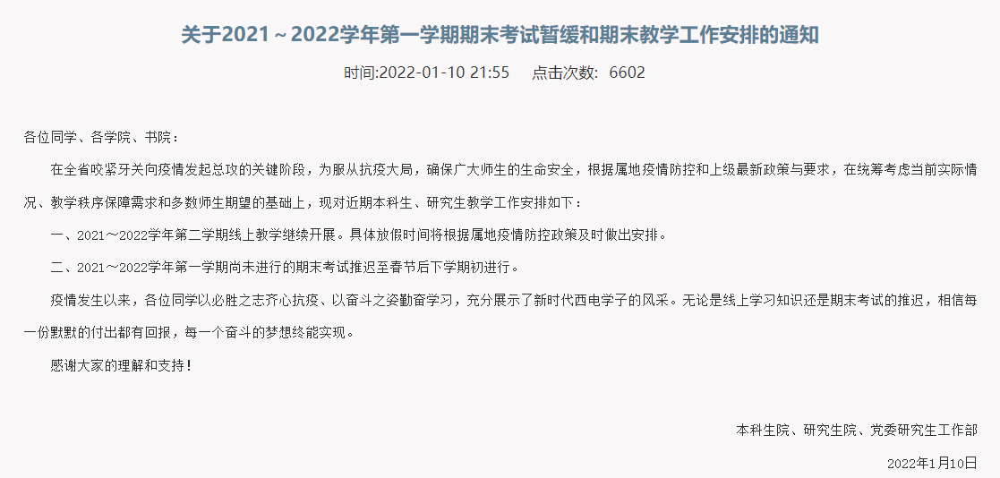

此次西安电子科技大学全校宿舍隔离从2021年12月29日早上突然开始持续到2022年1月14日早上，共计16天。这些日子里除从1月6日开始午晚餐中有一个时间段所有人可以出寝室买饭外，每个小寝室每顿饭只让派一个人凭出入证带饭。隔离期间大概两天一次全员核酸检测。2021年下学期课程在隔离开始之前已基本结束，所以从2022年1月10日开始全校师生愉快地开始了2022年上学期的教学。
先放一张隔离期间宿舍出入证和食堂发的鸡腿券的照片：

可能是因为我关注的新闻比较少，我感觉西安得疫情是在不知不觉中发展起来的。在我刚了解到事情严重性的时候，学校已经安排第二次全员核酸检测了，下图是2021年12月18日有正式通知的第一次也是第二次核酸检测的消息，因为之前还有一次没有通知。从这天开始日子就一直不安稳了，群里开始被注意防疫的消息，每天晨午晚检的消息，下楼做核酸的消息等刷屏。因为软件工程专业考试都比较晚，这段时间我还是在努力复习，希望在考试中弥补二年级太浪的结果。

下图是2021年12月25日晚上19点北操场记不得第几次全员核酸检测的场面，当时天上下着今年最大的一场雪，被清冷天空笼罩的是底下等待做核酸的十余条长队，远处几盏平时根本没注意的探照灯从正面的高处指向条状的人群，颇具压迫感。在队伍首部的医务人员们的帐篷一字排开，刚好占满北操场主席台一侧的百米跑道，我在庆幸自己带了雨伞之余缓慢地向前移动，经过大约四十五分钟的等待，终于得以离开。

2021年12月25日到27日也是2022年全国硕士研究生招生考试的日子，学校为了不影响考生考试，学校特地为研究生安排了凭准考证做核酸的绿色通道。
2021年12月26日和27日，我们分别收到下图所示来自教务处的关于推迟期末考试的消息...只能说条件判断用的很到位。事实证明，此时聪明的人已经开摆了，而我仍在每天按时复习，天真地浪费着自己的时间。

2021年12月29日，隔离来的很突然，突然到一早起来我就已经被限制出宿舍楼了，突然到在外面的室友发现只要回宿舍就很难再出来了。从这天开始，我开始了为期16天的宿舍隔离，从这天开始，我每天起大早给室友带饭。唔，在隔离开始的前几天，我还在复习，直到大概1月6日我才反应过来自己有多么蠢立刻止损。
隔离的日子很不好过，三顿饭，一次核酸，一天就过去了，每天发着霉，过着没有未来的日子，晚上躺在床上也不知道这一天干了什么事，宿舍楼阿姨每天早上会在群里类似下图的时间表，而我就像按时完成相应动作的机器人。这几天我唯独有实感的事就是创建了这个小站。

什么是“T+N”？是西电教务处政务的杰作。2022年1月5日，处于考试与不考试叠加态的我们迎来了教务处下图所示的通知。我们伟大的教务处给了我们一个答案，但同时也给了我们两个思考题，答案是“要么不考，要么‘T+N’的时候考试”，思考题是“T”与“N”的具体数值，换句话说就是教务处告诉我们不知道考不考，也不知道什么时候考。别人什么反应我不知道，但我着实被这毫无意义凑字数般的通知震惊到了，顿时感觉教务处已经到达了一个我不能理解的高度。

好在2022年1月14日终于有了下图所示不考试的消息，有消息的那天晚上我们在线上“奔走相告”，终于能安心的开摆了。同天，2022年上学期的课正式开始。

回顾这段时间，因为周围没有人管，体感上比2020年12月至2021年3月在家隔离那段时间要轻松，而精神比那次要疲惫很多，不仅是因为学校的操作，还有很多自己的原因。期间还有一点其它感受不适合在这里说，但我会一直记得。
