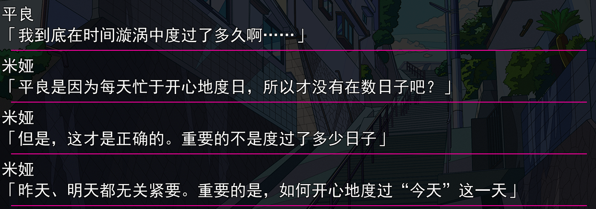
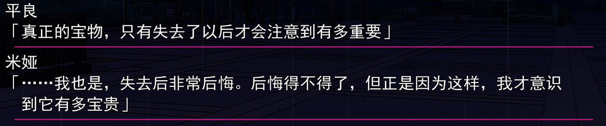
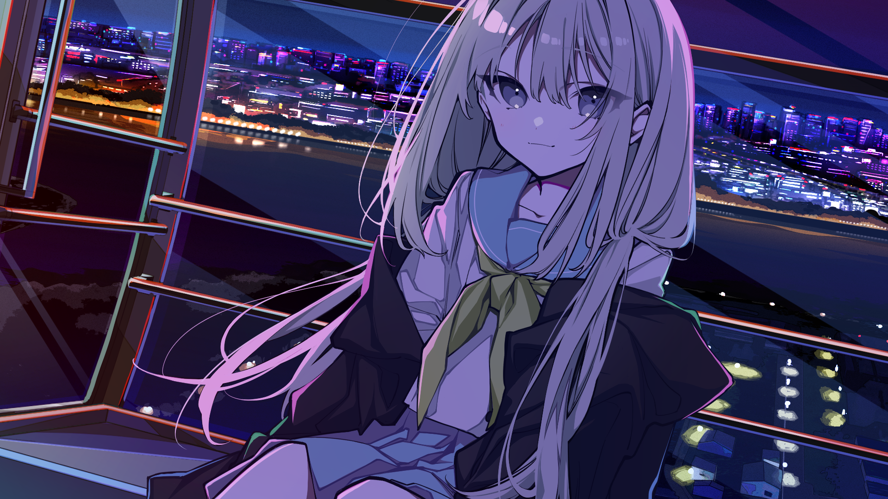

《Loopers》（时廻者、ルーパーズ）讲了一群年轻人被困于“时间漩涡”后互相帮助并最终全部逃脱的故事。作品省略很多细节，主线很短，不到一天就能看完，不过故事中“时间漩涡”里人们的生活状态、男主平良明享受寻宝的态度、昼田贵理子和町村玲央奈之间的友情以及藤川美亚和平良明之间的感情等情节都让我有所想法。

故事里的10个人之所以被称为“Looper”，就是因为他们被永远被困在8月1日这一天，今天是8月1日，“明天”还会是一尘不变的8月1日，每天新报纸上的新闻、电视上的综艺和世界上发生的一切都是一样的，而且loopers“前一天”留下的所有痕迹都会消失，这意味着不论今天如何锻炼身体、拍了多好看的照片，上传了多精彩的游戏实况，画了多精致的线稿，在“下一天”都会回归原样，他们能带到“下一天”的只有自己的记忆，并且这样的日子在所有人中最久重复了快二十年。

下一天不会来临这一事实表面上十分吸引人，而且是故事中年轻人们发牢骚时会产生的愿望，因为有每天会重置的金钱和精力去做所有事，但这样的生活会慢慢侵蚀人的内心。一个新的looper进入“时间漩涡”的一段时间往往也会很激动，认为这里是一个至臻至美的乌托邦，能做所有自己在寻常世界完全接触不到的事，但久而久之，由于接触不到更新的生活，所有事情都在按照自己的“经验”发展，就会变得无聊，麻木，精神异常。故事中因为这种生活玲央奈在昼田的头槌作为导火索的情况下沉睡不醒，雾岛让、堀井佐奈、利田美咲失去了对先前爱好的兴趣一蹶不振，还有两个loopers失去了理性只好被眩晕处理。

**若是这乌托邦永恒不变，又何尝不是另一种形态的地狱？**这让我想到我玩过类似主题的国产AVG《葬花·暗黑桃花源》，《葬花》的村民们因为长生不老重复了上千遍进入桃花源的那一年，但即使是再淳朴的村民也会被永恒不变的岁月消磨意志，他们在追求更强烈刺激过程中，让桃花源变成了一个享乐糜烂的地狱。留守桃花源的九百魂灵，渴望着“葬花之人”的到来，也是这部作品名字的由来。《Loopers》中只轻描淡写地说loopers们尝试过所有能想的到的事情，我认为时间跨度如果足够长，本作中的loopers们也不排除有变成《葬花》的村民们那种可能。遇到这种生活该怎么办？男主平良明给了一个答案：

**既然“明天”永远不会到来，那就让每个今天都变得更有意义**。平良在“时间漩涡中”不仅靠寻宝保持了对生活的热情，它的调度也让米娅等loopers久违地体验到了生活的乐趣，恢复了对“明天”的信心，我看来这也是米娅对平良感情的由来。我当然能够理解平良的热情能有如此成效的原因，但我也明白对平良的塑造肯定掺杂了理想化的因素，现实中有多少人能在没有未来的日子保持这种热情呢？更多的可能会像昼田那样被现实一天天消耗意志。我认为本作通过良品这个角色想传达给玩家的一个主题就是——**活在当下。在今天用尽全力，不要费尽心思考虑明天会发生什么，久而久之，好的结果自然会到来。**这对目前混吃等死的我来说也是很好的告诫了。

寻宝是贯穿整个作品的主题，就算把游戏名改为“寻宝者”我也不会觉得奇怪，良平的热情来源于寻宝，米娅和其它loopers被寻宝游戏鼓舞，大伏笔觅心女也是在寻找最初的宝物为了解开魔法回到正常生活，主线也就是众人在“LOOPERS”的“LOOP”里寻找逃离的方法。生活告诉我们结果的重要性，经验告诉我们过程弥足珍贵，良平差点错失米娅这一至宝，故事想借此给我们说无论何种形式的寻宝过程和结果都重要，**过程让人有获得的实感，获得的“宝物”虽说是过程的一个里程碑，但不要等宝物失去后才觉得后悔。**这是我认为本作想给玩家传达的第二个主题，这显然与第一个主题有所关联。

剧情上我唯独感到突兀的地方是玲央奈和米娅的清醒，尤其是后者有点强行凑HE的味道，没有交代任何原因米娅在已经宣告没有生还机会后醒来，此处合理性有待思考。

总的来说，本作剧情受篇幅限制很紧凑，也很让人投入，阅读中好像我就是loopers的一员一样；音乐我也不懂，只听得出来质量很高，好听；画面十分优秀，无论是游戏内的立绘、BG还是游戏外的UI设计都很有特色，和主题结合起来别具风味；米娅也很可爱，放几张图。

