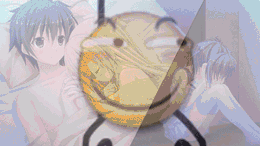

这一部在前面和后面像是两个不同的游戏，刚开始就像一般废萌一样，不断遇见女孩子，剧情平淡日常。进线后各种关系就开始翻江倒海，胃疼至极。作为玩家，我只能说是在恍惚中被迫接受剧本作者巨大的脑洞。

我因为显而易见的原因只玩了菜乃花，木乃实和彩菜线。菜乃花线是一个我在理解后能接受的HE，最后男主抛弃了等了他很久很久的木乃实，和菜乃花也就是彩菜生下了孩子。然而线里甚至是共通线里妹妹的存在感太强，太讨人喜欢，菜乃花又太幼了，导致我不得不在想着木乃实的事推这条线，代入感(×)很不好。不过增加了我对木乃实线的期待也算是这条线的功能。

木乃实线也就是我疼痛的根源了。从小就喜欢男主的妹妹一直压抑着内心的想法，为了守护男主付出时间和心血，然而就算姐姐不在了也没有自信男主喜欢的是木乃实这个人。木乃实对男主的喜欢在游戏里被刻画地很醒目，这份感情足以让我心疼这个角色，因为她能为了照顾昏迷的男主辍学半年，能为了满足男主见到已逝恋人的愿望而丢掉自己的身份来冒充，甚至能在菜乃花线让出喜欢了十几年的男孩继续活在角落。这个孩子的处境多么地令人压抑！然而游戏里的木乃实甚至在自己线都得看着男主和别的女人过日子。游戏剧情看得我血脉贲张，只能看着这么好的妹妹被写剧本的家伙糟蹋，承受着就算在虚拟世界也得不到喜欢女孩子的胃疼。

彩菜线互相复活一命抵一命的操作就更神奇了，我想你完你想我，我难受完你难受，旁边还有个木乃实独自发愁。真就是让玩家闹肚子到底，在哪都吃不到真正的糖。

我早就听说这游戏的大名，刚开始一个个女孩投怀送抱还让我摸不着头脑，觉得，就这？后来才知道自己之前的想法太错了。总而言之，这是一个纯纯地给自己喂屎的游戏，下载它就是在自找不快。
