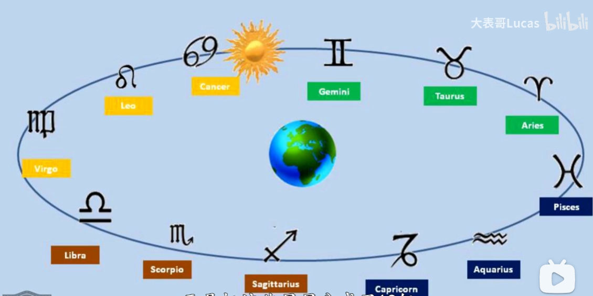

.jpg)

蓝色是白天，黑色是夜晚，灰色是日出和日落，橙色是黎明和黄昏。橙灰交界处为地平线。

东方	ORTVS 日出	AVRORA 黎明	OCCASVS 日落	CREPVSCVLVM 黄昏	西方

从内向外：阿拉伯数字的“天体时间(Babylonian Time)”，两组罗马数字的“24小时时间(German or Civil Time)”，施瓦巴赫数字的“意大利时间(Bohemian or Italian Time)”。

巴比伦分界线分割出**天体时间**：古巴比伦把一天中从日出到日落平分为十二个时辰，1区日出，12区日落。

**古波西米亚时间**以每天日落时刻为起止点，数字圈可以移动，是为了保证24点能对应上里圈的日落。布拉格最早的日落时冬天的16:00，最晚在夏天的20:16，所以最外圈的24点在罗马数字的 III-VII 出头也就是15:00到19:16之间来回运动。

1547年，国王斐迪南一世下令波西米亚全景采用于神圣罗马帝国相同的德国时间，正好比捷克现在使用的中欧标准时间晚了一小时。

**黄道环**以逆时针标记起源于古巴比伦占星术”黄道十二宫“的十二星座。古巴比伦把天上的星星分成十二组，象征太阳神在一年的不同日子住在不同的星座宫殿中。黄道环的起点是春分，太阳位置在下图最右双鱼金牛中间，逆时针转动。

太阳指针上金色太阳图标始终在黄道环上移动，顶端有只金手掌，指尖对着古波西米亚时间，手背对着罗马数字，也就是布拉格当地时间。

围绕地球的三个同心圆分别是：南回归线(Tropic of Capricorn)、赤道(Equator)、北回归线(Tropic of Cancer)。太阳指针转动的同时，太阳图标也会做上下运动，表示太阳和地球的相对位置。

月亮指针上的月球标志也会一直运行在黄道环，表示月亮、地球和太阳的相对位置。

固定在黄道环上金色六角星指针的是能显示春分点位置和恒星时(Sidereal Time)的**恒星指针**，太阳指针会在每个太阳日也(24小时)绕表盘转一圈，恒星指针会在每个恒星日(23小时56分04秒)绕表盘转一圈。一年下来，恒星指针会比太阳指针多转一圈，两指针重合，也就是一年的春分。

四宗罪从左到右：虚荣 、贪婪、死亡、奢靡和欲望

日历表盘从左到右：哲学家、天使长米迦勒、天文学家、历史学家

早上九点到晚上十一点的整点时刻，两扇小窗打开，十二使徒两人一组从窗口经过。

在中世纪，拥有天文钟时一座城市财富的象征。