四个声部比较饱满。超过四个构成音的和弦，往往也可以精简为四个音。

三和弦绝大部分重复根音。

 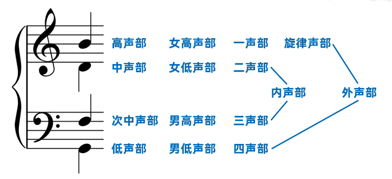

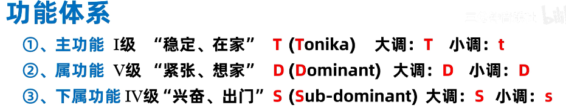

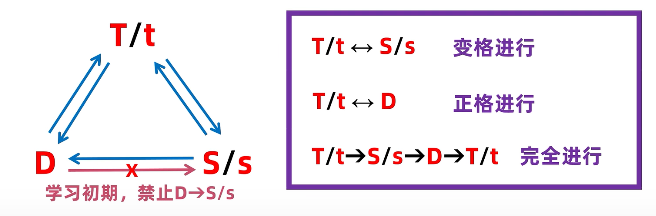

自然小调属功能和弦是小调d，和声小调三音升高，属功能和弦是大调D。

主和弦、属和弦和下属和弦称为正三和弦，因为反映了调式特征。

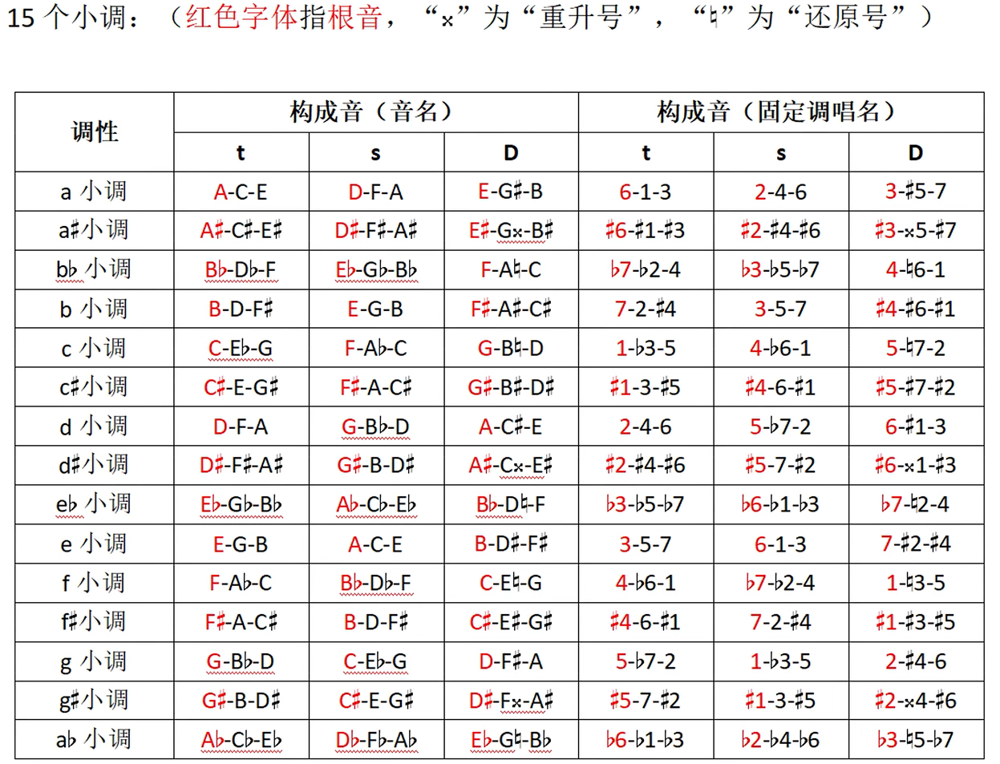

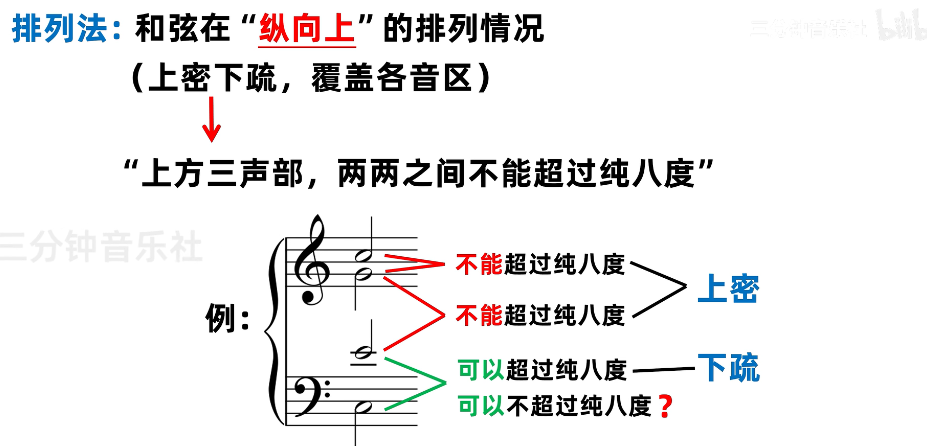

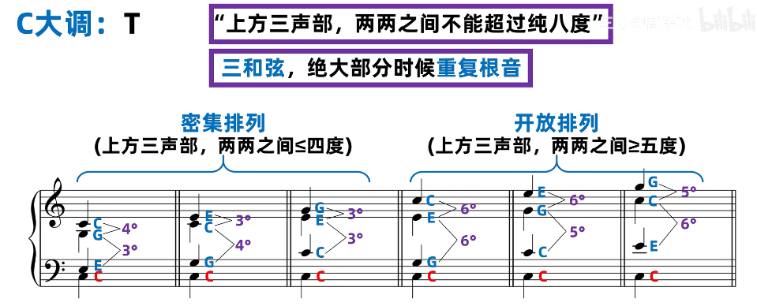

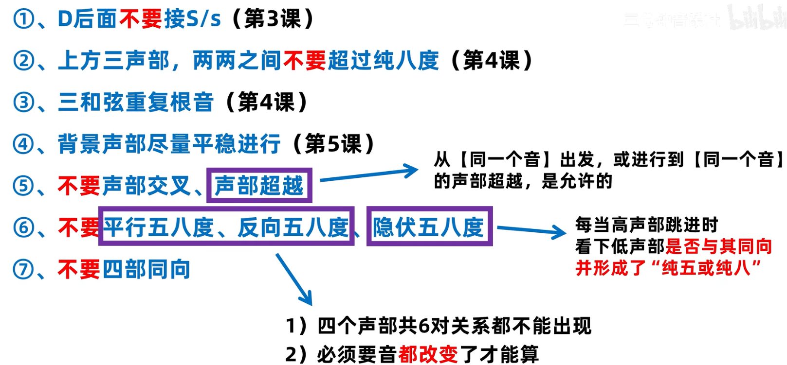

平行是两个五八度音同向进行，反向是两个音反向进行到纯五八度，隐伏是高声部和低声部同向进行到五八度。

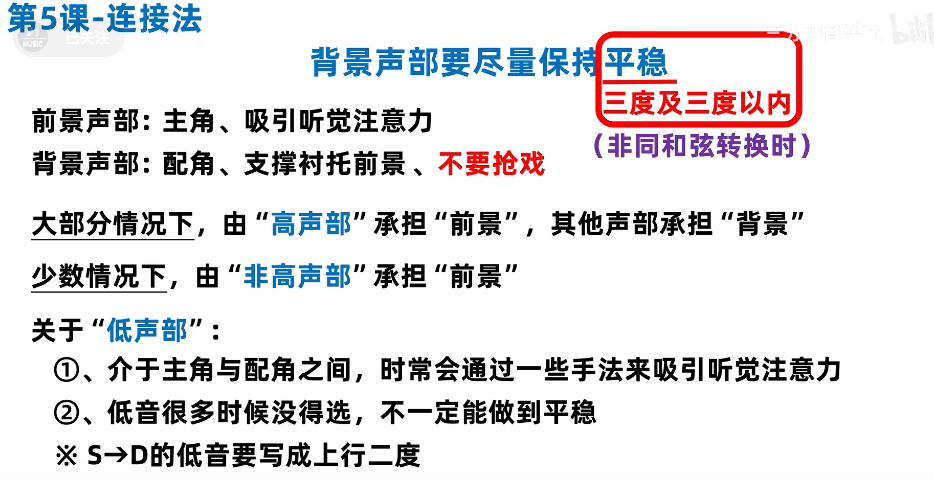

声部交叉

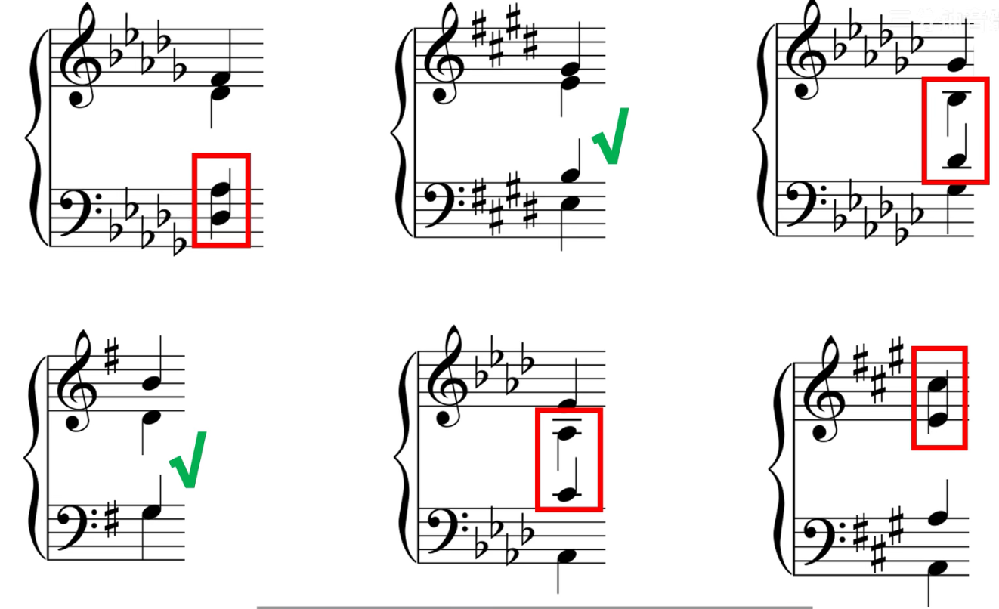

任意两个改变的声部都不能有平行五八度，反向五八度

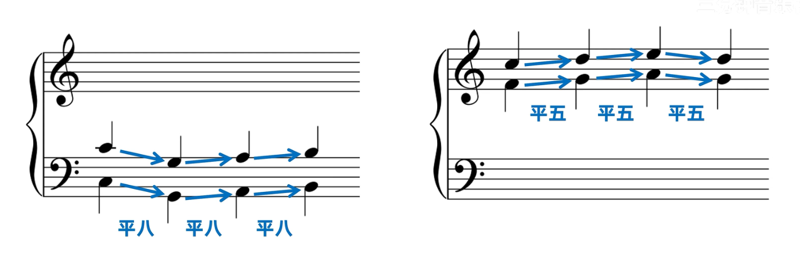

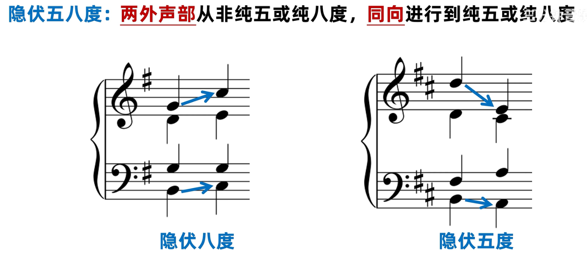

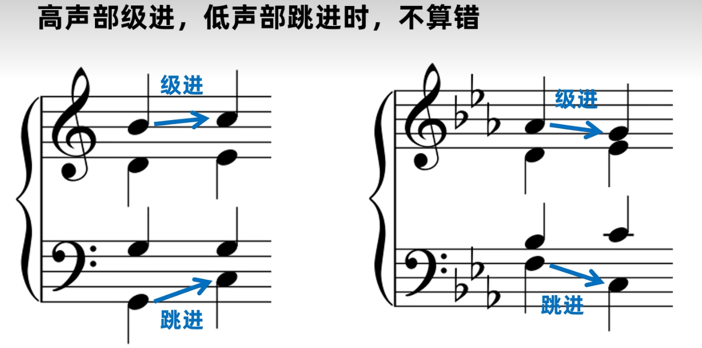

终止处的T，七级导音到一级主音的解决需求比较迫切时，可以用三个根音，一个三音。

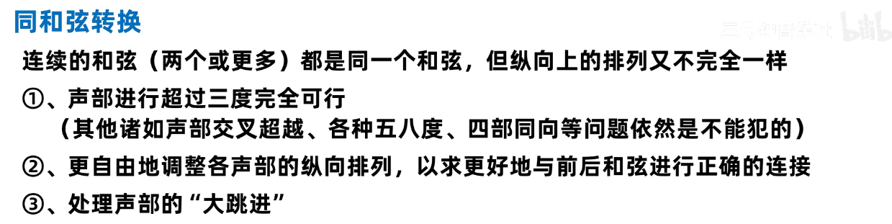

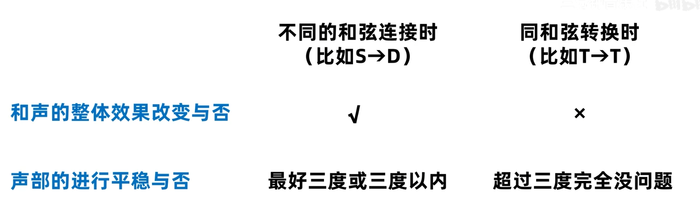