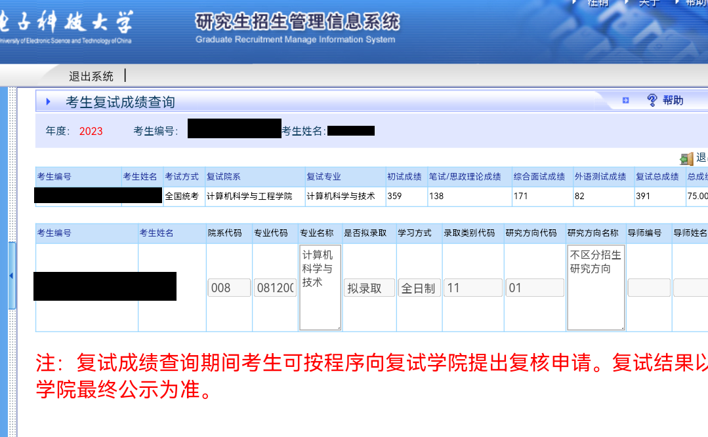
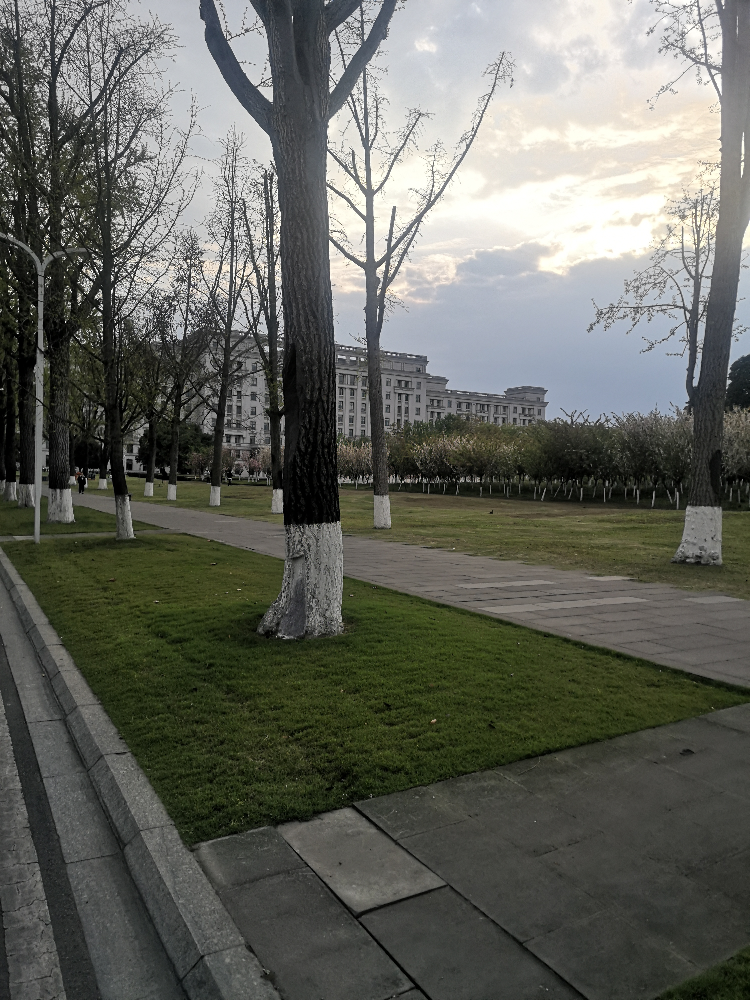
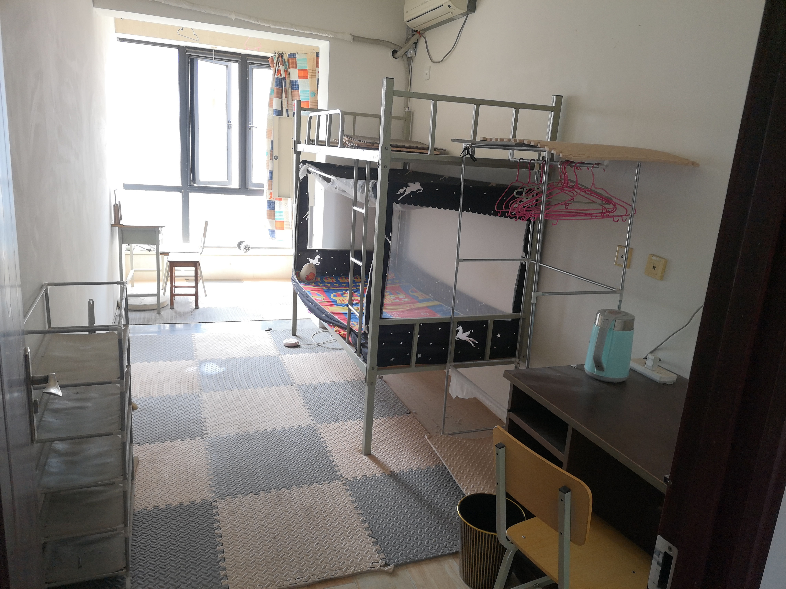
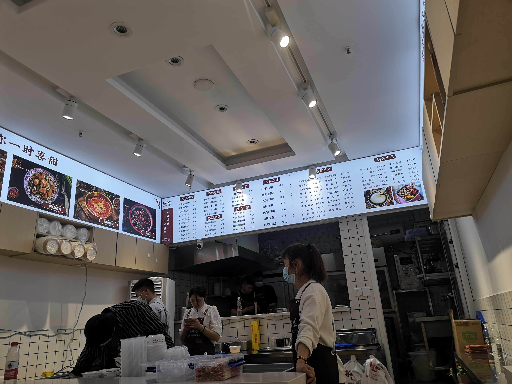

从2022年五月开始我还在大三下，到现在2023年四月我已经是大四下临近毕业，考研这两春一秋过的很快，周围的人和事变得很大。去年我还在和hxd在嵌入式操作系统和~~FPGA~~VHDL课的实验室里验收着没有意义的实验，现在我已经在挣扎着做着毫无进展的毕设了，有点想以前的日子，但不能想，毕竟历史的车轮疾行向前🎵。

大三的时候也不知道为什么就开始准备考研了，可能一直以来就默认把这个学期当作学习的季节了吧。我上着软件体系结构课的同时关注着考研信息，然后就查到了哈尔滨工业大学和它的深圳分校，查到了它考研专业课CSAPP这本可能影响我一辈子的书，查到了B站蒋炎岩老师的操作系统课程，虽然我最后没有选择考哈工大和南大，但感谢它们为我的计算机学习生涯提供了一些指导。

考研初期我做的事主要有这么几件，数学做张宇的基础三十讲，现代和概率论看李永乐的复习全书，英语开始背单词，专业课还没开始，一直在看上面提到的两个资料。此时数学基本上是一两天做一章，在B楼那个B-443大教室里做题，我当时特别喜欢去这几个大教室学习，因为图书馆人太多，小教室有其他人的话也不敢发出太大的声音。

六七月份我从宿舍搬到了南校区家属区住，从这以后我每天上课也好，去图书馆也好都是从家属区出发了。习惯住集体宿舍的我刚开始一个人住确实有点不适应，哪里都要花钱，环境也不太好，觉得有点过于奢侈了，最开始甚至有点后悔搬出来。

自从搬出来后我学习的时间就能固定下来了，每天早上九点至十点起床学习两个小时，中午睡觉睡到两点到三点在学习两到三小时，这段时间我晚上基本不学习，主打的就是一个无痛考研。此时高数我已经在看张宇十八讲，线代和概率论看李永乐的小红书，专业课开始看王道，英语就是一至两天一套真题，不写作文。暑假的时候教室关了，我每天只能为了空调去图书馆或就在屋子里看书做题，暑假后期因为图书馆下午五点就关门，而且书搬来搬去很麻烦，我就干脆宅在出租屋里了。

暑假是我情绪波动比较大的一段时间，因为一个人复习实在是孤独，每天早起就面临可以预知的繁重的习题任务，很快就变得疲惫不堪，心思都不知道飞哪里去了。我印象最深的一个场景就是走在从家属区宿舍的这段路上，脑子里一片浆糊，因为刚过去的半天学习进展不够而心情不好，故意唱着歌来掩盖自己内心的空洞，然后想着下一觉醒来一定还要重复同样的事。不只是暑假，我从那时候一直到考研前基本上一直是这种状态。所以有研友能一起考还是很重要的一件事。此处也要特别感谢暑假一样没有回家的cxh同学能隔两天就叫我出来玩。

过了几个月，我意识到C9计算机考研的惨烈程度后，就开始降低择校标准，后面我确定学校也主要看了两条，一是计科学科排名要是A（A+考不上），二是专业课不能考408（不敢碰圣神的统考题），再想要稍微稳一点，就这样我就确定要考电子科技大学计算机科学与技术专业了，考虑到去年学硕的分数线甚至只有315，我站在了第二层，果断选择考学硕，后面结果证明我的选择也是正确的。

大概十月的时候疫情不知是加重了还是怎么回事，学校突然开始限制学生从家属区进入教学区，因为这事我受尽了苦头，封控刚开始的时候我从东门进出找导员开证明，后面证明突然不能用了我甚至吃了一个星期泡面度日，风控一直持续的考研的十二月放开，那时我才不用每天和家属区门卫斗智斗勇。

中后期我复习的计划就是看一遍一遍地看张宇十八讲，李永乐小红书，英语做黄皮书的八十篇阅读，政治从十月下旬开始做一千题，看B站上的空卡视频，看思维导图，专业课就一遍一遍的刷王道，除这些外的资料我也用过一些但都没有太大帮助。

此时还有和lqy有关的一些怪事，我忘得应该不会太快，以后会单独写一篇文章来记录。

这样就在迷糊之中参加考试了，虽然没有得新冠但精神状态也好不到哪里去。第一天考政治英语，第二天考数学专业课，不知道为什么要把两个都需要背得学科安排在一天。23考研的英语中的作文变动比较大，第一次说可能要写信，以前都是看图写话来着。我的英语考试比较幸运，考前刚好看了一眼招聘启示，很有底气的在作文的第一行写下了`volunter wanted`，嘿嘿。第二天数学就没这么顺利了，花了一个小时填空题还没写完，最后所有大题里只有大概不到两道能确定是对的，考完出来心凉了一大截差点要不想去下午的专业课了。

考完初试是12月25号，[出成绩](https://yz.uestc.edu.cn/info/1081/4295.htm)是23年2月21日，这段时间因为lqy的事过年在家躺平，直到出成绩前大概一个月才缓过来到学校开始做毕业设计。最终成绩高的有点出乎意料，数一本以为寄了，但最后出结果发现还可以。下面是成绩

.png)

在复试开始这段时间我全心的在网安大楼十层搞毕设，这段时间过得真是紧张，无论是精神上还是身体上，天天在实验室等vivado跑综合到凌晨的体验真是很奇妙。

[之后3月30日就要复试了](https://www.scse.uestc.edu.cn/info/1015/13078.htm)，我在毫无准备的情况下用复试中的机试充分检验了自己的计算机能力，从考场出来我才知道复试里的40分都是往年原题。之后面试因为是线下我反而没有初试那么紧张。很奇怪我线上面试就会很紧张。

[最终4月4日](https://www.scse.uestc.edu.cn/info/1015/13171.htm)，拟录取了，为期大概一年的考研经历就结束了。我认为最大的收获不是研究生入学机会，而是在lqy的事上有所进展。

复试拍的成电：

考研租住的小屋：

复试住宿点下新开的冰粉店：

