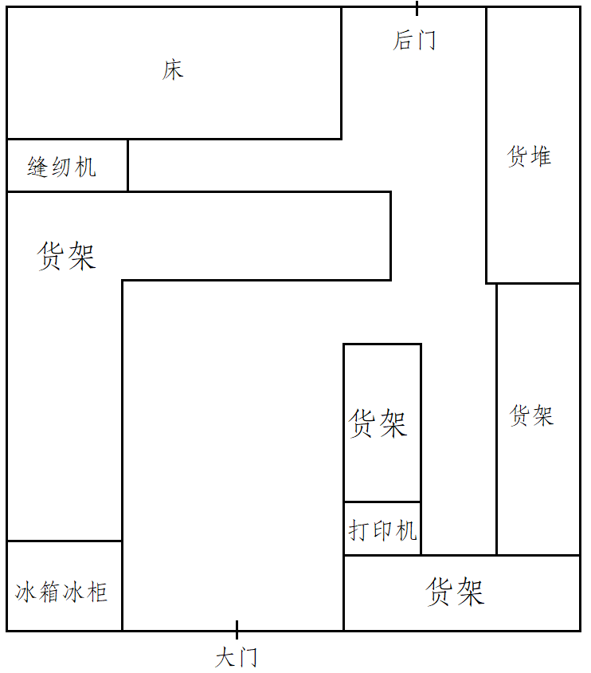

从小学毕业到高中毕业，hdj在他家的小卖部生活了近6年，以小卖部为中心的周边记录了他的成长，有他十分珍贵的回忆。近期hdj因为处于过年前后的焦虑期，计划开始落实已有很久的想法，根据自己的记忆写点东西，这是他开始落笔的第一篇。

本文的时间线大概是2013年9月-2016年7月（初中），2016年9月-2019年7月（高中）。因为短时间内无法回到那条老街实地考察，hdj只能尽力从记忆的缝隙里往外掏内容，写出来的东西可能会比较乱，但此系列文章会持续完善。

# 初中

小卖部几十平米的空间是 hdj 这那年待得时间最长的地方，但初中的时候他还比较小，和小卖部有关的回忆大多是无邪的流水帐。他在这几年里最傻逼，最无忧无虑也玩的最开心，这些时光他至今都常常回想起来。

## 店内

缝纫机
小床
食物
打印机
电脑
柜台
货物

顾客、业务员、其他人：

## 店外
烟款
后院
其它店家
老家里
超市
更远的周边

## xhy

## wzq&xxh

## lxa

# 高中
