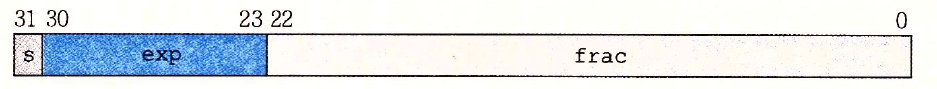
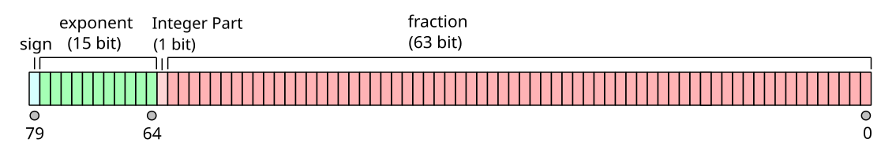

## IEEE 浮点数的表示

**对于非规格化的浮点数：**

阶数全为零的浮点数是非规格化浮点数。

当尾数也全为0时，表示+0或-0；

当尾数不全为0时，表示一个非规范化数 (也称为次正规数或非规格化数)。

计算方式为：$ (-1)^s * 2^{min\_exponent} * 0.f$，其中 min_exponent 是最小的规格化指数值。 比如, binary32的 min_exponent 是 -126，binary64是-1022，binary128是-16382，见下表。

**对于规格化的浮点数：**

阶数不全为0，或不全为1的浮点数是非规格化浮点数。

|          |                          IEEE 754 32                  |           IEEE 754 64           |       IEEE 754 128       | x86 extended 80 |
| :------: | :----------------------------------------------------------: | :---------------------------: | :---------------------------: |:-:|
|   表示   |  1+8+23 |            1+11+52            |           1+15+112            |1+15+(explicit)1+63|
| 计算方式 |               $(-1)^s * 2^{exp - bias} * 1.f$          | $(-1)^s * 2^{exp - bias} * 1.f$ | $(-1)^s * 2^{exp - bias} * 1.f$ |$(-1)^s * 2^{exp - bias} * 1.f$|
|   bias   | $2^{8-1}-1=127$ | $2^{11-1}-1=1023$ | $2^{15-1}-1=16383$ |$2^{15-1}-1=16383$|
| exp（无符号数） | 0000 0001 至 1111 1110 1至254 表示-126至+127 | 000 0000 0001至111 1111 1110 1至2046 表示-1022至1023 | 000 0000 0000 0001至111 1111 1111 1110  1至32766 表示-16382至16383 |000 0000 0000 0001至111 1111 1111 1110  1至32766 表示-16382至16383|

### 浮点数舍入

### 浮点数运算

