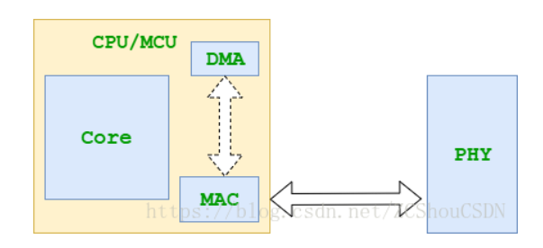
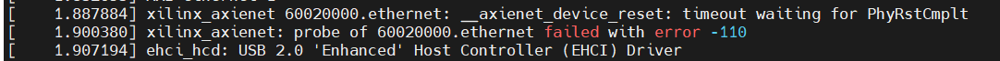
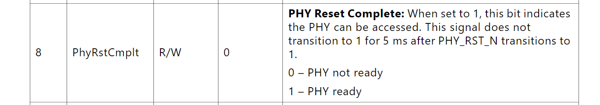
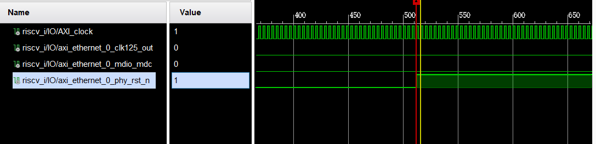

>从硬件的角度看，以太网接口电路主要由MAC（Media Access Control）控制器和物理层接口PHY（Physical Layer，PHY）两大部分构成（[相关介绍](https://developer.aliyun.com/article/1134812)）。我的设计中网络部分大概如下图所示

VCU118 上 MAC 和 PHY 通信的总线标准是 [SGMII](https://blog.csdn.net/poena/article/details/118992738)，还有[MDIO](https://ica123.com/archives/23388)总线来支持核与 PHY 芯片的通信，用来配置芯片的工作状态。
VCU128 上 PHY 芯片和 VCU118 一样。


下面是我用到的设备树中和以太网接口中有关的部分，经过比对[`AXI 1G/2.5G Ethernet Subsystem`](https://www.xilinx.com/content/dam/xilinx/support/documents/ip_documentation/axi_ethernet/v7_2/pg138-axi-ethernet.pdf)IP核驱动的[文档](https://github.com/Xilinx/linux-xlnx/blob/master/Documentation/devicetree/bindings/net/xilinx_axienet.txt)，和一个[VCU128设计](https://github.com/jiegec/rocket-chip-vcu128)用到的[设备树](https://github.com/jiegec/u-boot/blob/rocket-chip-vcu128/arch/riscv/dts/rocket-chip-vcu128.dtsi)，经过很多次调试，可以确定此设备树已经不会再出错。

```yaml
axi_eth_0_dma: eth_dma@60030000 {
    axistream-connected = <&eth0>;
    axistream-control-connected = <&eth0>; 
    compatible = "xlnx,eth-dma";
    reg = <0x60030000 0x10000>;
    interrupt-parent = <&{/soc/interrupt-controller@c000000}>;
    interrupts = <4 3>;
};
eth0: ethernet@60020000 {
    compatible = "xlnx,axi-ethernet-1.00.a";
    reg = <0x60020000 0x10000>;
    mac-address = [00 0a 35 00 00 00];
    device_type = "network";
    interrupt-parent = <&{/soc/interrupt-controller@c000000}>;
    interrupts = <5 6>;
    phy-handle = <&axi_eth_phy>;
    phy-mode = "sgmii";
    axistream-connected = <&axi_eth_0_dma>;
    axistream-control-connected = <&axi_eth_0_dma>; 

    mdio0: mdio {
        #address-cells = <1>;
        #size-cells = <0>;
        axi_eth_phy: phy@3 {
            xlnx,phy-type = <0x4>;
            compatible = "ti,dp83867","ethernet-phy-ieee802.3-c22";
            device_type = "ethernet-phy";
            ti,6-wire-mode;
            ti,sgmii-ref-clock-output-enable;
            ti,dp83867-rxctrl-strap-quirk;
            ti,rx-internal-delay = <0x8>;
            ti,tx-internal-delay = <0xa>;
            ti,fifo-depth = <0x01>;
            reg = <3>;
        };
    };
};
```

修改设备树过程中遇到的问题主要有下面这些：

1. 当设备树中使用`AXI 1G/2.5G Ethernet Subsystem`的驱动时，就不能让 DMA 再使用 AXI DMA 的驱动，因为前者驱动中就已内置了自己的 DMA 驱动，所以设备树中 DMA 的`compatible`属性要设置为一个不会被识别的字符串 `xlnx,eth-dma`。

2. 不能随意设置`mac-address`属性，有些值比如我之前用到的`[11 22 33 44 55 66]`就会被驱动判断为一个不合法的值。

3. VCU118 的文档中给出了以太网口 PHY 设备的地址，设备树中也只能用它给的地址也就是`0x03`。

   

4. `AXI 1G/2.5G Ethernet Subsystem`内置了一个自己的 PHY 设备，配置 IP 核时这个设备的地址不能和外部 PHY 冲突。

但配置好后 Linux 内核在启动的过程中会卡在等待一个信号的时候说等待超时，但就算我在驱动中把等待时间设置为无限也会一直卡在这一步，说明不是因为等待时间不够。



[卡住的函数](https://elixir.bootlin.com/linux/latest/C/ident/__axienet_device_reset)如下，它在等待 IP 核中一个寄存器中的一个位`PhyRstCmplt`被设置。

```C
	/* Wait for PhyRstCmplt bit to be set, indicating the PHY reset has finished */
	ret = read_poll_timeout(axienet_ior, value,
				value & XAE_INT_PHYRSTCMPLT_MASK,
				DELAY_OF_ONE_MILLISEC, 50000, false, lp,
				XAE_IS_OFFSET);
	if (ret) {
		dev_err(lp->dev, "%s: timeout waiting for PhyRstCmplt\n", __func__);
		return ret;
	}
```

`AXI 1G/2.5G Ethernet Subsystem`文档中对这个位的介绍是这个位会在一个输出给外部 PHY 芯片的信号`phy_rst_n`被拉高5ms后设置，根据文档`phy_rst_n`信号会在上电后10ms后拉高，我通过ILA核也确实能观测到（波形图第四行），也就是说这个位会在上电或reset 15ms后被设置，至于为什么驱动检测不到它，我目前还没有头绪。






除此之外，我通过 ILA 还发现`AXI 1G/2.5G Ethernet Subsystem` IP 核的`clock125_out`信号完全没有信号输出(波形图第二行)，而这个时钟信号是根据 PHY 芯片提供的 625MHz `lvds_clk`信号生成的，也就是说 PHY 没有正确提供这个 625MHz 的时钟。

根据[一篇提问](https://support.xilinx.com/s/question/0D52E00006hpLU6SAM/vcu128-sgmii-625-mhz-clock-not-present?language=en_US)我了解到 VCU118 和 VCU128 上搭载的这款 [TI DP83867](https://www.ti.com/lit/ds/symlink/dp83867ir.pdf?ts=1681095138263&ref_url=https%253A%252F%252Fwww.ti.com%252Fproduct%252FDP83867IR) PHY 芯片和其他大多数板子很不一样（😢），它在上电或reset时不会自动进行启动时钟、启动 auto negotiation 这些初始化操作，所有这些似乎必须手动用连接到 PHY 的 MDIO 来配置。

**后面打算做的事：**

1. 既然它自动生成的`phy_rst_n` reset 信号不管用，我可以把 PHY 芯片的 reset 引脚连到 GPIO 或 VIO 来手动 reset，这样操作之后看会发生什么。
2. 看能不能为初始化 PHY 芯片写好硬件代码，可以参考[这个](https://github.com/alexforencich/verilog-ethernet/blob/master/example/VCU118/fpga_1g/rtl/fpga.v)。
3. 调这个网口已经花了**太多**时间，得开始查资料干其他事了。

------
**参考回答：[Linux AXI Ethernet DMA internal error](https://support.xilinx.com/s/question/0D52E00007G0lraSAB/linux-axi-ethernet-dma-internal-error?language=en_US)、[VCU128 SGMII 625 MHz Clock Not Present](https://support.xilinx.com/s/question/0D52E00006hpLU6SAM/vcu128-sgmii-625-mhz-clock-not-present?language=en_US)、[VCU118 PCS/PMA MDIO No Response](https://support.xilinx.com/s/question/0D52E00006iHjAjSAK/vcu118-pcspma-mdio-no-response?language=en_US)、[VCU118 SGMII Ethernet](https://support.xilinx.com/s/question/0D52E00006hpf65SAA/vcu118-sgmii-ethernet?language=en_US)、[VCU118 / KCU116 - How to bring up the SGMII PHY](https://support.xilinx.com/s/article/69494?language=en_US)。**