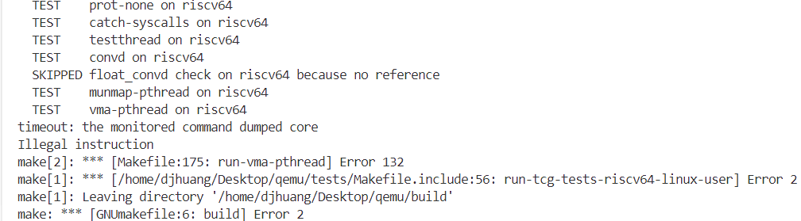
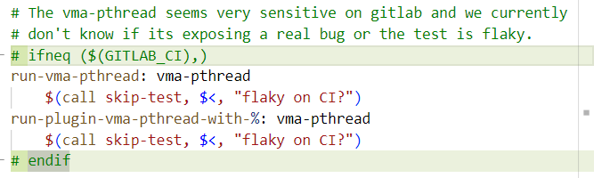

# qemu TCG 指令测试方法

QEMU 为 TCG 指令准备了测试系统，能编译 [`test/tcg/$TARGET/Makefile.target`](https://github.com/qemu/qemu/blob/master/tests/tcg/riscv64/Makefile.target) 中`TEST`变量指定的当前目录下的测试用例，并在用户态qemu中执行测试返回结果。例如 qemu 中有 [Zfa 扩展的测试用例](https://github.com/qemu/qemu/commit/a47842d16653b4f73b5d56ff0c252dd8a329481b#diff-0b894648472d9fd6e6bd7de5baaf6d7b9e2f99317d0577738b43631a9ef66e3c)。对于 RISC-V 架构，该测试的使用方法为：

**1. 配置 QEMU:**

```bash
./configure --target-list=riscv64-softmmu,riscv32-softmmu,riscv64-linux-user,riscv32-linux-user --cross-cc-riscv64=riscv64-unknown-linux-gnu-gcc
```

其中`--cross-cc-riscv64`指定的是编译测试用例的编译器，需要提前准备，如果找不到编译器，会尝试使用 docker 环境测试。

**2. 编译：**

```bash
make -j8
```

**3. 测试：**

```bash
make build-tcg-tests-riscv64-linux-user
make run-tcg-tests-riscv64-linux-user
```

加上 V=1 可以查看具体执行的指令。

## BUG

无论是在本地还是在服务器上，我按上述方法为 qemu-riscv64 测试 TCG 时 vma-pthread 这个测试用例总会报错，如下图。这个[commit](https://github.com/qemu/qemu/commit/5842de51573fdbd7299ab4b33d64b7446cc07649)说此用例本身就不稳定，因此我认为可以忽略错误。



忽略方法为借用[qemu/tests/tcg/multiarch/Makefile.target:47](https://github.com/qemu/qemu/blob/5012e522aca161be5c141596c66e5cc6082538a9/tests/tcg/multiarch/Makefile.target#L47)处的判断：



----

**参考：[qemu check-tcg 文档](https://www.qemu.org/docs/master/devel/testing.html#testing-with-make-check-tcg)、[QEMU TCG Tests](https://www.qemu.org/2018/06/21/tcg-testing/)。**