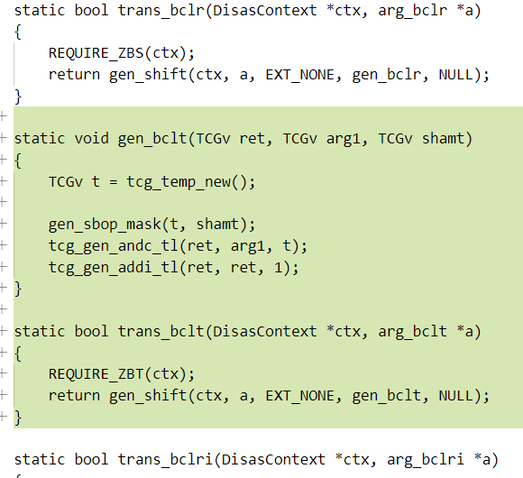
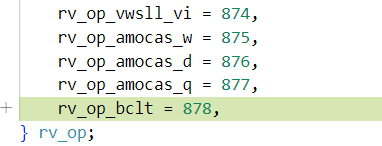

# 一、QEMU 支持的 RISC-V 扩展指令集

**支持**：MAFDCBKVHSJ, Zifencei, Zihintpause, Zicsr, Zc*, Zfinx, Zdinx, Zhinx, Zhinxmin, Zicntr, Zicbom, Zicboz, Zicbop, Zawrs, Zfa, Zfh, Ztso, Zmmul, ......

**暂不支持**：Q❌L❌T❌P❌Zihintntl❌Zcmop❌

> 调查方式：
>
> 1. 搜索源码看没有实现
> 2. 搜索仓库看有没有对应的 commit
> 3. wikipedia、RISC-V 手册

## Zc*

均支持，其中 Zcb 依赖于 Zca。


## Zfinx, Zdinx, Zhinx, Zhinxmin

均支持，其中 [Zdinx](https://github.com/qemu/qemu/commit/026e73fa2665f07d24bb715f2c405c3e38587812)，[Zhinx](https://github.com/qemu/qemu/commit/a2464a4cec4740c3703d8232f695d6643e0e086e)，[Zhinxmin](https://github.com/qemu/qemu/commit/a2464a4cec4740c3703d8232f695d6643e0e086e) 指令集依赖于 [Zfinx](https://github.com/qemu/qemu/commit/e1a29bbd5493634afd52f1724331728abdd196b8)。

## B

均支持，包含 Zba，Zbb，[Zbc](https://github.com/qemu/qemu/commit/fd4b81a304a5d50e719019d22eacca2d8ef4de69)，Zbs 子指令集

## K

除 Zkt 因对时序有要求 ，QEMU 没有实现外，其余均支持。


## P

包含 Zbpbo，Zpsfoperand， Zpn 子指令集，均不支持。

# 二、为 RISC-V QEMU 添加指令集支持

QEMU 的用户态模拟模式（如 `qemu-riscv64`）与系统模拟模式（如 `qemu-system-riscv64`）采用的指令翻译方式相同，均为基于 Tiny Code Generator 的动态二进制翻译，即在程序运行的过程中将指令通过 TCG 前端翻译成中间指令（TCG ops），再通过 TCG 后端将中间指令翻译成宿主机上可以直接运行的指令。要将 QEMU 移植到新处理器上时，需要修改 TCG 后端的逻辑或使用 TCI（TCG Interpreter）来生成后端代码；而在 QEMU 上模拟新处理器时，需要修改前端部分。因此要为 QEMU 添加一个 RISC-V 扩展的支持，可能需要从两个方面进行修改：把目标指令翻译成 TCG ops 的前端和把 TCG ops 翻译成宿主机指令的后端。QEMU 的后端目前支持的扩展很少，仅会生成使用了少数扩展的 RISC-V 指令。

这里，我仿照[Zbs](https://five-embeddev.com/riscv-bitmanip/1.0.0/bitmanip.html#zbs)指令集的[bclr](https://five-embeddev.com/riscv-bitmanip/1.0.0/bitmanip.html#insns-bclr)指令，为 QEMU 添加一个『只有一条 "bclt"指令的"Zbt"指令集』，"bclt"指令的功能是在[bclr](https://five-embeddev.com/riscv-bitmanip/1.0.0/bitmanip.html#insns-bclr)指令功能的基础上，再给结果加一。实现这样一个简单的指令集意在熟悉 QEMU 最基础的扩展方法。

1. 在[RISCVCPUConfig](https://github.com/qemu/qemu/blob/ba49d760eb04630e7b15f423ebecf6c871b8f77b/target/riscv/cpu_cfg.h#L39)结构体中添加新扩展的入口。

   

2. 在 [isa_edata_arr](https://github.com/qemu/qemu/blob/ba49d760eb04630e7b15f423ebecf6c871b8f77b/target/riscv/cpu.c#L100)结构体中添加新扩展的入口。

   

3. 在 [riscv_cpu_extensions](https://github.com/qemu/qemu/blob/ba49d760eb04630e7b15f423ebecf6c871b8f77b/target/riscv/cpu.c#L1459) 结构体中添加新扩展的入口。

   

4. 如果新加入的扩展对其它扩展有依赖，或拥有子扩展，在[riscv_cpu_validate_set_extensions](https://github.com/qemu/qemu/blob/ba49d760eb04630e7b15f423ebecf6c871b8f77b/target/riscv/tcg/tcg-cpu.c#L396)函数中判断，

   如下图中的语句表示Zcb扩展作为Zce扩展的子集，在Zce启用时，会被启用。

   

   下图中的语句表示Zcb扩展依赖于Zca扩展，如果启用Zcb扩展时没有启用Zca扩展，会报错。

   

   假设“Zct”扩展不依赖于其它扩展，这一步不修改代码。

5. “zbt”作为B的新子集，在[riscv_cpu_validate_b](https://github.com/qemu/qemu/blob/ba49d760eb04630e7b15f423ebecf6c871b8f77b/target/riscv/tcg/tcg-cpu.c#L363) 函数中添加和其有关的判断


6. 选择在[RVA22U64](https://github.com/qemu/qemu/blob/ba49d760eb04630e7b15f423ebecf6c871b8f77b/target/riscv/cpu.c#L2208)、[RVA22S64](https://github.com/qemu/qemu/blob/ba49d760eb04630e7b15f423ebecf6c871b8f77b/target/riscv/cpu.c#L2240)等数据结构添加扩展名。表示对指令集特性的不完全支持。

   这里忽略。

7. 在[insn32.decode](https://github.com/qemu/qemu/blob/ba49d760eb04630e7b15f423ebecf6c871b8f77b/target/riscv/insn32.decode)中添加新扩展中指令的编码。

   原bclr指令格式如下图：

   

   “bclt”的不同是14-12位改为011，所以添加的编码如下图。不同格式指令的添加在这个文件头有介绍。

   

8. 在[trans_rvb.c.inc](https://github.com/qemu/qemu/blob/master/target/riscv/insn_trans/trans_rvb.c.inc) 中添加 REQUIRE_ZBS 宏，后面实现具体指令的解析函数时，需要用来判断是否启用扩展。

   

9. 在trans_rvb.c.inc 中添加指令的解析函数。

   

   这里 trans_bclt 和 gen_bcle 调用 QEMU TCG 的函数，先进行和 bclr 指令一样的与操作，再加一。

10. 在[disas/riscv.c](https://github.com/qemu/qemu/blob/master/disas/riscv.c) 中添加新扩展的反汇编支持。

   把新添加指令的入口分别加到[rv_op](https://github.com/qemu/qemu/blob/ba49d760eb04630e7b15f423ebecf6c871b8f77b/disas/riscv.c#L30)结构体和[rvi_opcode_data](https://github.com/qemu/qemu/blob/ba49d760eb04630e7b15f423ebecf6c871b8f77b/disas/riscv.c#L1180)结构体的末尾。



在[decode_inst_opcode](https://github.com/qemu/qemu/blob/ba49d760eb04630e7b15f423ebecf6c871b8f77b/disas/riscv.c#L2317)函数中按照指令编码规则在合适的位置添加反汇编入口。


11. 修改完成后重新编译 qemu-system-riscv64

### 新指令功能验证

准备代码片段`hello.s`：
```asm
.global _start
    
_start:
    li s6, 4
    li s7, 0xffffffffffffffff
    .insn 0x496bbc33	# 这一行是 bclt s8, s7, s6 的字节码
```

和`link.ld`:

```bash
SECTIONS
{
  . = 0x80000000;
  .text : { *(.text) }
  .data : { *(.data) }
  .bss  : { *(.bss) }
}
```

执行下面的指令编译链接程序：
```bash
riscv64-unknown-elf-gcc -nostartfiles -g -mabi=lp64 -march=rv64g -c hello.s -o hello.o
riscv64-unknown-elf-ld --no-warn-rwx-segments -o hello.elf hello.o
riscv64-unknown-elf-objcopy hello.elf -I binary hello.img
riscv64-unknown-elf-objdump -d hello.elf > hello.asm
```
反汇编显示：

```asm
00000000000100e8 <_start>:
   100e8:	00400b13          	li	s6,4
   100ec:	fff00b93          	li	s7,-1
   100f0:	496bbc33          	.insn	4, 0x496bbc33
```

启动 QEMU:

```bash
../qemu/build/qemu-system-riscv64 -cpu rv64,zbt=true -s -S -M virt -bios none -serial stdio -display none -kernel hello.img
```

GDB 连接 QEMU  调试：


执行结果正确，s8中的值是s7的第4位取反后加一的结果。

QEMU monitor 中查看内存：


反汇编功能正确。

---

**参考：[QEMU RISC-V ISA 扩展支持](https://tinylab.org/riscv-isa-discovery-3-qemu/)。**
