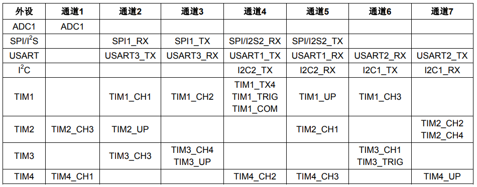

&#8195;&#8195;DMA，全称为：`Direct Memory Access`，即直接存储器访问，DMA传输将数据从一个地址空间复制到另外一个地址空间。DMA传输方式无需CPU直接控制传输，也没有中断处理方式那样保留现场和恢复现场的过程，通过硬件为RAM与I/O设备开辟一条直接传送数据的通路，能使CPU的效率大为提高。
&#8195;&#8195;从外设(TIMx[ x=1、2、3、4 ]、ADC1、SPI1、SPI/I2S2、I2Cx[ x=1、2 ]和USARTx[ x=1、2、3 ) 产生的7个请求，通过逻辑或输入到`DMA1`控制器，这意味着同时只能有一个请求有效。参见下图的`DMA1`请求映像。



&#8195;&#8195;例如通道1的几个`DMA1`请求（`ADC1`、`TIM2_CH3`、`TIM4_CH1`)，这几个是通过逻辑或到通道1的，这样在同一时间，就只能使用其中的一个，其他通道也是类似的。
# DMA配置
&#8195;&#8195;使能DMA1时钟方法如下：
```
RCC_AHBPeriphClockCmd(RCC_AHBPeriph_DMA1, ENABLE); //使能DMA1时钟
```
&#8195;&#8195;DMA通道配置参数种类比较繁多，包括内存地址，外设地址，传输数据长度，数据宽度，通道优先级等等。这些参数的配置在库函数中都是在函数`void DMA_Init(DMA_Channel_TypeDef* DMAy_Channelx, DMA_InitTypeDef* DMA_InitStruct)`中完成。第一个参数`DMAy_Channelx`注释如下：
```
DMAy_Channelx: where y can be 1 or 2 to select the DMA and x can be 1 to 7 for DMA1 and 1 to 5 for DMA2 to select the DMA Channel.
```
&#8195;&#8195;第二个参数`DMA_InitTypeDef`的结构体如下：
```
typedef struct { 
    uint32_t DMA_PeripheralBaseAddr; 
    uint32_t DMA_MemoryBaseAddr; 
    uint32_t DMA_DIR; uint32_t DMA_BufferSize; 
    uint32_t DMA_PeripheralInc; 
    uint32_t DMA_MemoryInc; 
    uint32_t DMA_PeripheralDataSize; 
    uint32_t DMA_MemoryDataSize; 
    uint32_t DMA_Mode; 
    uint32_t DMA_Priority; 
    uint32_t DMA_M2M; 
}DMA_InitTypeDef;
```
&#8195;&#8195;第一个参数`DMA_PeripheralBaseAddr`用来设置DMA传输的外设基地址，比如要进行串口DMA传输，那么外设基地址为串口接受发送数据存储器`USART1->DR`的地址，表示方法为`&USART1->DR`。
&#8195;&#8195;第二个参数`DMA_MemoryBaseAddr`为内存基地址，也就是存放DMA传输数据的内存地址。
&#8195;&#8195;第三个参数`DMA_DIR`设置数据传输方向，也就是外设是源地还是目的地。可取值如下：
```
#define DMA_DIR_PeripheralDST              ((uint32_t)0x00000010)
#define DMA_DIR_PeripheralSRC              ((uint32_t)0x00000000)
```
&#8195;&#8195;这里设置为从内存读取数据发送到串口，所以外设自然就是目的地了，所以选择值为`DMA_DIR_PeripheralDST`。
&#8195;&#8195;第四个参数`DMA_BufferSize`设置一次传输数据量的大小。
&#8195;&#8195;第五个参数`DMA_PeripheralInc`设置传输数据的时候外设地址是不变还是递增。取值如下：
```
#define DMA_PeripheralInc_Enable           ((uint32_t)0x00000040)
#define DMA_PeripheralInc_Disable          ((uint32_t)0x00000000)
```
&#8195;&#8195;如果设置为递增，那么下一次传输的时候地址加1，这里因为是一直往固定外设地址`&USART1->DR`发送数据，所以地址不递增，值为`DMA_PeripheralInc_Disable`。
&#8195;&#8195;第六个参数`DMA_MemoryInc`设置传输数据时候内存地址是否递增。这个参数和`DMA_PeripheralInc`意思接近，只不过针对的是内存。取值如下：
```
#define DMA_MemoryInc_Enable               ((uint32_t)0x00000080)
#define DMA_MemoryInc_Disable              ((uint32_t)0x00000000)
```
&#8195;&#8195;第七个参数`DMA_PeripheralDataSize`用来设置外设的数据长度是为字节传输（8bits），半字传输(16bits)还是字传输(32bits)。取值如下：
```
#define DMA_PeripheralDataSize_Byte        ((uint32_t)0x00000000)
#define DMA_PeripheralDataSize_HalfWord    ((uint32_t)0x00000100)
#define DMA_PeripheralDataSize_Word        ((uint32_t)0x00000200)
```
&#8195;&#8195;这里是8位字节传输，所以值设置为`DMA_PeripheralDataSize_Byte`。
&#8195;&#8195;第八个参数`DMA_MemoryDataSize`是用来设置内存的数据长度，和第七个参数意思接近，取值如下：
```
#define DMA_MemoryDataSize_Byte            ((uint32_t)0x00000000)
#define DMA_MemoryDataSize_HalfWord        ((uint32_t)0x00000400)
#define DMA_MemoryDataSize_Word            ((uint32_t)0x00000800)
```
&#8195;&#8195;第九个参数`DMA_Mode`用来设置DMA模式是否循环采集，也就是说，比如我们要从内存中采集64个字节发送到串口，如果设置为重复采集，那么它会在64个字节采集完成之后继续从内存的第一个地址采集，如此循环，取值如下：
```
#define DMA_Mode_Circular                  ((uint32_t)0x00000020)
#define DMA_Mode_Normal                    ((uint32_t)0x00000000)
```
&#8195;&#8195;第十个参数`DMA_Priority`是设置DMA通道的优先级，取值如下：
```
#define DMA_Priority_VeryHigh              ((uint32_t)0x00003000)
#define DMA_Priority_High                  ((uint32_t)0x00002000)
#define DMA_Priority_Medium                ((uint32_t)0x00001000)
#define DMA_Priority_Low                   ((uint32_t)0x00000000)
```
&#8195;&#8195;如果要开启多个通道，那么这个值就非常有意义。
&#8195;&#8195;第十一个参数`DMA_M2M`设置是否是存储器到存储器模式传输，取值如下：
```
#define DMA_M2M_Enable                     ((uint32_t)0x00004000)
#define DMA_M2M_Disable                    ((uint32_t)0x00000000)
```
&#8195;&#8195;初始化DMA格式为：
```
DMA_InitTypeDef DMA_InitStructure; 
DMA_InitStructure.DMA_PeripheralBaseAddr = &USART1->DR; //DMA 外设 ADC 基地址 
DMA_InitStructure.DMA_MemoryBaseAddr = cmar; //DMA 内存基地址 
DMA_InitStructure.DMA_DIR = DMA_DIR_PeripheralDST; //从内存读取发送到外设 
DMA_InitStructure.DMA_BufferSize = 64; //DMA 通道的 DMA 缓存的大小 
DMA_InitStructure.DMA_PeripheralInc = DMA_PeripheralInc_Disable;//外设地址不变 
DMA_InitStructure.DMA_MemoryInc = DMA_MemoryInc_Enable; //内存地址递增 
DMA_InitStructure.DMA_PeripheralDataSize = DMA_PeripheralDataSize_Byte; //8 位 
DMA_InitStructure.DMA_MemoryDataSize = DMA_MemoryDataSize_Byte; // 8 位 
DMA_InitStructure.DMA_Mode = DMA_Mode_Normal; //工作在正常缓存模式 
DMA_InitStructure.DMA_Priority = DMA_Priority_Medium; //DMA 通道 x 拥有中优先级 
DMA_InitStructure.DMA_M2M = DMA_M2M_Disable; //非内存到内存传输 
DMA_Init(DMA_CHx, &DMA_InitStructure); //根据指定的参数初始化
```
# 传递数据
&#8195;&#8195;进行DMA配置之后，我们就要开启串口的DMA功能，使用的函数是：`void USART_DMACmd(USART_TypeDef* USARTx, uint16_t USART_DMAReq, FunctionalState NewState)`，第二个参数`USART_DMAReq`如下：
```
@arg USART_DMAReq_Tx: USART DMA transmit request
@arg USART_DMAReq_Rx: USART DMA receive request
```
&#8195;&#8195;使能串口DMA发送之后，我们接着就要用函数`void DMA_Cmd(DMA_Channel_TypeDef* DMAy_Channelx, FunctionalState NewState)`使能DMA传输通道。
&#8195;&#8195;在DMA传输过程中，我们要查询DMA传输通道的状态，使用的函数是`FlagStatus DMA_GetFlagStatus(uint32_t DMAy_FLAG)`，参数如下：
```
This parameter can be one of the following values:
  @arg DMA1_FLAG_GL1: DMA1 Channel1 global flag.
  @arg DMA1_FLAG_TC1: DMA1 Channel1 transfer complete flag.
  @arg DMA1_FLAG_HT1: DMA1 Channel1 half transfer flag.
  @arg DMA1_FLAG_TE1: DMA1 Channel1 transfer error flag.
  @arg DMA1_FLAG_GL2: DMA1 Channel2 global flag.
  @arg DMA1_FLAG_TC2: DMA1 Channel2 transfer complete flag.
  @arg DMA1_FLAG_HT2: DMA1 Channel2 half transfer flag.
  @arg DMA1_FLAG_TE2: DMA1 Channel2 transfer error flag.
  @arg DMA1_FLAG_GL3: DMA1 Channel3 global flag.
  @arg DMA1_FLAG_TC3: DMA1 Channel3 transfer complete flag.
  @arg DMA1_FLAG_HT3: DMA1 Channel3 half transfer flag.
  @arg DMA1_FLAG_TE3: DMA1 Channel3 transfer error flag.
  @arg DMA1_FLAG_GL4: DMA1 Channel4 global flag.
  @arg DMA1_FLAG_TC4: DMA1 Channel4 transfer complete flag.
  @arg DMA1_FLAG_HT4: DMA1 Channel4 half transfer flag.
  @arg DMA1_FLAG_TE4: DMA1 Channel4 transfer error flag.
  @arg DMA1_FLAG_GL5: DMA1 Channel5 global flag.
  @arg DMA1_FLAG_TC5: DMA1 Channel5 transfer complete flag.
  @arg DMA1_FLAG_HT5: DMA1 Channel5 half transfer flag.
  @arg DMA1_FLAG_TE5: DMA1 Channel5 transfer error flag.
  @arg DMA1_FLAG_GL6: DMA1 Channel6 global flag.
  @arg DMA1_FLAG_TC6: DMA1 Channel6 transfer complete flag.
  @arg DMA1_FLAG_HT6: DMA1 Channel6 half transfer flag.
  @arg DMA1_FLAG_TE6: DMA1 Channel6 transfer error flag.
  @arg DMA1_FLAG_GL7: DMA1 Channel7 global flag.
  @arg DMA1_FLAG_TC7: DMA1 Channel7 transfer complete flag.
  @arg DMA1_FLAG_HT7: DMA1 Channel7 half transfer flag.
  @arg DMA1_FLAG_TE7: DMA1 Channel7 transfer error flag.
  @arg DMA2_FLAG_GL1: DMA2 Channel1 global flag.
  @arg DMA2_FLAG_TC1: DMA2 Channel1 transfer complete flag.
  @arg DMA2_FLAG_HT1: DMA2 Channel1 half transfer flag.
  @arg DMA2_FLAG_TE1: DMA2 Channel1 transfer error flag.
  @arg DMA2_FLAG_GL2: DMA2 Channel2 global flag.
  @arg DMA2_FLAG_TC2: DMA2 Channel2 transfer complete flag.
  @arg DMA2_FLAG_HT2: DMA2 Channel2 half transfer flag.
  @arg DMA2_FLAG_TE2: DMA2 Channel2 transfer error flag.
  @arg DMA2_FLAG_GL3: DMA2 Channel3 global flag.
  @arg DMA2_FLAG_TC3: DMA2 Channel3 transfer complete flag.
  @arg DMA2_FLAG_HT3: DMA2 Channel3 half transfer flag.
  @arg DMA2_FLAG_TE3: DMA2 Channel3 transfer error flag.
  @arg DMA2_FLAG_GL4: DMA2 Channel4 global flag.
  @arg DMA2_FLAG_TC4: DMA2 Channel4 transfer complete flag.
  @arg DMA2_FLAG_HT4: DMA2 Channel4 half transfer flag.
  @arg DMA2_FLAG_TE4: DMA2 Channel4 transfer error flag.
  @arg DMA2_FLAG_GL5: DMA2 Channel5 global flag.
  @arg DMA2_FLAG_TC5: DMA2 Channel5 transfer complete flag.
  @arg DMA2_FLAG_HT5: DMA2 Channel5 half transfer flag.
  @arg DMA2_FLAG_TE5: DMA2 Channel5 transfer error flag.


```
&#8195;&#8195;还有一个比较重要的函数就是获取还有多少个数据没有传输的函数：`uint16_t DMA_GetCurrDataCounter(DMA_Channel_TypeDef* DMAy_Channelx)`。

&#8195;&#8195;综上，使用串口DMA的步骤是：
1. 使能DMA时钟并初始化。
2. 使能串口DMA功能。
3. 使能DMA开始传输。
4. 传输过程中获取状态信息。


**参考：正点原子STM32F1开发指南-库函数版本_V3.3、STM32中文参考手册_V10**

---
示例：
```
/*
 * 本实验通过按键KEY0控制串口1以DMA方式发送数据，按下KEY0，就开始DMA传送，串口调试助手可以收到DMA发送的内容
 */

#include <stdio.h>
#include "stm32f10x.h"
#define KEY0		GPIO_ReadInputDataBit( GPIOE, GPIO_Pin_4 )      /* 读取按键0 */
#define KEY1		GPIO_ReadInputDataBit( GPIOE, GPIO_Pin_3 )      /* 读取按键1 */
#define KEY2		GPIO_ReadInputDataBit( GPIOE, GPIO_Pin_2 )      /* 读取按键2 */
#define WK_UP		GPIO_ReadInputDataBit( GPIOA, GPIO_Pin_0 )      /* 读取按键3(WK_UP) */
#define KEY0_PRES	1                                               /* KEY0按下 */
#define KEY1_PRES	2                                               /* KEY1按下 */
#define KEY2_PRES	3                                               /* KEY2按下 */
#define WKUP_PRES	4                                               /* KEY_UP按下(即WK_UP/KEY_UP) */

/* 加入以下代码,支持printf函数,而不需要选择use MicroLIB */

/* 标准库需要的支持函数 */
struct __FILE
{
	int handle;
};

FILE __stdout;
/* 定义_sys_exit()以避免使用半主机模式 */
void _sys_exit( int x )
{
	x = x;
}


/* 重定义fputc函数 */
int fputc( int ch, FILE *f )
{
	while ( (USART1->SR & 0X40) == 0 )
		;  /* 循环发送,直到发送完毕 */
	USART1->DR = (u8) ch;
	return(ch);
}


void uart_init( u32 bound )
{
	/* GPIO端口设置 */
	GPIO_InitTypeDef	GPIO_InitStructure;
	USART_InitTypeDef	USART_InitStructure;
	NVIC_InitTypeDef	NVIC_InitStructure;

	RCC_APB2PeriphClockCmd( RCC_APB2Periph_USART1 | RCC_APB2Periph_GPIOA, ENABLE );         /* 使能USART1，GPIOA时钟 */

	/* USART1_TX   GPIOA.9 */
	GPIO_InitStructure.GPIO_Pin	= GPIO_Pin_9;                                           /* PA.9 */
	GPIO_InitStructure.GPIO_Speed	= GPIO_Speed_50MHz;
	GPIO_InitStructure.GPIO_Mode	= GPIO_Mode_AF_PP;                                      /*复用推挽输出 */
	GPIO_Init( GPIOA, &GPIO_InitStructure );                                                /* 初始化GPIOA.9 */

	/* USART1_RX	  GPIOA.10初始化 */
	GPIO_InitStructure.GPIO_Pin	= GPIO_Pin_10;                                          /* PA10 */
	GPIO_InitStructure.GPIO_Mode	= GPIO_Mode_IN_FLOATING;                                /* 浮空输入 */
	GPIO_Init( GPIOA, &GPIO_InitStructure );                                                /* 初始化GPIOA.10 */

	/* USART 初始化设置 */
	USART_InitStructure.USART_BaudRate		= bound;                                /* 串口波特率 */
	USART_InitStructure.USART_WordLength		= USART_WordLength_8b;                  /* 字长为8位数据格式 */
	USART_InitStructure.USART_StopBits		= USART_StopBits_1;                     /* 一个停止位 */
	USART_InitStructure.USART_Parity		= USART_Parity_No;                      /* 无奇偶校验位 */
	USART_InitStructure.USART_HardwareFlowControl	= USART_HardwareFlowControl_None;       /* 无硬件数据流控制 */
	USART_InitStructure.USART_Mode			= USART_Mode_Rx | USART_Mode_Tx;        /* 收发模式 */

	USART_Init( USART1, &USART_InitStructure );                                             /* 初始化串口1 */
	USART_Cmd( USART1, ENABLE );                                                            /* 使能串口1 */
}


static u8	fac_us	= 0;
static u16	fac_ms	= 0;

void delay_init()
{
	SysTick_CLKSourceConfig( SysTick_CLKSource_HCLK_Div8 ); /*选择外部时钟  HCLK/8 */
	fac_us	= SystemCoreClock / 8000000;                    /* 为系统时钟的1/8 */
	fac_ms	= (u16) fac_us * 1000;
}


void delay_ms( u16 nms )
{
	u32 temp;
	SysTick->LOAD	= (u32) nms * fac_ms;                                           /* 时间加载(SysTick->LOAD为24bit) */
	SysTick->VAL	= 0x00;                                                         /* 清空计数器 */
	SysTick->CTRL	|= SysTick_CTRL_ENABLE_Msk;                                     /* 开始倒数 */
	do
	{
		temp = SysTick->CTRL;
	}
	while ( (temp & 0x01) && !(temp & (1 << 16) ) );                                /* 等待时间到达 */
	SysTick->CTRL	&= ~SysTick_CTRL_ENABLE_Msk;                                    /* 关闭计数器 */
	SysTick->VAL	= 0X00;                                                         /* 清空计数器 */
}


void KEY_Init( void )                                                                   /* IO初始化 */
{
	GPIO_InitTypeDef GPIO_InitStructure;

	RCC_APB2PeriphClockCmd( RCC_APB2Periph_GPIOA | RCC_APB2Periph_GPIOE, ENABLE );  /* 使能PORTA,PORTE时钟 */

	GPIO_InitStructure.GPIO_Pin	= GPIO_Pin_2 | GPIO_Pin_3 | GPIO_Pin_4;         /* KEY0-KEY2 */
	GPIO_InitStructure.GPIO_Mode	= GPIO_Mode_IPU;                                /* 设置成上拉输入 */
	GPIO_Init( GPIOE, &GPIO_InitStructure );                                        /* 初始化GPIOE2,3,4 */

	/* 初始化 WK_UP-->GPIOA.0	  下拉输入 */
	GPIO_InitStructure.GPIO_Pin	= GPIO_Pin_0;
	GPIO_InitStructure.GPIO_Mode	= GPIO_Mode_IPD;                                /* PA0设置成输入，默认下拉 */
	GPIO_Init( GPIOA, &GPIO_InitStructure );                                        /* 初始化GPIOA.0 */
}


/*
 * 键处理函数
 * 返回按键值
 * mode:0,不支持连续按(长按识别为一次触发);1,支持连续按(长按识别为多次触发);
 * 0，没有任何按键按下
 * 1，KEY0按下
 * 2，KEY1按下
 * 3，KEY2按下
 * 4，KEY3按下 WK_UP
 * 注意此函数有响应优先级,KEY0>KEY1>KEY2>KEY3!!
 */
u8 KEY_Scan( u8 mode )
{
	static u8 key_up = 1;                                                           /*按键按松开标志 */
	if ( mode )
		key_up = 1;                                                             /* 支持连按 */
	if ( key_up && (KEY0 == 0 || KEY1 == 0 || KEY2 == 0 || WK_UP == 1) )
	{
		delay_ms( 10 );                                                         /* 去抖动 */
		key_up = 0;
		if ( KEY0 == 0 )
			return(KEY0_PRES);
		else if ( KEY1 == 0 )
			return(KEY1_PRES);
		else if ( KEY2 == 0 )
			return(KEY2_PRES);
		else if ( WK_UP == 1 )
			return(WKUP_PRES);
	}else if ( KEY0 == 1 && KEY1 == 1 && KEY2 == 1 && WK_UP == 0 )
		key_up = 1;
	return(0);                              /* 无按键按下 */
}


u16		DMA1_MEM_LEN;                   /* 保存DMA每次数据传送的长度 */
/*
 * DMA1的各通道配置
 * 这里的传输形式是固定的,这点要根据不同的情况来修改
 * 从存储器->外设模式/8位数据宽度/存储器增量模式
 * DMA_CHx:DMA通道CHx
 * cpar:外设地址
 * cmar:存储器地址
 * cndtr:数据传输量
 */
void MYDMA_Config( DMA_Channel_TypeDef* DMA_CHx, u32 cpar, u32 cmar, u16 cndtr )
{
	DMA_InitTypeDef DMA_InitStructure;
	
	RCC_AHBPeriphClockCmd( RCC_AHBPeriph_DMA1, ENABLE );                            /* 使能DMA传输 */
	DMA_DeInit( DMA_CHx );                                                          /* 将DMA的通道1寄存器重设为缺省值 */

	DMA1_MEM_LEN					= cndtr;
	DMA_InitStructure.DMA_PeripheralBaseAddr	= cpar;                         /* DMA外设基地址 */
	DMA_InitStructure.DMA_MemoryBaseAddr		= cmar;                         /* DMA内存基地址 */
	DMA_InitStructure.DMA_DIR			= DMA_DIR_PeripheralDST;        /* 数据传输方向，从内存读取发送到外设 */
	DMA_InitStructure.DMA_BufferSize		= cndtr;                        /* DMA通道的DMA缓存的大小 */
	DMA_InitStructure.DMA_PeripheralInc		= DMA_PeripheralInc_Disable;    /* 外设地址寄存器不变 */
	DMA_InitStructure.DMA_MemoryInc			= DMA_MemoryInc_Enable;         /* 内存地址寄存器递增 */
	DMA_InitStructure.DMA_PeripheralDataSize	= DMA_PeripheralDataSize_Byte;  /* 数据宽度为8位 */
	DMA_InitStructure.DMA_MemoryDataSize		= DMA_MemoryDataSize_Byte;      /* 数据宽度为8位 */
	DMA_InitStructure.DMA_Mode			= DMA_Mode_Normal;              /* 工作在正常模式 */
	DMA_InitStructure.DMA_Priority			= DMA_Priority_Medium;          /* DMA通道 x拥有中优先级 */
	DMA_InitStructure.DMA_M2M			= DMA_M2M_Disable;              /* DMA通道x没有设置为内存到内存传输 */
	DMA_Init( DMA_CHx, &DMA_InitStructure );                                        /* 根据DMA_InitStruct中指定的参数初始化DMA的通道USART1_Tx_DMA_Channel所标识的寄存器 */
}


/* 开启一次DMA传输 */
void MYDMA_Enable( DMA_Channel_TypeDef*DMA_CHx )
{
	DMA_Cmd( DMA_CHx, DISABLE );                                                    /* 关闭USART1 TX DMA1 所指示的通道 */
	DMA_SetCurrDataCounter( DMA_CHx, DMA1_MEM_LEN );                                /* DMA通道的DMA缓存的大小 */
	DMA_Cmd( DMA_CHx, ENABLE );                                                     /* 使能USART1 TX DMA1 所指示的通道 */
}


#define SEND_BUF_SIZE 8200                      /* 发送数据长度,最好等于sizeof(TEXT_TO_SEND)+2的整数倍. */
u8		SendBuff[SEND_BUF_SIZE];        /* 发送数据缓冲区 */
const u8	TEXT_TO_SEND[] = { "ALIENTEK WarShip STM32F1 DMA 串口实验" };

int main( void )
{
	u16	i;
	u8	t = 0;
	u8	j, mask = 0;

	delay_init();                                                                           /* 延时函数初始化 */
	uart_init( 115200 );                                                                    /* 串口初始化为115200 */
	KEY_Init();                                                                             /*按键初始化 */
	MYDMA_Config( DMA1_Channel4, (u32) & USART1->DR, (u32) SendBuff, SEND_BUF_SIZE );       /* DMA1通道4,外设为串口1,存储器为SendBuff,长度SEND_BUF_SIZE. */
	j = sizeof(TEXT_TO_SEND);
	for ( i = 0; i < SEND_BUF_SIZE; i++ )                                                   /* 填充数据到SendBuff */
	{
		if ( t >= j )                                                                   /* 加入换行符 */
		{
			if ( mask )
			{
				SendBuff[i]	= 0x0a;
				t		= 0;
			}else{
				SendBuff[i] = 0x0d;
				mask++;
			}
		}else{ /*复制TEXT_TO_SEND语句 */
			mask		= 0;
			SendBuff[i]	= TEXT_TO_SEND[t];
			t++;
		}
	}
	i = 0;
	while ( 1 )
	{
		t = KEY_Scan( 0 );
		if ( t == KEY0_PRES )                                                   /* KEY0按下 */
		{
			printf( "\r\nDMA DATA:\r\n" );
			USART_DMACmd( USART1, USART_DMAReq_Tx, ENABLE );                /* 使能串口1的DMA发送 */
			MYDMA_Enable( DMA1_Channel4 );                                  /* 开始一次DMA传输！ */
			/*
			 * 等待DMA传输完成，此时我们来做另外一些事，点灯
			 * 实际应用中，传输数据期间，可以执行另外的任务
			 */
			while ( 1 )
			{
				if ( DMA_GetFlagStatus( DMA1_FLAG_TC4 ) != RESET )      /* 判断通道4传输完成 */
				{
					DMA_ClearFlag( DMA1_FLAG_TC4 );                 /* 清除通道4传输完成标志 */
					break;
				}
			}
		}
		i++;
		delay_ms( 10 );
		if ( i == 20 )
		{
			i = 0;
		}
	}
}


```
