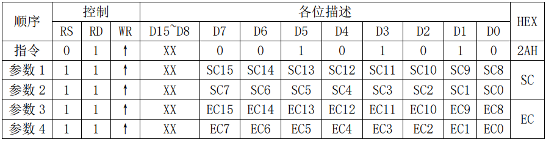

&#8195;&#8195;这篇文章主要记录如何用STM32芯片的`FSMC`驱动正点原子的TFLCD显示屏显示内容，分别介绍TFLCD的使用和`FSMC`的使用方法。

# TFLCD

&#8195;&#8195;TFLCD模块的外部接口如下图所示：


&#8195;&#8195;一些和显示有关的信号线功能如下：
- `LCD_CS`：TFTLCD片选信号。
- `LCD_WR`：向TFTLCD写入数据。
- `LCD_RD`：从TFTLCD读取数据。
- `DB[15-0]`：16位双向数据线。
- `LCD_RST`：硬复位TFTLCD。
- `LCD_RS`：命令/数据标志（`0`：读写命令；`1`：读写数据）。

&#8195;&#8195;驱动TFLCD的芯片是`ILI9341`，在16位模式下`ILI9341`的显存采用RGB565格式存储颜色，此时MCU数据线、`ILI9341`数据线和GRAM的对应关系如下。可以理解为我们只用操作连接到`ILI9341`总线`DB[17-13]`、`DB[11-6]`、`DB[5-1]`的`FSMC_D[15-0]`就能传递RGB颜色数据。其中有5位R、6位G和5位B。


&#8195;&#8195;几个`ILI9341`的命令使用方法如下，注意RS、RD、WR即上图中带“LCD_”前缀的引脚，Dx是上图中DBx引脚，连到开发板上就是`FSMC_D[15-0]`引脚。

1. 读取LCD控制器ID


2. 控制`ILI9341`存储器读写方向，就是在连续写GRAM的时候，GRAM指针的增长方向。


3. 列地址设置指令，在从左到右，从上到下的扫描方式下面，该指令用于设置横坐标。`SC`和`EC`即列地址的起始值和结束值，`SC`必须小于等于`EC`，且0≤`SC`/`EC`≤239。



4. 行地址设置指令，在从左到右，从上到下的扫描方式下面，该指令用于设置纵坐标。`SP`和`EP`即页地址的起始值和结束值，`SP`必须小于等于`EP`，且0≤`SP`/`EP`≤319。


5. 写GRAM指令，在发送该指令之后，便可以往LCD的GRAM里面连续写入颜色数据了。GRAM的地址将根据`MY`/`MX`/`MV`设置的扫描方向进行自增。


6. 读取 GRAM，第一次输出的是dummy数据，也就是无效的数据，第二次开始，读取到的才是有效的GRAM数据，连续读取时GRAM地址自增方法同上。输出规律如下：


# FSMC
## FSMC原理

&#8195;&#8195;`FSMC`，即灵活的静态存储控制器，能够与同步或异步存储器和16位PC存储器卡连接，STM32的`FSMC`接口支持包括`SRAM`、`NAND FLASH`、`NOR FLASH` 和`PSRAM`等存储器。`FSMC`的框图如下图所示，本实验中把TFLCD当作`SRAM`设备使用，使用原理框图中`NOR/PSRAM`信号和公用信号部分引脚。


&#8195;&#8195;STM32的`FSMC`支持8/16/32位数据宽度，我们这里用到的TFLCD是16位宽度。STM32的`FSMC`将外部存储器划分为固定大小为256M字节的四个存储块，如图所示：


&#8195;&#8195;STM32的每个存储块又被分为4个区，每个区管理64M字节空间，每个块的每个区又有独立的寄存器来配置。这些地址靠内部`AHB`的地址总线`HADDR`来寻址，`HADDR[25-0]`来自`FSMC_A[25-0]`，存储块1中它们两个之间的映射关系如下：

|Bank1所选区|片选信号|地址范围|HADDR[27-26]|HADDR[25-0]|
|:-:|:-:|:-:|:-:|:-:|
|第1区|FSMC_NE1|0X6000,0000~63FF,FFFF|00|FSMC_A[25:0]|
|第1区|FSMC_NE1|0X6400,0000~67FF,FFFF|01|FSMC_A[25:0]|
|第1区|FSMC_NE1|0X6800,0000~6BFF,FFFF|10|FSMC_A[25:0]|
|第1区|FSMC_NE1|0X6C00,0000~6FFF,FFFF|11|FSMC_A[25:0]|

&#8195;&#8195;特别要注意的是当使用的是16位数据宽度时，`FSMC_A[24-0]`对应的是`HADDR[25:1]`。使用的是8位数据宽度时，`FSMC_A[25-0]`对应的是`HADDR[25:0]`。可理解为`FSMC_A`里是经过处理的逻辑地址，`HADDR`里是数据的真实地址。


&#8195;&#8195;STM32的`FSMC`各Bank配置寄存器如表所示，通过`FSMC_BCRx`、`FSMC_BTRx`和`FSMC_BWTRx`寄存器可以设置FSMC访问外部存储器的时序参数，拓宽了可选用的外部存储器的速度范围。注意，`FSMC_BCRx`寄存器中的`EXTMOD`是扩展模式使能位，也就是是否允许读写不同的时序，如果使能，写时序依照`FSMC_BWTRx`中的参数。


&#8195;&#8195;`FSMC_BCRx`是`SRAM/NOR` 闪存片选控制寄存器，`FSMC_BTRx`是 `SRAM/NOR` 闪存片选时序寄存器，`FSMC_BWTRx`是`SRAM/NOR` 闪写时序寄存器。

&#8195;&#8195;`FSMC`综合了`SRAM／ROM、PSRAM`和`NOR Flash`产品的信号特点，定义了4种不同的异步时序模型。选用不同的时序模型时，需要设置不同的时序参数，如表所列。

|时序模型|描述|要设置的时间参数|
|:--|:--|:--|
|异步Mode1|SRAM/CRAM时序|DATAST、ADDSET|
|异步ModeA|SRAM/CRAM OE选通型时序|DATAST、ADDSET|
|异步Mode2/B|SRAM/CRAM OE选通型时序|DATAST、ADDSET|
|异步ModeC|NOR FLASH OE选通型时序|DATAST、ADDSET|
|异步ModeD|延长地址保持时间的异步时序|DATAST、ADDSET、ADDHLK|
|同步突发|根据同步时钟FSMC_CK读取多个顺序单元的数据|CLKDIV、DATLAT|

&#8195;&#8195;`DATLAT`是同步突发访问中获得第1个数据所需要的等待延迟，`ADDSET`是地址建立时间，`DATASET`是数据建立时间，`ADDHLD`是地址保持时间。

&#8195;&#8195;在实际扩展时，根据选用存储器的特征确定时序模型，从而确定各时间参数与存储器读写周期参数指标之间的计算关系；利用该计算关系和存储芯片数据手册中给定的参数指标，可计算出FSMC所需要的各时间参数，从而对时间参数寄存器进行合理的配置。

## FSMC初始化函数

&#8195;&#8195;对于上面提到的三个和`SRAM`有关的寄存器，可以通过`void FSMC_NORSRAMInit(FSMC_NORSRAMInitTypeDef* FSMC_NORSRAMInitStruct)函数来初始化，FSMC_NORSRAMInitTypeDef`结构体定义如下。

```
 1 typedef struct
 2 {
 3   uint32_t FSMC_Bank;//使用到的存储块标号和区号
 4   uint32_t FSMC_DataAddressMux;//地址和数据是否复用
 5   uint32_t FSMC_MemoryType;//存储器类型
 6   uint32_t FSMC_MemoryDataWidth;//数据总线宽度8位/16位
 7   uint32_t FSMC_BurstAccessMode;//是否进行成组模式访问
 8   uint32_t FSMC_WaitSignalPolarity;//等待信号有效级性
 9   uint32_t FSMC_WrapMode;//该位决定控制器是否支持把非对齐的AHB成组操作分割成2次线性操作；该位仅在存储器的成组模式下有效。
10   uint32_t FSMC_WaitSignalActive;//当闪存存储器处于成组传输模式时，NWAIT信号指示从闪存存储器出来的数据是否有效或是否需要插入等待周期。该位决定存储器是在等待状态之前的一个时钟周期产生NWAIT信号，还是在等待状态期间产生NWAIT信号。
11   uint32_t FSMC_WriteOperation;//该位指示FSMC是否允许/禁止对存储器的写操作。
12   uint32_t FSMC_WaitSignal;//当闪存存储器处于成组传输模式时，这一位允许/禁止通过NWAIT信号插入等待状态。
13   uint32_t FSMC_ExtendedMode;//该位允许FSMC使用FSMC_BWTR寄存器，即允许读和写使用不同的时序。
14   uint32_t FSMC_WriteBurst; //对于处于成组传输模式的闪存存储器，这一位允许/禁止通过NWAIT信号插入等待状态。读操作的同步成组传输协议使能位是FSMC_BCRx寄存器的BURSTEN位。
15   FSMC_NORSRAMTimingInitTypeDef* FSMC_ReadWriteTimingStruct;//读时序配置指针
16   FSMC_NORSRAMTimingInitTypeDef* FSMC_WriteTimingStruct;//写时序配置指针
17 }FSMC_NORSRAMInitTypeDef;
```

&#8195;&#8195;`FSMC_NORSRAMTimingInitTypeDef`结构体定义如下：

```
 1 typedef struct
 2 {
 3   uint32_t FSMC_AddressSetupTime;//这些位定义地址的建立时间，适用于SRAM、ROM和异步总线复用模式的 NOR闪存操作。
 4   uint32_t FSMC_AddressHoldTime;//这些位定义地址的保持时间，适用于SRAM、ROM和异步总线复用模式的 NOR闪存操作。
 5   uint32_t FSMC_DataSetupTime;//这些位定义数据的保持时间，适用于SRAM、ROM和异步总线复用模式的NOR闪存操作。
 6   uint32_t FSMC_BusTurnAroundDuration;//这些位用于定义一次读操作之后在总线上的延迟(仅适用于总线复用模式的NOR闪存操作)，一次读操作之后控制器需要在数据总线上为下次操作送出地址，这个延迟就是为了防止总线冲突。如果扩展的存储器系统不包含总线复用模式的存储器，或最慢的存储器可以在6个HCLK时钟周期内将数据总线恢复到高阻状态，可以设置这个参数为其最小值。
 7   uint32_t FSMC_CLKDivision;//定义CLK时钟输出信号的周期，以HCLK周期数表示：
 8   uint32_t FSMC_DataLatency;//处于同步成组模式的NOR闪存，需要定义在读取第一个数据之前等待的存储器周期数目。 这个时间参数不是以HCLK表示，而是以闪存时钟(CLK)表示。在访问异步NOR闪存、SRAM或ROM时，这个参数不起作用。操作CRAM时，这个参数必须为0。
 9   uint32_t FSMC_AccessMode;  //访问模式
10 }FSMC_NORSRAMTimingInitTypeDef;
```

## FSMC使用

&#8195;&#8195;下图是开发板TFLCD接口图。


- `FSMC_NE4`是`FSMC`第四区片选线，连接到`LCD_CS`也就是TFLCD片选信号。
- `FSMC_A10`连接`LCD_RS`，此位为`1`时读写命令，此位为`0`时读写数据，
- `FSMC_NWE`和`FSMC_NOE`分别连接`LCD_WR`和`LCD_RD`写和读使能位。
- `RESET`连接到`LCD_RST`即`TFLCD`硬复位。
- `FSMC_D[15-0]`连到`ILI9341`总线`DB[17-13]`、`DB[11-6]`、`DB[5-1]`用于传输命令和数据。
- `LCD_BL`(背光控制)对应 `PB0`;

&#8195;&#8195;`FSMC_A10`是`FSMC`地址线的第十一位，因为选择了16位模式，所以是`HADDR`地址线的第十二位。因此可以理解为向第一存储块的偏移地址`0x6C000000`加地址`0111,1111,1110(0x7FE)`得到的`((u32)(0x6C000000 | 0x000007FE))`读写信息就是在向TDLCD传输数据；向`0x6C000000`加地址`1000,0000,0000(0x800)`得到的`((u32)(0x6C000000 | 0x00000800))`读写信息就是在向TFLCD传输指令。使用如下结构体处理后更是能把写指令简化，写数据和读指令数据也都变为对结构体的操作。
```
typedef struct
{
	vu16 LCD_REG;
	vu16 LCD_RAM;
} LCD_TypeDef;		    
#define LCD_BASE        ((u32)(0x6C000000 | 0x000007FE))
#define LCD             ((LCD_TypeDef *) LCD_BASE)

LCD->LCD_REG=CMD; //写命令
LCD->LCD_RAM=DATA; //写数据
CMD= LCD->LCD_REG; //读 LCD 寄存器
DATA = LCD->LCD_RAM; //读 LCD 数据
```

**参考：正点原子STM32F1开发指南-库函数版本_V3.3、_V10、[stm32库函数FSMC_NORSRAMInit()解析](https://www.cnblogs.com/lixuejian/p/10578712.html)。**

---
示例：
```
/*
 * 本实验利用战舰STM32开发板连接ALIENTEK TFTLCD模块(除CPLD版本7寸屏模块外,其余所有ALIENTEK的
 * LCD模块都可以支持)，实现TFTLCD模块的显示，下载成功后，通过把LCD模块插入TFTLCD模块接口（靠右
 * 插），按下复位之后，就可以看到LCD模块不停的显示一些信息并不断切换底色。同时该实验会显示LCD驱
 * 动器的ID，并且会在串口打印（按复位一次，打印一次）。
 */

#include "stm32f10x.h"
#include "font.h"
#define BITBAND( addr, bitnum )		( (addr & 0xF0000000) + 0x2000000 + ( (addr & 0xFFFFF) << 5) + (bitnum << 2) )
#define MEM_ADDR( addr )		*( (volatile unsigned long *) (addr) )
#define BIT_ADDR( addr, bitnum )	MEM_ADDR( BITBAND( addr, bitnum ) )
#define GPIOB_ODR_Addr	(GPIOB_BASE + 12)               /* 0x40010C0C */
#define GPIOE_ODR_Addr	(GPIOE_BASE + 12)               /* 0x4001180C */
#define PBout( n )	BIT_ADDR( GPIOB_ODR_Addr, n )   /* 输出 */
#define PBin( n )	BIT_ADDR( GPIOB_IDR_Addr, n )   /* 输入 */
#define PEout( n )	BIT_ADDR( GPIOE_ODR_Addr, n )   /* 输出 */
#define PEin( n )	BIT_ADDR( GPIOE_IDR_Addr, n )   /* 输入 */
#define LCD_LED PBout( 0 )                              /* LCD背光  PB0 */
#define LED0	PBout( 5 )                              /* PB5 */
#define LED1	PEout( 5 )                              /* PE5 */
/* 扫描方向定义 */
#define L2R_U2D		0                               /* 从左到右,从上到下 */
#define L2R_D2U		1                               /* 从左到右,从下到上 */
#define R2L_U2D		2                               /* 从右到左,从上到下 */
#define R2L_D2U		3                               /* 从右到左,从下到上 */
#define U2D_L2R		4                               /* 从上到下,从左到右 */
#define U2D_R2L		5                               /* 从上到下,从右到左 */
#define D2U_L2R		6                               /* 从下到上,从左到右 */
#define D2U_R2L		7                               /* 从下到上,从右到左 */
#define DFT_SCAN_DIR	L2R_U2D                         /* 默认的扫描方向 */
/* 画笔颜色 */
#define WHITE	0xFFFF
#define BLACK	0x0000
#define BLUE	0x001F
#define BRED	0XF81F
#define GRED	0XFFE0
#define GBLUE	0X07FF
#define RED	0xF800
#define MAGENTA 0xF81F
#define GREEN	0x07E0
#define CYAN	0x7FFF
#define YELLOW	0xFFE0
#define BROWN	0XBC40                  /* 棕色 */
#define BRRED	0XFC07                  /* 棕红色 */
#define GRAY	0X8430                  /* 灰色 */
/* GUI颜色 */
#define DARKBLUE	0X01CF          /* 深蓝色 */
#define LIGHTBLUE	0X7D7C          /* 浅蓝色 */
#define GRAYBLUE	0X5458          /* 灰蓝色 */
/* 以上三色为PANEL的颜色 */
#define LIGHTGREEN	0X841F          /* 浅绿色 */
#define LGRAY		0XC618          /* 浅灰色(PANNEL),窗体背景色 */
#define LGRAYBLUE	0XA651          /* 浅灰蓝色(中间层颜色) */
#define LBBLUE		0X2B12          /* 浅棕蓝色(选择条目的反色) */

u16	POINT_COLOR	= 0x0000;       /* 画笔颜色 */
u16	BACK_COLOR	= 0xFFFF;       /* 背景色 */

/* LCD地址结构体 */
typedef struct
{
	vu16	LCD_REG;
	vu16	LCD_RAM;
} LCD_TypeDef;


/*
 * 使用NOR/SRAM的 Bank1.sector4,地址位HADDR[27,26]=11 A10作为数据命令区分线
 * 注意设置时STM32内部会右移一位对其!
 */
#define LCD_BASE	( (u32) (0x6C000000 | 0x000007FE) )
#define LCD		( (LCD_TypeDef *) LCD_BASE)
typedef struct
{
	u16	width;                                          /* LCD 宽度 */
	u16	height;                                         /* LCD 高度 */
	u8	dir;                                            /* 横屏还是竖屏控制：0，竖屏；1，横屏。 */
	u16	wramcmd;                                        /* 开始写gram指令 */
	u16	setxcmd;                                        /* 设置x坐标指令 */
	u16	setycmd;                                        /* 设置y坐标指令 */
}_lcd_dev;
_lcd_dev lcddev;                                                /* 管理LCD重要参数 */

static u8	fac_us	= 0;
static u16	fac_ms	= 0;

void delay_init()
{
	SysTick_CLKSourceConfig( SysTick_CLKSource_HCLK_Div8 ); /*选择外部时钟  HCLK/8 */
	fac_us	= SystemCoreClock / 8000000;                    /* 为系统时钟的1/8 */
	fac_ms	= (u16) fac_us * 1000;
}


void delay_us( u32 nus )
{
	u32 temp;
	SysTick->LOAD	= nus * fac_us;                         /* 时间加载 */
	SysTick->VAL	= 0x00;                                 /* 清空计数器 */
	SysTick->CTRL	|= SysTick_CTRL_ENABLE_Msk;             /* 开始倒数 */
	do
	{
		temp = SysTick->CTRL;
	}
	while ( (temp & 0x01) && !(temp & (1 << 16) ) );        /* 等待时间到达 */
	SysTick->CTRL	&= ~SysTick_CTRL_ENABLE_Msk;            /* 关闭计数器 */
	SysTick->VAL	= 0X00;                                 /* 清空计数器 */
}


void delay_ms( u16 nms )
{
	u32 temp;
	SysTick->LOAD	= (u32) nms * fac_ms;                   /* 时间加载(SysTick->LOAD为24bit) */
	SysTick->VAL	= 0x00;                                 /* 清空计数器 */
	SysTick->CTRL	|= SysTick_CTRL_ENABLE_Msk;             /* 开始倒数 */
	do
	{
		temp = SysTick->CTRL;
	}
	while ( (temp & 0x01) && !(temp & (1 << 16) ) );        /* 等待时间到达 */
	SysTick->CTRL	&= ~SysTick_CTRL_ENABLE_Msk;            /* 关闭计数器 */
	SysTick->VAL	= 0X00;                                 /* 清空计数器 */
}


void LED_Init( void )
{
	GPIO_InitTypeDef GPIO_InitStructure;

	RCC_APB2PeriphClockCmd( RCC_APB2Periph_GPIOB | RCC_APB2Periph_GPIOE, ENABLE );  /* 使能PB,PE端口时钟 */

	GPIO_InitStructure.GPIO_Pin	= GPIO_Pin_5;                                   /* LED0-->PB.5 端口配置 */
	GPIO_InitStructure.GPIO_Mode	= GPIO_Mode_Out_PP;                             /* 推挽输出 */
	GPIO_InitStructure.GPIO_Speed	= GPIO_Speed_50MHz;                             /* IO口速度为50MHz */
	GPIO_Init( GPIOB, &GPIO_InitStructure );                                        /* 根据设定参数初始化GPIOB.5 */
	GPIO_SetBits( GPIOB, GPIO_Pin_5 );                                              /* PB.5 输出高 */

	GPIO_InitStructure.GPIO_Pin = GPIO_Pin_5;                                       /* LED1-->PE.5 端口配置, 推挽输出 */
	GPIO_Init( GPIOE, &GPIO_InitStructure );                                        /* 推挽输出 ，IO口速度为50MHz */
	GPIO_SetBits( GPIOE, GPIO_Pin_5 );                                              /* PE.5 输出高 */
}


/*
 * 写寄存器函数
 * regval:寄存器值
 */
void LCD_WR_REG( u16 regval )
{
	LCD->LCD_REG = regval;                                                          /* 写入要写的寄存器序号 */
}


/*
 * 写LCD数据
 * data:要写入的值
 */
void LCD_WR_DATA( u16 data )
{
	LCD->LCD_RAM = data;
}


/*
 * 读LCD数据
 * 返回值:读到的值
 */
u16 LCD_RD_DATA( void )
{
	vu16 ram; /* 防止被优化 */
	ram = LCD->LCD_RAM;
	return(ram);
}


/*
 * 写寄存器
 * LCD_Reg:寄存器地址
 * LCD_RegValue:要写入的数据
 */
void LCD_WriteReg( u16 LCD_Reg, u16 LCD_RegValue )
{
	LCD->LCD_REG	= LCD_Reg;      /* 写入要写的寄存器序号 */
	LCD->LCD_RAM	= LCD_RegValue; /* 写入数据 */
}


/*
 * 读寄存器
 * LCD_Reg:寄存器地址
 * 返回值:读到的数据
 */
u16 LCD_ReadReg( u16 LCD_Reg )
{
	LCD_WR_REG( LCD_Reg );          /* 写入要读的寄存器序号 */
	delay_us( 5 );
	return(LCD_RD_DATA() );         /* 返回读到的值 */
}


/* 开始写GRAM */
void LCD_WriteRAM_Prepare( void )
{
	LCD->LCD_REG = lcddev.wramcmd;
}


/*
 * LCD写GRAM
 * RGB_Code:颜色值
 */
void LCD_WriteRAM( u16 RGB_Code )
{
	LCD->LCD_RAM = RGB_Code; /* 写十六位GRAM */
}


void LCD_Scan_Dir( u8 dir )
{
	u16	regval	= 0;
	u16	dirreg	= 0;
	u16	temp;
	if ( lcddev.dir == 1 )
	{
		switch ( dir ) /* 方向转换 */
		{
		case 0: dir	= 6; break;
		case 1: dir	= 7; break;
		case 2: dir	= 4; break;
		case 3: dir	= 5; break;
		case 4: dir	= 1; break;
		case 5: dir	= 0; break;
		case 6: dir	= 3; break;
		case 7: dir	= 2; break;
		}
	}

	switch ( dir )
	{
	case L2R_U2D:                                   /* 从左到右,从上到下 */
		regval |= (0 << 7) | (0 << 6) | (0 << 5);
		break;
	case L2R_D2U:                                   /* 从左到右,从下到上 */
		regval |= (1 << 7) | (0 << 6) | (0 << 5);
		break;
	case R2L_U2D:                                   /* 从右到左,从上到下 */
		regval |= (0 << 7) | (1 << 6) | (0 << 5);
		break;
	case R2L_D2U:                                   /* 从右到左,从下到上 */
		regval |= (1 << 7) | (1 << 6) | (0 << 5);
		break;
	case U2D_L2R:                                   /* 从上到下,从左到右 */
		regval |= (0 << 7) | (0 << 6) | (1 << 5);
		break;
	case U2D_R2L:                                   /* 从上到下,从右到左 */
		regval |= (0 << 7) | (1 << 6) | (1 << 5);
		break;
	case D2U_L2R:                                   /* 从下到上,从左到右 */
		regval |= (1 << 7) | (0 << 6) | (1 << 5);
		break;
	case D2U_R2L:                                   /* 从下到上,从右到左 */
		regval |= (1 << 7) | (1 << 6) | (1 << 5);
		break;
	}
	dirreg	= 0X36;
	regval	|= 0X08;                                /* 5310/5510/1963不需要BGR */

	LCD_WriteReg( dirreg, regval );

	if ( regval & 0X20 )
	{
		if ( lcddev.width < lcddev.height )     /* 交换X,Y */
		{
			temp		= lcddev.width;
			lcddev.width	= lcddev.height;
			lcddev.height	= temp;
		}
	}else{
		if ( lcddev.width > lcddev.height )     /* 交换X,Y */
		{
			temp		= lcddev.width;
			lcddev.width	= lcddev.height;
			lcddev.height	= temp;
		}
	}
	LCD_WR_REG( lcddev.setxcmd );
	LCD_WR_DATA( 0 ); LCD_WR_DATA( 0 );
	LCD_WR_DATA( (lcddev.width - 1) >> 8 ); LCD_WR_DATA( (lcddev.width - 1) & 0XFF );
	LCD_WR_REG( lcddev.setycmd );
	LCD_WR_DATA( 0 ); LCD_WR_DATA( 0 );
	LCD_WR_DATA( (lcddev.height - 1) >> 8 ); LCD_WR_DATA( (lcddev.height - 1) & 0XFF );
}


void LCD_Display_Dir( u8 dir )
{
	if ( dir == 0 )                 /* 竖屏 */
	{
		lcddev.dir	= 0;    /* 竖屏 */
		lcddev.width	= 240;
		lcddev.height	= 320;
		lcddev.wramcmd	= 0X2C;
		lcddev.setxcmd	= 0X2A;
		lcddev.setycmd	= 0X2B;
	}else{                          /* 横屏 */
		lcddev.dir	= 1;    /* 横屏 */
		lcddev.width	= 320;
		lcddev.height	= 240;
		lcddev.wramcmd	= 0X2C;
		lcddev.setxcmd	= 0X2A;
		lcddev.setycmd	= 0X2B;
	}
	LCD_Scan_Dir( DFT_SCAN_DIR );   /* 默认扫描方向 */
}


/*
 * 设置光标位置
 * Xpos:横坐标
 * Ypos:纵坐标
 */
void LCD_SetCursor( u16 Xpos, u16 Ypos )
{
	LCD_WR_REG( lcddev.setxcmd );
	LCD_WR_DATA( Xpos >> 8 ); LCD_WR_DATA( Xpos & 0XFF );
	LCD_WR_REG( lcddev.setycmd );
	LCD_WR_DATA( Ypos >> 8 ); LCD_WR_DATA( Ypos & 0XFF );
}


/*
 * 清屏函数
 * color:要清屏的填充色
 */
void LCD_Clear( u16 color )
{
	u32	index		= 0;
	u32	totalpoint	= lcddev.width;
	totalpoint *= lcddev.height;    /* 得到总点数 */
	LCD_SetCursor( 0x00, 0x0000 );  /* 设置光标位置 */
	LCD_WriteRAM_Prepare();         /* 开始写入GRAM */
	for ( index = 0; index < totalpoint; index++ )
	{
		LCD->LCD_RAM = color;
	}
}


void LCD_Init( void )
{
	GPIO_InitTypeDef		GPIO_InitStructure;
	FSMC_NORSRAMInitTypeDef		FSMC_NORSRAMInitStructure;
	FSMC_NORSRAMTimingInitTypeDef	readWriteTiming;
	FSMC_NORSRAMTimingInitTypeDef	writeTiming;

	RCC_AHBPeriphClockCmd( RCC_AHBPeriph_FSMC, ENABLE );                                                                                                            /* 使能FSMC时钟 */
	RCC_APB2PeriphClockCmd( RCC_APB2Periph_GPIOB | RCC_APB2Periph_GPIOD | RCC_APB2Periph_GPIOE | RCC_APB2Periph_GPIOG, ENABLE );                                    /* 使能PORTB,D,E,G以及AFIO复用功能时钟 */


	GPIO_InitStructure.GPIO_Pin	= GPIO_Pin_0;                                                                                                                   /* PB0 推挽输出 背光 */
	GPIO_InitStructure.GPIO_Mode	= GPIO_Mode_Out_PP;                                                                                                             /* 推挽输出 */
	GPIO_InitStructure.GPIO_Speed	= GPIO_Speed_50MHz;
	GPIO_Init( GPIOB, &GPIO_InitStructure );

	/* PORTD复用推挽输出 */
	GPIO_InitStructure.GPIO_Pin	= GPIO_Pin_0 | GPIO_Pin_1 | GPIO_Pin_4 | GPIO_Pin_5 | GPIO_Pin_8 | GPIO_Pin_9 | GPIO_Pin_10 | GPIO_Pin_14 | GPIO_Pin_15;        /*	//PORTD复用推挽输出 */
	GPIO_InitStructure.GPIO_Mode	= GPIO_Mode_AF_PP;                                                                                                              /*复用推挽输出 */
	GPIO_InitStructure.GPIO_Speed	= GPIO_Speed_50MHz;
	GPIO_Init( GPIOD, &GPIO_InitStructure );

	/* PORTE复用推挽输出 */
	GPIO_InitStructure.GPIO_Pin	= GPIO_Pin_7 | GPIO_Pin_8 | GPIO_Pin_9 | GPIO_Pin_10 | GPIO_Pin_11 | GPIO_Pin_12 | GPIO_Pin_13 | GPIO_Pin_14 | GPIO_Pin_15;     /*	//PORTD复用推挽输出 */
	GPIO_InitStructure.GPIO_Mode	= GPIO_Mode_AF_PP;                                                                                                              /*复用推挽输出 */
	GPIO_InitStructure.GPIO_Speed	= GPIO_Speed_50MHz;
	GPIO_Init( GPIOE, &GPIO_InitStructure );

	/*	//PORTG12复用推挽输出 A0 */
	GPIO_InitStructure.GPIO_Pin	= GPIO_Pin_0 | GPIO_Pin_12;                                                                                                     /*	//PORTD复用推挽输出 */
	GPIO_InitStructure.GPIO_Mode	= GPIO_Mode_AF_PP;                                                                                                              /*复用推挽输出 */
	GPIO_InitStructure.GPIO_Speed	= GPIO_Speed_50MHz;
	GPIO_Init( GPIOG, &GPIO_InitStructure );

	readWriteTiming.FSMC_AddressSetupTime		= 0x01;                                                                                                         /* 地址建立时间（ADDSET）为2个HCLK 1/36M=27ns */
	readWriteTiming.FSMC_AddressHoldTime		= 0x00;                                                                                                         /* 地址保持时间（ADDHLD）模式A未用到 */
	readWriteTiming.FSMC_DataSetupTime		= 0x0f;                                                                                                         /* 数据保存时间为16个HCLK,因为液晶驱动IC的读数据的时候，速度不能太快，尤其对1289这个IC。 */
	readWriteTiming.FSMC_BusTurnAroundDuration	= 0x00;
	readWriteTiming.FSMC_CLKDivision		= 0x00;
	readWriteTiming.FSMC_DataLatency		= 0x00;
	readWriteTiming.FSMC_AccessMode			= FSMC_AccessMode_A;                                                                                            /* 模式A */


	writeTiming.FSMC_AddressSetupTime	= 0x00;                                                                                                                 /* 地址建立时间（ADDSET）为1个HCLK */
	writeTiming.FSMC_AddressHoldTime	= 0x00;                                                                                                                 /* 地址保持时间（A */
	writeTiming.FSMC_DataSetupTime		= 0x03;                                                                                                                 /* //数据保存时间为4个HCLK */
	writeTiming.FSMC_BusTurnAroundDuration	= 0x00;
	writeTiming.FSMC_CLKDivision		= 0x00;
	writeTiming.FSMC_DataLatency		= 0x00;
	writeTiming.FSMC_AccessMode		= FSMC_AccessMode_A;                                                                                                    /* 模式A */


	FSMC_NORSRAMInitStructure.FSMC_Bank			= FSMC_Bank1_NORSRAM4;                                                                                  /*  这里我们使用NE4 ，也就对应BTCR[6],[7]。 */
	FSMC_NORSRAMInitStructure.FSMC_DataAddressMux		= FSMC_DataAddressMux_Disable;                                                                          /* 不复用数据地址 */
	FSMC_NORSRAMInitStructure.FSMC_MemoryType		= FSMC_MemoryType_SRAM;                                                                                 /* FSMC_MemoryType_SRAM;  //SRAM */
	FSMC_NORSRAMInitStructure.FSMC_MemoryDataWidth		= FSMC_MemoryDataWidth_16b;                                                                             /* 存储器数据宽度为16bit */
	FSMC_NORSRAMInitStructure.FSMC_BurstAccessMode		= FSMC_BurstAccessMode_Disable;                                                                         /* FSMC_BurstAccessMode_Disable; */
	FSMC_NORSRAMInitStructure.FSMC_WaitSignalPolarity	= FSMC_WaitSignalPolarity_Low;
	FSMC_NORSRAMInitStructure.FSMC_AsynchronousWait		= FSMC_AsynchronousWait_Disable;
	FSMC_NORSRAMInitStructure.FSMC_WrapMode			= FSMC_WrapMode_Disable;
	FSMC_NORSRAMInitStructure.FSMC_WaitSignalActive		= FSMC_WaitSignalActive_BeforeWaitState;
	FSMC_NORSRAMInitStructure.FSMC_WriteOperation		= FSMC_WriteOperation_Enable;                                                                           /*  存储器写使能 */
	FSMC_NORSRAMInitStructure.FSMC_WaitSignal		= FSMC_WaitSignal_Disable;
	FSMC_NORSRAMInitStructure.FSMC_ExtendedMode		= FSMC_ExtendedMode_Enable;                                                                             /* 读写使用不同的时序 */
	FSMC_NORSRAMInitStructure.FSMC_WriteBurst		= FSMC_WriteBurst_Disable;
	FSMC_NORSRAMInitStructure.FSMC_ReadWriteTimingStruct	= &readWriteTiming;                                                                                     /* 读写时序 */
	FSMC_NORSRAMInitStructure.FSMC_WriteTimingStruct	= &writeTiming;                                                                                         /* 写时序 */

	FSMC_NORSRAMInit( &FSMC_NORSRAMInitStructure );                                                                                                                 /* 初始化FSMC配置 */

	FSMC_NORSRAMCmd( FSMC_Bank1_NORSRAM4, ENABLE );                                                                                                                 /* 使能BANK1 */

	LCD_WR_REG( 0xCF );
	LCD_WR_DATA( 0x00 );
	LCD_WR_DATA( 0xC1 );
	LCD_WR_DATA( 0X30 );
	LCD_WR_REG( 0xED );
	LCD_WR_DATA( 0x64 );
	LCD_WR_DATA( 0x03 );
	LCD_WR_DATA( 0X12 );
	LCD_WR_DATA( 0X81 );
	LCD_WR_REG( 0xE8 );
	LCD_WR_DATA( 0x85 );
	LCD_WR_DATA( 0x10 );
	LCD_WR_DATA( 0x7A );
	LCD_WR_REG( 0xCB );
	LCD_WR_DATA( 0x39 );
	LCD_WR_DATA( 0x2C );
	LCD_WR_DATA( 0x00 );
	LCD_WR_DATA( 0x34 );
	LCD_WR_DATA( 0x02 );
	LCD_WR_REG( 0xF7 );
	LCD_WR_DATA( 0x20 );
	LCD_WR_REG( 0xEA );
	LCD_WR_DATA( 0x00 );
	LCD_WR_DATA( 0x00 );
	LCD_WR_REG( 0xC0 );     /* Power control */
	LCD_WR_DATA( 0x1B );    /* VRH[5:0] */
	LCD_WR_REG( 0xC1 );     /* Power control */
	LCD_WR_DATA( 0x01 );    /* SAP[2:0];BT[3:0] */
	LCD_WR_REG( 0xC5 );     /* VCM control */
	LCD_WR_DATA( 0x30 );    /* 3F */
	LCD_WR_DATA( 0x30 );    /* 3C */
	LCD_WR_REG( 0xC7 );     /* VCM control2 */
	LCD_WR_DATA( 0XB7 );
	LCD_WR_REG( 0x36 );     /* Memory Access Control */
	LCD_WR_DATA( 0x48 );
	LCD_WR_REG( 0x3A );
	LCD_WR_DATA( 0x55 );
	LCD_WR_REG( 0xB1 );
	LCD_WR_DATA( 0x00 );
	LCD_WR_DATA( 0x1A );
	LCD_WR_REG( 0xB6 );     /* Display Function Control */
	LCD_WR_DATA( 0x0A );
	LCD_WR_DATA( 0xA2 );
	LCD_WR_REG( 0xF2 );     /* 3Gamma Function Disable */
	LCD_WR_DATA( 0x00 );
	LCD_WR_REG( 0x26 );     /* Gamma curve selected */
	LCD_WR_DATA( 0x01 );
	LCD_WR_REG( 0xE0 );     /* Set Gamma */
	LCD_WR_DATA( 0x0F );
	LCD_WR_DATA( 0x2A );
	LCD_WR_DATA( 0x28 );
	LCD_WR_DATA( 0x08 );
	LCD_WR_DATA( 0x0E );
	LCD_WR_DATA( 0x08 );
	LCD_WR_DATA( 0x54 );
	LCD_WR_DATA( 0XA9 );
	LCD_WR_DATA( 0x43 );
	LCD_WR_DATA( 0x0A );
	LCD_WR_DATA( 0x0F );
	LCD_WR_DATA( 0x00 );
	LCD_WR_DATA( 0x00 );
	LCD_WR_DATA( 0x00 );
	LCD_WR_DATA( 0x00 );
	LCD_WR_REG( 0XE1 ); /* Set Gamma */
	LCD_WR_DATA( 0x00 );
	LCD_WR_DATA( 0x15 );
	LCD_WR_DATA( 0x17 );
	LCD_WR_DATA( 0x07 );
	LCD_WR_DATA( 0x11 );
	LCD_WR_DATA( 0x06 );
	LCD_WR_DATA( 0x2B );
	LCD_WR_DATA( 0x56 );
	LCD_WR_DATA( 0x3C );
	LCD_WR_DATA( 0x05 );
	LCD_WR_DATA( 0x10 );
	LCD_WR_DATA( 0x0F );
	LCD_WR_DATA( 0x3F );
	LCD_WR_DATA( 0x3F );
	LCD_WR_DATA( 0x0F );
	LCD_WR_REG( 0x2B );
	LCD_WR_DATA( 0x00 );
	LCD_WR_DATA( 0x00 );
	LCD_WR_DATA( 0x01 );
	LCD_WR_DATA( 0x3f );
	LCD_WR_REG( 0x2A );
	LCD_WR_DATA( 0x00 );
	LCD_WR_DATA( 0x00 );
	LCD_WR_DATA( 0x00 );
	LCD_WR_DATA( 0xef );
	LCD_WR_REG( 0x11 );     /* Exit Sleep */
	delay_ms( 120 );
	LCD_WR_REG( 0x29 );     /* display on */
	LCD_Display_Dir( 0 );   /* 默认为竖屏 */
	LCD_LED = 1;            /* 点亮背光 */
	LCD_Clear( WHITE );
}


/*
 * 快速画点
 * x,y:坐标
 * color:颜色
 */
void LCD_Fast_DrawPoint( u16 x, u16 y, u16 color )
{
	LCD_WR_REG( lcddev.setxcmd );
	LCD_WR_DATA( x >> 8 ); LCD_WR_DATA( x & 0XFF );
	LCD_WR_REG( lcddev.setycmd );
	LCD_WR_DATA( y >> 8 ); LCD_WR_DATA( y & 0XFF );

	LCD->LCD_REG	= lcddev.wramcmd;
	LCD->LCD_RAM	= color;
}


/*
 * 在指定位置显示一个字符
 * x,y:起始坐标
 * num:要显示的字符:" "--->"~"
 * size:字体大小 12/16/24
 * mode:叠加方式(1)还是非叠加方式(0)
 */
void LCD_ShowChar( u16 x, u16 y, u8 num, u8 size, u8 mode )
{
	u8	temp, t1, t;
	u16	y0	= y;
	u8	csize	= (size / 8 + ( (size % 8) ? 1 : 0) ) * (size / 2);     /* 得到字体一个字符对应点阵集所占的字节数 */
	num = num - ' ';                                                        /* 得到偏移后的值（ASCII字库是从空格开始取模，所以-' '就是对应字符的字库） */
	for ( t = 0; t < csize; t++ )
	{
		if ( size == 12 )
			temp = asc2_1206[num][t];                               /* 调用1206字体 */
		else if ( size == 16 )
			temp = asc2_1608[num][t];                               /* 调用1608字体 */
		else if ( size == 24 )
			temp = asc2_2412[num][t];                               /* 调用2412字体 */
		else return;                                                    /* 没有的字库 */
		for ( t1 = 0; t1 < 8; t1++ )
		{
			if ( temp & 0x80 )
				LCD_Fast_DrawPoint( x, y, POINT_COLOR );
			else if ( mode == 0 )
				LCD_Fast_DrawPoint( x, y, BACK_COLOR );
			temp <<= 1;
			y++;
			if ( y >= lcddev.height )
				return;                 /* 超区域了 */
			if ( (y - y0) == size )
			{
				y = y0;
				x++;
				if ( x >= lcddev.width )
					return;         /* 超区域了 */
				break;
			}
		}
	}
}


/*
 * 显示字符串
 * x,y:起点坐标
 * width,height:区域大小
 * size:字体大小
 * *p:字符串起始地址
 */
void LCD_ShowString( u16 x, u16 y, u16 width, u16 height, u8 size, u8 *p )
{
	u8 x0 = x;
	width	+= x;
	height	+= y;
	while ( (*p <= '~') && (*p >= ' ') )    /* 判断是不是非法字符! */
	{
		if ( x >= width )
		{
			x = x0; y += size;
		}
		if ( y >= height )
			break;                  /* 退出 */
		LCD_ShowChar( x, y, *p, size, 0 );
		x += size / 2;
		p++;
	}
}


int main( void )
{
	u8 x = 0;
	delay_init();   /* 延时函数初始化 */
	LED_Init();     /* LED端口初始化 */
	LCD_Init();
	POINT_COLOR = RED;
	while ( 1 )
	{
		switch ( x )
		{
		case 0: LCD_Clear( WHITE ); break;
		case 1: LCD_Clear( BLACK ); break;
		case 2: LCD_Clear( BLUE ); break;
		case 3: LCD_Clear( RED ); break;
		case 4: LCD_Clear( MAGENTA ); break;
		case 5: LCD_Clear( GREEN ); break;
		case 6: LCD_Clear( CYAN ); break;
		case 7: LCD_Clear( YELLOW ); break;
		case 8: LCD_Clear( BRRED ); break;
		case 9: LCD_Clear( GRAY ); break;
		case 10: LCD_Clear( LGRAY ); break;
		case 11: LCD_Clear( BROWN ); break;
		}
		POINT_COLOR = RED;
		LCD_ShowString( 30, 40, 210, 24, 24, "WarShip STM32 ^_^" );
		LCD_ShowString( 30, 70, 200, 16, 16, "TFTLCD TEST" );
		LCD_ShowString( 30, 90, 200, 16, 16, "ATOM@ALIENTEK" );
		LCD_ShowString( 30, 110, 200, 12, 12, "2014/5/4" );
		x++;
		if ( x == 12 )
			x = 0;
		LED0 = !LED0;
		delay_ms( 1000 );
	}
}


```


