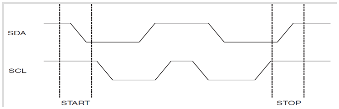
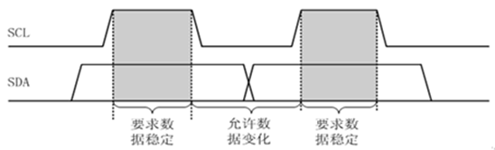
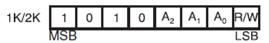
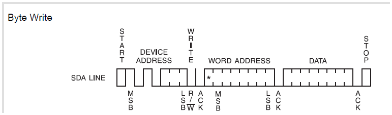
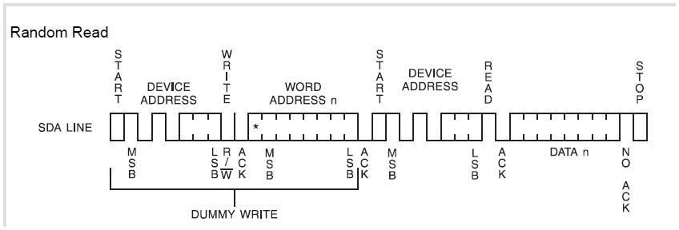

# I²C协议

&#8195;&#8195;`IIC(Inter－Integrated Circuit)`总线是一种由PHILIPS公司开发的两线式串行总线，用于连接微控制器及其外围设备。它是由数据线`SDA`和时钟`SCL`构成的串行总线，可发送和接收数据。
&#8195;&#8195;I2C总线在传送数据过程中共有三种类型信号，它们分别是：开始信号、结束信号和应答
信号。

1. 开始信号：`SCL`为高电平时，`SDA`由高电平向低电平跳变，开始传送数据。
2. 结束信号：`SCL`为高电平时，`SDA`由低电平向高电平跳变，结束传送数据。



3. 应答信号：发送器每发送一个字节，就在时钟脉冲9期间释放数据线，由接收器反馈一个应答信号。应答信号为低电平时，规定为有效应答位，`ACK`简称应答位，表示接收器已经成功地接收了该字节；应答信号为高电平时，规定为非应答位`NACK`，一般表示接收器接收该字节没有成功。
对于反馈有效应答位`ACK`的要求是，接收器在第9个时钟脉冲之前的低电平期间将`SDA`线拉低，并且确保在该时钟的高电平期间为稳定的低电平。如果接收器是主控器，则在它收到最后一个字节后，发送一个`NACK`信号，以通知被控发送器结束数据发送，并释放`SDA`线，以便主控接收器发送一个停止信号P。

&#8195;&#8195;这些信号中，起始信号是必需的，结束信号和应答信号，都可以不要。

&#8195;&#8195;I2C总线进行数据传送时，时钟信号为高电平期间，数据线上的数据必须保持稳定，只有在时钟线上的信号为低电平期间，数据线上的高电平或低电平状态才允许变化



# I²C驱动

&#8195;&#8195;`EEPROM(24C02)`读写指令如下图，开发板上`A[2-0]`接地，故写指令是`0xA0`，读指令是`0xA1`。



&#8195;&#8195;`24C02`写时序如下图所示：



&#8195;&#8195;`24C02`读时序如下图所示：



**参考：正点原子STM32F1开发指南-库函数版本_V3.3、STM32中文参考手册_V10**

---

示例：

```
/*	
 *	本实验通过KEY1按键来控制24C02的写入，通过另外一个按键KEY0来控制24C02的读取。
 */

#include "stm32f10x.h"
#define BITBAND(addr, bitnum) ((addr & 0xF0000000)+0x2000000+((addr &0xFFFFF)<<5)+(bitnum<<2)) 
#define MEM_ADDR(addr)  *((volatile unsigned long  *)(addr)) 
#define BIT_ADDR(addr, bitnum)   MEM_ADDR(BITBAND(addr, bitnum)) 
#define GPIOA_ODR_Addr    (GPIOA_BASE+12) //0x4001080C 
#define GPIOB_ODR_Addr    (GPIOB_BASE+12) //0x40010C0C 
#define GPIOE_ODR_Addr    (GPIOE_BASE+12) //0x4001180C 
#define GPIOA_IDR_Addr    (GPIOA_BASE+8) //0x40010808 
#define GPIOB_IDR_Addr    (GPIOB_BASE+8) //0x40010C08 
#define GPIOE_IDR_Addr    (GPIOE_BASE+8) //0x40011808 
#define PAout(n)   BIT_ADDR(GPIOA_ODR_Addr,n)  //输出 
#define PAin(n)    BIT_ADDR(GPIOA_IDR_Addr,n)  //输入 
#define PBout(n)   BIT_ADDR(GPIOB_ODR_Addr,n)  //输出 
#define PBin(n)    BIT_ADDR(GPIOB_IDR_Addr,n)  //输入 
#define PEout(n)   BIT_ADDR(GPIOE_ODR_Addr,n)  //输出 
#define PEin(n)    BIT_ADDR(GPIOE_IDR_Addr,n)  //输入
#define LED0 PBout(5)// PB5
#define LED1 PEout(5)// PE5	
#define KEY0 PEin(4)   	//PE4
#define KEY1 PEin(3)	//PE3 
#define KEY2 PEin(2)	//PE2
#define WK_UP PAin(0)	//PA0  WK_UP
#define KEY0_PRES 	1	//KEY0按下
#define KEY1_PRES	2	//KEY1按下
#define KEY2_PRES	3	//KEY2按下
#define WKUP_PRES   4	//KEY_UP按下(即WK_UP/KEY_UP)
//IO方向设置
#define SDA_IN()  {GPIOB->CRL&=0X0FFFFFFF;GPIOB->CRL|=(u32)8<<28;}
#define SDA_OUT() {GPIOB->CRL&=0X0FFFFFFF;GPIOB->CRL|=(u32)3<<28;}
//IO操作函数	 
#define IIC_SCL    PBout(6) //SCL
#define IIC_SDA    PBout(7) //SDA	 
#define READ_SDA   PBin(7)  //输入SDA 

u8  fac_us=0;							//us延时倍乘数	
u16 fac_ms=0;							//ms延时倍乘数,在ucos下,代表每个节拍的ms数
//初始化延迟函数
//当使用OS的时候,此函数会初始化OS的时钟节拍
//SYSTICK的时钟固定为HCLK时钟的1/8
//SYSCLK:系统时钟
void delay_init()
{
	SysTick_CLKSourceConfig(SysTick_CLKSource_HCLK_Div8);	//选择外部时钟  HCLK/8
	fac_us=SystemCoreClock/8000000;				//为系统时钟的1/8 
	fac_ms=(u16)fac_us*1000;					//非OS下,代表每个ms需要的systick时钟数   	
}	

//延时nus
//nus为要延时的us数.		    								   
void delay_us(u32 nus)
{		
	u32 temp;	    	 
	SysTick->LOAD=nus*fac_us; 					//时间加载	  		 
	SysTick->VAL=0x00;        					//清空计数器
	SysTick->CTRL|=SysTick_CTRL_ENABLE_Msk ;	//开始倒数	  
	do
	{
		temp=SysTick->CTRL;
	}while((temp&0x01)&&!(temp&(1<<16)));		//等待时间到达   
	SysTick->CTRL&=~SysTick_CTRL_ENABLE_Msk;	//关闭计数器
	SysTick->VAL =0X00;      					 //清空计数器	 
}

//延时nms
//注意nms的范围
//SysTick->LOAD为24位寄存器,所以,最大延时为:
//nms<=0xffffff*8*1000/SYSCLK
//SYSCLK单位为Hz,nms单位为ms
//对72M条件下,nms<=1864 
void delay_ms(u16 nms)
{	 		  	  
	u32 temp;		   
	SysTick->LOAD=(u32)nms*fac_ms;				//时间加载(SysTick->LOAD为24bit)
	SysTick->VAL =0x00;							//清空计数器
	SysTick->CTRL|=SysTick_CTRL_ENABLE_Msk ;	//开始倒数  
	do
	{
		temp=SysTick->CTRL;
	}while((temp&0x01)&&!(temp&(1<<16)));		//等待时间到达   
	SysTick->CTRL&=~SysTick_CTRL_ENABLE_Msk;	//关闭计数器
	SysTick->VAL =0X00;       					//清空计数器	  	    
} 

void LED_Init(void)
{
 
 GPIO_InitTypeDef  GPIO_InitStructure;
 	
 RCC_APB2PeriphClockCmd(RCC_APB2Periph_GPIOB|RCC_APB2Periph_GPIOE, ENABLE);	 //使能PB,PE端口时钟
	
 GPIO_InitStructure.GPIO_Pin = GPIO_Pin_5;				 //LED0-->PB.5 端口配置
 GPIO_InitStructure.GPIO_Mode = GPIO_Mode_Out_PP; 		 //推挽输出
 GPIO_InitStructure.GPIO_Speed = GPIO_Speed_50MHz;		 //IO口速度为50MHz
 GPIO_Init(GPIOB, &GPIO_InitStructure);					 //根据设定参数初始化GPIOB.5
 GPIO_SetBits(GPIOB,GPIO_Pin_5);						 //PB.5 输出高

 GPIO_InitStructure.GPIO_Pin = GPIO_Pin_5;	    		 //LED1-->PE.5 端口配置, 推挽输出
 GPIO_Init(GPIOE, &GPIO_InitStructure);	  				 //推挽输出 ，IO口速度为50MHz
 GPIO_SetBits(GPIOE,GPIO_Pin_5); 						 //PE.5 输出高 
}

//按键初始化函数
void KEY_Init(void) //IO初始化
{ 
 	GPIO_InitTypeDef GPIO_InitStructure;
 
 	RCC_APB2PeriphClockCmd(RCC_APB2Periph_GPIOA|RCC_APB2Periph_GPIOE,ENABLE);//使能PORTA,PORTE时钟

	GPIO_InitStructure.GPIO_Pin  = GPIO_Pin_2|GPIO_Pin_3|GPIO_Pin_4;//KEY0-KEY2
	GPIO_InitStructure.GPIO_Mode = GPIO_Mode_IPU; //设置成上拉输入
 	GPIO_Init(GPIOE, &GPIO_InitStructure);//初始化GPIOE2,3,4

	//初始化 WK_UP-->GPIOA.0	  下拉输入
	GPIO_InitStructure.GPIO_Pin  = GPIO_Pin_0;
	GPIO_InitStructure.GPIO_Mode = GPIO_Mode_IPD; //PA0设置成输入，默认下拉	  
	GPIO_Init(GPIOA, &GPIO_InitStructure);//初始化GPIOA.0

}
//按键处理函数
//返回按键值
//mode:0,不支持连续按;1,支持连续按;
//0，没有任何按键按下
//1，KEY0按下
//2，KEY1按下
//3，KEY2按下 
//4，KEY3按下 WK_UP
//注意此函数有响应优先级,KEY0>KEY1>KEY2>KEY3!!
u8 KEY_Scan(u8 mode)
{	 
	static u8 key_up=1;//按键按松开标志
	if(mode)key_up=1;  //支持连按		  
	if(key_up&&(KEY0==0||KEY1==0||KEY2==0||WK_UP==1))
	{
		delay_ms(10);//去抖动 
		key_up=0;
		if(KEY0==0)return KEY0_PRES;
		else if(KEY1==0)return KEY1_PRES;
		else if(KEY2==0)return KEY2_PRES;
		else if(WK_UP==1)return WKUP_PRES;
	}else if(KEY0==1&&KEY1==1&&KEY2==1&&WK_UP==0)key_up=1; 	    
 	return 0;// 无按键按下
}

//初始化IIC
void IIC_Init(void)
{					     
	GPIO_InitTypeDef GPIO_InitStructure;
	RCC_APB2PeriphClockCmd(	RCC_APB2Periph_GPIOB, ENABLE );	//使能GPIOB时钟
	   
	GPIO_InitStructure.GPIO_Pin = GPIO_Pin_6|GPIO_Pin_7;
	GPIO_InitStructure.GPIO_Mode = GPIO_Mode_Out_PP ;   //推挽输出
	GPIO_InitStructure.GPIO_Speed = GPIO_Speed_50MHz;
	GPIO_Init(GPIOB, &GPIO_InitStructure);
	GPIO_SetBits(GPIOB,GPIO_Pin_6|GPIO_Pin_7); 	//PB6,PB7 输出高
}

//产生IIC起始信号
void IIC_Start(void)
{
	SDA_OUT();     //sda线输出
	IIC_SDA=1;	  	  
	IIC_SCL=1;
	delay_us(4);
 	IIC_SDA=0;//START:when CLK is high,DATA change form high to low 
	delay_us(4);
	IIC_SCL=0;//钳住I2C总线，准备发送或接收数据 
}

//产生IIC停止信号
void IIC_Stop(void)
{
	SDA_OUT();//sda线输出
	IIC_SCL=0;
	IIC_SDA=0;//STOP:when CLK is high DATA change form low to high
 	delay_us(4);
	IIC_SCL=1; 
	delay_us(4);	
	IIC_SDA=1;//发送I2C总线结束信号						   	
}

//等待应答信号到来
//返回值：1，接收应答失败
//        0，接收应答成功
u8 IIC_Wait_Ack(void)
{
	u8 ucErrTime=0;
	SDA_IN();      //SDA设置为输入  
	IIC_SDA=1;delay_us(1);	   
	IIC_SCL=1;delay_us(1);	 
	while(READ_SDA)
	{
		ucErrTime++;
		if(ucErrTime>250)
		{
			IIC_Stop();
			return 1;
		}
	}
	IIC_SCL=0;//时钟输出0 	   
	return 0;  
} 
//产生ACK应答
void IIC_Ack(void)
{
	IIC_SCL=0;
	SDA_OUT();
	IIC_SDA=0;
	delay_us(2);
	IIC_SCL=1;
	delay_us(2);
	IIC_SCL=0;
}
//不产生ACK应答		    
void IIC_NAck(void)
{
	IIC_SCL=0;
	SDA_OUT();
	IIC_SDA=1;
	delay_us(2);
	IIC_SCL=1;
	delay_us(2);
	IIC_SCL=0;
}

//IIC发送一个字节
//返回从机有无应答
//1，有应答
//0，无应答			  
void IIC_Send_Byte(u8 txd)
{                        
    u8 t;   
	SDA_OUT(); 	    
    IIC_SCL=0;//拉低时钟开始数据传输
    for(t=0;t<8;t++)
    {              
        //IIC_SDA=(txd&0x80)>>7;
		if((txd&0x80)>>7)
			IIC_SDA=1;
		else
			IIC_SDA=0;
		txd<<=1; 	  
		delay_us(2);   //对TEA5767这三个延时都是必须的
		IIC_SCL=1;
		delay_us(2); 
		IIC_SCL=0;	
		delay_us(2);
    }	 
} 	    
//读1个字节，ack=1时，发送ACK，ack=0，发送nACK   
u8 IIC_Read_Byte(unsigned char ack)
{
	unsigned char i,receive=0;
	SDA_IN();//SDA设置为输入
    for(i=0;i<8;i++ )
	{
        IIC_SCL=0; 
        delay_us(2);
		IIC_SCL=1;
        receive<<=1;
        if(READ_SDA)receive++;   
		delay_us(1); 
    }					 
    if (!ack)
        IIC_NAck();//发送nACK
    else
        IIC_Ack(); //发送ACK   
    return receive;
}

//在AT24CXX指定地址读出一个数据
//ReadAddr:开始读数的地址  
//返回值  :读到的数据
u8 AT24CXX_ReadOneByte(u16 ReadAddr)
{				  
	u8 temp=0;		  	    																 
    IIC_Start();  
	IIC_Send_Byte(0XA0+((ReadAddr/256)<<1));   //发送器件地址0XA0,写数据 	 

	IIC_Wait_Ack(); 
    IIC_Send_Byte(ReadAddr%256);   //发送低地址
	IIC_Wait_Ack();	    
	IIC_Start();  	 	   
	IIC_Send_Byte(0XA1);           //进入接收模式			   
	IIC_Wait_Ack();	 
    temp=IIC_Read_Byte(0);		   
    IIC_Stop();//产生	    
	return temp;
}
//在AT24CXX指定地址写入一个数据
//WriteAddr  :写入数据的目的地址    
//DataToWrite:要写入的数据
void AT24CXX_WriteOneByte(u16 WriteAddr,u8 DataToWrite)
{				   	  	    																 
    IIC_Start();  
	IIC_Send_Byte(0XA0+((WriteAddr/256)<<1));   //发送器件地址0XA0,写数据 	 
	IIC_Wait_Ack();	   
    IIC_Send_Byte(WriteAddr%256);   //发送低地址
	IIC_Wait_Ack(); 	 										  		   
	IIC_Send_Byte(DataToWrite);     //发送字节							   
	IIC_Wait_Ack();  		    	   
    IIC_Stop();//产生一个停止条件 
	delay_ms(10);	 
}

//在AT24CXX里面的指定地址开始读出指定个数的数据
//ReadAddr :开始读出的地址 对24c02为0~255
//pBuffer  :数据数组首地址
//NumToRead:要读出数据的个数
void AT24CXX_Read(u16 ReadAddr,u8 *pBuffer,u16 NumToRead)
{
	while(NumToRead)
	{
		*pBuffer++=AT24CXX_ReadOneByte(ReadAddr++);	
		NumToRead--;
	}
}  
//在AT24CXX里面的指定地址开始写入指定个数的数据
//WriteAddr :开始写入的地址 对24c02为0~255
//pBuffer   :数据数组首地址
//NumToWrite:要写入数据的个数
void AT24CXX_Write(u16 WriteAddr,u8 *pBuffer,u16 NumToWrite)
{
	while(NumToWrite--)
	{
		AT24CXX_WriteOneByte(WriteAddr,*pBuffer);
		WriteAddr++;
		pBuffer++;
	}
}

//检查AT24CXX是否正常
//这里用了24XX的最后一个地址(255)来存储标志字.
//如果用其他24C系列,这个地址要修改
//返回1:检测失败
//返回0:检测成功
u8 AT24CXX_Check(void)
{
	u8 temp;
	temp=AT24CXX_ReadOneByte(255);//避免每次开机都写AT24CXX			   
	if(temp==0X55)return 0;		   
	else//排除第一次初始化的情况
	{
		AT24CXX_WriteOneByte(255,0X55);
	    temp=AT24CXX_ReadOneByte(255);	  
		if(temp==0X55)return 0;
	}
	return 1;											  
}

//要写入到24c02的字符串数组
const u8 TEXT_Buffer[]={"WarShipSTM32 IIC TEST"};
#define SIZE sizeof(TEXT_Buffer)
int main()
{
	u8 key;
	u16 i=0;
	u8 datatemp[SIZE];
	delay_init();	    	 //延时函数初始化	  
	LED_Init();		  		//初始化与LED连接的硬件接口	
	KEY_Init();				//按键初始化
	IIC_Init();
	while(AT24CXX_Check())//检测不到24c02
	{
		delay_ms(500);
		delay_ms(500);
		LED0=!LED0;//DS0闪烁
	}
	while(1)
	{
		key=KEY_Scan(0);
		if(key==KEY1_PRES)//KEY_UP按下,写入24C02
		{
			AT24CXX_Write(0,(u8*)TEXT_Buffer,SIZE);
		}
		if(key==KEY0_PRES)//KEY1按下,读取字符串并显示
		{
			AT24CXX_Read(0,datatemp,SIZE);
		}
		i++;
		delay_ms(10);
		if(i==20)
		{
			LED1=!LED1;//提示系统正在运行	
			i=0;
		}		   
	}
}
```

