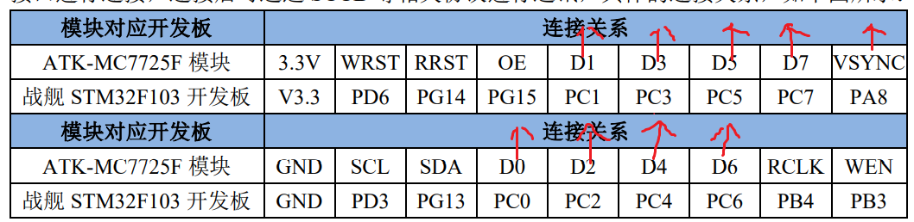
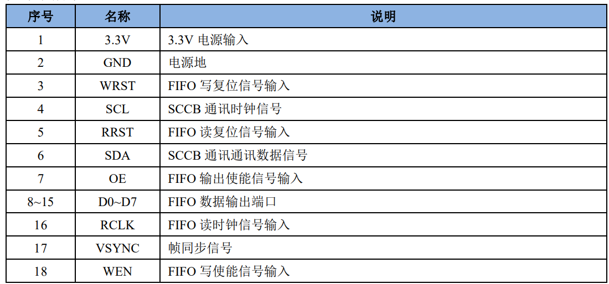
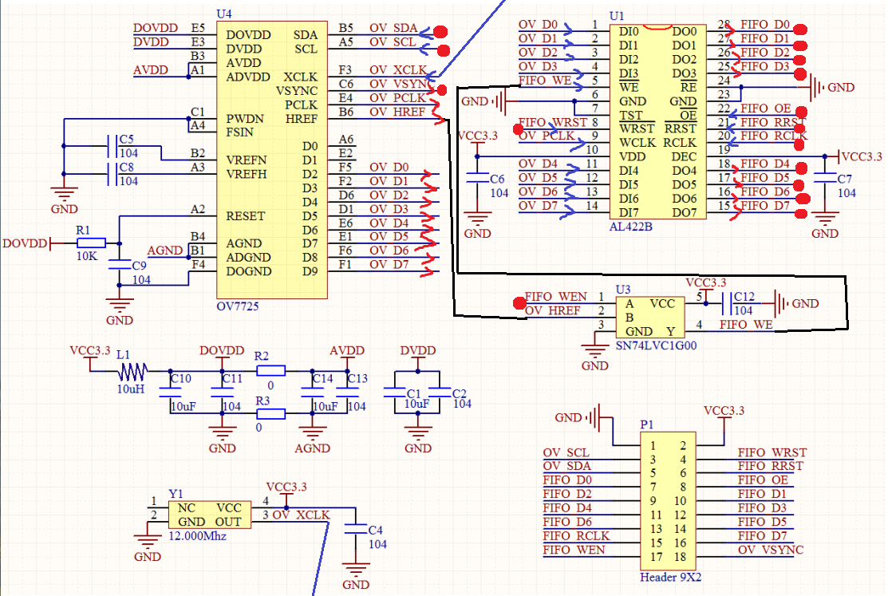
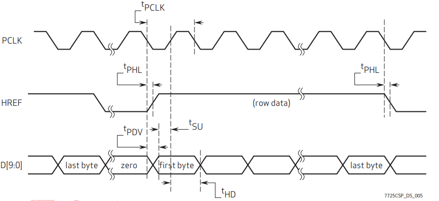
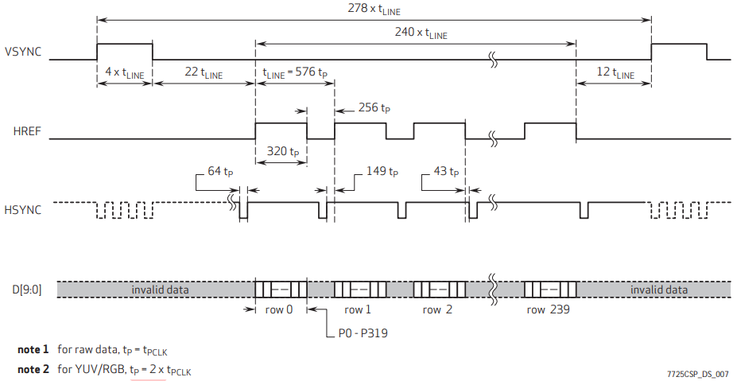
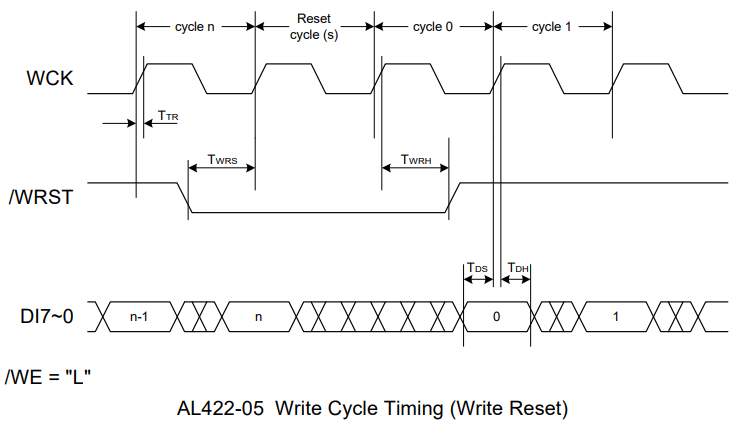
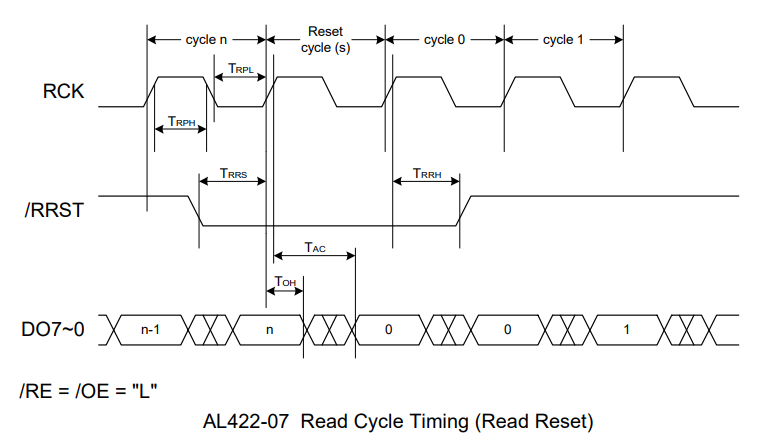

开发板把`OV7725`芯片采集到的图像显示到LCD屏的过程分为三步：**OV7725输出、FIFO输入、FIFO输出**。下面是模块的原理图，主要有`OV7725`芯片、`AL422B` FIFO芯片和一个`SN74VC1G00` 逻辑门芯片，图中红点是直接和STM32芯片连接的引脚，其它引脚是内部引脚。



# OV7725 图像数据输出

&#8195;&#8195;`OV7725`芯片配置各种寄存器通过`SCCB`标准实现，这种标准和`I²C`类似，只用到`SCL`和`SDA`两条线。

&#8195;&#8195;`OV7725`有两种输出模式：VGA(640 * 480)和QVGA(320 * 240)，下面分别是`OV7725`输出一行和QVGA模式输出一帧颜色数据的写时序，一行的时序可以理解为是一帧时序的一部分。





&#8195;&#8195;仔细分析上图。输出时序需要用到引脚`XCLK`、`PCLK`、`HREF`、`VSYNC`和数据线，`XCLK`是24MHz的输入时钟，`PCLK`是输出数据的时钟，`HREF`只在输出有效数据时为高，`VSYNC`在输出完一帧图像后拉高片刻。可以理解为：在`PCLK`时钟同步下，每输出完一行图像数据`HREF`置低片刻，每输出完一帧图像数据`VSYNC`置高片刻。以上信号被稍微处理后通过`PCLK`、`HREF`和数据线传给`AL422B`芯片。

# AL422B 存储图像数据

&#8195;&#8195;`AL422B`现在有了写时钟`WCK`即`OV7725`的输出时钟`PCLK`、数据线，然而数据的时序和自己的写时序并不匹配，它现在要做的就是想办法接受得到的数据。`AL422B`重置并写数据的时序如下图。`AL422B`存储图像要用到的引脚为`WE`、`WRST`、`WCLK`和数据线。



&#8195;&#8195;可见`AL422B`每次需要**连续的一帧**数据，考虑到`VSYNC`信号每帧出现一次，且`HREF`信号只在`OV7725`输出有效信号时置低，因此可以利用`VSYNC`创建外部中断，每帧前发生中断，在中断里控制`WRST`信号开始接收数据，并且`WE`全程被程序和`HREF`同时控制，实现方法为一个`C=!A+!B`即`SN74VC1G00`的逻辑门，只有在程序把`FIFO_WEN`置高并且`OV7725`在输出有效数据时WE才被置低，`AL422B`才继续接收数据。

&#8195;&#8195;中断代码如下。

```
void EXTI9_5_IRQHandler( void )
{
   if ( EXTI_GetITStatus( EXTI_Line8 ) == SET )    /* 是8线的中断 */
   {
      if ( ov_sta == 0 )
      {
         OV7725_WRST    = 0;            /* 复位写指针 */
         OV7725_WRST    = 1;
         OV7725_WREN    = 1;            /* 允许写入FIFO */
         ov_sta++;                       /* 帧中断加1 */
      }else OV7725_WREN = 0;                  /* 禁止写入FIFO */
   }
   EXTI_ClearITPendingBit( EXTI_Line8 );           /* 清除EXTI8线路挂起位 */
}
```

# AL422B 图像数据输出

&#8195;&#8195`;AL433B`图像数据输出只用遵循输出时序读取即可，重置并读数据的时序如下图。用到的引脚为`OE`、`RE`、`RRST`、`RCLK`和数据线，`RE`和`OE`已被物理和程序上拉低。



&#8195;&#8195;分析时序，得到把颜色数据显示到LCD屏上的代码如下。

```
u8 ov_sta;                                                                                                                            
/* 更新LCD显示(OV7725) */
void OV7725_camera_refresh( void )
{
	u32	i, j;
	u16	color;
	if ( ov_sta )     /* 有帧中断更新 */
	{
		LCD_WriteRAM_Prepare();     /* 开始写入GRAM */
		OV7725_RRST = 0;     /* 开始复位读指针 */
		OV7725_RCK_L;
        OV7725_RCK_H;
        OV7725_RCK_L;
        OV7725_RRST = 1;
        OV7725_RCK_H;
		OV7725_RCK_L;
        /* 复位读指针结束 */
		for ( i = 0; i < OV7725_WINDOW_HEIGHT; i++ )
		{
			for ( j = 0; j < OV7725_WINDOW_WIDTH; j++ )
			{
				color = GPIOC->IDR & 0XFF;    /* 读数据 */
				OV7725_RCK_H;
				color <<= 8;
				OV7725_RCK_L;
				color |= GPIOC->IDR & 0XFF;  /* 读数据 */
				OV7725_RCK_H;
				LCD->LCD_RAM = color;
                OV7725_RCK_L;
			}
		}
		ov_sta = 0;    /* 清零帧中断标记 */                             
	}
}
```

**参考：正点原子AN1704 ALIENTEK 摄像头模块使用、OV7725_datasheet、AL422B_datasheet。**

---
示例：

```
/* 代码会把摄像头采集到的图像显示到TFLCD上 */

#include "stm32f10x.h"
#define BITBAND( addr, bitnum )		( (addr & 0xF0000000) + 0x2000000 + ( (addr & 0xFFFFF) << 5) + (bitnum << 2) )
#define MEM_ADDR( addr )		*( (volatile unsigned long *) (addr) )
#define BIT_ADDR( addr, bitnum )	MEM_ADDR( BITBAND( addr, bitnum ) )
#define GPIOB_ODR_Addr	(GPIOB_BASE + 12)               /* 0x40010C0C */
#define GPIOE_ODR_Addr	(GPIOE_BASE + 12)               /* 0x4001180C */
#define GPIOG_ODR_Addr	(GPIOG_BASE + 12)               /* 0x40011E0C */
#define GPIOD_ODR_Addr	(GPIOD_BASE + 12)               /* 0x4001140C */
#define GPIOG_IDR_Addr	(GPIOG_BASE + 8)                /* 0x40011E08 */
#define PBout( n )	BIT_ADDR( GPIOB_ODR_Addr, n )   /* 输出 */
#define PDout( n )	BIT_ADDR( GPIOD_ODR_Addr, n )
#define PGout( n )	BIT_ADDR( GPIOG_ODR_Addr, n )
#define PGin( n )	BIT_ADDR( GPIOG_IDR_Addr, n )
/* IO操作函数 */
#define LCD_LED		PBout( 0 )                      /* LCD背光  PB0 */
#define SCCB_SCL	PDout( 3 )                      /* SCL */
#define SCCB_SDA	PGout( 13 )                     /* SDA */
#define SCCB_READ_SDA	PGin( 13 )                      /* 输入SDA */

#define LCD_BASE	( (u32) (0x6C000000 | 0x000007FE) )
#define LCD		( (LCD_TypeDef *) LCD_BASE)

#define SCCB_SDA_IN()	{ GPIOG->CRH &= 0XFF0FFFFF; GPIOG->CRH |= 0X00800000; }
#define SCCB_SDA_OUT()	{ GPIOG->CRH &= 0XFF0FFFFF; GPIOG->CRH |= 0X00300000; }
#define SCCB_ID 0X42                                                    /* OV7670的ID */

#define  OV7725 1

/*
 * 由于OV7725传感器安装方式原因,OV7725_WINDOW_WIDTH相当于LCD的高度，OV7725_WINDOW_HEIGHT相当于LCD的宽度
 * 注意：此宏定义只对OV7725有效
 */
#define OV7725_WINDOW_WIDTH	320                                     /* <=320 */
#define OV7725_WINDOW_HEIGHT	240                                     /* <=240 */
#define OV7725_MID		0X7FA2
#define OV7725_PID		0X7721
#define OV7725_VSYNC		PAin( 8 )                               /* 同步信号检测IO */
#define OV7725_WRST		PDout( 6 )                              /* 写指针复位 */
#define OV7725_WREN		PBout( 3 )                              /* 写入FIFO使能 */
#define OV7725_RCK_H		GPIOB->BSRR	= 1 << 4                /* 设置读数据时钟高电平 */
#define OV7725_RCK_L		GPIOB->BRR	= 1 << 4                /* 设置读数据时钟低电平 */
#define OV7725_RRST		PGout( 14 )                             /* 读指针复位 */
#define OV7725_CS		PGout( 15 )                             /* 片选信号(OE) */
#define OV7725_DATA		GPIO_ReadInputData( GPIOC, 0x00FF )     /* 数据输入端口 */

/* 扫描方向定义 */
#define L2R_U2D		0                                               /* 从左到右,从上到下 */
#define L2R_D2U		1                                               /* 从左到右,从下到上 */
#define R2L_U2D		2                                               /* 从右到左,从上到下 */
#define R2L_D2U		3                                               /* 从右到左,从下到上 */
#define U2D_L2R		4                                               /* 从上到下,从左到右 */
#define U2D_R2L		5                                               /* 从上到下,从右到左 */
#define D2U_L2R		6                                               /* 从下到上,从左到右 */
#define D2U_R2L		7                                               /* 从下到上,从右到左 */
#define DFT_SCAN_DIR	L2R_U2D                                         /* 默认的扫描方向 */
/* 画笔颜色 */
#define WHITE	0xFFFF
#define BLACK	0x0000
#define BLUE	0x001F
#define BRED	0XF81F
#define GRED	0XFFE0
#define GBLUE	0X07FF
#define RED	0xF800
#define MAGENTA 0xF81F
#define GREEN	0x07E0
#define CYAN	0x7FFF
#define YELLOW	0xFFE0
#define BROWN	0XBC40                                          /* 棕色 */
#define BRRED	0XFC07                                          /* 棕红色 */
#define GRAY	0X8430                                          /* 灰色 */
/* GUI颜色 */
#define DARKBLUE	0X01CF                                  /* 深蓝色 */
#define LIGHTBLUE	0X7D7C                                  /* 浅蓝色 */
#define GRAYBLUE	0X5458                                  /* 灰蓝色 */
/* 以上三色为PANEL的颜色 */
#define LIGHTGREEN	0X841F                                  /* 浅绿色 */
#define LGRAY		0XC618                                  /* 浅灰色(PANNEL),窗体背景色 */
#define LGRAYBLUE	0XA651                                  /* 浅灰蓝色(中间层颜色) */
#define LBBLUE		0X2B12                                  /* 浅棕蓝色(选择条目的反色) */


u16		POINT_COLOR	= RED;
u16		BACK_COLOR	= WHITE;
static u8	fac_us		= 0;
static u16	fac_ms		= 0;
/* LCD地址结构体 */
typedef struct
{
    vu16	LCD_REG;
    vu16	LCD_RAM;
} LCD_TypeDef;
typedef struct
{
    u16	width;                                  /* LCD 宽度 */
    u16	height;                                 /* LCD 高度 */
    u8	dir;                                    /* 横屏还是竖屏控制：0，竖屏；1，横屏。 */
    u16	wramcmd;                                /* 开始写gram指令 */
    u16	setxcmd;                                /* 设置x坐标指令 */
    u16	setycmd;                                /* 设置y坐标指令 */
}_lcd_dev;
_lcd_dev lcddev;                                        /* 管理LCD重要参数 */


/* OV7725寄存器宏定义 */
#define GAIN		0x00
#define OV7725_BLUE	0x01
#define OV7725_RED	0x02
#define OV7725_GREEN	0x03
#define BAVG		0x05
#define GAVG		0x06
#define RAVG		0x07
#define AECH		0x08
#define COM2		0x09
#define PID		0x0A
#define VER		0x0B
#define COM3		0x0C
#define COM4		0x0D
#define COM5		0x0E
#define COM6		0x0F
#define AEC		0x10
#define CLKRC		0x11
#define COM7		0x12
#define COM8		0x13
#define COM9		0x14
#define COM10		0x15
#define REG16		0x16
#define HSTART		0x17
#define HSIZE		0x18
#define VSTRT		0x19
#define VSIZE		0x1A
#define PSHFT		0x1B
#define MIDH		0x1C
#define MIDL		0x1D
#define LAEC		0x1F
#define COM11		0x20
#define BDBase		0x22
#define BDMStep		0x23
#define AEW		0x24
#define AEB		0x25
#define VPT		0x26
#define REG28		0x28
#define HOutSize	0x29
#define EXHCH		0x2A
#define EXHCL		0x2B
#define VOutSize	0x2C
#define ADVFL		0x2D
#define ADVFH		0x2E
#define YAVE		0x2F
#define LumHTh		0x30
#define LumLTh		0x31
#define HREF		0x32
#define DM_LNL		0x33
#define DM_LNH		0x34
#define ADoff_B		0x35
#define ADoff_R		0x36
#define ADoff_Gb	0x37
#define ADoff_Gr	0x38
#define Off_B		0x39
#define Off_R		0x3A
#define Off_Gb		0x3B
#define Off_Gr		0x3C
#define COM12		0x3D
#define COM13		0x3E
#define COM14		0x3F
#define COM16		0x41
#define TGT_B		0x42
#define TGT_R		0x43
#define TGT_Gb		0x44
#define TGT_Gr		0x45
#define LC_CTR		0x46
#define LC_XC		0x47
#define LC_YC		0x48
#define LC_COEF		0x49
#define LC_RADI		0x4A
#define LC_COEFB	0x4B
#define LC_COEFR	0x4C
#define FixGain		0x4D
#define AREF1		0x4F
#define AREF6		0x54
#define UFix		0x60
#define VFix		0x61
#define AWBb_blk	0x62
#define AWB_Ctrl0	0x63
#define DSP_Ctrl1	0x64
#define DSP_Ctrl2	0x65
#define DSP_Ctrl3	0x66
#define DSP_Ctrl4	0x67
#define AWB_bias	0x68
#define AWBCtrl1	0x69
#define AWBCtrl2	0x6A
#define AWBCtrl3	0x6B
#define AWBCtrl4	0x6C
#define AWBCtrl5	0x6D
#define AWBCtrl6	0x6E
#define AWBCtrl7	0x6F
#define AWBCtrl8	0x70
#define AWBCtrl9	0x71
#define AWBCtrl10	0x72
#define AWBCtrl11	0x73
#define AWBCtrl12	0x74
#define AWBCtrl13	0x75
#define AWBCtrl14	0x76
#define AWBCtrl15	0x77
#define AWBCtrl16	0x78
#define AWBCtrl17	0x79
#define AWBCtrl18	0x7A
#define AWBCtrl19	0x7B
#define AWBCtrl20	0x7C
#define AWBCtrl21	0x7D
#define GAM1		0x7E
#define GAM2		0x7F
#define GAM3		0x80
#define GAM4		0x81
#define GAM5		0x82
#define GAM6		0x83
#define GAM7		0x84
#define GAM8		0x85
#define GAM9		0x86
#define GAM10		0x87
#define GAM11		0x88
#define GAM12		0x89
#define GAM13		0x8A
#define GAM14		0x8B
#define GAM15		0x8C
#define SLOP		0x8D
#define DNSTh		0x8E
#define EDGE0		0x8F
#define EDGE1		0x90
#define DNSOff		0x91
#define EDGE2		0x92
#define EDGE3		0x93
#define MTX1		0x94
#define MTX2		0x95
#define MTX3		0x96
#define MTX4		0x97
#define MTX5		0x98
#define MTX6		0x99
#define MTX_Ctrl	0x9A
#define BRIGHT		0x9B
#define CNST		0x9C
#define UVADJ0		0x9E
#define UVADJ1		0x9F
#define SCAL0		0xA0
#define SCAL1		0xA1
#define SCAL2		0xA2
#define SDE		0xA6
#define USAT		0xA7
#define VSAT		0xA8
#define HUECOS		0xA9
#define HUESIN		0xAA
#define SIGN		0xAB
#define DSPAuto		0xAC

/* 初始化寄存器序列及其对应的值 */
const u8 ov7725_init_reg_tb1[][2] =
        {
                /*输出窗口设置*/
                { CLKRC,     0x00 },    /* clock config */
                { COM7,	     0x06 },    /* VGA RGB565 */
                { HSTART,    0x3f },    /* 水平起始位置 */
                { HSIZE,     0x50 },    /* 水平尺寸 */
                { VSTRT,     0x03 },    /* 垂直起始位置 */
                { VSIZE,     0x78 },    /* 垂直尺寸 */
                { HREF,	     0x00 },
                { HOutSize,  0x50 },    /* 输出尺寸 */
                { VOutSize,  0x78 },    /* 输出尺寸 */

                /*DSP control*/
                { TGT_B,     0x7f },
                { FixGain,   0x09 },
                { AWB_Ctrl0, 0xe0 },
                { DSP_Ctrl1, 0xff },
                { DSP_Ctrl2, 0x00 },
                { DSP_Ctrl3, 0x00 },
                { DSP_Ctrl4, 0x00 },

                /*AGC AEC AWB*/
                { COM8,	     0xf0 },
                { COM4,	     0x81 }, /*Pll AEC CONFIG*/
                { COM6,	     0xc5 },
                { COM9,	     0x11 },
                { BDBase,    0x7F },
                { BDMStep,   0x03 },
                { AEW,	     0x40 },
                { AEB,	     0x30 },
                { VPT,	     0xa1 },
                { EXHCL,     0x9e },
                { AWBCtrl3,  0xaa },
                { COM8,	     0xff },

                /*matrix shapness brightness contrast*/
                { EDGE1,     0x08 },
                { DNSOff,    0x01 },
                { EDGE2,     0x03 },
                { EDGE3,     0x00 },
                { MTX1,	     0xb0 },
                { MTX2,	     0x9d },
                { MTX3,	     0x13 },
                { MTX4,	     0x16 },
                { MTX5,	     0x7b },
                { MTX6,	     0x91 },
                { MTX_Ctrl,  0x1e },
                { BRIGHT,    0x08 },
                { CNST,	     0x20 },
                { UVADJ0,    0x81 },
                { SDE,	     0X06 },
                { USAT,	     0x65 },
                { VSAT,	     0x65 },
                { HUECOS,    0X80 },
                { HUESIN,    0X80 },

                /*GAMMA config*/
                { GAM1,	     0x0c },
                { GAM2,	     0x16 },
                { GAM3,	     0x2a },
                { GAM4,	     0x4e },
                { GAM5,	     0x61 },
                { GAM6,	     0x6f },
                { GAM7,	     0x7b },
                { GAM8,	     0x86 },
                { GAM9,	     0x8e },
                { GAM10,     0x97 },
                { GAM11,     0xa4 },
                { GAM12,     0xaf },
                { GAM13,     0xc5 },
                { GAM14,     0xd7 },
                { GAM15,     0xe8 },
                { SLOP,	     0x20 },


                { COM3,	     0x50 },                                    /*Horizontal mirror image*/


                /*
                 * 注：datasheet默认0x10,即改变YUV为UVY格式。但是摄像头不是芯片而是模组时，
                 * 要将0X10中的1变成0，即设置YUV格式。
                 */
                /*night mode auto frame rate control*/
                { COM5,	     0xf5 },                                    /*在夜视环境下，自动降低帧率，保证低照度画面质量*/
                /* {COM5,		0x31},	/ *夜视环境帧率不变* / */
        };

void delay_init()
{
    SysTick_CLKSourceConfig( SysTick_CLKSource_HCLK_Div8 ); /*选择外部时钟  HCLK/8 */
    fac_us	= SystemCoreClock / 8000000;                    /* 为系统时钟的1/8 */
    fac_ms	= (u16) fac_us * 1000;
}


void delay_us( u32 nus )
{
    u32 temp;
    SysTick->LOAD	= nus * fac_us;                         /* 时间加载 */
    SysTick->VAL	= 0x00;                                 /* 清空计数器 */
    SysTick->CTRL	|= SysTick_CTRL_ENABLE_Msk;             /* 开始倒数 */
    do
    {
        temp = SysTick->CTRL;
    }
    while ( (temp & 0x01) && !(temp & (1 << 16) ) );        /* 等待时间到达 */
    SysTick->CTRL	&= ~SysTick_CTRL_ENABLE_Msk;            /* 关闭计数器 */
    SysTick->VAL	= 0X00;                                 /* 清空计数器 */
}


void delay_ms( u16 nms )
{
    u32 temp;
    SysTick->LOAD	= (u32) nms * fac_ms;                   /* 时间加载(SysTick->LOAD为24bit) */
    SysTick->VAL	= 0x00;                                 /* 清空计数器 */
    SysTick->CTRL	|= SysTick_CTRL_ENABLE_Msk;             /* 开始倒数 */
    do
    {
        temp = SysTick->CTRL;
    }
    while ( (temp & 0x01) && !(temp & (1 << 16) ) );        /* 等待时间到达 */
    SysTick->CTRL	&= ~SysTick_CTRL_ENABLE_Msk;            /* 关闭计数器 */
    SysTick->VAL	= 0X00;                                 /* 清空计数器 */
}


/*
 * 写寄存器函数
 * regval:寄存器值
 */
void LCD_WR_REG( u16 regval )
{
    LCD->LCD_REG = regval;                                  /* 写入要写的寄存器序号 */
}


/*
 * 写LCD数据
 * data:要写入的值
 */
void LCD_WR_DATA( u16 data )
{
    LCD->LCD_RAM = data;
}


/*
 * 读LCD数据
 * 返回值:读到的值
 */
u16 LCD_RD_DATA( void )
{
    vu16 ram; /* 防止被优化 */
    ram = LCD->LCD_RAM;
    return(ram);
}


/*
 * 写寄存器
 * LCD_Reg:寄存器地址
 * LCD_RegValue:要写入的数据
 */
void LCD_WriteReg( u16 LCD_Reg, u16 LCD_RegValue )
{
    LCD->LCD_REG	= LCD_Reg;      /* 写入要写的寄存器序号 */
    LCD->LCD_RAM	= LCD_RegValue; /* 写入数据 */
}


/*
 * 读寄存器
 * LCD_Reg:寄存器地址
 * 返回值:读到的数据
 */
u16 LCD_ReadReg( u16 LCD_Reg )
{
    LCD_WR_REG( LCD_Reg );          /* 写入要读的寄存器序号 */
    delay_us( 5 );
    return(LCD_RD_DATA() );         /* 返回读到的值 */
}


/* 开始写GRAM */
void LCD_WriteRAM_Prepare( void )
{
    LCD->LCD_REG = lcddev.wramcmd;
}


/*
 * LCD写GRAM
 * RGB_Code:颜色值
 */
void LCD_WriteRAM( u16 RGB_Code )
{
    LCD->LCD_RAM = RGB_Code; /* 写十六位GRAM */
}


void LCD_Scan_Dir( u8 dir )
{
    u16	regval	= 0;
    u16	dirreg	= 0;
    u16	temp;
    if ( lcddev.dir == 1 )
    {
        switch ( dir ) /* 方向转换 */
        {
            case 0: dir	= 6; break;
            case 1: dir	= 7; break;
            case 2: dir	= 4; break;
            case 3: dir	= 5; break;
            case 4: dir	= 1; break;
            case 5: dir	= 0; break;
            case 6: dir	= 3; break;
            case 7: dir	= 2; break;
        }
    }

    switch ( dir )
    {
        case L2R_U2D:                                   /* 从左到右,从上到下 */
            regval |= (0 << 7) | (0 << 6) | (0 << 5);
            break;
        case L2R_D2U:                                   /* 从左到右,从下到上 */
            regval |= (1 << 7) | (0 << 6) | (0 << 5);
            break;
        case R2L_U2D:                                   /* 从右到左,从上到下 */
            regval |= (0 << 7) | (1 << 6) | (0 << 5);
            break;
        case R2L_D2U:                                   /* 从右到左,从下到上 */
            regval |= (1 << 7) | (1 << 6) | (0 << 5);
            break;
        case U2D_L2R:                                   /* 从上到下,从左到右 */
            regval |= (0 << 7) | (0 << 6) | (1 << 5);
            break;
        case U2D_R2L:                                   /* 从上到下,从右到左 */
            regval |= (0 << 7) | (1 << 6) | (1 << 5);
            break;
        case D2U_L2R:                                   /* 从下到上,从左到右 */
            regval |= (1 << 7) | (0 << 6) | (1 << 5);
            break;
        case D2U_R2L:                                   /* 从下到上,从右到左 */
            regval |= (1 << 7) | (1 << 6) | (1 << 5);
            break;
    }
    dirreg	= 0X36;
    regval	|= 0X08;                                /* 5310/5510/1963不需要BGR */

    LCD_WriteReg( dirreg, regval );

    if ( regval & 0X20 )
    {
        if ( lcddev.width < lcddev.height )     /* 交换X,Y */
        {
            temp		= lcddev.width;
            lcddev.width	= lcddev.height;
            lcddev.height	= temp;
        }
    }else{
        if ( lcddev.width > lcddev.height )     /* 交换X,Y */
        {
            temp		= lcddev.width;
            lcddev.width	= lcddev.height;
            lcddev.height	= temp;
        }
    }
    LCD_WR_REG( lcddev.setxcmd );
    LCD_WR_DATA( 0 ); LCD_WR_DATA( 0 );
    LCD_WR_DATA( (lcddev.width - 1) >> 8 ); LCD_WR_DATA( (lcddev.width - 1) & 0XFF );
    LCD_WR_REG( lcddev.setycmd );
    LCD_WR_DATA( 0 ); LCD_WR_DATA( 0 );
    LCD_WR_DATA( (lcddev.height - 1) >> 8 ); LCD_WR_DATA( (lcddev.height - 1) & 0XFF );
}


void LCD_Display_Dir( u8 dir )
{
    if ( dir == 0 )                 /* 竖屏 */
    {
        lcddev.dir	= 0;    /* 竖屏 */
        lcddev.width	= 240;
        lcddev.height	= 320;
        lcddev.wramcmd	= 0X2C;
        lcddev.setxcmd	= 0X2A;
        lcddev.setycmd	= 0X2B;
    }else{                          /* 横屏 */
        lcddev.dir	= 1;    /* 横屏 */
        lcddev.width	= 320;
        lcddev.height	= 240;
        lcddev.wramcmd	= 0X2C;
        lcddev.setxcmd	= 0X2A;
        lcddev.setycmd	= 0X2B;
    }
}


/*
 * 设置光标位置
 * Xpos:横坐标
 * Ypos:纵坐标
 */
void LCD_SetCursor( u16 Xpos, u16 Ypos )
{
    LCD_WR_REG( lcddev.setxcmd );
    LCD_WR_DATA( Xpos >> 8 ); LCD_WR_DATA( Xpos & 0XFF );
    LCD_WR_REG( lcddev.setycmd );
    LCD_WR_DATA( Ypos >> 8 ); LCD_WR_DATA( Ypos & 0XFF );
}


/*
 * 清屏函数
 * color:要清屏的填充色
 */
void LCD_Clear( u16 color )
{
    u32	index		= 0;
    u32	totalpoint	= lcddev.width;
    totalpoint *= lcddev.height;    /* 得到总点数 */
    LCD_SetCursor( 0x00, 0x0000 );  /* 设置光标位置 */
    LCD_WriteRAM_Prepare();         /* 开始写入GRAM */
    for ( index = 0; index < totalpoint; index++ )
    {
        LCD->LCD_RAM = color;
    }
}


/*
 * 设置窗口,并自动设置画点坐标到窗口左上角(sx,sy).
 * sx,sy:窗口起始坐标(左上角)
 * width,height:窗口宽度和高度,必须大于0!!
 * 窗体大小:width*height.
 */
void LCD_Set_Window( u16 sx, u16 sy, u16 width, u16 height )
{
    u8	hsareg, heareg, vsareg, veareg;
    u16	hsaval, heaval, vsaval, veaval;
    u16	twidth, theight;
    twidth	= sx + width - 1;
    theight = sy + height - 1;
    LCD_WR_REG( lcddev.setxcmd );
    LCD_WR_DATA( sx >> 8 );
    LCD_WR_DATA( sx & 0XFF );
    LCD_WR_DATA( twidth >> 8 );
    LCD_WR_DATA( twidth & 0XFF );
    LCD_WR_REG( lcddev.setycmd );
    LCD_WR_DATA( sy >> 8 );
    LCD_WR_DATA( sy & 0XFF );
    LCD_WR_DATA( theight >> 8 );
    LCD_WR_DATA( theight & 0XFF );
}


void LCD_Init( void )
{
    GPIO_InitTypeDef		GPIO_InitStructure;
    FSMC_NORSRAMInitTypeDef		FSMC_NORSRAMInitStructure;
    FSMC_NORSRAMTimingInitTypeDef	readWriteTiming;
    FSMC_NORSRAMTimingInitTypeDef	writeTiming;

    RCC_AHBPeriphClockCmd( RCC_AHBPeriph_FSMC, ENABLE );                                                                                                            /* 使能FSMC时钟 */
    RCC_APB2PeriphClockCmd( RCC_APB2Periph_GPIOB | RCC_APB2Periph_GPIOD | RCC_APB2Periph_GPIOE | RCC_APB2Periph_GPIOG, ENABLE );                                    /* 使能PORTB,D,E,G以及AFIO复用功能时钟 */


    GPIO_InitStructure.GPIO_Pin	= GPIO_Pin_0;                                                                                                                   /* PB0 推挽输出 背光 */
    GPIO_InitStructure.GPIO_Mode	= GPIO_Mode_Out_PP;                                                                                                             /* 推挽输出 */
    GPIO_InitStructure.GPIO_Speed	= GPIO_Speed_50MHz;
    GPIO_Init( GPIOB, &GPIO_InitStructure );

    /* PORTD复用推挽输出 */
    GPIO_InitStructure.GPIO_Pin	= GPIO_Pin_0 | GPIO_Pin_1 | GPIO_Pin_4 | GPIO_Pin_5 | GPIO_Pin_8 | GPIO_Pin_9 | GPIO_Pin_10 | GPIO_Pin_14 | GPIO_Pin_15;        /*	//PORTD复用推挽输出 */
    GPIO_InitStructure.GPIO_Mode	= GPIO_Mode_AF_PP;                                                                                                              /*复用推挽输出 */
    GPIO_InitStructure.GPIO_Speed	= GPIO_Speed_50MHz;
    GPIO_Init( GPIOD, &GPIO_InitStructure );

    /* PORTE复用推挽输出 */
    GPIO_InitStructure.GPIO_Pin	= GPIO_Pin_7 | GPIO_Pin_8 | GPIO_Pin_9 | GPIO_Pin_10 | GPIO_Pin_11 | GPIO_Pin_12 | GPIO_Pin_13 | GPIO_Pin_14 | GPIO_Pin_15;     /*	//PORTD复用推挽输出 */
    GPIO_InitStructure.GPIO_Mode	= GPIO_Mode_AF_PP;                                                                                                              /*复用推挽输出 */
    GPIO_InitStructure.GPIO_Speed	= GPIO_Speed_50MHz;
    GPIO_Init( GPIOE, &GPIO_InitStructure );

    /*	//PORTG12复用推挽输出 A0 */
    GPIO_InitStructure.GPIO_Pin	= GPIO_Pin_0 | GPIO_Pin_12;                                                                                                     /*	//PORTD复用推挽输出 */
    GPIO_InitStructure.GPIO_Mode	= GPIO_Mode_AF_PP;                                                                                                              /*复用推挽输出 */
    GPIO_InitStructure.GPIO_Speed	= GPIO_Speed_50MHz;
    GPIO_Init( GPIOG, &GPIO_InitStructure );

    readWriteTiming.FSMC_AddressSetupTime		= 0x01;                                                                                                         /* 地址建立时间（ADDSET）为2个HCLK 1/36M=27ns */
    readWriteTiming.FSMC_AddressHoldTime		= 0x00;                                                                                                         /* 地址保持时间（ADDHLD）模式A未用到 */
    readWriteTiming.FSMC_DataSetupTime		= 0x0f;                                                                                                         /* 数据保存时间为16个HCLK,因为液晶驱动IC的读数据的时候，速度不能太快，尤其对1289这个IC。 */
    readWriteTiming.FSMC_BusTurnAroundDuration	= 0x00;
    readWriteTiming.FSMC_CLKDivision		= 0x00;
    readWriteTiming.FSMC_DataLatency		= 0x00;
    readWriteTiming.FSMC_AccessMode			= FSMC_AccessMode_A;                                                                                            /* 模式A */


    writeTiming.FSMC_AddressSetupTime	= 0x00;                                                                                                                 /* 地址建立时间（ADDSET）为1个HCLK */
    writeTiming.FSMC_AddressHoldTime	= 0x00;                                                                                                                 /* 地址保持时间（A */
    writeTiming.FSMC_DataSetupTime		= 0x03;                                                                                                                 /* //数据保存时间为4个HCLK */
    writeTiming.FSMC_BusTurnAroundDuration	= 0x00;
    writeTiming.FSMC_CLKDivision		= 0x00;
    writeTiming.FSMC_DataLatency		= 0x00;
    writeTiming.FSMC_AccessMode		= FSMC_AccessMode_A;                                                                                                    /* 模式A */


    FSMC_NORSRAMInitStructure.FSMC_Bank			= FSMC_Bank1_NORSRAM4;                                                                                  /*  这里我们使用NE4 ，也就对应BTCR[6],[7]。 */
    FSMC_NORSRAMInitStructure.FSMC_DataAddressMux		= FSMC_DataAddressMux_Disable;                                                                          /* 不复用数据地址 */
    FSMC_NORSRAMInitStructure.FSMC_MemoryType		= FSMC_MemoryType_SRAM;                                                                                 /* FSMC_MemoryType_SRAM;  //SRAM */
    FSMC_NORSRAMInitStructure.FSMC_MemoryDataWidth		= FSMC_MemoryDataWidth_16b;                                                                             /* 存储器数据宽度为16bit */
    FSMC_NORSRAMInitStructure.FSMC_BurstAccessMode		= FSMC_BurstAccessMode_Disable;                                                                         /* FSMC_BurstAccessMode_Disable; */
    FSMC_NORSRAMInitStructure.FSMC_WaitSignalPolarity	= FSMC_WaitSignalPolarity_Low;
    FSMC_NORSRAMInitStructure.FSMC_AsynchronousWait		= FSMC_AsynchronousWait_Disable;
    FSMC_NORSRAMInitStructure.FSMC_WrapMode			= FSMC_WrapMode_Disable;
    FSMC_NORSRAMInitStructure.FSMC_WaitSignalActive		= FSMC_WaitSignalActive_BeforeWaitState;
    FSMC_NORSRAMInitStructure.FSMC_WriteOperation		= FSMC_WriteOperation_Enable;                                                                           /*  存储器写使能 */
    FSMC_NORSRAMInitStructure.FSMC_WaitSignal		= FSMC_WaitSignal_Disable;
    FSMC_NORSRAMInitStructure.FSMC_ExtendedMode		= FSMC_ExtendedMode_Enable;                                                                             /* 读写使用不同的时序 */
    FSMC_NORSRAMInitStructure.FSMC_WriteBurst		= FSMC_WriteBurst_Disable;
    FSMC_NORSRAMInitStructure.FSMC_ReadWriteTimingStruct	= &readWriteTiming;                                                                                     /* 读写时序 */
    FSMC_NORSRAMInitStructure.FSMC_WriteTimingStruct	= &writeTiming;                                                                                         /* 写时序 */

    FSMC_NORSRAMInit( &FSMC_NORSRAMInitStructure );                                                                                                                 /* 初始化FSMC配置 */

    FSMC_NORSRAMCmd( FSMC_Bank1_NORSRAM4, ENABLE );                                                                                                                 /* 使能BANK1 */

    LCD_WR_REG( 0xCF );
    LCD_WR_DATA( 0x00 );
    LCD_WR_DATA( 0xC1 );
    LCD_WR_DATA( 0X30 );
    LCD_WR_REG( 0xED );
    LCD_WR_DATA( 0x64 );
    LCD_WR_DATA( 0x03 );
    LCD_WR_DATA( 0X12 );
    LCD_WR_DATA( 0X81 );
    LCD_WR_REG( 0xE8 );
    LCD_WR_DATA( 0x85 );
    LCD_WR_DATA( 0x10 );
    LCD_WR_DATA( 0x7A );
    LCD_WR_REG( 0xCB );
    LCD_WR_DATA( 0x39 );
    LCD_WR_DATA( 0x2C );
    LCD_WR_DATA( 0x00 );
    LCD_WR_DATA( 0x34 );
    LCD_WR_DATA( 0x02 );
    LCD_WR_REG( 0xF7 );
    LCD_WR_DATA( 0x20 );
    LCD_WR_REG( 0xEA );
    LCD_WR_DATA( 0x00 );
    LCD_WR_DATA( 0x00 );
    LCD_WR_REG( 0xC0 );     /* Power control */
    LCD_WR_DATA( 0x1B );    /* VRH[5:0] */
    LCD_WR_REG( 0xC1 );     /* Power control */
    LCD_WR_DATA( 0x01 );    /* SAP[2:0];BT[3:0] */
    LCD_WR_REG( 0xC5 );     /* VCM control */
    LCD_WR_DATA( 0x30 );    /* 3F */
    LCD_WR_DATA( 0x30 );    /* 3C */
    LCD_WR_REG( 0xC7 );     /* VCM control2 */
    LCD_WR_DATA( 0XB7 );
    LCD_WR_REG( 0x36 );     /* Memory Access Control */
    LCD_WR_DATA( 0x48 );
    LCD_WR_REG( 0x3A );
    LCD_WR_DATA( 0x55 );
    LCD_WR_REG( 0xB1 );
    LCD_WR_DATA( 0x00 );
    LCD_WR_DATA( 0x1A );
    LCD_WR_REG( 0xB6 );     /* Display Function Control */
    LCD_WR_DATA( 0x0A );
    LCD_WR_DATA( 0xA2 );
    LCD_WR_REG( 0xF2 );     /* 3Gamma Function Disable */
    LCD_WR_DATA( 0x00 );
    LCD_WR_REG( 0x26 );     /* Gamma curve selected */
    LCD_WR_DATA( 0x01 );
    LCD_WR_REG( 0xE0 );     /* Set Gamma */
    LCD_WR_DATA( 0x0F );
    LCD_WR_DATA( 0x2A );
    LCD_WR_DATA( 0x28 );
    LCD_WR_DATA( 0x08 );
    LCD_WR_DATA( 0x0E );
    LCD_WR_DATA( 0x08 );
    LCD_WR_DATA( 0x54 );
    LCD_WR_DATA( 0XA9 );
    LCD_WR_DATA( 0x43 );
    LCD_WR_DATA( 0x0A );
    LCD_WR_DATA( 0x0F );
    LCD_WR_DATA( 0x00 );
    LCD_WR_DATA( 0x00 );
    LCD_WR_DATA( 0x00 );
    LCD_WR_DATA( 0x00 );
    LCD_WR_REG( 0XE1 ); /* Set Gamma */
    LCD_WR_DATA( 0x00 );
    LCD_WR_DATA( 0x15 );
    LCD_WR_DATA( 0x17 );
    LCD_WR_DATA( 0x07 );
    LCD_WR_DATA( 0x11 );
    LCD_WR_DATA( 0x06 );
    LCD_WR_DATA( 0x2B );
    LCD_WR_DATA( 0x56 );
    LCD_WR_DATA( 0x3C );
    LCD_WR_DATA( 0x05 );
    LCD_WR_DATA( 0x10 );
    LCD_WR_DATA( 0x0F );
    LCD_WR_DATA( 0x3F );
    LCD_WR_DATA( 0x3F );
    LCD_WR_DATA( 0x0F );
    LCD_WR_REG( 0x2B );
    LCD_WR_DATA( 0x00 );
    LCD_WR_DATA( 0x00 );
    LCD_WR_DATA( 0x01 );
    LCD_WR_DATA( 0x3f );
    LCD_WR_REG( 0x2A );
    LCD_WR_DATA( 0x00 );
    LCD_WR_DATA( 0x00 );
    LCD_WR_DATA( 0x00 );
    LCD_WR_DATA( 0xef );
    LCD_WR_REG( 0x11 );     /* Exit Sleep */
    delay_ms( 120 );
    LCD_WR_REG( 0x29 );     /* display on */
    LCD_LED = 1;            /* 点亮背光 */
}


/*
 * 初始化SCCB接口
 * CHECK OK
 */
void SCCB_Init( void )
{
    GPIO_InitTypeDef GPIO_InitStructure;

    RCC_APB2PeriphClockCmd( RCC_APB2Periph_GPIOD | RCC_APB2Periph_GPIOG, ENABLE );  /* 使能PB端口时钟 */

    GPIO_InitStructure.GPIO_Pin	= GPIO_Pin_13;                                  /* 端口配置 */
    GPIO_InitStructure.GPIO_Mode	= GPIO_Mode_IPU;                                /* 输入 */
    GPIO_InitStructure.GPIO_Speed	= GPIO_Speed_50MHz;
    GPIO_Init( GPIOG, &GPIO_InitStructure );
    GPIO_SetBits( GPIOG, GPIO_Pin_13 );                                             /* 输出高 */

    GPIO_InitStructure.GPIO_Pin	= GPIO_Pin_3;                                   /* 端口配置 */
    GPIO_InitStructure.GPIO_Mode	= GPIO_Mode_Out_PP;                             /* 输输出 */
    GPIO_Init( GPIOD, &GPIO_InitStructure );
    GPIO_SetBits( GPIOD, GPIO_Pin_3 );                                              /* 输出高 */

    SCCB_SDA_OUT();
}


/*
 * SCCB起始信号
 * 当时钟为高的时候,数据线的高到低,为SCCB起始信号
 * 在激活状态下,SDA和SCL均为低电平
 */
void SCCB_Start( void )
{
    SCCB_SDA	= 1;    /* 数据线高电平 */
    SCCB_SCL	= 1;    /* 在时钟线高的时候数据线由高至低 */
    delay_us( 50 );
    SCCB_SDA = 0;
    delay_us( 50 );
    SCCB_SCL = 0;           /* 数据线恢复低电平，单操作函数必要 */
}


/*
 * SCCB停止信号
 * 当时钟为高的时候,数据线的低到高,为SCCB停止信号
 * 空闲状况下,SDA,SCL均为高电平
 */
void SCCB_Stop( void )
{
    SCCB_SDA = 0;
    delay_us( 50 );
    SCCB_SCL = 1;
    delay_us( 50 );
    SCCB_SDA = 1;
    delay_us( 50 );
}


/* 产生NA信号 */
void SCCB_No_Ack( void )
{
    delay_us( 50 );
    SCCB_SDA	= 1;
    SCCB_SCL	= 1;
    delay_us( 50 );
    SCCB_SCL = 0;
    delay_us( 50 );
    SCCB_SDA = 0;
    delay_us( 50 );
}


/*
 * SCCB,写入一个字节
 * 返回值:0,成功;1,失败.
 */
u8 SCCB_WR_Byte( u8 dat )
{
    u8 j, res;
    for ( j = 0; j < 8; j++ ) /* 循环8次发送数据 */
    {
        if ( dat & 0x80 )
            SCCB_SDA = 1;
        else SCCB_SDA = 0;
        dat <<= 1;
        delay_us( 50 );
        SCCB_SCL = 1;
        delay_us( 50 );
        SCCB_SCL = 0;
    }
    SCCB_SDA_IN();          /* 设置SDA为输入 */
    delay_us( 50 );
    SCCB_SCL = 1;           /* 接收第九位,以判断是否发送成功 */
    delay_us( 50 );
    if ( SCCB_READ_SDA )
        res = 1;        /* SDA=1发送失败，返回1 */
    else res = 0;           /* SDA=0发送成功，返回0 */
    SCCB_SCL = 0;
    SCCB_SDA_OUT();         /* 设置SDA为输出 */
    return(res);
}


/*
 * SCCB 读取一个字节
 * 在SCL的上升沿,数据锁存
 * 返回值:读到的数据
 */
u8 SCCB_RD_Byte( void )
{
    u8 temp = 0, j;
    SCCB_SDA_IN();                  /* 设置SDA为输入 */
    for ( j = 8; j > 0; j-- )       /* 循环8次接收数据 */
    {
        delay_us( 50 );
        SCCB_SCL	= 1;
        temp		= temp << 1;
        if ( SCCB_READ_SDA )
            temp++;
        delay_us( 50 );
        SCCB_SCL = 0;
    }
    SCCB_SDA_OUT(); /* 设置SDA为输出 */
    return(temp);
}


/*
 * 写寄存器
 * 返回值:0,成功;1,失败.
 */
u8 SCCB_WR_Reg( u8 reg, u8 data )
{
    u8 res = 0;
    SCCB_Start();           /* 启动SCCB传输 */
    if ( SCCB_WR_Byte( SCCB_ID ) )
        res = 1;        /* 写器件ID */
    delay_us( 100 );
    if ( SCCB_WR_Byte( reg ) )
        res = 1;        /* 写寄存器地址 */
    delay_us( 100 );
    if ( SCCB_WR_Byte( data ) )
        res = 1;        /* 写数据 */
    SCCB_Stop();
    return(res);
}


/*
 * 读寄存器
 * 返回值:读到的寄存器值
 */
u8 SCCB_RD_Reg( u8 reg )
{
    u8 val = 0;
    SCCB_Start();                   /* 启动SCCB传输 */
    SCCB_WR_Byte( SCCB_ID );        /* 写器件ID */
    delay_us( 100 );
    SCCB_WR_Byte( reg );            /* 写寄存器地址 */
    delay_us( 100 );
    SCCB_Stop();
    delay_us( 100 );
    /* 设置寄存器地址后，才是读 */
    SCCB_Start();
    SCCB_WR_Byte( SCCB_ID | 0X01 ); /* 发送读命令 */
    delay_us( 100 );
    val = SCCB_RD_Byte();           /* 读取数据 */
    SCCB_No_Ack();
    SCCB_Stop();
    return(val);
}


u8 OV7725_Init( void )
{
    u16	i	= 0;
    u16	reg	= 0;
    /* 设置IO */
    GPIO_InitTypeDef GPIO_InitStructure;
    RCC_APB2PeriphClockCmd( RCC_APB2Periph_GPIOA | RCC_APB2Periph_GPIOB | RCC_APB2Periph_GPIOC | RCC_APB2Periph_GPIOD | RCC_APB2Periph_GPIOG | RCC_APB2Periph_AFIO, ENABLE );       /* 使能相关端口时钟 */

    GPIO_InitStructure.GPIO_Pin	= GPIO_Pin_8;                                                                                                                                   /* PA8 输入 上拉 */
    GPIO_InitStructure.GPIO_Mode	= GPIO_Mode_IPU;
    GPIO_InitStructure.GPIO_Speed	= GPIO_Speed_50MHz;
    GPIO_Init( GPIOA, &GPIO_InitStructure );
    GPIO_SetBits( GPIOA, GPIO_Pin_8 );

    GPIO_InitStructure.GPIO_Pin	= GPIO_Pin_3 | GPIO_Pin_4;                                                                                                                      /* 端口配置 */
    GPIO_InitStructure.GPIO_Mode	= GPIO_Mode_Out_PP;                                                                                                                             /* 推挽输出 */
    GPIO_Init( GPIOB, &GPIO_InitStructure );
    GPIO_SetBits( GPIOB, GPIO_Pin_3 | GPIO_Pin_4 );


    GPIO_InitStructure.GPIO_Pin	= 0xff;                                                                                                                                         /* PC0~7 输入 上拉 */
    GPIO_InitStructure.GPIO_Mode	= GPIO_Mode_IPU;
    GPIO_Init( GPIOC, &GPIO_InitStructure );


    GPIO_InitStructure.GPIO_Pin	= GPIO_Pin_6;
    GPIO_InitStructure.GPIO_Mode	= GPIO_Mode_Out_PP;
    GPIO_Init( GPIOD, &GPIO_InitStructure );
    GPIO_SetBits( GPIOD, GPIO_Pin_6 );

    GPIO_InitStructure.GPIO_Pin	= GPIO_Pin_14 | GPIO_Pin_15;
    GPIO_InitStructure.GPIO_Mode	= GPIO_Mode_Out_PP;
    GPIO_Init( GPIOG, &GPIO_InitStructure );
    GPIO_SetBits( GPIOG, GPIO_Pin_14 | GPIO_Pin_15 );

    GPIO_PinRemapConfig( GPIO_Remap_SWJ_JTAGDisable, ENABLE );      /* SWD */

    SCCB_Init();                                                    /* 初始化SCCB 的IO口 */
    if ( SCCB_WR_Reg( 0x12, 0x80 ) )
        return(1);                                              /* 软复位OV7725 */
    delay_ms( 50 );
    reg	= SCCB_RD_Reg( 0X1c );                                  /* 读取厂家ID 高八位 */
    reg	<<= 8;
    reg	|= SCCB_RD_Reg( 0X1d );                                 /* 读取厂家ID 低八位 */
    if ( reg != OV7725_MID )
    {
        /* printf("MID:%d\r\n",reg); */
        return(1);
    }
    reg	= SCCB_RD_Reg( 0X0a );                                  /* 读取厂家ID 高八位 */
    reg	<<= 8;
    reg	|= SCCB_RD_Reg( 0X0b );                                 /* 读取厂家ID 低八位 */
    if ( reg != OV7725_PID )
    {
        /* printf("HID:%d\r\n",reg); */
        return(2);
    }
    /* 初始化 OV7725,采用QVGA分辨率(320*240) */
    for ( i = 0; i < sizeof(ov7725_init_reg_tb1) / sizeof(ov7725_init_reg_tb1[0]); i++ )
    {
        SCCB_WR_Reg( ov7725_init_reg_tb1[i][0], ov7725_init_reg_tb1[i][1] );
    }
    return(0x00); /* ok */
}


/*
 * OV7725功能设置
 * 白平衡设置
 * 0:自动模式 1:晴天 2,多云 3,办公室 4,家里 5,夜晚
 */
void OV7725_Light_Mode( u8 mode )
{
    switch ( mode )
    {
        case 0:                                 /* Auto，自动模式 */
            SCCB_WR_Reg( 0x13, 0xff );      /* AWB on */
            SCCB_WR_Reg( 0x0e, 0x65 );
            SCCB_WR_Reg( 0x2d, 0x00 );
            SCCB_WR_Reg( 0x2e, 0x00 );
            break;
        case 1:                                 /* sunny，晴天 */
            SCCB_WR_Reg( 0x13, 0xfd );      /* AWB off */
            SCCB_WR_Reg( 0x01, 0x5a );
            SCCB_WR_Reg( 0x02, 0x5c );
            SCCB_WR_Reg( 0x0e, 0x65 );
            SCCB_WR_Reg( 0x2d, 0x00 );
            SCCB_WR_Reg( 0x2e, 0x00 );
            break;
        case 2:                                 /* cloudy，多云 */
            SCCB_WR_Reg( 0x13, 0xfd );      /* AWB off */
            SCCB_WR_Reg( 0x01, 0x58 );
            SCCB_WR_Reg( 0x02, 0x60 );
            SCCB_WR_Reg( 0x0e, 0x65 );
            SCCB_WR_Reg( 0x2d, 0x00 );
            SCCB_WR_Reg( 0x2e, 0x00 );
            break;
        case 3:                                 /* office，办公室 */
            SCCB_WR_Reg( 0x13, 0xfd );      /* AWB off */
            SCCB_WR_Reg( 0x01, 0x84 );
            SCCB_WR_Reg( 0x02, 0x4c );
            SCCB_WR_Reg( 0x0e, 0x65 );
            SCCB_WR_Reg( 0x2d, 0x00 );
            SCCB_WR_Reg( 0x2e, 0x00 );
            break;
        case 4:                                 /* home，家里 */
            SCCB_WR_Reg( 0x13, 0xfd );      /* AWB off */
            SCCB_WR_Reg( 0x01, 0x96 );
            SCCB_WR_Reg( 0x02, 0x40 );
            SCCB_WR_Reg( 0x0e, 0x65 );
            SCCB_WR_Reg( 0x2d, 0x00 );
            SCCB_WR_Reg( 0x2e, 0x00 );
            break;

        case 5:                                 /* night，夜晚 */
            SCCB_WR_Reg( 0x13, 0xff );      /* AWB on */
            SCCB_WR_Reg( 0x0e, 0xe5 );
            break;
    }
}


/*
 * 色度设置
 * sat:-4~+4
 */
void OV7725_Color_Saturation( s8 sat )
{
    if ( sat >= -4 && sat <= 4 )
    {
        SCCB_WR_Reg( USAT, (sat + 4) << 4 );
        SCCB_WR_Reg( VSAT, (sat + 4) << 4 );
    }
}


/*
 * 亮度设置
 * bright：-4~+4
 */
void OV7725_Brightness( s8 bright )
{
    u8 bright_value, sign;
    switch ( bright )
    {
        case 4:
            bright_value	= 0x48;
            sign		= 0x06;
            break;
        case 3:
            bright_value	= 0x38;
            sign		= 0x06;
            break;
        case 2:
            bright_value	= 0x28;
            sign		= 0x06;
            break;
        case 1:
            bright_value	= 0x18;
            sign		= 0x06;
            break;
        case 0:
            bright_value	= 0x08;
            sign		= 0x06;
            break;
        case -1:
            bright_value	= 0x08;
            sign		= 0x0e;
            break;
        case -2:
            bright_value	= 0x18;
            sign		= 0x0e;
            break;
        case -3:
            bright_value	= 0x28;
            sign		= 0x0e;
            break;
        case -4:
            bright_value	= 0x38;
            sign		= 0x0e;
            break;
    }
    SCCB_WR_Reg( BRIGHT, bright_value );
    SCCB_WR_Reg( SIGN, sign );
}


/*
 * 对比度设置
 * contrast：-4~+4
 */
void OV7725_Contrast( s8 contrast )
{
    if ( contrast >= -4 && contrast <= 4 )
    {
        SCCB_WR_Reg( CNST, (0x30 - (4 - contrast) * 4) );
    }
}


/*
 * 特效设置
 * 0:普通模式 1,负片 2,黑白 3,偏红色 4,偏绿色 5,偏蓝色 6,复古
 */
void OV7725_Special_Effects( u8 eft )
{
    switch ( eft )
    {
        case 0:                                 /* 正常 */
            SCCB_WR_Reg( 0xa6, 0x06 );      /* TSLB设置 */
            SCCB_WR_Reg( 0x60, 0x80 );      /* MANV,手动V值 */
            SCCB_WR_Reg( 0x61, 0x80 );      /* MANU,手动U值 */
            break;
        case 1:                                 /* 负片 */
            SCCB_WR_Reg( 0xa6, 0x46 );
            break;
        case 2:                                 /* 黑白 */
            SCCB_WR_Reg( 0xa6, 0x26 );
            SCCB_WR_Reg( 0x60, 0x80 );
            SCCB_WR_Reg( 0x61, 0x80 );
            break;
        case 3:                                 /* 偏红 */
            SCCB_WR_Reg( 0xa6, 0x1e );
            SCCB_WR_Reg( 0x60, 0x80 );
            SCCB_WR_Reg( 0x61, 0xc0 );
            break;
        case 4:                                 /* 偏绿 */
            SCCB_WR_Reg( 0xa6, 0x1e );
            SCCB_WR_Reg( 0x60, 0x60 );
            SCCB_WR_Reg( 0x61, 0x60 );
            break;
        case 5:                                 /* 偏蓝 */
            SCCB_WR_Reg( 0xa6, 0x1e );
            SCCB_WR_Reg( 0x60, 0xa0 );
            SCCB_WR_Reg( 0x61, 0x40 );
            break;
        case 6:                                 /* 复古 */
            SCCB_WR_Reg( 0xa6, 0x1e );
            SCCB_WR_Reg( 0x60, 0x40 );
            SCCB_WR_Reg( 0x61, 0xa0 );
            break;
    }
}


/*
 * 设置图像输出窗口
 * width:输出图像宽度,<=320
 * height:输出图像高度,<=240
 * mode:0，QVGA输出模式；1，VGA输出模式
 * QVGA模式可视范围广但近物不是很清晰，VGA模式可视范围小近物清晰
 */
void OV7725_Window_Set( u16 width, u16 height, u8 mode )
{
    u8	raw, temp;
    u16	sx, sy;
    if ( mode )
    {
        sx	= (640 - width) / 2;
        sy	= (480 - height) / 2;
        SCCB_WR_Reg( COM7, 0x06 );      /* 设置为VGA模式 */
        SCCB_WR_Reg( HSTART, 0x23 );    /* 水平起始位置 */
        SCCB_WR_Reg( HSIZE, 0xA0 );     /* 水平尺寸 */
        SCCB_WR_Reg( VSTRT, 0x07 );     /* 垂直起始位置 */
        SCCB_WR_Reg( VSIZE, 0xF0 );     /* 垂直尺寸 */
        SCCB_WR_Reg( HREF, 0x00 );
        SCCB_WR_Reg( HOutSize, 0xA0 );  /* 输出尺寸 */
        SCCB_WR_Reg( VOutSize, 0xF0 );  /* 输出尺寸 */
    }else {
        sx	= (320 - width) / 2;
        sy	= (240 - height) / 2;
        SCCB_WR_Reg( COM7, 0x46 );      /* 设置为QVGA模式 */
        SCCB_WR_Reg( HSTART, 0x3f );    /* 水平起始位置 */
        SCCB_WR_Reg( HSIZE, 0x50 );     /* 水平尺寸 */
        SCCB_WR_Reg( VSTRT, 0x03 );     /* 垂直起始位置 */
        SCCB_WR_Reg( VSIZE, 0x78 );     /* 垂直尺寸 */
        SCCB_WR_Reg( HREF, 0x00 );
        SCCB_WR_Reg( HOutSize, 0x50 );  /* 输出尺寸 */
        SCCB_WR_Reg( VOutSize, 0x78 );  /* 输出尺寸 */
    }
    raw	= SCCB_RD_Reg( HSTART );
    temp	= raw + (sx >> 2);              /* sx高8位存在HSTART,低2位存在HREF[5:4] */
    SCCB_WR_Reg( HSTART, temp );
    SCCB_WR_Reg( HSIZE, width >> 2 );       /* width高8位存在HSIZE,低2位存在HREF[1:0] */

    raw	= SCCB_RD_Reg( VSTRT );
    temp	= raw + (sy >> 1);              /* sy高8位存在VSTRT,低1位存在HREF[6] */
    SCCB_WR_Reg( VSTRT, temp );
    SCCB_WR_Reg( VSIZE, height >> 1 );      /* height高8位存在VSIZE,低1位存在HREF[2] */

    raw	= SCCB_RD_Reg( HREF );
    temp	= ( (sy & 0x01) << 6) | ( (sx & 0x03) << 4) | ( (height & 0x01) << 2) | (width & 0x03) | raw;
    SCCB_WR_Reg( HREF, temp );

    SCCB_WR_Reg( HOutSize, width >> 2 );
    SCCB_WR_Reg( VOutSize, height >> 1 );

    SCCB_RD_Reg( EXHCH );
    temp = (raw | (width & 0x03) | ( (height & 0x01) << 2) );
    SCCB_WR_Reg( EXHCH, temp );
}


/* 外部中断8初始化 */
void EXTI8_Init( void )
{
    EXTI_InitTypeDef	EXTI_InitStructure;
    NVIC_InitTypeDef	NVIC_InitStructure;

    GPIO_EXTILineConfig( GPIO_PortSourceGPIOA, GPIO_PinSource8 );           /* PA8对中断线8   OV_VSYNC*/

    EXTI_InitStructure.EXTI_Line	= EXTI_Line8;
    EXTI_InitStructure.EXTI_Mode	= EXTI_Mode_Interrupt;
    EXTI_InitStructure.EXTI_Trigger = EXTI_Trigger_Rising;
    EXTI_InitStructure.EXTI_LineCmd = ENABLE;
    EXTI_Init( &EXTI_InitStructure );                                       /* 根据EXTI_InitStruct中指定的参数初始化外设EXTI寄存器 */

    NVIC_InitStructure.NVIC_IRQChannel			= EXTI9_5_IRQn; /* 使能按键所在的外部中断通道 */
    NVIC_InitStructure.NVIC_IRQChannelPreemptionPriority	= 0;            /* 抢占优先级0 */
    NVIC_InitStructure.NVIC_IRQChannelSubPriority		= 0;            /* 子优先级0 */
    NVIC_InitStructure.NVIC_IRQChannelCmd			= ENABLE;       /* 使能外部中断通道 */
    NVIC_Init( &NVIC_InitStructure );                                       /* 根据NVIC_InitStruct中指定的参数初始化外设NVIC寄存器 */
}


u8 ov_sta;                                                                      /* 在exit.c里 面定义 */

/* 更新LCD显示(OV7725) */
void OV7725_camera_refresh( void )
{
    u32	i, j;
    u16	color;
    if ( ov_sta )                                                           /* 有帧中断更新 */
    {
        LCD_WriteRAM_Prepare();                                         /* 开始写入GRAM */
        OV7725_RRST = 0;                                                /* 开始复位读指针 */
        OV7725_RCK_L;
        OV7725_RCK_H;
        OV7725_RCK_L;
        OV7725_RRST = 1;
        OV7725_RCK_H;
        OV7725_RCK_L;
        /* 复位读指针结束 */
        for ( i = 0; i < OV7725_WINDOW_HEIGHT; i++ )
        {
            for ( j = 0; j < OV7725_WINDOW_WIDTH; j++ )
            {
                color = GPIOC->IDR & 0XFF;      /* 读数据 */
                OV7725_RCK_H;
                color <<= 8;
                OV7725_RCK_L;
                color |= GPIOC->IDR & 0XFF;     /* 读数据 */
                OV7725_RCK_H;
                LCD->LCD_RAM = color;
                OV7725_RCK_L;
            }
        }
        ov_sta = 0;                                     /* 清零帧中断标记 */                                                                                                                        /* 恢复默认扫描方向 */
    }
}


void EXTI9_5_IRQHandler( void )
{
    if ( EXTI_GetITStatus( EXTI_Line8 ) == SET )            /* 是8线的中断 */
    {
        if ( ov_sta == 0 )
        {
            OV7725_WRST	= 0;                    /* 复位写指针 */
            OV7725_WRST	= 1;
            OV7725_WREN	= 1;                    /* 允许写入FIFO */
            ov_sta++;                               /* 帧中断加1 */
        }else OV7725_WREN = 0;                          /* 禁止写入FIFO */
    }
    EXTI_ClearITPendingBit( EXTI_Line8 );                   /* 清除EXTI8线路挂起位 */
}


int main( void )
{
    u8	lightmode	= 0, effect = 0;
    s8	saturation	= 0, brightness = 0, contrast = 0;
    delay_init();                                                                           /* 延时函数初始化 */

    NVIC_PriorityGroupConfig( NVIC_PriorityGroup_2 );                                       /* 设置中断优先级分组为组2：2位抢占优先级，2位响应优先级 */
    LCD_Init();                                                                             /* 初始化LCD */
    LCD_Display_Dir( 0 );                                                                   /* 默认为竖屏 */
    LCD_Scan_Dir( U2D_L2R );                                                                /* 默认扫描方向 */                                                                                                                                /* 从上到下,从左到右 */
    LCD_Set_Window( 0, 0, 320, 240 );                                                       /* 将显示区域设置到屏幕中央 */
    while ( 1 )                                                                             /* 初始化OV7725_OV7670 */
    {
        if ( OV7725_Init() == 0 )
        {
            OV7725_Window_Set( OV7725_WINDOW_WIDTH, OV7725_WINDOW_HEIGHT, 0 );      /* QVGA模式输出 * / */
            /* OV7725_Window_Set( OV7725_WINDOW_WIDTH, OV7725_WINDOW_HEIGHT, 1 );      / * VGA模式输出 * / */
            OV7725_Light_Mode( lightmode );
            OV7725_Color_Saturation( saturation );
            OV7725_Brightness( brightness );
            OV7725_Contrast( contrast );
            OV7725_Special_Effects( effect );
            OV7725_CS = 0;
            break;
        }
    }
    EXTI8_Init();                           /* 使能定时器捕获 */
    while ( 1 )
    {
        OV7725_camera_refresh();        /* 更新显示 */
    }
}

```

