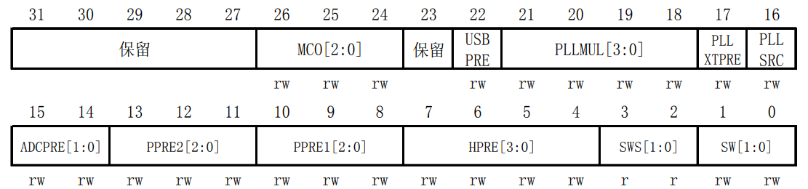

# 时钟源

STM32时钟系统如下图所示。在STM32中，有五个时钟源，为HSI、HSE、LSI、LSE、PLL。HSI高速内部时钟，HSE高速外部时钟，LSI低速内部时钟，LSE低速外部时钟，PLL锁相环倍频输出，是高速时钟。


**1. HSI高速内部时钟**
HSI是高速内部时钟，RC振荡器，频率为8MHz。
HSI时钟有两个去处。一个直接连到SYSCLK时钟选择器上，通过这种方式可直接作为系统时钟使用；另一个经过二分频后连到PLLSRC上，可选择为PLLMUL输入。

**2. HSE高速外部时钟**
HSE可接石英/陶瓷谐振器，或外部时钟源，频率范围为4MHz~16MHz。开发板接的是8M的晶振。
HSE使用和HSI类似，要么二分频或不经二分频后作为PLLMUL输入，要么直接连接系统时钟选择器。

**3. LSI低速内部时钟**
LSI是RC振荡器，频率为40kHz。
LSI可以作为看门狗或RTC的时钟源。

**4. LSE低速外部时钟**
LSE接频率为32.768kHz的石英晶体。
这个时钟主要是RTC的时钟源。

**5. PLL锁相环倍频输出**
PLL时钟输入源可选择为HSI/2、HSE或者HSE/2。
PLLMUL可以关闭或倍频×2、×3...×16作为系统时钟选择器输入。输出频率最大不得超过72MHz。

# 时钟输出

STM32时钟输出可以分为六部分，按照图中从上到下分别为USB时钟、系统时钟、外设时钟、RTC时钟、看门狗时钟、时钟输出。

**1. USB时钟**
USB的时钟是来自PLL时钟源。STM32中有一个全速功能的USB模块，其串行接口引擎需要一个频率为48MHz的时钟源。该时钟源只能从PLL输出端获取，可以选择为1.5分频或者1分频。也就是，当使用USB时PLL必须是能，且如果选择1分频，PLL配置为48MHz，如果选择1.5分频，PLL配置为72MHz。

**2. 系统时钟**
系统时钟时未经分频的SYSCLK，它是供STM32中绝大部分部件工作的时钟源。系统时钟可选择为PLL输出、HSI或者HSE。系统时钟最大频率为72MHz。

**3. 外设时钟**
SYSCLK 通过 AHB 分频器分频后送给各外设使用。
外设部分本应很复杂，但图中解释很详细，此处仔细理解图中部分即可。
需要注意的是APB1 和 APB2 的区别，APB1 上面连接的是低速外设，包括电源接口、备份接口、CAN、USB、I2C1、I2C2、UART2、UART3 等等，APB2 上面连接的是高速外设包括 UART1、SPI1、Timer1、ADC1、ADC2、所有普通 IO 口（PA-PE）、第二功能 IO 口等。

**4. RTC时钟**
从图上可以看出，RTC的时钟源可以选择LSI，LSE，以及HSE的128分频。

**5. 看门狗时钟**
独立看门狗的时钟源只能是LSI。

**6. 时钟输出**
MCO是STM32的一个时钟输出IO(PA8)，它可以选择PLL输出的2分频、HSI、HSE、或者系统时钟作为输出。这个时钟可以用来给外部其他系统提供时钟源。

为了方便理解，给出如下简化版的STM32时钟系统图：


# 时钟初始化

STM32 时钟系统的配置除了初始化的时候在`system_stm32f10x.c`中的`SystemInit()`函数中外，其他的配置主要在`stm32f10x_rcc.c`文件中。默认情况下系统时钟是在`SystemInit()`函数的`SetSysClock()`函数中判断，`SetSysClock()`函数如下所示，可见系统时钟通过宏定义来设置。

```
static void SetSysClock(void)
{
#ifdef SYSCLK_FREQ_HSE
  SetSysClockToHSE();
#elif defined SYSCLK_FREQ_24MHz
  SetSysClockTo24();
#elif defined SYSCLK_FREQ_36MHz
  SetSysClockTo36();
#elif defined SYSCLK_FREQ_48MHz
  SetSysClockTo48();
#elif defined SYSCLK_FREQ_56MHz
  SetSysClockTo56();  
#elif defined SYSCLK_FREQ_72MHz
  SetSysClockTo72();
#endif

 /* If none of the define above is enabled, the HSI is used as System clock
    source (default after reset) */ 
}
```

接下来分两种情况分析时钟配置，一种是不动宏定义，系统时钟设置为HSI的情况，另一种是把系统时钟设置为72MHz，即调用`SetSysClockTo72()`函数的情况。

## SYSCLK初始化为HSI

这种情况下时钟初始化只涉及到`SystemInit()`函数，简化后的函数体如下：

```
void SystemInit (void)
{
  /* Set HSION bit */
  RCC->CR |= (uint32_t)0x00000001;

  RCC->CFGR &= (uint32_t)0xF8FF0000;

  /* Reset HSEON, CSSON and PLLON bits */
  RCC->CR &= (uint32_t)0xFEF6FFFF;

  /* Reset HSEBYP bit */
  RCC->CR &= (uint32_t)0xFFFBFFFF;

  /* Reset PLLSRC, PLLXTPRE, PLLMUL and USBPRE/OTGFSPRE bits */
  RCC->CFGR &= (uint32_t)0xFF80FFFF;

  /* Disable all interrupts and clear pending bits  */
  RCC->CIR = 0x009F0000;

  SetSysClock();

  SCB->VTOR = FLASH_BASE | VECT_TAB_OFFSET; /* Vector Table Relocation in Internal FLASH. */
}
```

第一行：`RCC_CR`寄存器如下图所示，第0位是内部高速时钟使能位，这一位置1则开启内部8MHz振荡器。


第二行：这一行把`RCC_CFGR`寄存器第0-15位、24-26位置0，`RCC_CFGR`寄存器如下图所示。第24-26位置0控制MCO没有时钟输出，第0-15位置0控制PCLK2 2分频后作为ADC时钟，APB2不分频，APB1不分频，AHB不分频，HSI作为系统时钟源。



第三行：这一行把`RCC_CR`寄存器第16、19、24位置0。第24位置0关闭PLL，第19位置0关闭CSS时钟监控器，第16位置0关闭HSE高速外部时钟。

第四行：把`RCC_CR`寄存器第18位置0。第18位置0控制外部4-16MHz振荡器没有旁路；

第五行：把`RCC_CFGR`寄存器第16-22位置0。控制PLL时钟1.5倍分频作为USB时钟，PLL 2倍频输出，HSE不分频作为PLL输入时钟选项，HSI振荡器时钟经2分频后作为PLL输入时钟。

经过以上初始化程序后，SYSCLK是8MHz HSI时钟，PLL关闭，AHB不分频，APB2不分频，APB1不分频，PCLK2 2分频后作为ADC时钟，MCO没有输出，CSS和HSE关闭。

## SYSCLK初始化为72MHz

这种情况在`SystemInit()`函数的基础上执行`SetSysClockTo72()`函数，此函数简化后如下：

```
static void SetSysClockTo72(void)
{
  __IO uint32_t StartUpCounter = 0, HSEStatus = 0;

  /* SYSCLK, HCLK, PCLK2 and PCLK1 configuration ---------------------------*/    
  /* Enable HSE */    
  RCC->CR |= ((uint32_t)RCC_CR_HSEON);

  /* HCLK = SYSCLK */
  RCC->CFGR |= (uint32_t)RCC_CFGR_HPRE_DIV1;

  /* PCLK2 = HCLK */
  RCC->CFGR |= (uint32_t)RCC_CFGR_PPRE2_DIV1;

  /* PCLK1 = HCLK */
  RCC->CFGR |= (uint32_t)RCC_CFGR_PPRE1_DIV2;

  /*  PLL configuration: PLLCLK = HSE * 9 = 72 MHz */
  RCC->CFGR &= (uint32_t)((uint32_t)~(RCC_CFGR_PLLSRC | RCC_CFGR_PLLXTPRE |
                                      RCC_CFGR_PLLMULL));
  RCC->CFGR |= (uint32_t)(RCC_CFGR_PLLSRC_HSE | RCC_CFGR_PLLMULL9);

  /* Enable PLL */
  RCC->CR |= RCC_CR_PLLON;

  /* Wait till PLL is ready */
  while((RCC->CR & RCC_CR_PLLRDY) == 0){}

  /* Select PLL as system clock source */
  RCC->CFGR &= (uint32_t)((uint32_t)~(RCC_CFGR_SW));
  RCC->CFGR |= (uint32_t)RCC_CFGR_SW_PLL;    
}
```

函数功能已经在注释里被解释，配置完成后SYSCLK=72MHz，AHB 总线时钟=72MHz，APB1 总线时钟(PCLK1) =36MHz，APB2 总线时钟(PCLK2) =72MHz，PLL 时钟 =72MHz。


**参考：正点原子STM32F1开发指南-库函数版本_V3.3、STM32中文参考手册_V10**