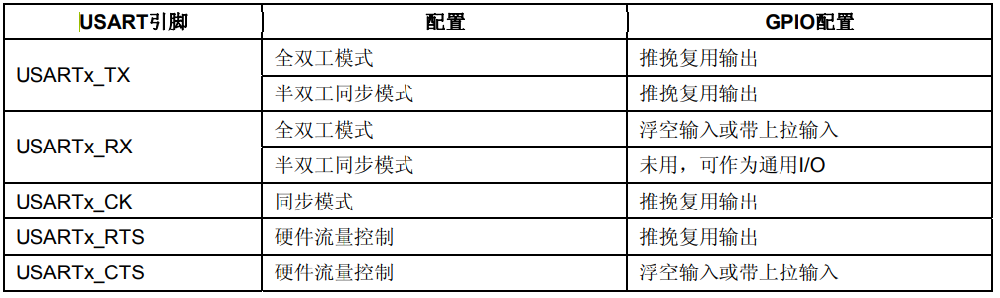

# 端口复用

STM32有很多的内置外设，这些外设的外部引脚都是与GPIO复用的。也就是说，一个GPIO如果可以复用为内置外设的功能引脚，那么当这个GPIO作为内置外设使用的时候，就叫做复用。
STM32F103xx芯片资料中给出了每个引脚的详细资料，PA9和PA10引脚的条目如下所示：


文档显示PA9和PA10可以复用为USART1的TX和RX端口，要想在程序上把引脚指定为可复用的功能，需要三个步骤，下面拿PA引脚复用为USART1引脚举例。

**1. GPIO时钟使能**

```
RCC_APB2PeriphClockCmd(RCC_APB2Periph_GPIOA, ENABLE);
```

**2. 复用外设时钟使能**

```
RCC_APB2PeriphClockCmd(RCC_APB2Periph_GPIOA, ENABLE);
```

**3. 端口模式配置**

在 IO 复用位内置外设功能引脚的时候，必须设置 GPIO 端口的模式。具体配置参数需要在参考手册GPIO部分查找，USART1配置方法如下图所示：



从表格中可以看出，我们要配置全双工的USART1，那么TX引脚需要配置为推挽复用输出，RX引脚配置为浮空输入或者带上拉输入。

```
//USART1_TX PA.9 复用推挽输出
GPIO_InitStructure.GPIO_Pin = GPIO_Pin_9; //PA.9
GPIO_InitStructure.GPIO_Speed = GPIO_Speed_50MHz;
GPIO_InitStructure.GPIO_Mode = GPIO_Mode_AF_PP; //复用推挽输出
GPIO_Init(GPIOA, &GPIO_InitStructure);
//USART1_RX PA.10 浮空输入
GPIO_InitStructure.GPIO_Pin = GPIO_Pin_10;//PA10
GPIO_InitStructure.GPIO_Mode = GPIO_Mode_IN_FLOATING;//浮空输入
GPIO_Init(GPIOA, &GPIO_InitStructure);
```

# 端口重映射

为了使不同器件封装的外设 IO 功能数量达到最优，可以把一些复用功能重新映射到其他一些引脚上。下图是USART1重映射引脚表：


从表中可以看出，默认情况下，USART1复用的引脚位是PA9、PA10，但可以将TX和RX重映射到引脚PB6和PB7上面去，重映射有4个步骤。

**1. 使能GPIO时钟**

```
RCC_APB2PeriphClockCmd(RCC_APB2Periph_GPIOB, ENABLE);
```

**2. 使能外设时钟**

```
RCC_APB2PeriphClockCmd(RCC_APB2Periph_USART1, ENABLE);
```

**3. 使能重映射时钟**

```
RCC_APB2PeriphClockCmd(RCC_APB2Periph_AFIO, ENABLE);
```

**4. 开启重映射**

```
GPIO_PinRemapConfig(GPIO_Remap_USART1, ENABLE);
```

这样就将串口的TX和RX重映射到引脚PB6和PB7上面了。

USART1 只有一种重映射，而对于USART3,存在部分重映射和完全重映射。所谓部分重映射就是部分管脚和默认的是一样的，而部分引脚重新映射到其他引脚，手册中的USART3重映射表如下图所示：


对于部分重映射，只用改变第四步函数参数即可。

```
GPIO_PinRemapConfig(GPIO_PartialRemap_USART3, ENABLE);
```

**参考：正点原子STM32F1开发指南-库函数版本_V3.3、STM32中文参考手册_V10**
