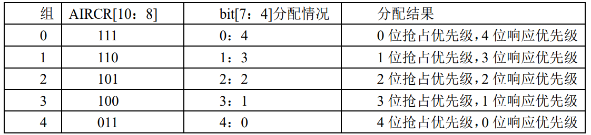

&#8195;&#8195;CM3内核支持256个中断，其中包含了16个内核中断和240个外部中断，并且具有256级的可编程中断设置。但STM32只用了它的一部分。STM32有84个中断，包括16个内核中断和68个可屏蔽中断，具有16级可编程的中断优先级。STM32的68个可屏蔽中断，在STM32F103系列上面，又只有60个。
# STM32的中断分组
&#8195;&#8195;STM32将中断分为5个组，组0-4，分配关系如下图所示：



&#8195;&#8195;这里需要注意两点：第一，如果两个中断的抢占优先级和响应优先级都是一样的话，则看哪个中断先发生就先执行；第二，高优先级的抢占优先级是可以打断正在进行的低抢占优先级中断的。而抢占优先级相同的中断，高优先级的响应优先级不可以打断低响应优先级的中断。
&#8195;&#8195;中断优先级分组函数是`NVIC_PriorityGroupConfig(uint32_t NVIC_PriorityGroup)`，例如：
```
NVIC_PriorityGroupConfig(NVIC_PriorityGroup_2);
```
设置整个系统的中断优先级分组值为2，就确定了一共为2位抢占优先级，2位响应优先级。
# 中断初始化
&#8195;&#8195;中断初始化函数为`void NVIC_Init(NVIC_InitTypeDef* NVIC_InitStruct)`，其中`NVIC_InitTypeDef`是一个结构体，结构体的成员变量如下：
```
typedef struct { 
    uint8_t NVIC_IRQChannel; 
    uint8_t NVIC_IRQChannelPreemptionPriority; 
    uint8_t NVIC_IRQChannelSubPriority; 
    FunctionalState NVIC_IRQChannelCmd; 
} NVIC_InitTypeDef;
```
&#8195;&#8195;`NVIC_InitTypeDef`结构体中间有三个成员变量，这三个成员变量的作用是：
&#8195;&#8195;`NVIC_IRQChannel`：定义初始化的是哪个中断，这个我们可以在`stm32f10x.h` 中找到 每个中断对应的名字。例如`USART1_IRQn`。
&#8195;&#8195;`NVIC_IRQChannelPreemptionPriority`：定义这个中断的抢占优先级别。`NVIC_IRQChannelSubPriority`：定义这个中断的子优先级别。 
&#8195;&#8195;`NVIC_IRQChannelCmd`：该中断是否使能。
&#8195;&#8195;比如我们要使能串口1的中断，同时设置抢占优先级为1，子优先级位2，初始化的方法是：
```
NVIC_InitTypeDef NVIC_InitStructure; 
NVIC_InitStructure.NVIC_IRQChannel = USART1_IRQn;//串口1中断 
NVIC_InitStructure.NVIC_IRQChannelPreemptionPriority=1 ;//抢占优先级为1 
NVIC_InitStructure.NVIC_IRQChannelSubPriority = 2;//子优先级位2
NVIC_InitStructure.NVIC_IRQChannelCmd = ENABLE; //IRQ通道使能 
NVIC_Init(&NVIC_InitStructure); //根据上面指定的参数初始化NVIC寄存器
```
&#8195;&#8195;综上中断优先级配置的步骤：
1. 系统运行开始的时候设置中断分组。调用函数`NVIC_PriorityGroupConfig()`确定组号，也就是确定抢占优先级和子优先级的分配位数。;
2. 设置所用到的中断的中断优先级别。对中断调用函数`NVIC_Init()`以初始化;


**参考：正点原子STM32F1开发指南-库函数版本_V3.3、STM32中文参考手册_V10**

