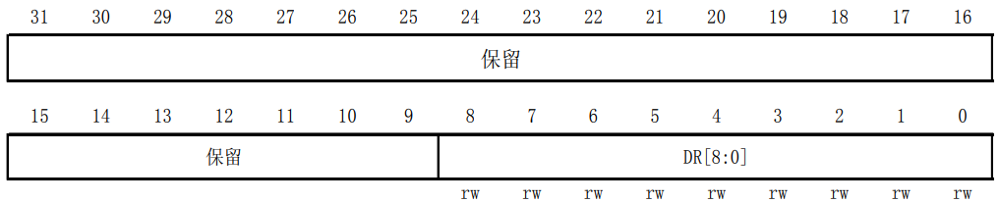
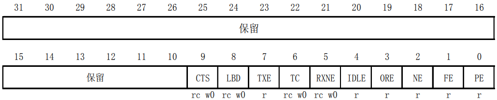

# 串口初始化
&#8195;&#8195;串口的使用都要用到端口复用，端口复用的步骤为：GPIO时钟使能、复用外设时钟使能、端口模式配置。之后要初始化串口参数，最后使能串口时钟。端口复用在前面已经介绍过这里就不展开了。
**1. 串口时钟使能**
&#8195;&#8195;串口是挂载在APB2下面的外设，所以使能函数为`RCC_APB2PeriphClockCmd(RCC_APB2Periph_USART1)`。
**2. 串口复位**
&#8195;&#8195;一般在系统刚开始配置外设的时候，都会先执行复位该外设的操作。复位的是在函数`void USART_DeInit(USART_TypeDef* USARTx)`中完成，比如我们要复位串口1，方法为：
```
USART_DeInit(USART1); //复位串口 1
```
**3. 串口参数初始化**
&#8195;&#8195;串口初始化是通过`void USART_Init(USART_TypeDef* USARTx, USART_InitTypeDef* USART_InitStruct)`函数实现的，这个函数的第一个入口参数是指定初始化的串口标号，这里选择USART1。第二个入口参数是一个`USART_InitTypeDef`类型的结构体指针，这个结构体指针的成员变量用来设置串口的一些参数。一般的实现格式为：
```
USART_InitStructure.USART_BaudRate = bound; //波特率设置; 
USART_InitStructure.USART_WordLength = USART_WordLength_8b;//字长为 8 位数据格式
USART_InitStructure.USART_StopBits = USART_StopBits_1; //一个停止位
USART_InitStructure.USART_Parity = USART_Parity_No; //无奇偶校验位
USART_InitStructure.USART_HardwareFlowControl = USART_HardwareFlowControl_None;  //无硬件数据流控制 
USART_InitStructure.USART_Mode = USART_Mode_Rx | USART_Mode_Tx; //收发模式 
USART_Init(USART1, &USART_InitStructure); //初始化串口
```
&#8195;&#8195;我们可以根据需要设置这些参数。
**4. 串口使能**
&#8195;&#8195;串口使能是通过函数`void USART_Cmd(USART_TypeDef* USARTx, FunctionalState NewState)`来实现的，这个很容易理解，使用方法是：
```
USART_Cmd(USART1, ENABLE); //使能串口1
```
# 串口操作
**1. 数据发送与接收**
&#8195;&#8195;STM32的发送与接收是通过数据寄存器`USART_DR`来实现的，这是一个双寄存器，包含了`TDR`和`RDR`。当向该寄存器写数据的时候，串口就会自动发送，当收到数据的时候，也是存在该寄存器内。`USART_DR`寄存器如下图所示：



&#8195;&#8195;STM32库函数操作`USART_DR`寄存器发送数据的函数是`void USART_SendData(USART_TypeDef* USARTx, uint16_t Data)`，操作`USART_DR`寄存器读取串口接收到的数据的函数是`uint16_t USART_ReceiveData(USART_TypeDef* USARTx)`。
**2. 串口状态**
&#8195;&#8195;串口的状态可以通过状态寄存器`USART_SR`读取，USART_SR寄存器如下图所示：



&#8195;&#8195;固件库函数里面，读取串口状态的函数`是FlagStatus USART_GetFlagStatus(USART_TypeDef* USARTx, uint16_t USART_FLAG)`，第二个入口参数非常关键，它是标示我们要查看串口的哪种状态例如我们要判断读寄存器是否非空(`RXNE`)，操作库函数的方法是：
```
USART_GetFlagStatus(USART1, USART_FLAG_RXNE);
```
&#8195;&#8195;第二个参数见函数注释：
```
USART_FLAG_CTS:  CTS Change flag (not available for UART4 and UART5)
USART_FLAG_LBD:  LIN Break detection flag
USART_FLAG_TXE:  Transmit data register empty flag
USART_FLAG_TC:   Transmission Complete flag
USART_FLAG_RXNE: Receive data register not empty flag
USART_FLAG_IDLE: Idle Line detection flag
USART_FLAG_ORE:  OverRun Error flag
USART_FLAG_NE:   Noise Error flag
USART_FLAG_FE:   Framing Error flag
USART_FLAG_PE:   Parity Error flag
```
**3. 开启串口响应中断**
&#8195;&#8195;使能串口中断的函数是`void USART_ITConfig(USART_TypeDef* USARTx, uint16_t USART_IT, FunctionalState NewState)`，第二个入口参数是标示使能哪种中断，中断类型如下：
```
USART_IT_CTS:  CTS change interrupt (not available for UART4 and UART5)
USART_IT_LBD:  LIN Break detection interrupt
USART_IT_TXE:  Transmit Data Register empty interrupt
USART_IT_TC:   Transmission complete interrupt
USART_IT_RXNE: Receive Data register not empty interrupt
USART_IT_IDLE: Idle line detection interrupt
USART_IT_PE:   Parity Error interrupt
USART_IT_ERR:  Error interrupt(Frame error, noise error, overrun error)
```
&#8195;&#8195;我们在发送数据结束的时候要产生中断，那么方法是：
```
USART_ITConfig(USART1，USART_IT_TC，ENABLE);
```
**4. 获取相应中断状态**
&#8195;&#8195;当我们使能的某个中断发生了，就会设置状态寄存器中的某个标志位。要判断该中断是哪种中断，使用的函数是`ITStatus USART_GetITStatus(USART_TypeDef* USARTx, uint16_t USART_IT)`比如我们使能了串口发送完成中断，那么当中断发生了，我们便可以在中断处理函数中调用这个函数来判断到底是否是串口发送完成中断，方法是：
```
USART_GetITStatus(USART1, USART_IT_TC)；
```

&#8195;&#8195;串口设置的一般步骤可以总结为如下几个步骤：
1. 串口时钟使能，GPIO时钟使能
2. 串口复位
3. GPIO端口模式设置
4. 串口参数初始化
5. 开启中断并且初始化NVIC
6. 使能串口
7. 编写中断处理函数


**参考：正点原子STM32F1开发指南-库函数版本_V3.3、STM32中文参考手册_V10**

---
# 实例
```
/*
 * 本实验,STM32通过串口1和上位机对话，STM32在收到上位机发过来的字符串(以回车换
 * 行结束)后，	原原本本的返回给上位机。下载后，DS0闪烁，提示程序在运行，同时每
 * 隔一定时间，通过串口1输出一段信息到电脑。
 */

#include <stdio.h>
#include "stm32f10x.h"
#define BITBAND( addr, bitnum )		( (addr & 0xF0000000) + 0x2000000 + ( (addr & 0xFFFFF) << 5) + (bitnum << 2) )
#define MEM_ADDR( addr )		*( (volatile unsigned long *) (addr) )
#define BIT_ADDR( addr, bitnum )	MEM_ADDR( BITBAND( addr, bitnum ) )
#define GPIOB_ODR_Addr	(GPIOB_BASE + 12)               /* 0x40010C0C */
#define GPIOE_ODR_Addr	(GPIOE_BASE + 12)               /* 0x4001180C */
#define PBout( n )	BIT_ADDR( GPIOB_ODR_Addr, n )   /* 输出 */
#define PBin( n )	BIT_ADDR( GPIOB_IDR_Addr, n )   /* 输入 */
#define PEout( n )	BIT_ADDR( GPIOE_ODR_Addr, n )   /* 输出 */
#define PEin( n )	BIT_ADDR( GPIOE_IDR_Addr, n )   /* 输入 */
#define LED0		PBout( 5 )                      /* PB5 */
#define LED1		PEout( 5 )                      /* PE5 */
#define USART_REC_LEN	200                             /* 定义最大接收字节数 200 */
#pragma import(__use_no_semihosting)

u8 USART_RX_BUF[USART_REC_LEN];                         /* 接收缓冲,最大USART_REC_LEN个字节. */

/*
 * 接收状态标记
 * bit15，	接收完成标志
 * bit14，	接收到0x0d
 * bit13~0，	接收到的有效字节数目
 */
u16 USART_RX_STA = 0;

/* 加入以下代码,支持printf函数,而不需要选择use MicroLIB */

/* 标准库需要的支持函数 */
struct __FILE
{
	int handle;
};

FILE __stdout;
/* 定义_sys_exit()以避免使用半主机模式 */
void _sys_exit( int x )
{
	x = x;
}


/* 重定义fputc函数 */
int fputc( int ch, FILE *f )
{
	while ( (USART1->SR & 0X40) == 0 )
		;            /* 循环发送,直到发送完毕 */
	USART1->DR = (u8) ch;
	return(ch);
}


static u8	fac_us	= 0;
static u16	fac_ms	= 0;

void delay_init()
{
	SysTick_CLKSourceConfig( SysTick_CLKSource_HCLK_Div8 ); /*选择外部时钟  HCLK/8 */
	fac_us	= SystemCoreClock / 8000000;                    /* 为系统时钟的1/8 */
	fac_ms	= (u16) fac_us * 1000;
}


void delay_ms( u16 nms )
{
	u32 temp;
	SysTick->LOAD	= (u32) nms * fac_ms;                   /* 时间加载(SysTick->LOAD为24bit) */
	SysTick->VAL	= 0x00;                                 /* 清空计数器 */
	SysTick->CTRL	|= SysTick_CTRL_ENABLE_Msk;             /* 开始倒数 */
	do
	{
		temp = SysTick->CTRL;
	}
	while ( (temp & 0x01) && !(temp & (1 << 16) ) );        /* 等待时间到达 */
	SysTick->CTRL	&= ~SysTick_CTRL_ENABLE_Msk;            /* 关闭计数器 */
	SysTick->VAL	= 0X00;                                 /* 清空计数器 */
}


void LED_Init( void )
{
	GPIO_InitTypeDef GPIO_InitStructure;

	RCC_APB2PeriphClockCmd( RCC_APB2Periph_GPIOB | RCC_APB2Periph_GPIOE, ENABLE );  /* 使能PB,PE端口时钟 */

	GPIO_InitStructure.GPIO_Pin	= GPIO_Pin_5;                                   /* LED0-->PB.5 端口配置 */
	GPIO_InitStructure.GPIO_Mode	= GPIO_Mode_Out_PP;                             /* 推挽输出 */
	GPIO_InitStructure.GPIO_Speed	= GPIO_Speed_50MHz;                             /* IO口速度为50MHz */
	GPIO_Init( GPIOB, &GPIO_InitStructure );                                        /* 根据设定参数初始化GPIOB.5 */
	GPIO_SetBits( GPIOB, GPIO_Pin_5 );                                              /* PB.5 输出高 */

	GPIO_InitStructure.GPIO_Pin = GPIO_Pin_5;                                       /* LED1-->PE.5 端口配置, 推挽输出 */
	GPIO_Init( GPIOE, &GPIO_InitStructure );                                        /* 推挽输出 ，IO口速度为50MHz */
	GPIO_SetBits( GPIOE, GPIO_Pin_5 );                                              /* PE.5 输出高 */
}


void uart_init( u32 bound )
{
	/* GPIO端口设置 */
	GPIO_InitTypeDef	GPIO_InitStructure;
	USART_InitTypeDef	USART_InitStructure;
	NVIC_InitTypeDef	NVIC_InitStructure;

	RCC_APB2PeriphClockCmd( RCC_APB2Periph_USART1 | RCC_APB2Periph_GPIOA, ENABLE );         /* 使能USART1，GPIOA时钟 */

	/* USART1_TX   GPIOA.9 */
	GPIO_InitStructure.GPIO_Pin	= GPIO_Pin_9;                                           /* PA.9 */
	GPIO_InitStructure.GPIO_Speed	= GPIO_Speed_50MHz;
	GPIO_InitStructure.GPIO_Mode	= GPIO_Mode_AF_PP;                                      /*复用推挽输出 */
	GPIO_Init( GPIOA, &GPIO_InitStructure );                                                /* 初始化GPIOA.9 */

	/* USART1_RX	  GPIOA.10初始化 */
	GPIO_InitStructure.GPIO_Pin	= GPIO_Pin_10;                                          /* PA10 */
	GPIO_InitStructure.GPIO_Mode	= GPIO_Mode_IN_FLOATING;                                /* 浮空输入 */
	GPIO_Init( GPIOA, &GPIO_InitStructure );                                                /* 初始化GPIOA.10 */

	/* Usart1 NVIC 配置 */
	NVIC_InitStructure.NVIC_IRQChannel			= USART1_IRQn;
	NVIC_InitStructure.NVIC_IRQChannelPreemptionPriority	= 3;                            /* 抢占优先级3 */
	NVIC_InitStructure.NVIC_IRQChannelSubPriority		= 3;                            /* 子优先级3 */
	NVIC_InitStructure.NVIC_IRQChannelCmd			= ENABLE;                       /* IRQ通道使能 */
	NVIC_Init( &NVIC_InitStructure );                                                       /* 根据指定的参数初始化VIC寄存器 */

	/* USART 初始化设置 */
	USART_InitStructure.USART_BaudRate		= bound;                                /* 串口波特率 */
	USART_InitStructure.USART_WordLength		= USART_WordLength_8b;                  /* 字长为8位数据格式 */
	USART_InitStructure.USART_StopBits		= USART_StopBits_1;                     /* 一个停止位 */
	USART_InitStructure.USART_Parity		= USART_Parity_No;                      /* 无奇偶校验位 */
	USART_InitStructure.USART_HardwareFlowControl	= USART_HardwareFlowControl_None;       /* 无硬件数据流控制 */
	USART_InitStructure.USART_Mode			= USART_Mode_Rx | USART_Mode_Tx;        /* 收发模式 */

	USART_Init( USART1, &USART_InitStructure );                                             /* 初始化串口1 */
	USART_ITConfig( USART1, USART_IT_RXNE, ENABLE );                                        /* 开启串口接受中断 */
	USART_Cmd( USART1, ENABLE );                                                            /* 使能串口1 */
}


int main( void )
{
	u16	t;
	u16	len;
	u16	times = 0;
	delay_init();                                                           /* 延时函数初始化 */
	NVIC_PriorityGroupConfig( NVIC_PriorityGroup_2 );                       /* 设置NVIC中断分组2:2位抢占优先级，2位响应优先级 */
	uart_init( 115200 );                                                    /* 串口初始化为115200 */
	LED_Init();                                                             /* LED端口初始化 */
	while ( 1 )
	{
		if ( USART_RX_STA & 0x8000 )
		{
			len = USART_RX_STA & 0x3fff;                            /* 得到此次接收到的数据长度 */
			printf( "\r\n您发送的消息为:\r\n\r\n" );
			for ( t = 0; t < len; t++ )
			{
				USART_SendData( USART1, USART_RX_BUF[t] );      /* 向串口1发送数据 */
				while ( USART_GetFlagStatus( USART1, USART_FLAG_TC ) != SET )
					;                                       /* 等待发送结束 */
			}
			printf( "\r\n\r\n" );                                   /* 插入换行 */
			USART_RX_STA = 0;
		}else{
			times++;
			if ( times % 5000 == 0 )
			{
				printf( "\r\n战舰STM32开发板 串口实验\r\n" );
				printf( "正点原子@ALIENTEK\r\n\r\n" );
			}
			if ( times % 200 == 0 )
				printf( "请输入数据,以回车键结束\n" );
			if ( times % 30 == 0 )
				LED0 = !LED0;                           /* 闪烁LED,提示系统正在运行. */
			delay_ms( 10 );
		}
	}
}


void USART1_IRQHandler( void )                                          /* 串口1中断服务程序 */
{
	u8 Res;
	if ( USART_GetITStatus( USART1, USART_IT_RXNE ) != RESET )      /* 接收中断(接收到的数据必须是0x0d 0x0a结尾) */
	{
		Res = USART_ReceiveData( USART1 );                      /* 读取接收到的数据 */

		if ( (USART_RX_STA & 0x8000) == 0 )                     /* 接收未完成 */
		{
			if ( USART_RX_STA & 0x4000 )                    /* 接收到了0x0d */
			{
				if ( Res != 0x0a )
					USART_RX_STA = 0;               /* 接收错误,重新开始 */
				else USART_RX_STA |= 0x8000;            /* 接收完成了 */
			}else   { /* 还没收到0X0D */
				if ( Res == 0x0d )
					USART_RX_STA |= 0x4000;
				else{
					USART_RX_BUF[USART_RX_STA & 0X3FFF] = Res;
					USART_RX_STA++;
					if ( USART_RX_STA > (USART_REC_LEN - 1) )
						USART_RX_STA = 0;  /* 接收数据错误,重新开始接收 */
				}
			}
		}
	}
}


```

