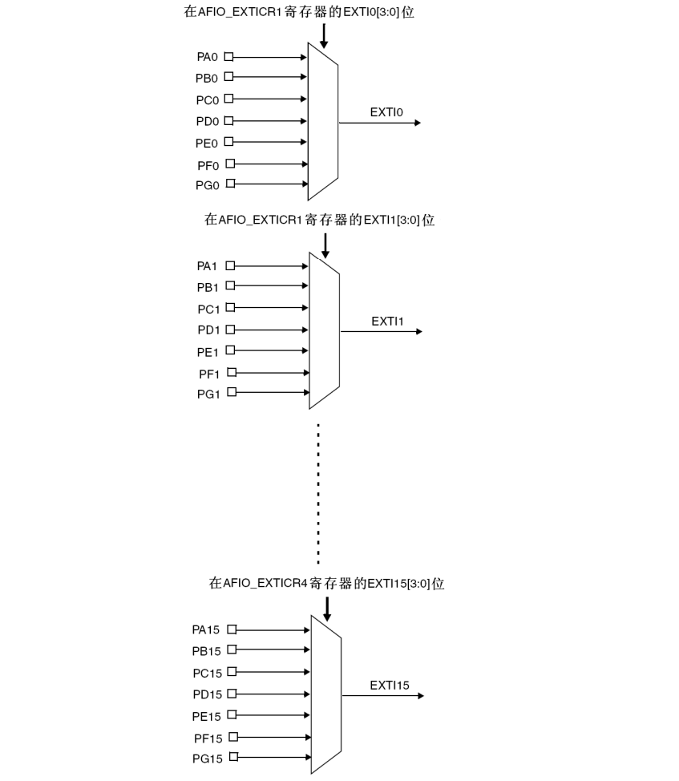

&#8195;&#8195;STM32F103的19个外部中断为：
1. 线0~15：对应外部IO口的输入中断。
2. 线16：连接到PVD输出。
3. 线17：连接到RTC闹钟事件。
4. 线18：连接到USB唤醒事件。

&#8195;&#8195;可见STM32供IO口使用的中断线只有16个，于是STM32就这样设计，GPIO的管脚`GPIOx.0~GPIOx.15(x=A,B,C,D,E，F,G)`分别对应中断线0~15，以线0为例：它对应了`GPIOA.0`、`GPIOB.0`、`GPIOC.0`、`GPIOD.0`、`GPIOE.0`、`GPIOF.0`、`GPIOG.0`。GPIO跟中断线的映射关系图：



# 配置映射关系
&#8195;&#8195;在库函数中配置GPIO与中断线的映射关系的函数`void GPIO_EXTILineConfig(uint8_t GPIO_PortSource, uint8_t GPIO_PinSource)`来实现的，该函数将GPIO端口与中断线映射起来，使用范例是：
```
GPIO_EXTILineConfig(GPIO_PortSourceGPIOE,GPIO_PinSource2);
```
&#8195;&#8195;将中断线2与GPIOE映射起来，那么很显然是`GPIOE.2`与`EXTI2`中断线连接了。
# 外部中断初始化
&#8195;&#8195;中断线上中断的初始化是通过函数中断线上中断的初始化是通过函数`void EXTI_Init(EXTI_InitTypeDef* EXTI_InitStruct)`实现的。设置中断线4上的中断为下降沿触发的方法如下：
```
EXTI_InitTypeDef EXTI_InitStructure; 
EXTI_InitStructure.EXTI_Line=EXTI_Line4; 
EXTI_InitStructure.EXTI_Mode = EXTI_Mode_Interrupt; 
EXTI_InitStructure.EXTI_Trigger = EXTI_Trigger_Falling; 
EXTI_InitStructure.EXTI_LineCmd = ENABLE; 
EXTI_Init(&EXTI_InitStructure); //根据 EXTI_InitStruct 中指定的参数初始化外设 EXTI 寄存器
```
&#8195;&#8195;`EXTI_InitTypeDef`的成 员变量如下：
```
typedef struct
{
    uint32_t EXTI_Line; 
    EXTIMode_TypeDef EXTI_Mode;
    EXTITrigger_TypeDef EXTI_Trigger;
    FunctionalState EXTI_LineCmd; 
}EXTI_InitTypeDef;
```
&#8195;&#8195;第一个参数是中断线的标号，取值范围为`EXTI_Line0` ~ `EXTI_Line19`。
&#8195;&#8195;第二个参数是中断模式，可选值为中断`EXTI_Mode_Interrupt`和事件`EXTI_Mode_Event`。
&#8195;&#8195;第三个参数是触发方式，可以是下降沿触发`EXTI_Trigger_Falling`，上升沿触发`EXTI_Trigger_Rising`，或者上升沿和下降沿触发`EXTI_Trigger_Rising_Falling`。
# 中断配置
&#8195;&#8195;STM32外部中断只有6个：
```
EXTI0_IRQn = 6,      /*!< EXTI Line0 Interrupt */
EXTI1_IRQn = 7,      /*!< EXTI Line1 Interrupt */
EXTI2_IRQn = 8,      /*!< EXTI Line2 Interrupt */
EXTI3_IRQn = 9,      /*!< EXTI Line3 Interrupt */
EXTI4_IRQn = 10,     /*!< EXTI Line4 Interrupt */
EXTI9_5_IRQn = 23,     /*!< External Line[9:5] Interrupts */
EXTI15_10_IRQn = 40,     /*!< External Line[15:10] Interrupts */
```
&#8195;&#8195;中断线5-9共用中断函数`EXTI9_5_IRQn`，中断线10-15共用中断函数`EXTI15_10_IRQn`，中断服务函数同理。因此在配置`NVIC_InitStructure.NVIC_IRQChannel`参数时只能选择以上六个之一。
&#8195;&#8195;在编写中断服务函数的时候会经常使用到两 个函数，第一个函数是`ITStatus EXTI_GetITStatus(uint32_t EXTI_Line)`用来判断某个中断线上的中断是否发生（标志位是否置位），第二个是`void EXTI_ClearITPendingBit(uint32_t EXTI_Line)`用来清除某个中断线上 的中断标志位。常用的中断服务函数格式为：
```
void EXTI3_IRQHandler(void) { 
    if(EXTI_GetITStatus(EXTI_Line3)!=RESET)//判断某个线上的中断是否发生 
    { 
        中断逻辑… 
        EXTI_ClearITPendingBit(EXTI_Line3); //清除 LINE 上的中断标志位 
    } 
}
```
&#8195;&#8195;固件库还提供了两个函数用来判断外部中断状态以及清除外部状态标志位的函数`FlagStatus EXTI_GetFlagStatus(uint32_t EXTI_Line)`和`void EXTI_ClearFlag(uint32_t EXTI_Line)`，他们的作用和前面两个函数的作用类似。只是在`ITStatus EXTI_GetITStatus(uint32_t EXTI_Line)`函数中会先判断这种中断是否使能，使能了才去判断中断标志位，而`FlagStatus EXTI_GetFlagStatus(uint32_t EXTI_Line)`直接用来判断状态标志位。

&#8195;&#8195;使用IO口外部中断的一般步骤：
1. 初始化IO口为输入。 
2. 开启AFIO时钟 
3. 设置IO口与中断线的映射关系。 
4. 初始化线上中断，设置触发条件等。 
5. 配置中断分组（NVIC），并使能中断。 
6. 编写中断服务函数。


**参考：正点原子STM32F1开发指南-库函数版本_V3.3、STM32中文参考手册_V10**

---
示例：
```
/*
 * 本实验,利用外部中断通过开发板上载有的4个按钮（KEY_UP、KEY0、KEY1和KEY2），
 * 来控制板上的2个LED（DS0和DS1）和蜂鸣器，其中WK_UP控制蜂鸣器，按一次叫，
 * 再按一次停；KEY2控制DS0，按一次亮，再按一次灭；KEY1控制DS1，效果同KEY2；
 * KEY0则同时控制DS0和DS1，按一次，他们的状态就翻转一次。
 */

#include "stm32f10x.h"
#define BITBAND( addr, bitnum )		( (addr & 0xF0000000) + 0x2000000 + ( (addr & 0xFFFFF) << 5) + (bitnum << 2) )
#define MEM_ADDR( addr )		*( (volatile unsigned long *) (addr) )
#define BIT_ADDR( addr, bitnum )	MEM_ADDR( BITBAND( addr, bitnum ) )
#define GPIOB_ODR_Addr	(GPIOB_BASE + 12)                               /* 0x40010C0C */
#define GPIOE_ODR_Addr	(GPIOE_BASE + 12)                               /* 0x4001180C */
#define PBout( n )	BIT_ADDR( GPIOB_ODR_Addr, n )                   /* 输出 */
#define PBin( n )	BIT_ADDR( GPIOB_IDR_Addr, n )                   /* 输入 */
#define PEout( n )	BIT_ADDR( GPIOE_ODR_Addr, n )                   /* 输出 */
#define PEin( n )	BIT_ADDR( GPIOE_IDR_Addr, n )                   /* 输入 */
#define LED0		PBout( 5 )                                      /* PB5 */
#define LED1		PEout( 5 )                                      /* PE5 */
#define BEEP		PBout( 8 )                                      /* BEEP,蜂鸣器接口 */
#define KEY0		GPIO_ReadInputDataBit( GPIOE, GPIO_Pin_4 )      /* 读取按键0 */
#define KEY1		GPIO_ReadInputDataBit( GPIOE, GPIO_Pin_3 )      /* 读取按键1 */
#define KEY2		GPIO_ReadInputDataBit( GPIOE, GPIO_Pin_2 )      /* 读取按键2 */
#define WK_UP		GPIO_ReadInputDataBit( GPIOA, GPIO_Pin_0 )      /* 读取按键3(WK_UP) */
#define KEY0_PRES	1                                               /* KEY0按下 */
#define KEY1_PRES	2                                               /* KEY1按下 */
#define KEY2_PRES	3                                               /* KEY2按下 */
#define WKUP_PRES	4                                               /* KEY_UP按下(即WK_UP/KEY_UP) */

static u8	fac_us	= 0;
static u16	fac_ms	= 0;

void delay_init()
{
	SysTick_CLKSourceConfig( SysTick_CLKSource_HCLK_Div8 );         /*选择外部时钟  HCLK/8 */
	fac_us	= SystemCoreClock / 8000000;                            /* 为系统时钟的1/8 */
	fac_ms	= (u16) fac_us * 1000;
}


void delay_ms( u16 nms )
{
	u32 temp;
	SysTick->LOAD	= (u32) nms * fac_ms;                   /* 时间加载(SysTick->LOAD为24bit) */
	SysTick->VAL	= 0x00;                                 /* 清空计数器 */
	SysTick->CTRL	|= SysTick_CTRL_ENABLE_Msk;             /* 开始倒数 */
	do
	{
		temp = SysTick->CTRL;
	}
	while ( (temp & 0x01) && !(temp & (1 << 16) ) );        /* 等待时间到达 */
	SysTick->CTRL	&= ~SysTick_CTRL_ENABLE_Msk;            /* 关闭计数器 */
	SysTick->VAL	= 0X00;                                 /* 清空计数器 */
}


void LED_Init( void )
{
	GPIO_InitTypeDef GPIO_InitStructure;

	RCC_APB2PeriphClockCmd( RCC_APB2Periph_GPIOB | RCC_APB2Periph_GPIOE, ENABLE );  /* 使能PB,PE端口时钟 */

	GPIO_InitStructure.GPIO_Pin	= GPIO_Pin_5;                                   /* LED0-->PB.5 端口配置 */
	GPIO_InitStructure.GPIO_Mode	= GPIO_Mode_Out_PP;                             /* 推挽输出 */
	GPIO_InitStructure.GPIO_Speed	= GPIO_Speed_50MHz;                             /* IO口速度为50MHz */
	GPIO_Init( GPIOB, &GPIO_InitStructure );                                        /* 根据设定参数初始化GPIOB.5 */
	GPIO_SetBits( GPIOB, GPIO_Pin_5 );                                              /* PB.5 输出高 */

	GPIO_InitStructure.GPIO_Pin = GPIO_Pin_5;                                       /* LED1-->PE.5 端口配置, 推挽输出 */
	GPIO_Init( GPIOE, &GPIO_InitStructure );                                        /* 推挽输出 ，IO口速度为50MHz */
	GPIO_SetBits( GPIOE, GPIO_Pin_5 );                                              /* PE.5 输出高 */
}


void BEEP_Init( void )
{
	GPIO_InitTypeDef GPIO_InitStructure;

	RCC_APB2PeriphClockCmd( RCC_APB2Periph_GPIOB, ENABLE );                         /* 使能GPIOB端口时钟 */

	GPIO_InitStructure.GPIO_Pin	= GPIO_Pin_8;                                   /* BEEP-->PB.8 端口配置 */
	GPIO_InitStructure.GPIO_Mode	= GPIO_Mode_Out_PP;                             /* 推挽输出 */
	GPIO_InitStructure.GPIO_Speed	= GPIO_Speed_50MHz;                             /* 速度为50MHz */
	GPIO_Init( GPIOB, &GPIO_InitStructure );                                        /* 根据参数初始化GPIOB.8 */

	GPIO_ResetBits( GPIOB, GPIO_Pin_8 );                                            /* 输出0，关闭蜂鸣器输出 */
}


void KEY_Init( void )                                                                   /* IO初始化 */
{
	GPIO_InitTypeDef GPIO_InitStructure;

	RCC_APB2PeriphClockCmd( RCC_APB2Periph_GPIOA | RCC_APB2Periph_GPIOE, ENABLE );  /* 使能PORTA,PORTE时钟 */

	GPIO_InitStructure.GPIO_Pin	= GPIO_Pin_2 | GPIO_Pin_3 | GPIO_Pin_4;         /* KEY0-KEY2 */
	GPIO_InitStructure.GPIO_Mode	= GPIO_Mode_IPU;                                /* 设置成上拉输入 */
	GPIO_Init( GPIOE, &GPIO_InitStructure );                                        /* 初始化GPIOE2,3,4 */

	/* 初始化 WK_UP-->GPIOA.0	  下拉输入 */
	GPIO_InitStructure.GPIO_Pin	= GPIO_Pin_0;
	GPIO_InitStructure.GPIO_Mode	= GPIO_Mode_IPD;                                /* PA0设置成输入，默认下拉 */
	GPIO_Init( GPIOA, &GPIO_InitStructure );                                        /* 初始化GPIOA.0 */
}


void EXTIX_Init( void )
{
	EXTI_InitTypeDef	EXTI_InitStructure;
	NVIC_InitTypeDef	NVIC_InitStructure;

	KEY_Init();                                             /*	按键端口初始化 */

	RCC_APB2PeriphClockCmd( RCC_APB2Periph_AFIO, ENABLE );  /* 使能复用功能时钟 */

	/* GPIOE.2 中断线以及中断初始化配置   下降沿触发 */
	GPIO_EXTILineConfig( GPIO_PortSourceGPIOE, GPIO_PinSource2 );

	EXTI_InitStructure.EXTI_Line	= EXTI_Line2;           /* KEY2 */
	EXTI_InitStructure.EXTI_Mode	= EXTI_Mode_Interrupt;
	EXTI_InitStructure.EXTI_Trigger = EXTI_Trigger_Falling;
	EXTI_InitStructure.EXTI_LineCmd = ENABLE;
	EXTI_Init( &EXTI_InitStructure );                       /* 根据EXTI_InitStruct中指定的参数初始化外设EXTI寄存器 */

	/* GPIOE.3	  中断线以及中断初始化配置 下降沿触发 //KEY1 */
	GPIO_EXTILineConfig( GPIO_PortSourceGPIOE, GPIO_PinSource3 );
	EXTI_InitStructure.EXTI_Line = EXTI_Line3;
	EXTI_Init( &EXTI_InitStructure );                       /* 根据EXTI_InitStruct中指定的参数初始化外设EXTI寄存器 */

	/* GPIOE.4	  中断线以及中断初始化配置  下降沿触发	//KEY0 */
	GPIO_EXTILineConfig( GPIO_PortSourceGPIOE, GPIO_PinSource4 );
	EXTI_InitStructure.EXTI_Line = EXTI_Line4;
	EXTI_Init( &EXTI_InitStructure );                       /* 根据EXTI_InitStruct中指定的参数初始化外设EXTI寄存器 */


	/* GPIOA.0	  中断线以及中断初始化配置 上升沿触发 PA0  WK_UP */
	GPIO_EXTILineConfig( GPIO_PortSourceGPIOA, GPIO_PinSource0 );

	EXTI_InitStructure.EXTI_Line	= EXTI_Line0;
	EXTI_InitStructure.EXTI_Trigger = EXTI_Trigger_Rising;
	EXTI_Init( &EXTI_InitStructure );                                       /* 根据EXTI_InitStruct中指定的参数初始化外设EXTI寄存器 */


	NVIC_InitStructure.NVIC_IRQChannel			= EXTI0_IRQn;   /* 使能按键WK_UP所在的外部中断通道 */
	NVIC_InitStructure.NVIC_IRQChannelPreemptionPriority	= 0x02;         /* 抢占优先级2， */
	NVIC_InitStructure.NVIC_IRQChannelSubPriority		= 0x03;         /* 子优先级3 */
	NVIC_InitStructure.NVIC_IRQChannelCmd			= ENABLE;       /* 使能外部中断通道 */
	NVIC_Init( &NVIC_InitStructure );

	NVIC_InitStructure.NVIC_IRQChannel			= EXTI2_IRQn;   /* 使能按键KEY2所在的外部中断通道 */
	NVIC_InitStructure.NVIC_IRQChannelPreemptionPriority	= 0x02;         /* 抢占优先级2， */
	NVIC_InitStructure.NVIC_IRQChannelSubPriority		= 0x02;         /* 子优先级2 */
	NVIC_InitStructure.NVIC_IRQChannelCmd			= ENABLE;       /* 使能外部中断通道 */
	NVIC_Init( &NVIC_InitStructure );


	NVIC_InitStructure.NVIC_IRQChannel			= EXTI3_IRQn;   /* 使能按键KEY1所在的外部中断通道 */
	NVIC_InitStructure.NVIC_IRQChannelPreemptionPriority	= 0x02;         /* 抢占优先级2 */
	NVIC_InitStructure.NVIC_IRQChannelSubPriority		= 0x01;         /* 子优先级1 */
	NVIC_InitStructure.NVIC_IRQChannelCmd			= ENABLE;       /* 使能外部中断通道 */
	NVIC_Init( &NVIC_InitStructure );                                       /* 根据NVIC_InitStruct中指定的参数初始化外设NVIC寄存器 */

	NVIC_InitStructure.NVIC_IRQChannel			= EXTI4_IRQn;   /* 使能按键KEY0所在的外部中断通道 */
	NVIC_InitStructure.NVIC_IRQChannelPreemptionPriority	= 0x02;         /* 抢占优先级2 */
	NVIC_InitStructure.NVIC_IRQChannelSubPriority		= 0x00;         /* 子优先级0 */
	NVIC_InitStructure.NVIC_IRQChannelCmd			= ENABLE;       /* 使能外部中断通道 */
	NVIC_Init( &NVIC_InitStructure );                                       /* 根据NVIC_InitStruct中指定的参数初始化外设NVIC寄存器 */
}


int main( void )
{
	delay_init();                                                           /* 延时函数初始化 */
	NVIC_PriorityGroupConfig( NVIC_PriorityGroup_2 );                       /* 设置NVIC中断分组2:2位抢占优先级，2位响应优先级 */
	LED_Init();                                                             /* 初始化与LED连接的硬件接口 */
	BEEP_Init();                                                            /* 初始化蜂鸣器端口 */
	KEY_Init();                                                             /* 初始化与按键连接的硬件接口 */
	EXTIX_Init();                                                           /* 外部中断初始化 */
	LED0 = 0;                                                               /* 点亮LED0 */
	while ( 1 )
	{
		delay_ms( 1000 );
	}
}


/* 外部中断0服务程序 */
void EXTI0_IRQHandler( void )
{
	delay_ms( 20 );                         /* 消抖 */
	if ( WK_UP == 1 )                       /* WK_UP按键 */
	{
		BEEP = !BEEP;
	}
	EXTI_ClearITPendingBit( EXTI_Line0 );   /* 清除LINE0上的中断标志位 */
}


/* 外部中断2服务程序 */
void EXTI2_IRQHandler( void )
{
	delay_ms( 20 );                         /* 消抖 */
	if ( KEY2 == 0 )                        /*按键KEY2 */
	{
		LED0 = !LED0;
	}
	EXTI_ClearITPendingBit( EXTI_Line2 );   /* 清除LINE2上的中断标志位 */
}


/* 外部中断3服务程序 */
void EXTI3_IRQHandler( void )
{
	delay_ms( 20 );                         /* 消抖 */
	if ( KEY1 == 0 )                        /*按键KEY1 */
	{
		LED1 = !LED1;
	}
	EXTI_ClearITPendingBit( EXTI_Line3 );   /* 清除LINE3上的中断标志位 */
}


void EXTI4_IRQHandler( void )
{
	delay_ms( 20 );                         /* 消抖 */
	if ( KEY0 == 0 )                        /*按键KEY0 */
	{
		LED0	= !LED0;
		LED1	= !LED1;
	}
	EXTI_ClearITPendingBit( EXTI_Line4 );   /* 清除LINE4上的中断标志位 */
}


```

