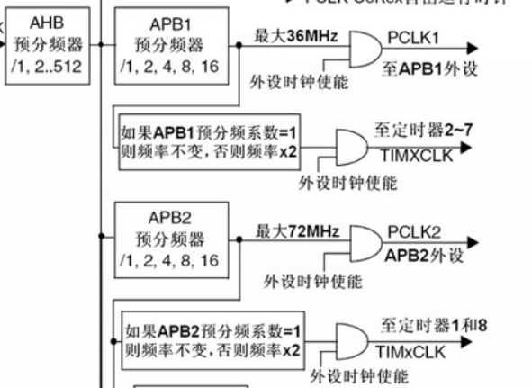

# 通用定时器TIMx
&#8195;&#8195;STM32F1的通用定时器TIMx(`TIM2`、`TIM3`、`TIM4`和`TIM5`)功能包括：
1. 16位向上、向下、向上/向下自动装载计数器。
2. 16位可编程(可以实时修改)预分频器，计数器时钟频率的分频系数为1～65536之间的任意数值。
3. 4个可用于输入捕获、输出比较、PWM生成、单脉冲模式输出的独立通道。
4. 使用外部信号控制定时器和定时器互连的同步电路。
5. 如下事件发生时产生中断/DMA：
* 更新：计数器向上溢出/向下溢出，计数器初始化(通过软件或者内部/外部触发)。
* 触发事件(计数器启动、停止、初始化或者由内部/外部触发计数)。
* 输入捕获。
* 输出比较。
6. 支持针对定位的增量(正交)编码器和霍尔传感器电路。
7. 触发输入作为外部时钟或者按周期的电流管理。

# 定时器初始化
**1. 时钟使能**
&#8195;&#8195;`TIM3`是挂载在APB1之下，所以我们通过APB1总线下的使能使能函数来使能`TIM3`。调用的函数是：
```
RCC_APB1PeriphClockCmd(RCC_APB1Periph_TIM3, ENABLE); //时钟使能
```
**2. 初始化定时器参数**
&#8195;&#8195;在库函数中，定时器的初始化参数是通过初始化函数`void TIM_TimeBaseInit(TIM_TypeDef* TIMx, TIM_TimeBaseInitTypeDef* TIM_TimeBaseInitStruct)`实现的。第一个参数是确定是哪个定时器。结构体类型`TIM_TimeBaseInitTypeDef`定义为：
```
typedef struct { 
    uint16_t TIM_Prescaler; 
    uint16_t TIM_CounterMode; 
    uint16_t TIM_Period; 
    uint16_t TIM_ClockDivision; 
    uint8_t TIM_RepetitionCounter; 
} TIM_TimeBaseInitTypeDef;
```
&#8195;&#8195;这个结构体一共有5个成员变量，对于通用定时器只有前面四个参数有用，最后一个参数`TIM_RepetitionCounter`是高级定时器才有用。
&#8195;&#8195;第一个参数`TIM_Prescaler`用来设置分频系数。
&#8195;&#8195;第二个参数`TIM_CounterMode`用来设置计数方式。比较常用的是向上计数模式`TIM_CounterMode_Up`和向下计数模式`TIM_CounterMode_Down`。
&#8195;&#8195;第三个参数`TIM_Period`是设置自动重载计数周期值。
&#8195;&#8195;这里需要注意，计时器周期计算公式为`分频系数×自动重载值/计时器频率`。其中计时器频率即`CK_INT`时钟是从APB倍频的来的，除非APB的时钟分频数设置为1，否则定时器的时钟是APB时钟的2倍，当APB的时钟不分频的时候，通用定时器的时钟就等于 APB的时钟。见下方时钟系统部分图：



&#8195;&#8195;第四个参数`TIM_ClockDivision`是用来设置时钟分频因子。
&#8195;&#8195;针对`TIM3`初始化范例代码格式：
```
TIM_TimeBaseInitTypeDef TIM_TimeBaseStructure; 
TIM_TimeBaseStructure.TIM_Period = 5000; 
TIM_TimeBaseStructure.TIM_Prescaler =7199; 
TIM_TimeBaseStructure.TIM_ClockDivision = TIM_CKD_DIV1; 
TIM_TimeBaseStructure.TIM_CounterMode = TIM_CounterMode_Up; 
TIM_TimeBaseInit(TIM3, &TIM_TimeBaseStructure);
```
# 定时器使用
**1. 使能中断**
&#8195;&#8195;在库函数里面定时器中断使能是通过`void TIM_ITConfig(TIM_TypeDef* TIMx, uint16_t TIM_IT, FunctionalState NewState)`函数来实现的。第一个参数是选择定时器号，这个容易理解，取值为`TIM1` ~ `TIM17`。第二个参数非常关键，是用来指明我们使能的定时器中断的类型，取值如下：
```
*   This parameter can be any combination of the following values:
*     @arg TIM_IT_Update: TIM update Interrupt source
*     @arg TIM_IT_CC1: TIM Capture Compare 1 Interrupt source
*     @arg TIM_IT_CC2: TIM Capture Compare 2 Interrupt source
*     @arg TIM_IT_CC3: TIM Capture Compare 3 Interrupt source
*     @arg TIM_IT_CC4: TIM Capture Compare 4 Interrupt source
*     @arg TIM_IT_COM: TIM Commutation Interrupt source
*     @arg TIM_IT_Trigger: TIM Trigger Interrupt source
*     @arg TIM_IT_Break: TIM Break Interrupt source
* @note 
*   - TIM6 and TIM7 can only generate an update interrupt.
*   - TIM9, TIM12 and TIM15 can have only TIM_IT_Update, TIM_IT_CC1,
*      TIM_IT_CC2 or TIM_IT_Trigger. 
*   - TIM10, TIM11, TIM13, TIM14, TIM16 and TIM17 can have TIM_IT_Update or TIM_IT_CC1.   
*   - TIM_IT_Break is used only with TIM1, TIM8 and TIM15. 
*   - TIM_IT_COM is used only with TIM1, TIM8, TIM15, TIM16 and TIM17.   
```
&#8195;&#8195;例如我们要使能`TIM3`的更新中断，格式为：
```
TIM_ITConfig(TIM3,TIM_IT_Update,ENABLE);
```
**2. 中断优先级设置**
&#8195;&#8195;格式为：
```
NVIC_InitStructure.NVIC_IRQChannel = TIM3_IRQn; //TIM3 中断 
NVIC_InitStructure.NVIC_IRQChannelPreemptionPriority = 0; //先占优先级 0 级 
NVIC_InitStructure.NVIC_IRQChannelSubPriority = 3; //从优先级 3 级 
NVIC_InitStructure.NVIC_IRQChannelCmd = ENABLE; //IRQ 通道被使能 
NVIC_Init(&NVIC_InitStructure); //初始化 NVIC 寄存器
```
**3. 使能使能计时器**
&#8195;&#8195;在固件库里面使能定时器的函数是通过在固件库里面使能定时器的函数是通过`void TIM_Cmd(TIM_TypeDef* TIMx, FunctionalState NewState)`函数来实现的函数来实现的，比如我们要使能定时器3，方法为：
```
TIM_Cmd(TIM3, ENABLE); //使能 TIMx 外设
```
**4. 编写中断服务函数**
&#8195;&#8195;在固件库函数里面，用来读取中断状态寄存器的值判断中断类型的函数是`ITStatus TIM_GetITStatus(TIM_TypeDef* TIMx, uint16_t TIM_IT)`该函数的作用是，判断定时器TIMx的中断类型`TIM_IT`是否发生中断。固件库中清除中断标志位的函数是`void TIM_ClearITPendingBit(TIM_TypeDef* TIMx, uint16_t TIM_IT)`。该函数的作用是，清除定时器`TIMx`的中断`TIM_IT`标志位。
&#8195;&#8195;定时器3中断服务程序示例：
```
void TIM3_IRQHandler(void) //TIM3 中断 
{ 
    if (TIM_GetITStatus(TIM3, TIM_IT_Update) != RESET) //检查 TIM3 更新中断发生与否 
    { 
        TIM_ClearITPendingBit(TIM3, TIM_IT_Update ); //清除 TIM3 更新中断标志 
        LED1=!LED1; 
    } 
}
```
&#8195;&#8195;固件库还提供了两个函数用来判断定时器状态以及清除定时器状态标志位的函数`FlagStatus TIM_GetFlagStatus(TIM_TypeDef* TIMx, uint16_t TIM_FLAG)`和`void TIM_ClearFlag(TIM_TypeDef* TIMx, uint16_t TIM_FLAG)`，他们的作用和前面两个函数的作用类似。只是在`ITStatus TIM_GetITStatus(TIM_TypeDef* TIMx, uint16_t TIM_IT)`函数中会先判断这种中断是否使能，使能了才去判断中断标志位，而`FlagStatus TIM_GetFlagStatus(TIM_TypeDef* TIMx, uint16_t TIM_FLAG)`直接用来判断状态标志位。

&#8195;&#8195;STM32使用通用计时器的步骤：
1. 时钟使能。
2. 初始化定时器参数。
3. 使能中断。
4. 中断优先级设置。
5. 使能使能计时器。
6. 编写中断服务函数。


**参考：正点原子STM32F1开发指南-库函数版本_V3.3、STM32中文参考手册_V10**

---
示例：
```
/*
 * 本实验,DS0用来指示程序运行，400ms为一个周期。DS1用于定时器中断取反，指示
 * 定时器中断状态，1000ms为一个周期。下载完后，可以看到DS0快闪，DS1慢闪。
 */

#include "stm32f10x.h"
#define BITBAND( addr, bitnum )		( (addr & 0xF0000000) + 0x2000000 + ( (addr & 0xFFFFF) << 5) + (bitnum << 2) )
#define MEM_ADDR( addr )		*( (volatile unsigned long *) (addr) )
#define BIT_ADDR( addr, bitnum )	MEM_ADDR( BITBAND( addr, bitnum ) )
#define GPIOB_ODR_Addr	(GPIOB_BASE + 12)                       /* 0x40010C0C */
#define GPIOE_ODR_Addr	(GPIOE_BASE + 12)                       /* 0x4001180C */
#define PBout( n )	BIT_ADDR( GPIOB_ODR_Addr, n )           /* 输出 */
#define PBin( n )	BIT_ADDR( GPIOB_IDR_Addr, n )           /* 输入 */
#define PEout( n )	BIT_ADDR( GPIOE_ODR_Addr, n )           /* 输出 */
#define PEin( n )	BIT_ADDR( GPIOE_IDR_Addr, n )           /* 输入 */
#define LED0	PBout( 5 )                                      /* PB5 */
#define LED1	PEout( 5 )                                      /* PE5 */

static u8	fac_us	= 0;
static u16	fac_ms	= 0;

void delay_init()
{
	SysTick_CLKSourceConfig( SysTick_CLKSource_HCLK_Div8 ); /*选择外部时钟  HCLK/8 */
	fac_us	= SystemCoreClock / 8000000;                    /* 为系统时钟的1/8 */
	fac_ms	= (u16) fac_us * 1000;
}


void delay_ms( u16 nms )
{
	u32 temp;
	SysTick->LOAD	= (u32) nms * fac_ms;                   /* 时间加载(SysTick->LOAD为24bit) */
	SysTick->VAL	= 0x00;                                 /* 清空计数器 */
	SysTick->CTRL	|= SysTick_CTRL_ENABLE_Msk;             /* 开始倒数 */
	do
	{
		temp = SysTick->CTRL;
	}
	while ( (temp & 0x01) && !(temp & (1 << 16) ) );        /* 等待时间到达 */
	SysTick->CTRL	&= ~SysTick_CTRL_ENABLE_Msk;            /* 关闭计数器 */
	SysTick->VAL	= 0X00;                                 /* 清空计数器 */
}


void LED_Init( void )
{
	GPIO_InitTypeDef GPIO_InitStructure;

	RCC_APB2PeriphClockCmd( RCC_APB2Periph_GPIOB | RCC_APB2Periph_GPIOE, ENABLE );  /* 使能PB,PE端口时钟 */

	GPIO_InitStructure.GPIO_Pin	= GPIO_Pin_5;                                   /* LED0-->PB.5 端口配置 */
	GPIO_InitStructure.GPIO_Mode	= GPIO_Mode_Out_PP;                             /* 推挽输出 */
	GPIO_InitStructure.GPIO_Speed	= GPIO_Speed_50MHz;                             /* IO口速度为50MHz */
	GPIO_Init( GPIOB, &GPIO_InitStructure );                                        /* 根据设定参数初始化GPIOB.5 */
	GPIO_SetBits( GPIOB, GPIO_Pin_5 );                                              /* PB.5 输出高 */

	GPIO_InitStructure.GPIO_Pin = GPIO_Pin_5;                                       /* LED1-->PE.5 端口配置, 推挽输出 */
	GPIO_Init( GPIOE, &GPIO_InitStructure );                                        /* 推挽输出 ，IO口速度为50MHz */
	GPIO_SetBits( GPIOE, GPIO_Pin_5 );                                              /* PE.5 输出高 */
}


/*
 * 通用定时器3中断初始化
 * 这里时钟选择为APB1的2倍，而APB1为36M
 * arr：自动重装值。
 * psc：时钟预分频数
 * 这里使用的是定时器3!
 */
void TIM3_Int_Init( u16 arr, u16 psc )
{
	TIM_TimeBaseInitTypeDef TIM_TimeBaseStructure;
	NVIC_InitTypeDef	NVIC_InitStructure;

	RCC_APB1PeriphClockCmd( RCC_APB1Periph_TIM3, ENABLE );                  /* 时钟使能 */

	/* 定时器TIM3初始化 */
	TIM_TimeBaseStructure.TIM_Period	= arr;                          /* 设置在下一个更新事件装入活动的自动重装载寄存器周期的值 */
	TIM_TimeBaseStructure.TIM_Prescaler	= psc;                          /* 设置用来作为TIMx时钟频率除数的预分频值 */
	TIM_TimeBaseStructure.TIM_ClockDivision = TIM_CKD_DIV1;                 /* 设置时钟分割:TDTS = Tck_tim */
	TIM_TimeBaseStructure.TIM_CounterMode	= TIM_CounterMode_Up;           /* TIM向上计数模式 */
	TIM_TimeBaseInit( TIM3, &TIM_TimeBaseStructure );                       /* 根据指定的参数初始化TIMx的时间基数单位 */

	TIM_ITConfig( TIM3, TIM_IT_Update, ENABLE );                            /* 使能指定的TIM3中断,允许更新中断 */

	/* 中断优先级NVIC设置 */
	NVIC_InitStructure.NVIC_IRQChannel			= TIM3_IRQn;    /* TIM3中断 */
	NVIC_InitStructure.NVIC_IRQChannelPreemptionPriority	= 0;            /* 先占优先级0级 */
	NVIC_InitStructure.NVIC_IRQChannelSubPriority		= 3;            /* 从优先级3级 */
	NVIC_InitStructure.NVIC_IRQChannelCmd			= ENABLE;       /* IRQ通道被使能 */
	NVIC_Init( &NVIC_InitStructure );                                       /* 初始化NVIC寄存器 */


	TIM_Cmd( TIM3, ENABLE );                                                /* 使能TIMx */
}


int main( void )
{
	delay_init();                                                           /* 延时函数初始化 */
	NVIC_PriorityGroupConfig( NVIC_PriorityGroup_2 );                       /* 设置NVIC中断分组2:2位抢占优先级，2位响应优先级 */
	LED_Init();                                                             /* LED端口初始化 */
	TIM3_Int_Init( 4999, 7199 );                                            /* 10Khz的计数频率，计数到5000为500ms */
	while ( 1 )
	{
		LED0 = !LED0;
		delay_ms( 200 );
	}
}


/* 定时器3中断服务程序 */
void TIM3_IRQHandler( void )                                    /* TIM3中断 */
{
	if ( TIM_GetITStatus( TIM3, TIM_IT_Update ) != RESET )  /* 检查TIM3更新中断发生与否 */
	{
		TIM_ClearITPendingBit( TIM3, TIM_IT_Update );   /* 清除TIMx更新中断标志 */
		LED1 = !LED1;
	}
}


```