# 5.5 秩亏损最小二乘问题
秩亏损矩阵：

$$
A \in \mathbb{R}^{m \times n}, rank(A) = r < n
$$

## 5.5.1 最小范数解

### 1）秩亏损最小二乘（LS）问题

最小解的集合 $\chi$ 满足：
$$
\chi = \{x \in \mathbb{R} :||Ax-b||_2=min\}
$$

### 2）秩亏损的最小二乘问题有无穷多个解

如果 $x$ 是一个极小解，$ Az = 0 $ ；

则 $||A(x+z)-b||_2 = min$ ，即 $(x+z)\in \chi$；

而因为 $A$ 秩亏损，所以 $Az = 0$ 有无穷多解；

所以 LS 问题有无穷多解。

### 3）因为 $\chi$ 是凸集合，所以$\chi$ 中有唯一元素 $x_{LS}$ 有极小 2- 范数

如果 $x_1,x_2\in \chi$ 且 $\lambda \in [0,1]$，那么：
$$
||A(\lambda x_1 + (1 - \lambda)x_2) - b||_2 \le \lambda||Ax_1-b||_2+(1-\lambda)||Ax_2-b||_2=\min_{x\in \mathbb{R}}||Ax-b||_2
$$
因此 $\lambda x_1 + (1-\lambda)x_2 \in \chi$，即 $\chi$ 是凸集合，所以 $\chi$  中有唯一元素具有极小2范数，用 $x_{LS}$ 表示这个解。

### 4）任何正交分解都可用来计算 $x_{LS}$

假设有正交分解：

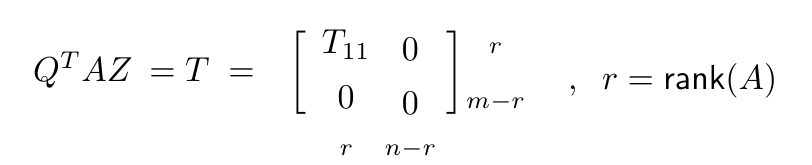

则 （备注）
$$
||Ax-b||_2=||(Q^TAZ)Z^Tx-Q^Tb||_2^2 = ||\begin{bmatrix}T_{11} & 0 \\ 0 & 0\end{bmatrix}\begin{bmatrix}w\\y\end{bmatrix}-\begin{bmatrix}c\\d\end{bmatrix}||_2^2=||\begin{bmatrix}T_{11}w-c\\d\end{bmatrix}||_2^2\\
=||T_{11}w-c||_2^2+||d||_2^2
$$
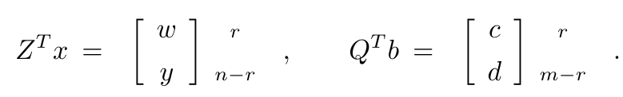

若要 $||Ax-b||_2$ 最小，则 $w=T_{11}^{-1}c$ 即
$$
x = Z\begin{bmatrix}T_{11}^{-1}c\\y\end{bmatrix},x_{LS} = Z\begin{bmatrix}T_{11}^{-1}c\\0\end{bmatrix}
$$
### 5）用 SVD 计算 $x_{LS}$ 和 $\rho _{LS}$

假设 $U_TAV=\Sigma$ 是 $A$ 的奇异值分解：

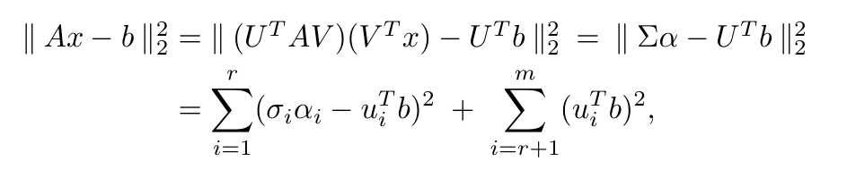

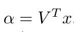

如果 $x$ 是 LS 问题的解，那么对于 $i = 1 : r$ 有 $\alpha_i=(u_i^Tb/\sigma_i)$

此时：

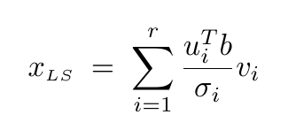

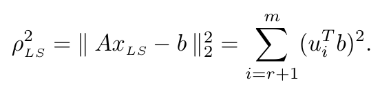

## 5.5.2 关于伪逆（广义逆）的注释

### 1）广义逆的定义

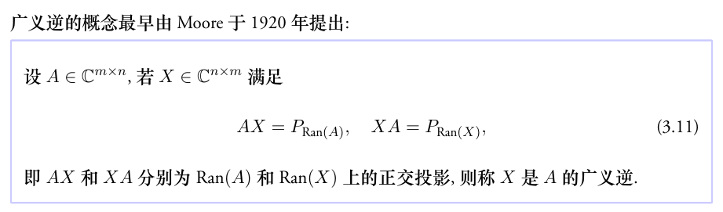

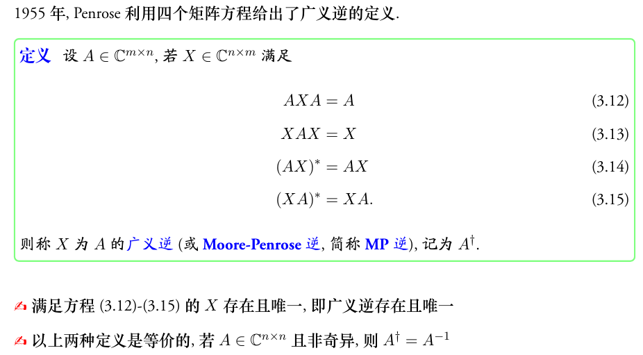

### 2）广义逆的性质
**1. 基本性质**

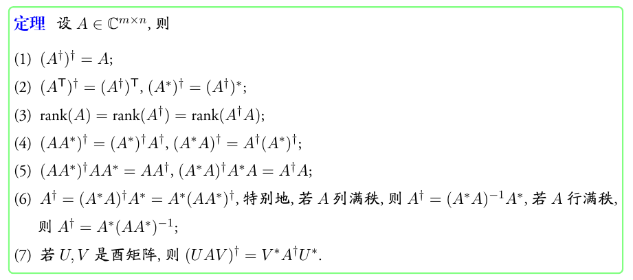

**2. $ x_{LS} = A^+b$ 且 $\rho _{LS} = ||(I-AA^+)b||_2$**

**3. 广义逆可以由 SVD 直接表示出来**

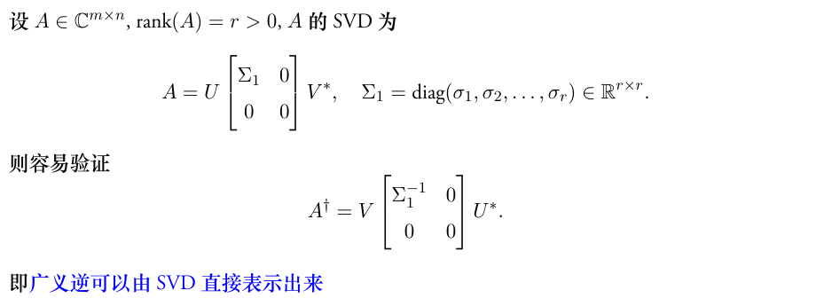

## 5.5.3 一些敏感度问题

如果 $A$ 不是列满秩，$A$ 和 $b$ 微小的变化会引起 $x_{LS} = A^+b$ 任意大的变化。

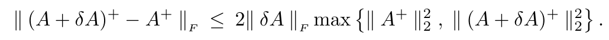

## 5.5.4 截断的 SVD 解

奇异值的物理意义是：奇异值往往对应着矩阵中隐含的重要信息，且重要性和奇异值大小正相关。每个矩阵 $A$ 都可以表示为一系列秩为1的“小矩阵”之和，而奇异值则衡量了这些“小矩阵”对于 $A$ 的权重。

在矩阵的奇异值分解中，只取最大的 $\hat{r}$ 个奇异值（$\hat{r} \lt r$, $r$ 为矩阵的秩）对应的部分，就得到矩阵的截断奇异值分解。截断奇异值分解可以产生一个指定维度的分解矩阵，可以实现降维。
$$
A \approx A_{\hat{r}}=U_{\hat{r}}\Sigma_{\hat{r}}V^T_{\hat{r}}
$$
其中 $U_{\hat{r}}$ 是奇异值分解中 $U$ 的前 $\hat{r}$ 列，$V_{\hat{r}}$ 是奇异值分解中 $V$ 的前 $\hat{r}$ 列，$\Sigma_{\hat{r}}$ 由 $\Sigma$ 的前 $\hat{r}$ 个最大奇异值得到。

可以取

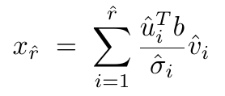

作为 $x_{LS}$ 的近似。

### 怎么选取 $\hat{r}$ 的值？or 从哪里开始截断？

**方法1：解的精度更重要**
$$
W^TAZ = \Sigma, x_{LS} = \sum_{i = 1}^r\frac{w_i^Tb}{\sigma_i}z_i
$$
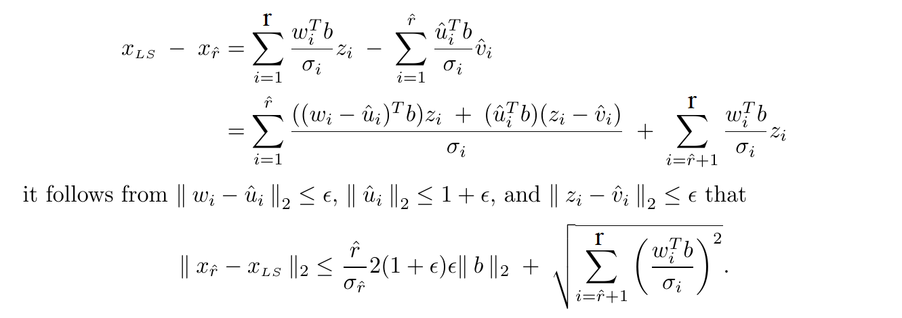

**方法2：最小化残差最重要**

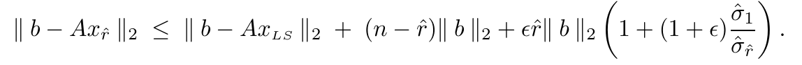

## 5.5.5 用列选主元的 QR 分解求基本解

假定 $A \in \mathbb{R}^{m\times n}$ 的秩为 $r < n$，列选主元的QR分解产生：$A\Pi = QR$，其中

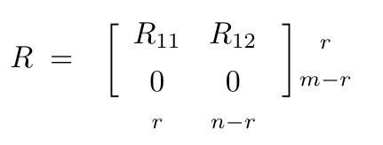

$R_{11}$ 是非奇异上三角矩阵。则

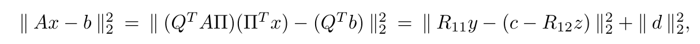

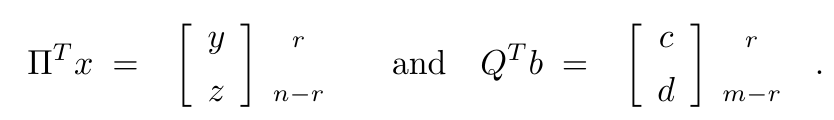

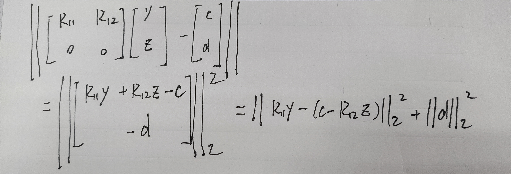

如果 $x$ 是 LS 问题的一个极小解，则
$$
y = R_{11}^{-1}(c-R_{12}z)
$$

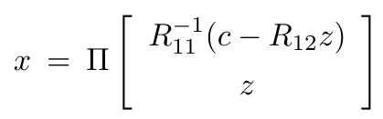

当 $z$ 取 $0$ 时，得到基本解：

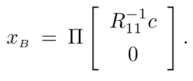

但基本解不一定是极小 2-范数解，因为：

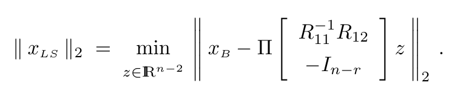

## 5.5.7 基于 SVD 的子集选择

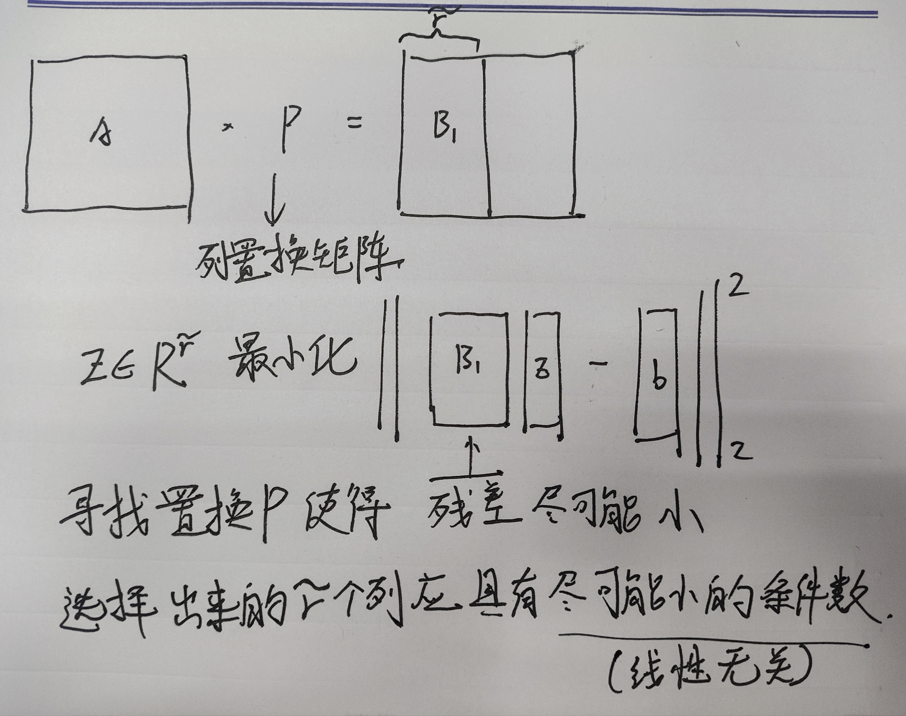

# 5.6 正方形方程组和欠定方程组

## 5.6.1正方形方程组

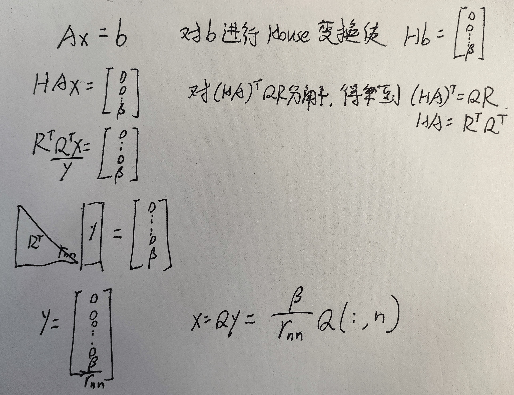

## 5.6.2 欠定方程组

$A$ 是行满秩矩阵，应用列选主元的QR分解得到：

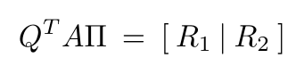

$Ax = b$ 变为：

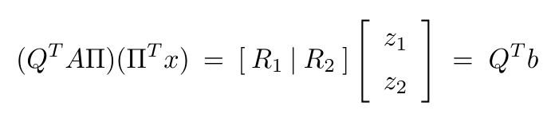

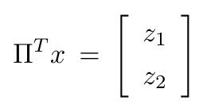

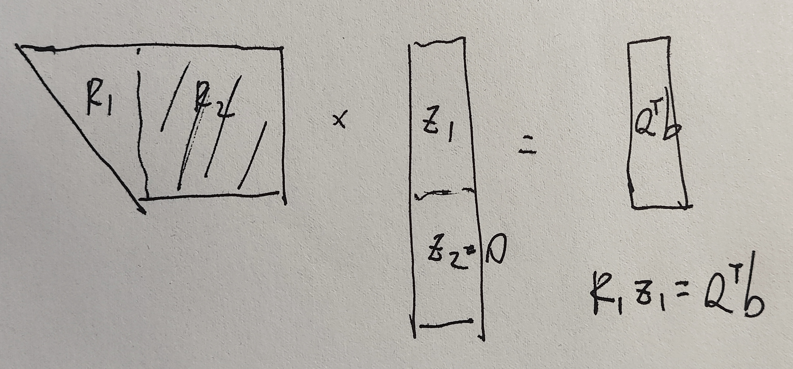

可以通过假设 $z_2 = 0, R_1z_1=Q^Tb$ 得到问题的一个解。
