# SVD 分解和 QR 分解

## SVD 分解

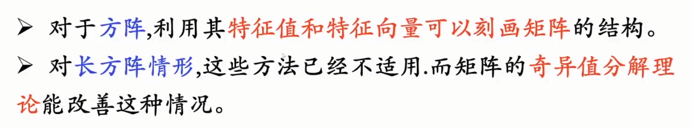

[SVD分解-CSDN博客](https://blog.csdn.net/qq_27782503/article/details/97152074)

对于方阵,利用其特征值和特征向量可以刻画矩阵的结构。

对长方阵情形,这些方法已经不适用.而矩阵的奇异值分解理论能改善这种情况。

> n阶矩阵可对角化的充分必要条件是有n个线性无关的特征向量
> $$
> |\lambda I - A| = 0
> $$
> 

### 定义

 假设 A 是 m×n 实矩阵，则存在正交矩阵：
$$
U = [u_1|\cdots|u_m] \in \mathbb{R}^{m \times m}, V = [v_1|\cdots|v_n] \in \mathbb{R}^{n \times n}
$$
使得：
$$
U^TAV = \Sigma = diag(\sigma_1, \cdots, \sigma_p) \in \mathbb{R}^{n \times n}, p = min\{m, n\}
$$
其中：
$$
\sigma_1 \ge \sigma_2 \ge \cdots \ge \sigma_p \ge 0
$$

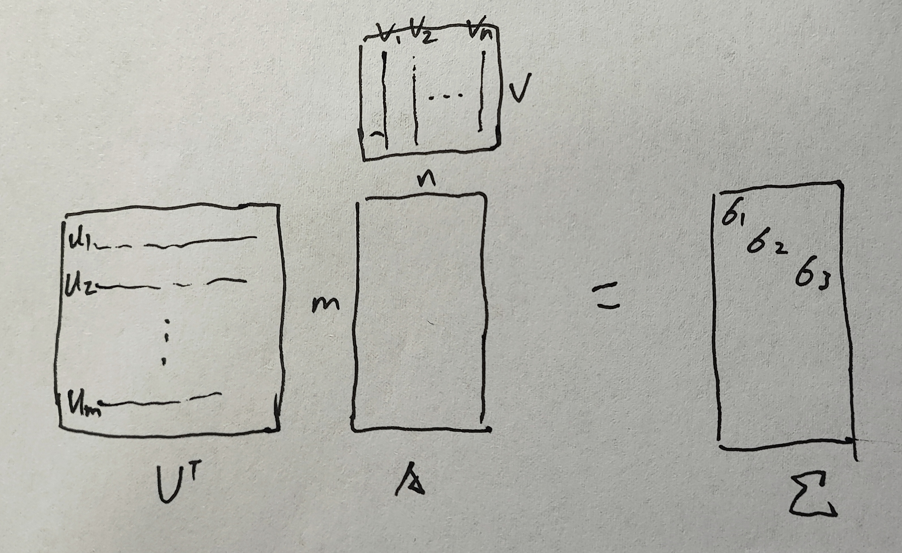

- 矩阵的奇异值分解**一定存在，但不唯一**（因为特征向量表示可以不唯一）

## 性质

假设 m ≥ n，则对于 i=1:n 有：
$$
Av_i = \sigma_iu_i, A^Tu_i = \sigma_iv_i
$$

有：
$$
A^TAv_i = \sigma_i^2v_i, AA_Tu_i = \sigma_i^2u_i
$$

## QR 分解

> LU分解不一定保证条件数，可能会变大，所以要用正交变换实现矩阵分解保证条件数不改变:
> $$
> A = QR,Q为正交阵，R为上三角阵
> $$
> 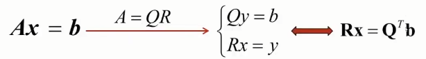

### 定义

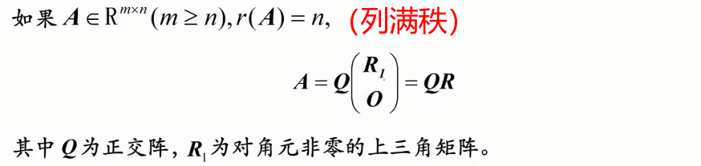

### 矩阵消元

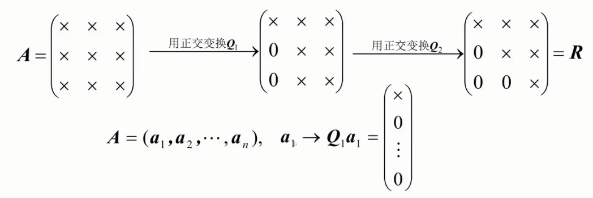

几何上看，就是把空间中的一个向量通过正交变换，变为落在第一个坐标轴上的向量。

###  镜面反射，矩阵变换

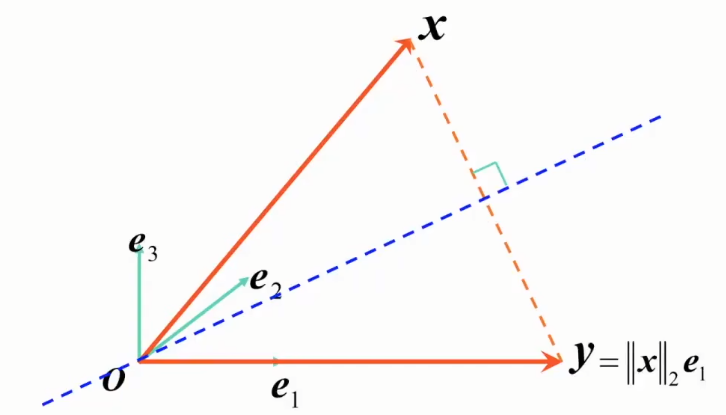

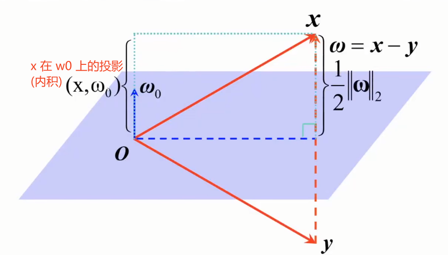
$$
\omega_0 = \frac{\omega}{\lVert \omega\rVert_2}, \omega=x-y=\lVert \omega\rVert_2\omega_0,  (x,\omega_0) = \frac{1}{2}\lVert \omega\rVert_2
$$

从x投影到y：
$$
y = x - 2\frac{\omega \omega^T}{\omega^T \omega}=(I-2\frac{\omega \omega^T}{\omega^T \omega})x\coloneqq H(\omega)x
$$

### Householder 矩阵

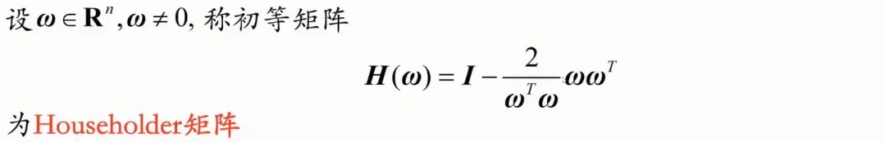

#### 性质

Householder 对称且正交，正交变换不会改变一个向量的长度。

Householder对单位矩阵做了秩为1的修正。

w可以是任何x-y方向的向量.

通常取
$$
y = \lVert x\rVert_2e_1， \omega = x - y = x - \lVert x\rVert_2e_1
$$
e1是第一个元素为1，其余为0的单位向量。

#### 例题

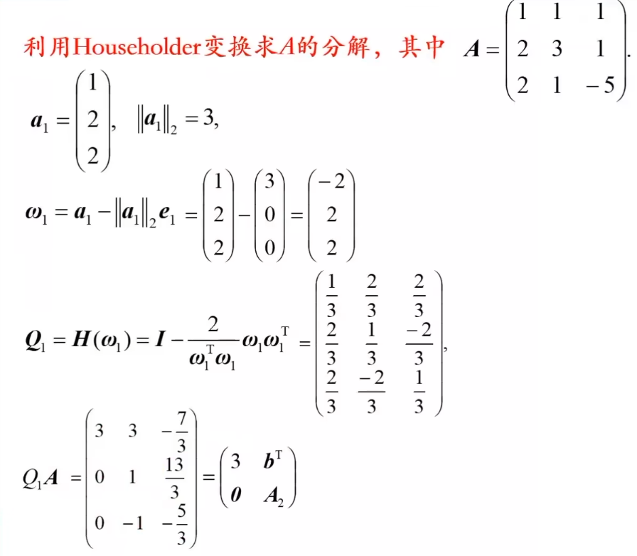

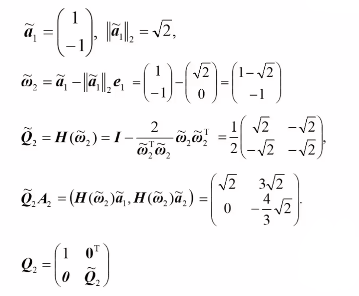

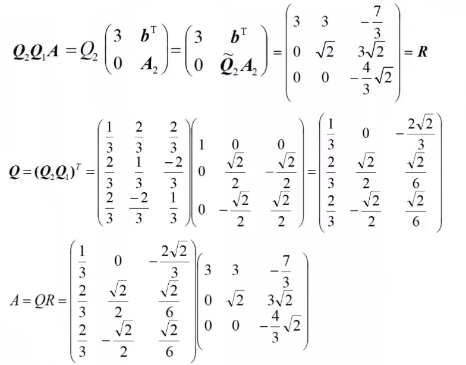

